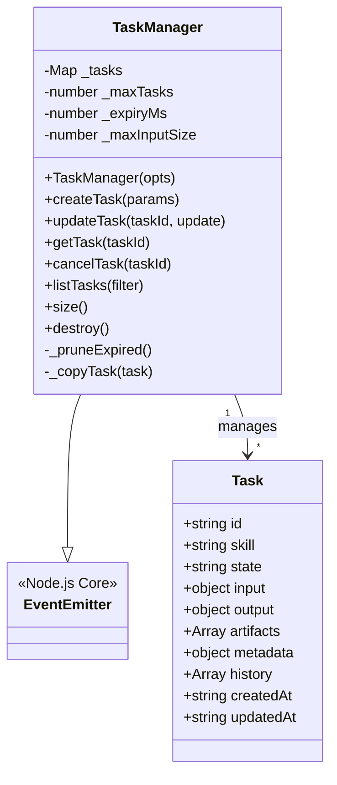
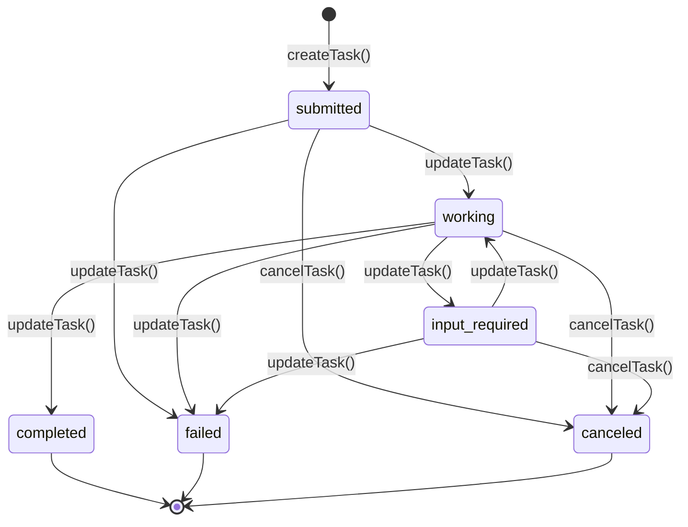

# A2A Protocol - TaskManager Module Documentation

## 1. Module Overview

The TaskManager module is a core component of the A2A (Agent-to-Agent) Protocol that provides comprehensive task lifecycle management capabilities. This module enables the creation, tracking, updating, and monitoring of tasks according to the A2A specification, serving as a foundational building block for agent communication and coordination.

### Purpose and Design Rationale

The TaskManager is designed to address the need for standardized task management in multi-agent systems. It provides:

- **State Management**: Formalized task states with valid transition rules
- **Event-driven Architecture**: Real-time notifications for task lifecycle changes
- **Data Integrity**: Input validation, size limits, and task expiry mechanisms
- **Concurrency Control**: Limits on maximum concurrent tasks
- **Audit Trail**: Complete history of state transitions and updates

This module intentionally separates protocol primitives from authentication and authorization, leaving those concerns to integrators who can implement appropriate security measures at the transport or application layer.

## 2. Architecture and Components

### Core Architecture

The TaskManager module follows a simple yet robust architecture centered around the `TaskManager` class, which extends Node.js's `EventEmitter` to provide event-driven capabilities.



### Key Components

#### 1. TaskManager Class
The central class that orchestrates all task management operations. It maintains an in-memory store of tasks and provides methods for manipulating them.

#### 2. State Management Constants
- `VALID_STATES`: Array of all possible task states
- `TERMINAL_STATES`: States from which no further transitions are allowed
- `VALID_TRANSITIONS`: Object defining allowed state transitions
- `MAX_TASKS`: Default maximum concurrent tasks (1000)
- `DEFAULT_EXPIRY_MS`: Default task expiry time (24 hours)

## 3. Task Lifecycle and State Management

### Task States and Transitions

The TaskManager implements a formal state machine with well-defined states and transition rules.



### State Definitions

| State | Description | Can Transition To |
|-------|-------------|------------------|
| `submitted` | Initial state when a task is first created | `working`, `failed`, `canceled` |
| `working` | Task is actively being processed | `input-required`, `completed`, `failed`, `canceled` |
| `input-required` | Task is paused waiting for additional input | `working`, `failed`, `canceled` |
| `completed` | **Terminal** - Task finished successfully | (None) |
| `failed` | **Terminal** - Task encountered an error | (None) |
| `canceled` | **Terminal** - Task was canceled by user | (None) |

## 4. Core API Reference

### Constructor

```javascript
const { TaskManager } = require('./src/protocols/a2a/task-manager');

const taskManager = new TaskManager({
  maxTasks: 500,           // Optional: Maximum concurrent tasks (default: 1000)
  expiryMs: 86400000,      // Optional: Task expiry in milliseconds (default: 24 hours)
  maxInputSize: 1048576    // Optional: Max input+metadata size in bytes (default: 1MB)
});
```

### Methods

#### createTask(params)

Creates a new task with the specified parameters.

**Parameters:**
- `params.skill` (string, required): Skill ID to invoke
- `params.input` (object, optional): Task input data
- `params.metadata` (object, optional): Arbitrary metadata

**Returns:**
- `object`: The created task object

**Events Emitted:**
- `task:created`: Emitted with the created task

**Example:**
```javascript
try {
  const task = taskManager.createTask({
    skill: 'data-analysis',
    input: { dataset: 'sales-2023', format: 'json' },
    metadata: { priority: 'high', requester: 'agent-123' }
  });
  console.log('Task created:', task.id);
} catch (error) {
  console.error('Failed to create task:', error.message);
}
```

**Throws:**
- Error if `skill` parameter is missing
- Error if combined input+metadata size exceeds `maxInputSize`
- Error if maximum task limit is reached

#### updateTask(taskId, update)

Updates a task's state, output, artifacts, or message.

**Parameters:**
- `taskId` (string, required): ID of the task to update
- `update` (object, required): Update object containing:
  - `state` (string, optional): New state (must be a valid transition)
  - `output` (any, optional): Task output data
  - `artifacts` (Array, optional): Additional artifacts to append
  - `message` (string, optional): Status message

**Returns:**
- `object`: The updated task object

**Events Emitted:**
- `task:stateChange`: Emitted with `{ taskId, from, to }` when state changes
- `task:updated`: Emitted with the updated task

**Example:**
```javascript
try {
  const updatedTask = taskManager.updateTask(taskId, {
    state: 'working',
    message: 'Processing started...'
  });
  console.log('Task updated:', updatedTask.state);
} catch (error) {
  console.error('Failed to update task:', error.message);
}
```

**Throws:**
- Error if task is not found
- Error if task is in a terminal state
- Error if state transition is invalid

#### getTask(taskId)

Retrieves a task by its ID.

**Parameters:**
- `taskId` (string, required): ID of the task to retrieve

**Returns:**
- `object|null`: The task object if found, `null` otherwise

**Example:**
```javascript
const task = taskManager.getTask(taskId);
if (task) {
  console.log('Task found:', task);
} else {
  console.log('Task not found');
}
```

#### cancelTask(taskId)

Cancels a task (transitions to `canceled` state).

**Parameters:**
- `taskId` (string, required): ID of the task to cancel

**Returns:**
- `object`: The canceled task object

**Events Emitted:**
- `task:stateChange`: Emitted with `{ taskId, from, to: 'canceled' }`

**Example:**
```javascript
try {
  const canceledTask = taskManager.cancelTask(taskId);
  console.log('Task canceled:', canceledTask.id);
} catch (error) {
  console.error('Failed to cancel task:', error.message);
}
```

**Throws:**
- Error if task is not found
- Error if task is already in a terminal state

#### listTasks(filter)

Lists all tasks, optionally filtered by state or skill.

**Parameters:**
- `filter` (object, optional): Filter criteria:
  - `state` (string, optional): Filter by task state
  - `skill` (string, optional): Filter by skill ID

**Returns:**
- `Array`: Array of matching task objects

**Example:**
```javascript
// List all tasks
const allTasks = taskManager.listTasks();

// List only working tasks
const workingTasks = taskManager.listTasks({ state: 'working' });

// List tasks for a specific skill
const analysisTasks = taskManager.listTasks({ skill: 'data-analysis' });
```

#### size()

Returns the current number of tasks.

**Returns:**
- `number`: Number of tasks currently stored

**Example:**
```javascript
console.log(`Current task count: ${taskManager.size()}`);
```

#### destroy()

Clears all tasks and removes all event listeners.

**Example:**
```javascript
taskManager.destroy();
```

## 5. Event System

The TaskManager emits events that can be listened to for real-time updates:

### Event Types

| Event | Payload | Description |
|-------|---------|-------------|
| `task:created` | `task` object | Emitted when a new task is created |
| `task:stateChange` | `{ taskId, from, to }` | Emitted when a task's state changes |
| `task:updated` | `task` object | Emitted when any task update occurs |

### Event Listening Example

```javascript
// Listen for task creation
taskManager.on('task:created', (task) => {
  console.log('New task created:', task.id);
});

// Listen for state changes
taskManager.on('task:stateChange', ({ taskId, from, to }) => {
  console.log(`Task ${taskId} changed from ${from} to ${to}`);
});

// Listen for any task updates
taskManager.on('task:updated', (task) => {
  console.log('Task updated:', task);
});
```

## 6. Task Object Structure

A task object contains the following properties:

```javascript
{
  id: "uuid-v4-string",           // Unique task identifier
  skill: "skill-id",               // Skill ID
  state: "submitted",              // Current state
  input: { ... },                  // Input data (or null)
  output: { ... },                 // Output data (or null)
  artifacts: [],                   // Array of artifacts
  metadata: { ... },               // Custom metadata
  history: [                       // State transition history
    {
      state: "submitted",
      timestamp: "2023-01-01T00:00:00.000Z"
    }
  ],
  createdAt: "2023-01-01T00:00:00.000Z",  // Creation time
  updatedAt: "2023-01-01T00:00:00.000Z"   // Last update time
}
```

## 7. Usage Examples

### Complete Workflow Example

```javascript
const { TaskManager } = require('./src/protocols/a2a/task-manager');

// Initialize TaskManager
const taskManager = new TaskManager({ maxTasks: 100 });

// Set up event listeners
taskManager.on('task:created', (task) => {
  console.log(`Task ${task.id} created for skill ${task.skill}`);
});

taskManager.on('task:stateChange', ({ taskId, from, to }) => {
  console.log(`Task ${taskId}: ${from} → ${to}`);
});

// Create a task
const task = taskManager.createTask({
  skill: 'document-processing',
  input: { documentId: 'doc-123', options: { extractText: true } },
  metadata: { department: 'legal', priority: 'medium' }
});

console.log('Created task:', task.id);

// Simulate processing
setTimeout(() => {
  // Start working on the task
  taskManager.updateTask(task.id, {
    state: 'working',
    message: 'Starting document analysis...'
  });
}, 1000);

setTimeout(() => {
  // Request input if needed
  taskManager.updateTask(task.id, {
    state: 'input-required',
    message: 'Please specify which sections to extract'
  });
}, 2000);

setTimeout(() => {
  // Resume working after receiving input
  taskManager.updateTask(task.id, {
    state: 'working',
    message: 'Resuming processing with user input...'
  });
}, 3000);

setTimeout(() => {
  // Complete the task
  taskManager.updateTask(task.id, {
    state: 'completed',
    output: {
      extractedText: '...',
      summary: 'Document analysis complete',
      sections: ['intro', 'conclusion']
    },
    artifacts: [{ type: 'summary', url: '/reports/doc-123-summary.pdf' }],
    message: 'Processing completed successfully'
  });
}, 4000);
```

### Error Handling Example

```javascript
try {
  const task = taskManager.createTask({
    skill: 'data-processing',
    input: veryLargeObject  // Might exceed size limit
  });
} catch (error) {
  if (error.message.includes('Input size')) {
    console.error('Input too large, please reduce payload size');
  } else if (error.message.includes('Maximum task limit')) {
    console.error('System busy, please try again later');
  } else {
    console.error('Error creating task:', error.message);
  }
}

// Safe update pattern
function safeUpdate(taskId, update) {
  try {
    return taskManager.updateTask(taskId, update);
  } catch (error) {
    if (error.message.includes('Task not found')) {
      console.warn('Task may have been deleted or expired');
    } else if (error.message.includes('terminal state')) {
      console.warn('Task already completed/failed/canceled');
    } else if (error.message.includes('Invalid transition')) {
      console.warn('Invalid state transition attempted');
    }
    throw error;
  }
}
```

## 8. Integration with Other A2A Protocol Components

The TaskManager is designed to work seamlessly with other A2A Protocol components:

### A2AClient Integration

The TaskManager can be used alongside the [A2AClient](A2A Protocol - A2AClient.md) to implement complete A2A workflows:

```javascript
// TaskManager manages local task state
const taskManager = new TaskManager();

// A2AClient handles communication with other agents
const a2aClient = new A2AClient({ taskManager });

// Create task locally, then send to remote agent
const task = taskManager.createTask({ skill: 'remote-analysis' });
a2aClient.sendTask(remoteAgentId, task);
```

### SSEStream Integration

For real-time streaming of task events to clients, integrate with [SSEStream](A2A Protocol - SSEStream.md):

```javascript
const sseStream = new SSEStream();

// Forward TaskManager events to SSE stream
taskManager.on('task:created', (task) => {
  sseStream.send('task.created', task);
});

taskManager.on('task:updated', (task) => {
  sseStream.send('task.updated', task);
});
```

### AgentCard Integration

Use [AgentCard](A2A Protocol - AgentCard.md) to validate task compatibility with agent capabilities:

```javascript
const agentCard = new AgentCard(agentInfo);

function createCompatibleTask(agentCard, params) {
  if (agentCard.hasSkill(params.skill)) {
    return taskManager.createTask(params);
  }
  throw new Error(`Agent does not support skill: ${params.skill}`);
}
```

## 9. Security Considerations

Important security notes from the module documentation:

> **Authentication and authorization are the integrator's responsibility.**
> 
> This module provides the A2A protocol primitives (task lifecycle, state management, event emission) but does not include an auth layer. Integrators should add middleware or guards at the transport/HTTP layer before invoking TaskManager methods.

### Recommended Security Practices

1. **Input Validation**: Always validate and sanitize inputs before passing to TaskManager methods
2. **Authentication**: Implement proper authentication at the API layer
3. **Authorization**: Check permissions before allowing task operations
4. **Rate Limiting**: Add rate limiting to prevent abuse
5. **Input Size**: The built-in `maxInputSize` helps prevent memory exhaustion attacks
6. **Task Expiry**: Configure appropriate `expiryMs` to prevent memory leaks

## 10. Edge Cases and Limitations

### Edge Cases

1. **Concurrent Task Limits**: When `_maxTasks` is reached, `createTask()` will throw an error
2. **Task Expiry**: Tasks are automatically pruned when they exceed `expiryMs` (checked during `createTask()`)
3. **Terminal State Updates**: Once a task reaches a terminal state, no further updates are allowed
4. **Deep Copy Behavior**: All returned task objects are deep copies to prevent accidental mutations
5. **Input Size Calculation**: Both `input` and `metadata` contribute to the size limit

### Known Limitations

1. **In-Memory Storage**: Tasks are stored in memory only - no persistence across process restarts
2. **Single Process**: Not designed for multi-process or distributed deployments without additional coordination
3. **No Built-in Persistence**: Integrators must implement their own persistence if needed
4. **Event Listener Leaks**: Always call `destroy()` when finished to clean up event listeners
5. **No Task Dependencies**: Does not natively support task dependencies or workflows

### Persistence Considerations

Since TaskManager uses in-memory storage, for production use you may want to:

1. **Implement Periodic Snapshots**: Serialize tasks to disk/database periodically
2. **Use Event Sourcing**: Persist all events to rebuild state if needed
3. **Integrate with a Database**: Wrap TaskManager with database read/write operations

Example persistence wrapper:

```javascript
class PersistentTaskManager extends TaskManager {
  constructor(db, opts) {
    super(opts);
    this.db = db;
    this._loadFromDB();
    
    // Persist changes
    this.on('task:created', (task) => this._saveTask(task));
    this.on('task:updated', (task) => this._saveTask(task));
  }
  
  async _loadFromDB() {
    const tasks = await this.db.getAllTasks();
    tasks.forEach(task => {
      this._tasks.set(task.id, task);
    });
  }
  
  async _saveTask(task) {
    await this.db.saveTask(task);
  }
}
```

## 11. Performance Considerations

### Memory Usage

- Each task is stored in memory - monitor `size()` and configure `_maxTasks` appropriately
- Larger `maxInputSize` values allow bigger payloads but increase memory footprint
- Task expiry (`_expiryMs`) helps manage memory by removing old tasks

### Time Complexity

| Operation | Time Complexity |
|-----------|-----------------|
| `createTask()` | O(n) due to `_pruneExpired()` |
| `updateTask()` | O(1) |
| `getTask()` | O(1) |
| `cancelTask()` | O(1) |
| `listTasks()` | O(n) |
| `size()` | O(1) |

### Optimization Tips

1. **Task Expiry**: Set appropriate `expiryMs` to keep the task list manageable
2. **Batch Operations**: For bulk operations, consider extending the class with custom methods
3. **Event Listener Efficiency**: Keep event listener callbacks lightweight
4. **Sharding**: For very large scale, consider sharding by skill or task type

## 12. Related Modules

For more information about related A2A Protocol components, see:

- [A2A Protocol - AgentCard](A2A Protocol - AgentCard.md): Agent capability discovery and validation
- [A2A Protocol - A2AClient](A2A Protocol - A2AClient.md): Client for A2A communication
- [A2A Protocol - SSEStream](A2A Protocol - SSEStream.md): Server-Sent Events streaming for task updates

## 13. Constants Reference

The module exports these constants for convenience:

```javascript
const { 
  TaskManager, 
  VALID_STATES, 
  TERMINAL_STATES, 
  VALID_TRANSITIONS, 
  MAX_TASKS 
} = require('./src/protocols/a2a/task-manager');
```

- `VALID_STATES`: `['submitted', 'working', 'input-required', 'completed', 'failed', 'canceled']`
- `TERMINAL_STATES`: `['completed', 'failed', 'canceled']`
- `MAX_TASKS`: `1000`
- `VALID_TRANSITIONS`: Object defining valid state transitions (see source for details)
