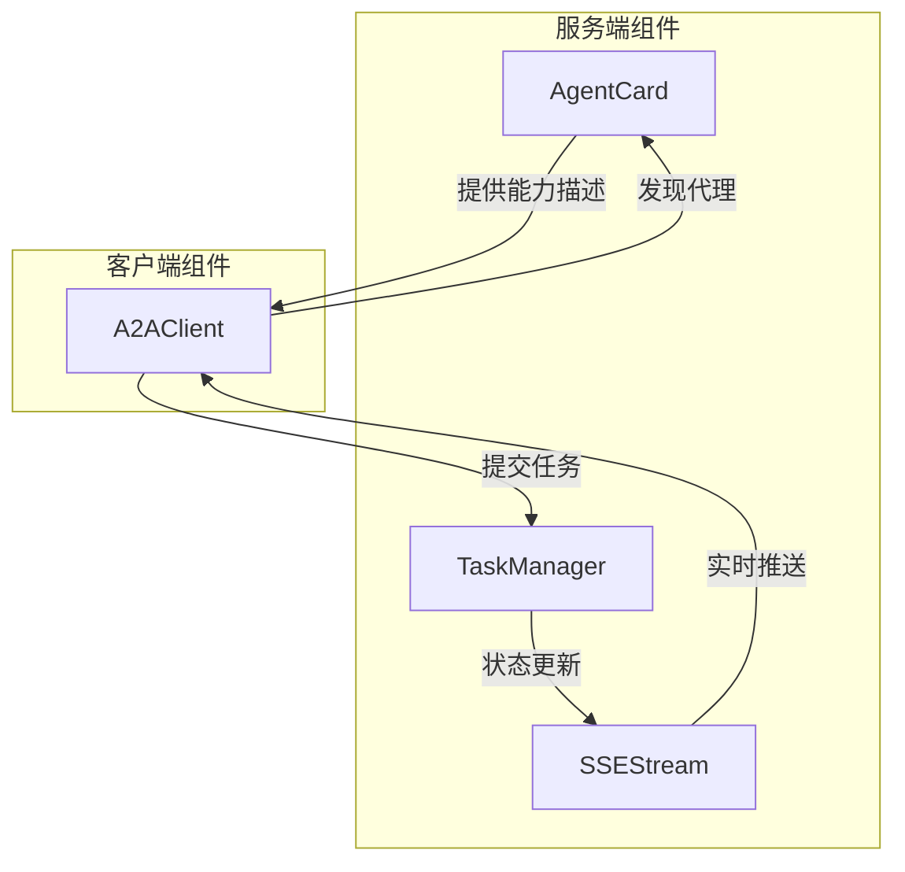
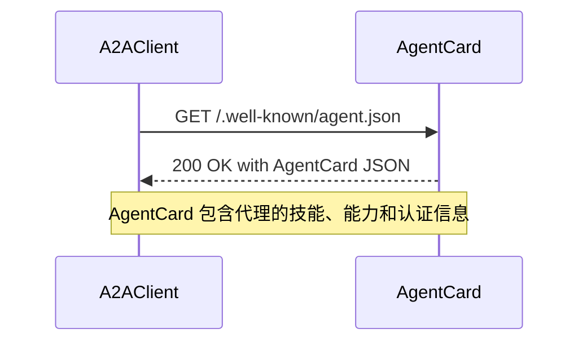
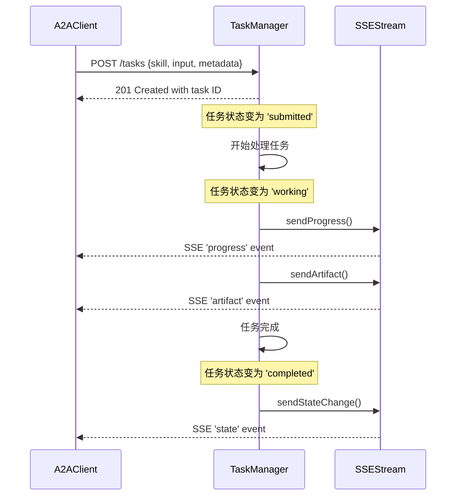

# A2A Protocol 文档

## 概述

A2A (Agent-to-Agent) Protocol 是一个标准化的代理间通信协议，用于实现智能代理之间的发现、任务提交和状态监控。该协议定义了一套通用的接口和数据格式，使得不同的代理系统可以无缝协作，无需预先了解彼此的内部实现细节。

### 设计理念

A2A Protocol 的设计基于以下核心理念：
- **标准化发现**：通过 `.well-known/agent.json` 端点提供统一的代理能力发现机制
- **异步任务处理**：支持长时间运行的任务，并通过 SSE (Server-Sent Events) 提供实时状态更新
- **技能导向**：代理通过声明式的技能列表描述其能力，任务通过技能 ID 进行路由
- **状态机驱动**：任务生命周期由明确的状态机管理，确保可预测的行为

### 模块架构



### 核心组件关系

A2A Protocol 模块由四个核心组件组成，它们协同工作提供完整的代理间通信功能：

1. **AgentCard**：负责代理能力的声明和发现，通过 `.well-known/agent.json` 端点提供标准化的代理元数据
2. **A2AClient**：作为客户端，用于发现和与远程 A2A 代理通信
3. **TaskManager**：管理任务的完整生命周期，包括创建、更新、取消和查询
4. **SSEStream**：提供基于 Server-Sent Events 的实时任务状态推送机制

## 组件详解

### AgentCard

AgentCard 是 A2A 协议的发现机制核心，它为代理提供了一种标准化的方式来声明其身份、能力和通信方式。每个 A2A 兼容的代理都需要在 `/.well-known/agent.json` 端点提供其 AgentCard。

AgentCard 包含代理的基本信息（名称、描述、URL、版本）、能力列表（如流式传输支持、状态转换历史）、技能定义（代理能执行的具体任务类型）以及认证方案。这种设计使得客户端可以在运行时动态发现代理的能力，而不需要硬编码的配置。

详细信息请参考 [AgentCard 组件文档](A2A Protocol - AgentCard.md)。

### A2AClient

A2AClient 是与远程 A2A 代理通信的客户端实现，它封装了所有与 A2A 协议相关的 HTTP 请求逻辑。该组件提供了发现代理、提交任务、查询任务状态、取消任务以及流式接收任务更新等功能。

A2AClient 处理了 HTTP 通信的底层细节，包括认证令牌管理、请求超时控制、响应大小限制以及 SSE 流的解析。它通过返回 Promise 或 EventEmitter 来适应不同的使用场景，使得开发者可以方便地集成 A2A 协议到自己的应用中。

详细信息请参考 [A2AClient 组件文档](A2A Protocol - A2AClient.md)。

### TaskManager

TaskManager 是 A2A 协议中负责任务生命周期管理的核心组件，它实现了一个完整的状态机来管理任务从创建到终止的全过程。TaskManager 支持任务的创建、状态更新、输出设置、工件添加、取消和查询等操作。

TaskManager 的设计考虑了实际生产环境的需求，包括任务数量限制、任务过期清理、输入大小限制以及状态转换验证。它通过事件发射器通知外部系统任务的创建、更新和状态变化，使得系统可以灵活地响应任务生命周期事件。

详细信息请参考 [TaskManager 组件文档](A2A Protocol - TaskManager.md)。

### SSEStream

SSEStream 组件实现了基于 Server-Sent Events 的实时通信机制，用于向客户端推送任务状态更新。它支持在 HTTP 响应初始化之前缓冲事件，确保即使在连接建立过程中产生的事件也不会丢失。

SSEStream 提供了多种类型的事件发送方法，包括进度更新、工件通知和状态变化通知。它还实现了缓冲区管理，防止内存无限增长，并提供了优雅的关闭机制。该组件继承自 EventEmitter，使得内部也可以监听和响应事件。

详细信息请参考 [SSEStream 组件文档](A2A Protocol - SSEStream.md)。

## 工作流程

### 代理发现流程



### 任务提交流程



## 使用指南

### 基本使用场景

#### 1. 创建一个 A2A 代理服务

```javascript
const { AgentCard, TaskManager, SSEStream } = require('src/protocols/a2a');

// 创建代理卡片
const agentCard = new AgentCard({
  name: 'My Agent',
  description: 'A sample A2A agent',
  url: 'https://my-agent.example.com',
  skills: [
    { id: 'example-skill', name: 'Example Skill', description: 'Does something useful' }
  ]
});

// 创建任务管理器
const taskManager = new TaskManager({ maxTasks: 100 });

// 监听任务创建事件
taskManager.on('task:created', (task) => {
  // 处理新任务
  console.log('New task created:', task.id);
});
```

#### 2. 作为客户端使用 A2AClient

```javascript
const { A2AClient } = require('src/protocols/a2a');

// 创建客户端
const client = new A2AClient({ authToken: 'your-token-here' });

// 发现代理
client.discover('https://agent.example.com')
  .then(agentCard => {
    console.log('Discovered agent:', agentCard.name);
    
    // 提交任务
    return client.submitTask('https://agent.example.com', {
      skill: 'prd-to-product',
      input: { prd: '...' },
      metadata: { priority: 'high' }
    });
  })
  .then(task => {
    console.log('Task created:', task.id);
    
    // 流式接收更新
    const stream = client.streamTask('https://agent.example.com', task.id);
    stream.on('event', (event) => {
      console.log('Task update:', event);
    });
  });
```

## 与其他模块的关系

A2A Protocol 模块在整个系统中扮演着代理间通信标准的角色，它与多个其他模块有紧密的关系：

- **Swarm Multi-Agent**：Swarm 模块可以利用 A2A Protocol 来实现多代理之间的协作和任务分配
- **API Server & Services**：API Server 可以集成 A2A Protocol 来提供标准化的代理接口
- **Python SDK / TypeScript SDK**：SDK 模块可以封装 A2AClient 功能，提供更友好的语言特定接口

## 安全考虑

A2A Protocol 模块本身不提供认证和授权功能，这是有意设计的。模块的文档明确指出，认证和授权是集成者的责任。在实际部署时，应该在传输/HTTP 层添加中间件或防护措施，然后再调用 TaskManager 方法。

建议的安全措施包括：
- 使用 HTTPS 加密所有通信
- 实现适当的认证机制（如 Bearer Token、API Key）
- 添加速率限制以防止滥用
- 验证所有输入数据的大小和格式

## 扩展性

A2A Protocol 设计为可扩展的，可以通过以下方式进行扩展：

- **自定义技能**：通过 AgentCard 的 addSkill 方法添加自定义技能
- **自定义事件类型**：SSEStream 支持发送任意类型的事件
- **任务状态扩展**：虽然核心状态是固定的，但可以通过任务元数据添加额外的状态信息
- **插件集成**：可以与 [Plugin System](Plugin System.md) 集成，通过插件扩展代理能力
