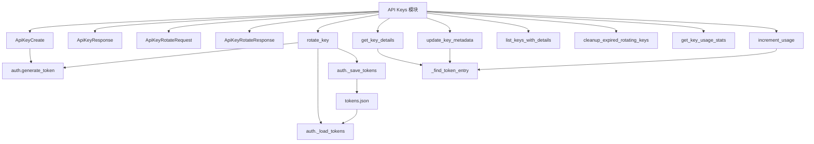

# API Keys 模块文档

## 概述

API Keys 模块是 Loki Mode Dashboard 中负责 API 密钥生命周期管理的核心组件。它构建在基础认证模块之上，提供了密钥创建、轮换、元数据管理、使用统计和安全清理等功能。

### 核心功能
- **密钥轮换与宽限期**：支持密钥轮换并保留旧密钥在指定宽限期内有效
- **详细元数据管理**：存储描述、允许 IP 列表、速率限制等扩展属性
- **使用统计跟踪**：记录密钥使用次数、最后使用时间和年龄信息
- **过期清理自动化**：提供过期轮换密钥的自动清理功能

### 设计原则
- 基于 [dashboard.auth](Dashboard%20Backend.md) 模块扩展，不重复实现核心令牌操作
- 所有元数据与 tokens.json 集成存储
- 提供安全的密钥标识（ID/名称双重查找）
- 完整的错误处理和回滚机制

---

## 架构与组件关系



API Keys 模块与 auth 模块紧密协作：
- **存储层**：共享 `~/.loki/dashboard/tokens.json` 文件
- **核心操作**：复用 `auth` 模块的令牌生成、加载和保存功能
- **扩展字段**：在基础令牌数据上添加元数据和轮换相关字段

---

## 核心组件详解

### 数据模型

#### ApiKeyCreate
创建 API 密钥的请求模型，包含以下字段：
- `name`：密钥名称（必填）
- `scopes`：权限范围列表（可选，默认全权限）
- `role`：预定义角色（可选，与 scopes 互斥）
- `expires_days`：过期天数（可选）
- `description`：描述信息（可选）
- `allowed_ips`：允许的 IP 地址列表（可选）
- `rate_limit`：每分钟请求数限制（可选）

#### ApiKeyResponse
API 密钥的响应模型，包含完整元数据：
- 基础信息：`id`、`name`、`scopes`、`role`
- 时间信息：`created_at`、`expires_at`、`last_used`
- 状态信息：`revoked`
- 扩展元数据：`description`、`allowed_ips`、`rate_limit`
- 轮换状态：`rotating_from`、`rotation_expires_at`
- 使用统计：`usage_count`

#### ApiKeyRotateRequest
密钥轮换请求模型：
- `grace_period_hours`：旧密钥保持有效的小时数（默认 24，最小 0）

#### ApiKeyRotateResponse
密钥轮换响应模型：
- `new_key`：新密钥的完整信息
- `old_key_id`：旧密钥 ID
- `old_key_rotation_expires_at`：旧密钥失效时间
- `token`：原始令牌（仅显示一次）

---

### 公共 API 函数

#### rotate_key
```python
def rotate_key(identifier: str, grace_period_hours: int = 24) -> dict:
    """轮换 API 密钥，在宽限期内保持旧密钥有效"""
```

**功能**：创建新密钥并标记旧密钥进入轮换状态，保持旧密钥在宽限期内有效

**参数**：
- `identifier`：要轮换的密钥 ID 或名称
- `grace_period_hours`：旧密钥保持有效的小时数（默认 24）

**返回值**：
包含新密钥信息、旧密钥 ID、旧密钥失效时间和原始令牌的字典

**异常**：
- `ValueError`：密钥不存在、已被撤销或已在轮换中

**工作流程**：
1. 查找并验证旧密钥
2. 临时重命名旧密钥以避免名称冲突
3. 使用原始名称创建新密钥
4. 复制元数据到新密钥
5. 记录轮换关系
6. 处理失败时的回滚操作

---

#### get_key_details
```python
def get_key_details(identifier: str) -> Optional[dict]:
    """获取完整密钥元数据包括使用统计"""
```

**功能**：通过 ID 或名称获取密钥的详细信息

**参数**：
- `identifier`：密钥 ID 或名称

**返回值**：
密钥详情字典（不包含哈希或原始令牌），不存在则返回 None

---

#### update_key_metadata
```python
def update_key_metadata(
    identifier: str,
    description: Optional[str] = None,
    allowed_ips: Optional[list[str]] = None,
    rate_limit: Optional[int] = None,
) -> dict:
    """更新密钥元数据而不轮换"""
```

**功能**：更新密钥的描述、允许 IP 和速率限制等元数据

**参数**：
- `identifier`：密钥 ID 或名称
- `description`：新描述（None 表示不修改）
- `allowed_ips`：新允许 IP 列表（None 表示不修改）
- `rate_limit`：新速率限制（None 表示不修改）

**返回值**：更新后的密钥详情字典

**异常**：
- `ValueError`：密钥不存在

---

#### list_keys_with_details
```python
def list_keys_with_details(include_rotating: bool = True) -> list[dict]:
    """列出所有密钥及扩展元数据和轮换状态"""
```

**功能**：获取所有密钥的详细信息列表

**参数**：
- `include_rotating`：是否包含处于轮换状态的旧密钥（默认 True）

**返回值**：密钥详情字典列表（不包含哈希或原始令牌）

---

#### cleanup_expired_rotating_keys
```python
def cleanup_expired_rotating_keys() -> list[str]:
    """移除轮换宽限期已过期的密钥"""
```

**功能**：查找并删除轮换宽限期已过的旧密钥

**返回值**：已删除的密钥 ID 列表

---

#### get_key_usage_stats
```python
def get_key_usage_stats(identifier: str) -> Optional[dict]:
    """返回密钥的使用统计信息"""
```

**功能**：获取密钥的使用次数、最后使用时间、创建时间和年龄

**参数**：
- `identifier`：密钥 ID 或名称

**返回值**：
包含 `usage_count`、`last_used`、`created_at` 和 `age_days` 的字典，不存在则返回 None

---

#### increment_usage
```python
def increment_usage(identifier: str) -> None:
    """递增密钥的使用计数器"""
```

**功能**：在密钥验证时调用，增加使用计数

**参数**：
- `identifier`：密钥 ID 或名称

---

## 使用示例

### 创建 API 密钥
```python
from dashboard import auth, api_keys

# 使用角色创建
token_info = auth.generate_token(
    name="production-api",
    role="operator",
    expires_days=90
)

# 或者使用自定义范围
token_info = auth.generate_token(
    name="read-only-api",
    scopes=["read"],
    description="用于只读访问的 API 密钥"
)

# 更新元数据
api_keys.update_key_metadata(
    "production-api",
    description="生产环境 API 访问密钥",
    allowed_ips=["192.168.1.0/24", "10.0.0.0/8"],
    rate_limit=100
)
```

### 轮换 API 密钥
```python
try:
    result = api_keys.rotate_key("production-api", grace_period_hours=48)
    print(f"新密钥令牌: {result['token']}")
    print(f"旧密钥将在 {result['old_key_rotation_expires_at']} 失效")
except ValueError as e:
    print(f"轮换失败: {e}")
```

### 管理和监控
```python
# 列出所有密钥（排除轮换中的旧密钥）
active_keys = api_keys.list_keys_with_details(include_rotating=False)

# 获取单个密钥详情
key_details = api_keys.get_key_details("production-api")

# 获取使用统计
usage_stats = api_keys.get_key_usage_stats("production-api")
print(f"已使用 {usage_stats['usage_count']} 次")
print(f"最后使用: {usage_stats['last_used']}")

# 清理过期的轮换密钥
deleted = api_keys.cleanup_expired_rotating_keys()
if deleted:
    print(f"已删除过期密钥: {deleted}")
```

---

## 配置与集成

### 存储位置
密钥数据存储在 `~/.loki/dashboard/tokens.json`，权限设置为仅所有者可读写（0o600）。

### 与认证模块集成
- 在调用 `auth.validate_token()` 后，可调用 `increment_usage()` 记录使用
- 使用 `auth.has_scope()` 检查权限
- 轮换功能构建在 `auth.generate_token()` 之上

### 环境变量
继承自 [dashboard.auth](Dashboard%20Backend.md) 模块的配置：
- `LOKI_ENTERPRISE_AUTH`：启用企业认证功能
- `LOKI_OIDC_ISSUER`、`LOKI_OIDC_CLIENT_ID`：OIDC/SSO 配置（可选）

---

## 注意事项与限制

### 安全考虑
- 原始令牌仅在创建和轮换时显示一次，无法重新获取
- 令牌使用加盐哈希存储，防止泄露后被直接使用
- 所有令牌操作都会更新 `last_used` 时间戳
- 轮换过程中有完整的回滚机制

### 轮换限制
- 已撤销的密钥无法轮换
- 已在轮换中的密钥无法再次轮换
- 轮换期间旧密钥会被临时重命名以避免名称冲突

### 元数据注意事项
- `allowed_ips` 和 `rate_limit` 字段仅存储，实际验证需在应用层实现
- 描述字段没有长度限制，但建议保持简洁

### 性能考虑
- 所有操作都会读写磁盘上的 tokens.json 文件
- 频繁调用 `increment_usage()` 可能导致性能问题，建议批量更新或异步处理
- 大量密钥时，建议定期调用 `cleanup_expired_rotating_keys()` 清理

### 错误处理
- 所有查找操作支持 ID 和名称两种标识方式
- 密钥不存在时，查询操作返回 None，修改操作抛出 ValueError
- 轮换过程中的任何异常都会触发回滚，恢复到操作前状态

---

## 相关模块
- [Dashboard Backend](Dashboard%20Backend.md)：包含基础 auth 模块
- [Multi-Tenancy](Multi-Tenancy.md)：租户管理（与 API 密钥配合使用）
- [API V2](API%20V2.md)：API 密钥更新请求

