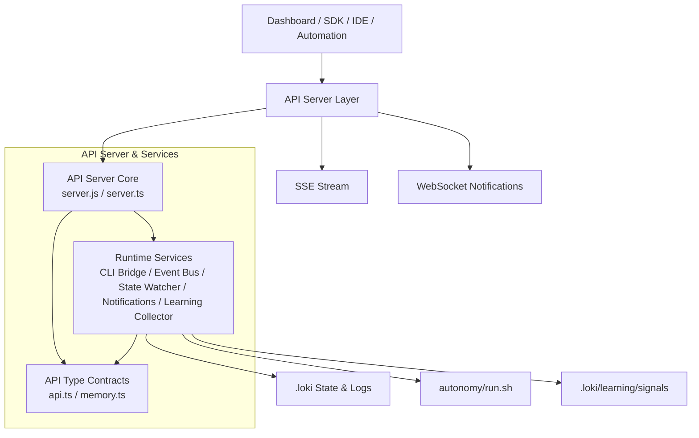
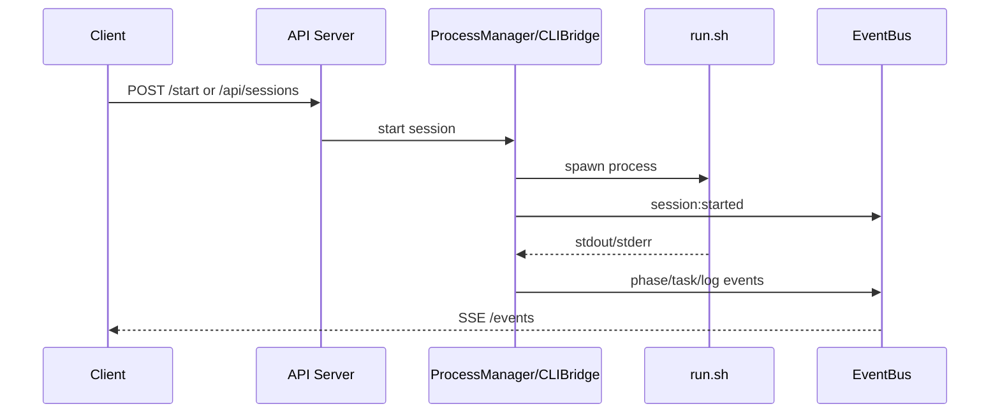
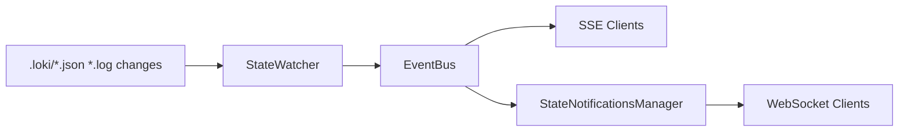

# API Server & Services 模块文档

## 1. 模块简介：它解决了什么问题，为什么存在

`API Server & Services` 是 Loki Mode 的统一控制与可观测入口，负责把底层“脚本执行 + 状态文件 + 日志输出”的运行形态，转换为上层可消费的 HTTP API、SSE 事件流和（部分场景下）WebSocket 通知。这个模块存在的核心意义是：让系统不再只能通过 CLI 手工驱动，而是可以被 Dashboard、SDK、IDE 插件以及自动化平台稳定调用和监控。

从实现上看，该模块同时包含 Node.js 与 Deno 两条 API 服务路径。Node 版本（`api/server.js`）强调零依赖、快速落地和本地控制；Deno 版本（`api/server.ts`）强调类型化路由、中间件治理、可扩展 API 面。两者并存并非重复建设，而是演进期的双栈设计：前者偏“运行器控制面”，后者偏“平台化服务面”。

如果把整个系统看成“执行引擎 + 记忆系统 + 治理与可视化”，那么本模块就是它们之间的网络边界层与事件边界层。

## 文档导航

为避免主文档过度膨胀，详细实现已拆分到以下子文档，请按需深入：

- [api_server_core.md](api_server_core.md)：入口路由、请求分发、Process 生命周期与 SSE 基础能力。
- [runtime_services.md](runtime_services.md)：CLI Bridge、服务层 Event Bus、State Watcher、State Notifications、Learning Collector。
- [api_type_contracts.md](api_type_contracts.md)：API 与 Memory 相关请求/响应与查询参数类型契约。

> 进一步按组件阅读可参考：
> - [CLI Bridge.md](CLI Bridge.md)、[Event Bus.md](Event Bus.md)、[State Watcher.md](State Watcher.md)、[State Notifications.md](State Notifications.md)、[Learning Collector.md](Learning Collector.md)
> - [API Types.md](API Types.md)、[Memory Types.md](Memory Types.md)

---

## 2. 总体架构



这个架构有三个关键特点。第一，入口层和运行时层分离：路由负责接入，服务负责解释与分发。第二，事件驱动优先：会话、任务、phase、日志等信息统一通过事件总线流转。第三，契约先行：`api/types` 中的类型定义为 API 与客户端提供稳定的数据边界。

---

## 3. 子模块概览（含文档索引）

### 3.1 API Server Core（入口编排与生命周期控制）

该子模块包含 `api.server.EventBus`、`api.server.ProcessManager`、`api.server.Route`，负责请求路由、会话生命周期控制、SSE 基础能力和中间件编排。其内部最关键的能力是把“启动/停止/暂停/恢复/输入注入”等控制命令与真实进程状态同步起来，并把 stdout/stderr 与状态变化翻译为结构化事件。

详细说明见：[`api_server_core.md`](api_server_core.md)（兼容参考：[`API Server Core.md`](API Server Core.md)）。

### 3.2 Runtime Services（运行时事件与状态服务）

该子模块由 `CLIBridge`、服务层 `EventBus`、`StateWatcher`、`StateNotificationsManager`、`LearningCollector` 组成，职责是把 CLI 输出、状态文件变化和操作行为变成可订阅、可查询、可学习的数据流。它是 API 的运行时中台，直接决定“前端看到的实时性”和“系统可观测性质量”。

详细说明见：[`runtime_services.md`](runtime_services.md)。可按组件查阅：[`CLI Bridge.md`](CLI Bridge.md)、[`Event Bus.md`](Event Bus.md)、[`State Watcher.md`](State Watcher.md)、[`State Notifications.md`](State Notifications.md)、[`Learning Collector.md`](Learning Collector.md)。

### 3.3 API Type Contracts（接口与数据契约层）

该子模块提供会话、任务、健康检查、记忆检索与建议等核心类型定义（`api.types.api.*` 与 `api.types.memory.*`），用于保证路由、服务、SDK、前端在字段语义上的一致性。它不直接执行业务，但决定了跨模块协作的稳定性。

详细说明见：[`api_type_contracts.md`](api_type_contracts.md)（补充：[`API Types.md`](API Types.md)、[`Memory Types.md`](Memory Types.md)）。

---

## 4. 关键交互流程

### 4.1 会话控制与事件回传



这个流程说明：控制请求通常是一次性的，但执行反馈是持续流式的。调用方应组合使用“同步 API 响应 + SSE/WS 实时流”，而不是只依赖单次 HTTP 返回。

### 4.2 文件状态驱动的补充观测



当 CLI 输出信号不完整或外部工具直接写状态文件时，`StateWatcher` 能提供“第二观测通道”，提高状态同步鲁棒性。

---

## 5. 与系统其他模块的关系

`API Server & Services` 是上层产品能力的统一后端接口。它与其他模块的关系建议按“依赖方向”理解：

- 面向应用层输出能力：[`Dashboard Backend.md`](Dashboard Backend.md)、[`Dashboard Frontend.md`](Dashboard Frontend.md)、[`Dashboard UI Components.md`](Dashboard UI Components.md)
- 面向开发者生态输出能力：[`Python SDK.md`](Python SDK.md)、[`TypeScript SDK.md`](TypeScript SDK.md)、[`VSCode Extension.md`](VSCode Extension.md)
- 消费底层能力：[`State Management.md`](State Management.md)、[`Memory System.md`](Memory System.md)、[`Swarm Multi-Agent.md`](Swarm Multi-Agent.md)
- 对接治理与合规：[`Policy Engine.md`](Policy Engine.md)、[`Audit.md`](Audit.md)、[`Observability.md`](Observability.md)

换言之，本模块更像“系统中枢 API 面”，而不是单一业务域实现。

---

## 6. 配置与运行指导

### 6.1 常用配置

- `LOKI_PROJECT_DIR`：Node 版本项目目录基准
- `LOKI_DASHBOARD_PORT` / `LOKI_DASHBOARD_HOST`：Deno 默认监听配置
- `LOKI_API_TOKEN`：远程访问认证（Deno auth middleware）
- `LOKI_PROMPT_INJECTION=true`：启用 Node `/input` 注入（默认禁用）
- `LOKI_DIR`：运行目录定位（服务组件读取 `.loki`）

### 6.2 启动方式

```bash
# Node（轻量、零依赖）
node api/server.js --port 57374 --host 127.0.0.1

# Deno（类型化 API）
deno run --allow-all api/server.ts --port 57374 --host localhost
```

### 6.3 接口使用建议

- Node 路径通常是短路径（如 `/start`、`/events`、`/chat`）。
- Deno 路径通常是资源化路径（如 `/api/sessions`、`/api/tasks`、`/api/memory/*`、`/api/learning/*`）。
- 生产集成建议优先使用 Deno 风格 API 面与类型契约，并结合 SDK 调用。

---

## 7. 扩展与二次开发建议

扩展 API 时建议遵循“契约先行、事件补全、观测优先”的顺序。先在类型层补充契约，再在 route/service 中实现逻辑，最后确保通过 `EventBus` 发出足够事件供 Dashboard/SDK 感知。

如果你新增会话或任务相关动作，应同时考虑：
1) HTTP 返回结构是否稳定；
2) 是否产生可追踪事件；
3) 是否需要学习信号采集；
4) 是否会影响状态文件监听路径。

具体落地可参考：[`api_server_core.md`](api_server_core.md)、[`runtime_services.md`](runtime_services.md)、[`api_type_contracts.md`](api_type_contracts.md)。

---

## 8. 风险点、边界条件与已知限制

这个模块在可用性上做了很多容错，但仍有一些必须明确的工程现实。第一，部分事件识别依赖日志模式匹配，日志格式变化会导致事件误判或漏判。第二，事件历史主要是内存缓冲，服务重启后不会保留完整历史。第三，Node 与 Deno 双栈并存期间，端点与错误模型存在差异，调用方需明确接入目标。

另外，输入注入相关能力默认偏保守（如 prompt injection 开关默认关闭），这符合企业安全基线；但 `/chat` 在运行会话中会写入 `HUMAN_INPUT.md`，属于“显式人工动作”路径，仍建议在外层接入鉴权与审计。

已知实现性注意事项详见子模块文档，尤其是：[`runtime_services.md`](runtime_services.md) 中列出的 timeout/统计字段等实现边界。

---

## 9. 阅读路径建议

如果你第一次接触本模块，推荐按以下顺序阅读：

1. 本文（总体架构与边界）
2. [`api_server_core.md`](api_server_core.md)（入口与生命周期）
3. [`runtime_services.md`](runtime_services.md)（运行时事件与状态同步）
4. [`api_type_contracts.md`](api_type_contracts.md)（接口契约）
5. 按需进入关联模块（Memory/State/SDK/Dashboard）

通过这个路径，你可以先建立“系统怎么跑”的心智模型，再深入“每个组件怎么实现”。