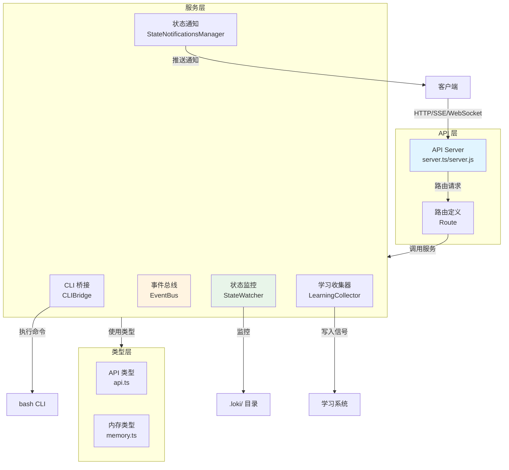

# API Server & Services 模块文档

## 1. 模块概述

API Server & Services 模块是 Loki Mode 系统的核心通信层，提供 RESTful API 和 Server-Sent Events (SSE) 支持，实现了系统与外部组件的交互接口。该模块设计为零依赖（Node.js版本）或 Deno 原生实现，确保轻量级部署和高性能运行。

### 1.1 核心功能

- **HTTP API 服务**：提供会话管理、任务控制、状态查询等 REST 端点
- **实时事件流**：通过 SSE 推送系统状态变化和日志信息
- **CLI 桥接**：将 API 请求转换为现有 bash CLI 命令执行
- **状态监控**：实时监控 `.loki/` 目录状态变化并推送通知
- **学习信号收集**：收集 API 操作数据用于跨工具学习
- **事件总线**：实现发布/订阅模式的事件分发系统

### 1.2 设计理念

该模块采用模块化设计，各服务组件职责清晰，通过事件总线实现松耦合通信。安全性是核心设计原则，包括输入验证、路径遍历防护、CORS 限制等机制。同时支持非阻塞异步操作，确保 API 性能不受学习信号收集等后台任务影响。

## 2. 架构概览

API Server & Services 模块采用分层架构，从底层的文件系统监控到顶层的 API 端点形成完整的处理链路。



### 2.1 核心组件关系

1. **API Server**：作为入口点，处理所有 HTTP 请求并路由到相应处理程序
2. **EventBus**：中心事件分发系统，所有服务通过它发布和订阅事件
3. **StateWatcher**：监控文件系统变化，将状态变更转换为事件
4. **CLIBridge**：连接 API 与现有 CLI 基础设施，执行命令并捕获输出
5. **LearningCollector**：异步收集学习信号，不阻塞 API 响应
6. **StateNotificationsManager**：提供 WebSocket 实时状态变更通知

## 3. 子模块功能介绍

### 3.1 API Server 核心

API Server 是整个模块的入口点，提供两个主要实现版本：Node.js 版本 (`server.js`) 和 Deno 版本 (`server.ts`)。两者功能相似，但 Deno 版本提供更完整的路由系统和中间件支持。

**主要功能**：
- HTTP 请求处理和路由
- CORS 和认证中间件
- SSE 事件流管理
- 进程生命周期控制

详细信息请参考 [API Server 核心子模块文档](API Server Core.md)。

### 3.2 事件总线 (EventBus)

EventBus 实现了发布/订阅模式的事件分发系统，支持事件过滤和历史记录。它是各组件之间通信的中枢，确保松耦合的架构设计。

**主要功能**：
- 事件订阅与发布
- 基于类型和会话的事件过滤
- 事件历史记录与回放
- SSE 客户端管理

详细信息请参考 [事件总线子模块文档](Event Bus.md)。

### 3.3 CLI 桥接 (CLIBridge)

CLIBridge 服务将 API 请求桥接到现有的 bash CLI 基础设施，负责 spawn loki 命令、捕获输出并流式传输回 API 客户端。

**主要功能**：
- 会话启动与停止
- CLI 命令执行
- 输出流式处理与事件解析
- 状态文件管理

详细信息请参考 [CLI 桥接子模块文档](CLI Bridge.md)。

### 3.4 状态监控 (StateWatcher)

StateWatcher 服务监控 `.loki/` 目录的状态变化，将文件系统变更转换为系统事件。它使用防抖机制处理频繁的文件变化，并通过事件总线分发状态更新。

**主要功能**：
- 文件系统监控
- 会话与任务状态加载
- 状态变更检测与事件发射
- 日志文件尾部读取

详细信息请参考 [状态监控子模块文档](State Watcher.md)。

### 3.5 状态通知 (StateNotificationsManager)

StateNotificationsManager 提供基于 WebSocket 的实时状态变更通知服务，允许 API 客户端订阅特定文件或变更类型的通知。

**主要功能**：
- WebSocket 连接管理
- 订阅过滤机制
- 状态变更广播
- 连接心跳保持

详细信息请参考 [状态通知子模块文档](State Notifications.md)。

### 3.6 学习收集器 (LearningCollector)

LearningCollector 服务从 API 操作中收集学习信号，用于跨工具学习。所有信号发送都是异步非阻塞的，避免影响 API 性能。

**主要功能**：
- 多种类型学习信号收集
- 信号缓冲与批量处理
- 异步写入存储
- API 性能指标追踪

详细信息请参考 [学习收集器子模块文档](Learning Collector.md)。

## 4. 与其他模块的集成

API Server & Services 模块作为系统的通信中枢，与多个其他模块紧密集成：

- **Dashboard Backend**：通过 API 提供会话和任务数据，支持前端界面展示
- **Memory System**：通过内存相关 API 端点提供记忆检索和管理功能
- **Swarm Multi-Agent**：接收代理状态变化并通过事件流推送
- **State Management**：集成状态管理器实现集中化状态访问
- **Python SDK / TypeScript SDK**：为 SDK 提供底层 API 实现

## 5. 使用指南

### 5.1 基本配置

API Server 支持以下配置方式：

**环境变量**：
- `LOKI_PROJECT_DIR`：项目目录路径
- `LOKI_DASHBOARD_PORT`：服务端口（默认 57374）
- `LOKI_DASHBOARD_HOST`：绑定主机（默认 localhost）
- `LOKI_PROMPT_INJECTION`：启用提示注入（默认禁用）
- `LOKI_API_TOKEN`：API 访问令牌

**命令行参数**：
- `--port <port>`：指定服务端口
- `--host <host>`：指定绑定主机
- `--no-cors`：禁用 CORS
- `--no-auth`：禁用认证

### 5.2 启动服务

**Node.js 版本**：
```bash
node api/server.js [--port 3000] [--host 127.0.0.1]
# 或
loki serve [--port 3000]
```

**Deno 版本**：
```bash
deno run --allow-all api/server.ts [options]
```

### 5.3 主要 API 端点

| 端点 | 方法 | 描述 |
|------|------|------|
| `/health` | GET | 健康检查 |
| `/status` | GET | 当前会话状态 |
| `/events` | GET | SSE 事件流 |
| `/logs` | GET | 最近日志条目 |
| `/start` | POST | 启动新会话 |
| `/stop` | POST | 停止会话 |
| `/pause` | POST | 暂停执行 |
| `/resume` | POST | 恢复执行 |
| `/input` | POST | 注入人工输入 |
| `/chat` | POST | 交互式对话 |

Deno 版本还提供更完整的 `/api/*` 端点集合，包括会话管理、任务、记忆、学习等功能。

## 6. 安全考虑

API Server & Services 模块内置多层安全机制：

1. **输入验证**：所有用户输入经过严格验证，防止注入攻击
2. **路径遍历防护**：验证文件路径确保在项目目录内
3. **CORS 限制**：仅允许 localhost 来源的跨域请求
4. **认证中间件**：Deno 版本支持 API 令牌认证
5. **提示注入控制**：默认禁用提示注入功能，需显式启用
6. **请求体大小限制**：防止过大请求导致的拒绝服务攻击

## 7. 扩展性

该模块设计支持多种扩展方式：

- **自定义路由**：可通过添加新的路由定义扩展 API 功能
- **中间件**：Deno 版本支持添加自定义中间件
- **事件订阅**：通过 EventBus 订阅系统事件实现自定义处理
- **学习信号**：扩展 LearningCollector 添加新的信号类型

详细扩展指南请参考各子模块文档。
