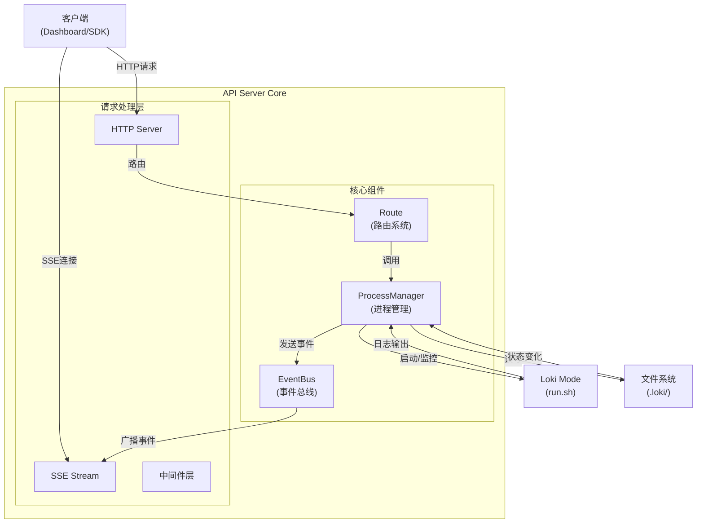
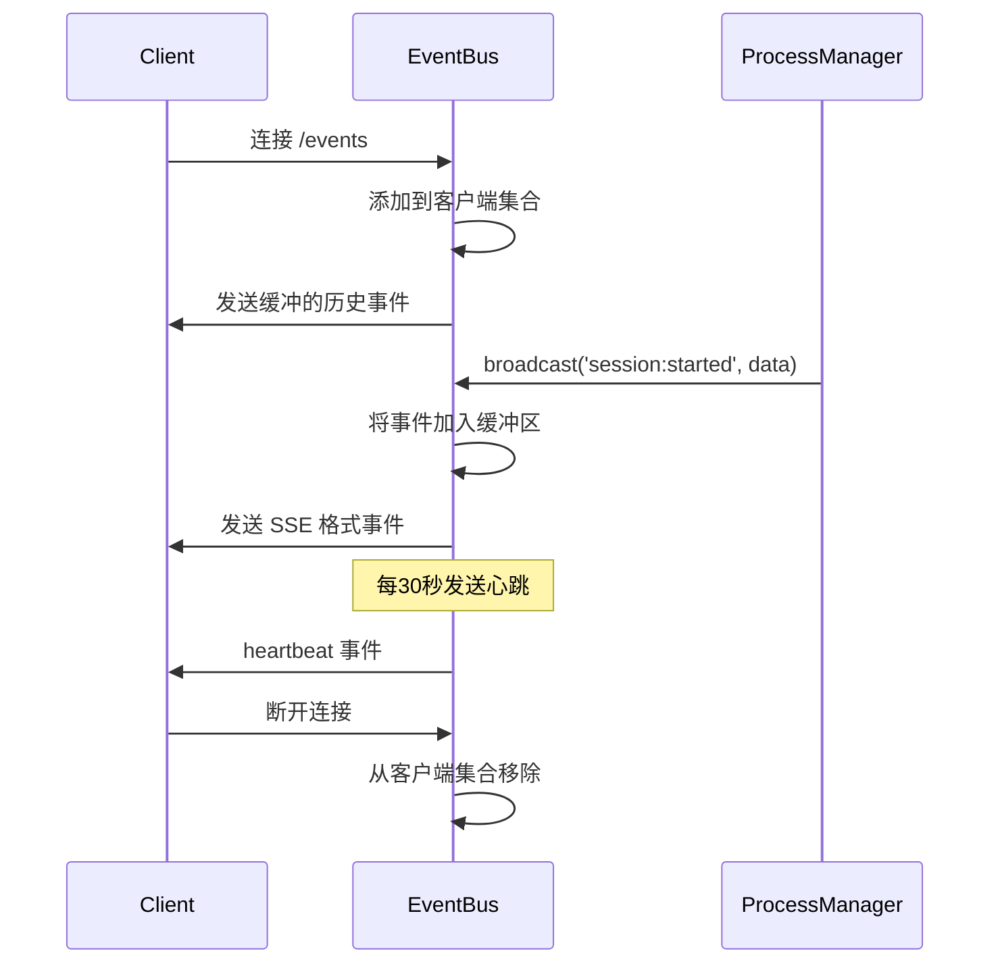
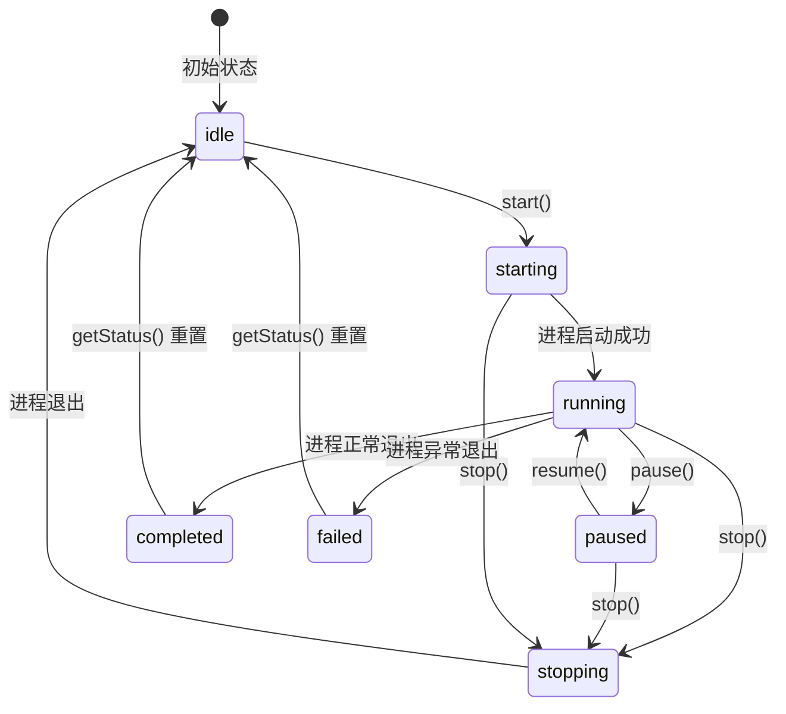
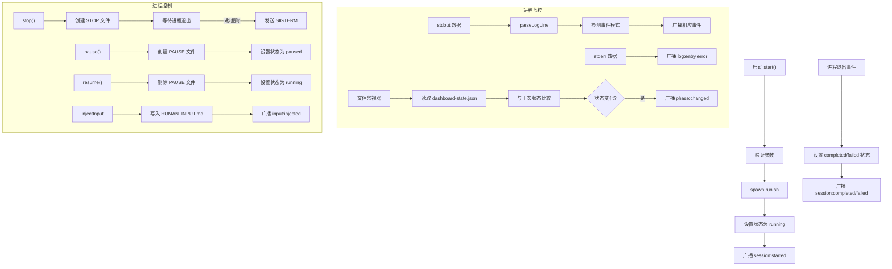
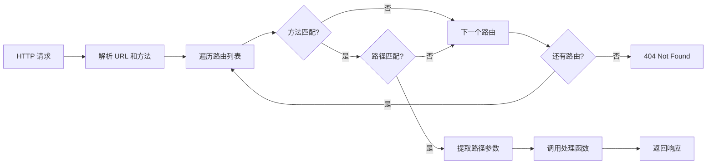

# API Server Core 模块文档

## 概述

API Server Core 模块是 Loki Mode 系统的核心基础设施组件，提供 HTTP/SSE API 服务，用于远程控制和监控 Loki Mode 会话。该模块设计为轻量级、零依赖（Node.js 版本），同时提供强大的会话管理和实时事件广播功能。

### 核心功能
- REST API 端点提供会话管理、状态监控和日志访问
- Server-Sent Events (SSE) 实现实时事件广播
- 进程生命周期管理
- 事件总线机制
- 路由系统

### 设计理念
API Server Core 采用模块化设计，将事件处理、进程管理和路由系统清晰分离。Node.js 版本注重零依赖和简单部署，而 TypeScript/Deno 版本则提供更丰富的功能集和更好的类型安全。

## 架构概览



### 组件关系说明

1. **EventBus**：作为事件中枢，负责接收来自 ProcessManager 的事件并广播给所有连接的 SSE 客户端
2. **ProcessManager**：管理 Loki Mode 进程的生命周期，包括启动、停止、暂停、恢复等操作
3. **Route**：定义和匹配 API 端点，将 HTTP 请求路由到相应的处理函数
4. **HTTP Server**：处理传入的 HTTP 请求，支持 REST API 和 SSE 连接
5. **Middleware**：提供跨域、认证、错误处理等横切关注点

## 核心组件详解

### EventBus（事件总线）

EventBus 是一个基于 Node.js EventEmitter 的事件广播系统，专门用于 Server-Sent Events (SSE) 的实时事件分发。

#### 主要功能
- 管理多个 SSE 客户端连接
- 事件缓冲（支持新客户端获取历史事件）
- 心跳机制保持连接活跃
- 事件广播和客户端通知

#### 核心方法

```javascript
class EventBus extends EventEmitter {
  // 添加 SSE 客户端
  addClient(res: http.ServerResponse): () => void
  
  // 广播事件到所有客户端
  broadcast(type: string, data: any): void
  
  // 发送单个事件到指定客户端
  sendToClient(res: http.ServerResponse, event: object): void
  
  // 启动心跳机制
  startHeartbeat(): void
  
  // 停止心跳机制
  stopHeartbeat(): void
  
  // 清理资源
  cleanup(): void
}
```

#### 工作原理

EventBus 维护一个客户端连接集合，当有新事件时，它会将事件格式化为 SSE 协议格式并发送给所有连接的客户端。同时，它会保留最近 100 个事件的缓冲区，以便新连接的客户端可以获取历史事件。



#### 使用示例

```javascript
// 创建 EventBus 实例
const eventBus = new EventBus();

// 在 HTTP 请求处理器中处理 SSE 连接
function handleSSE(req, res) {
  res.writeHead(200, {
    'Content-Type': 'text/event-stream',
    'Cache-Control': 'no-cache',
    'Connection': 'keep-alive'
  });

  // 发送初始状态
  res.write(`event: connected\ndata: ${JSON.stringify({ status: 'connected' })}\n\n`);

  // 注册客户端
  const removeClient = eventBus.addClient(res);

  // 处理断开连接
  req.on('close', removeClient);
}

// 广播事件
eventBus.broadcast('custom:event', { key: 'value' });
```

### ProcessManager（进程管理器）

ProcessManager 负责管理 Loki Mode 进程的完整生命周期，包括启动、监控、控制和终止进程。

#### 主要功能
- 启动和停止 Loki Mode 会话
- 暂停和恢复执行
- 注入人类输入
- 监控进程输出和状态
- 解析日志并生成事件
- 监视 .loki/ 目录中的状态变化

#### 状态机

ProcessManager 实现了一个完整的状态机，管理会话的各种状态：



#### 核心方法

```javascript
class ProcessManager {
  // 启动新会话
  async start(options: { prd?: string, provider?: string }): Promise<{ pid: number, status: string }>
  
  // 停止会话
  async stop(): Promise<{ status: string }>
  
  // 暂停会话
  async pause(): Promise<{ status: string }>
  
  // 恢复会话
  async resume(): Promise<{ status: string }>
  
  // 注入人类输入
  async injectInput(input: string): Promise<{ status: string }>
  
  // 获取当前状态
  getStatus(): object
  
  // 解析日志行
  parseLogLine(line: string): void
  
  // 启动文件监视器
  startFileWatcher(): void
  
  // 停止文件监视器
  stopFileWatcher(): void
}
```

#### 工作原理

ProcessManager 通过 spawn 启动 run.sh 脚本，并监视其 stdout 和 stderr 输出。它解析日志行以检测特定事件模式，并通过 EventBus 广播这些事件。同时，它还会定期轮询 .loki/dashboard-state.json 文件以获取最新的状态信息。



#### 安全特性

ProcessManager 实施了多项安全措施：
- 验证 provider 参数以防止命令注入
- 验证 PRD 路径以防止路径遍历
- 默认禁用提示注入功能，需要显式启用
- 限制请求体大小以防止拒绝服务攻击

### Route（路由系统）

Route 组件定义了 API 端点的结构和匹配逻辑，将 HTTP 请求路由到相应的处理函数。

#### 主要功能
- 定义 HTTP 方法和路径模式
- 提取路径参数
- 路由匹配和请求分发
- 中间件集成

#### 路由定义

```typescript
interface Route {
  method: string;        // HTTP 方法: GET, POST, PUT, DELETE 等
  pattern: RegExp;       // 路径匹配正则表达式
  handler: RouteHandler; // 处理函数
}

type RouteHandler = (
  req: Request,
  ...params: string[]    // 从路径中提取的参数
) => Promise<Response> | Response;
```

#### 路由示例

```typescript
const routes: Route[] = [
  // 健康检查端点（无需认证）
  { method: "GET", pattern: /^\/health$/, handler: healthCheck },
  
  // 会话端点
  { method: "POST", pattern: /^\/api\/sessions$/, handler: startSession },
  { method: "GET", pattern: /^\/api\/sessions$/, handler: listSessions },
  { 
    method: "GET", 
    pattern: /^\/api\/sessions\/([^/]+)$/, 
    handler: getSession 
  },
  
  // 任务端点
  { 
    method: "GET", 
    pattern: /^\/api\/sessions\/([^/]+)\/tasks$/, 
    handler: listTasks 
  },
  
  // 内存端点
  { method: "GET", pattern: /^\/api\/memory$/, handler: getMemorySummary },
  { 
    method: "POST", 
    pattern: /^\/api\/memory\/retrieve$/, 
    handler: retrieveMemories 
  },
];
```

#### 路由匹配流程



#### 中间件集成

路由系统与中间件层无缝集成，提供横切关注点处理：

```typescript
function createHandler(config: ServerConfig): Deno.ServeHandler {
  let handler: (req: Request) => Promise<Response> = routeRequest;

  // 应用中间件（从内向外）
  handler = errorMiddleware(handler);
  handler = timingMiddleware(handler);
  
  if (config.auth) {
    const authHandler = handler;
    handler = async (req: Request) => {
      const url = new URL(req.url);
      if (url.pathname.startsWith("/health")) {
        return authHandler(req); // 健康检查跳过认证
      }
      return authMiddleware(authHandler)(req);
    };
  }
  
  if (config.cors) {
    handler = corsMiddleware(handler);
  }

  return handler;
}
```

## API 端点

### Node.js 版本端点

| 方法 | 路径 | 描述 | 认证 |
|------|------|------|------|
| GET | `/health` | 健康检查 | 否 |
| GET | `/status` | 当前会话状态和指标 | 否 |
| GET | `/events` | SSE 实时事件流 | 否 |
| GET | `/logs` | 最近日志条目（?lines=100） | 否 |
| POST | `/start` | 启动新会话 | 否 |
| POST | `/stop` | 优雅停止 | 否 |
| POST | `/pause` | 暂停执行 | 否 |
| POST | `/resume` | 恢复执行 | 否 |
| POST | `/input` | 注入人类输入 | 否 |
| POST | `/chat` | 交互式对话 | 否 |
| GET | `/chat/history` | 获取聊天历史 | 否 |
| DELETE | `/chat/history` | 清除聊天历史 | 否 |

### TypeScript/Deno 版本端点

#### 健康检查

| 方法 | 路径 | 描述 | 认证 |
|------|------|------|------|
| GET | `/health` | 健康检查 | 否 |
| GET | `/health/ready` | 就绪性检查 | 否 |
| GET | `/health/live` | 存活性检查 | 否 |

#### 会话管理

| 方法 | 路径 | 描述 | 认证 |
|------|------|------|------|
| GET | `/api/status` | 详细状态 | 是 |
| POST | `/api/sessions` | 启动新会话 | 是 |
| GET | `/api/sessions` | 列出会话 | 是 |
| GET | `/api/sessions/:id` | 获取会话详情 | 是 |
| POST | `/api/sessions/:id/stop` | 停止会话 | 是 |
| POST | `/api/sessions/:id/pause` | 暂停会话 | 是 |
| POST | `/api/sessions/:id/resume` | 恢复会话 | 是 |
| POST | `/api/sessions/:id/input` | 注入输入 | 是 |
| DELETE | `/api/sessions/:id` | 删除会话 | 是 |

#### 任务管理

| 方法 | 路径 | 描述 | 认证 |
|------|------|------|------|
| GET | `/api/tasks` | 列出所有任务 | 是 |
| GET | `/api/tasks/active` | 获取活跃任务 | 是 |
| GET | `/api/tasks/queue` | 获取队列任务 | 是 |
| GET | `/api/sessions/:id/tasks` | 列出会话任务 | 是 |
| GET | `/api/sessions/:id/tasks/:taskId` | 获取任务详情 | 是 |

#### 事件和内存

| 方法 | 路径 | 描述 | 认证 |
|------|------|------|------|
| GET | `/api/events` | SSE 事件流 | 是 |
| GET | `/api/events/history` | 获取事件历史 | 是 |
| GET | `/api/events/stats` | 获取事件统计 | 是 |
| GET | `/api/memory` | 内存摘要 | 是 |
| GET | `/api/memory/index` | 内存索引 | 是 |
| GET | `/api/memory/timeline` | 内存时间线 | 是 |
| GET | `/api/memory/episodes` | 列出片段 | 是 |
| GET | `/api/memory/episodes/:id` | 获取片段 | 是 |
| GET | `/api/memory/patterns` | 列出模式 | 是 |
| GET | `/api/memory/patterns/:id` | 获取模式 | 是 |
| GET | `/api/memory/skills` | 列出技能 | 是 |
| GET | `/api/memory/skills/:id` | 获取技能 | 是 |
| POST | `/api/memory/retrieve` | 查询记忆 | 是 |
| POST | `/api/memory/consolidate` | 整合记忆 | 是 |
| GET | `/api/memory/economics` | Token 经济 | 是 |
| GET | `/api/suggestions` | 获取建议 | 是 |
| GET | `/api/suggestions/learning` | 获取学习建议 | 是 |

#### 学习指标

| 方法 | 路径 | 描述 | 认证 |
|------|------|------|------|
| GET | `/api/learning/metrics` | 学习指标 | 是 |
| GET | `/api/learning/trends` | 学习趋势 | 是 |
| GET | `/api/learning/signals` | 学习信号 | 是 |
| GET | `/api/learning/aggregation` | 最新聚合 | 是 |
| POST | `/api/learning/aggregate` | 触发聚合 | 是 |
| GET | `/api/learning/preferences` | 聚合偏好 | 是 |
| GET | `/api/learning/errors` | 聚合错误 | 是 |
| GET | `/api/learning/success` | 成功模式 | 是 |
| GET | `/api/learning/tools` | 工具效率 | 是 |

## 配置选项

### Node.js 版本

#### 命令行参数

| 参数 | 描述 | 默认值 |
|------|------|--------|
| `--port <port>` | 监听端口 | 57374 |
| `--host <host>` | 绑定主机 | 127.0.0.1 |

#### 环境变量

| 变量 | 描述 | 默认值 |
|------|------|--------|
| `LOKI_PROJECT_DIR` | 项目目录 | 当前工作目录 |
| `LOKI_PROMPT_INJECTION` | 启用提示注入 | false |

### TypeScript/Deno 版本

#### 命令行参数

| 参数 | 描述 | 默认值 |
|------|------|--------|
| `--port, -p <port>` | 监听端口 | 57374 |
| `--host, -h <host>` | 绑定主机 | localhost |
| `--no-cors` | 禁用 CORS | false |
| `--no-auth` | 禁用认证 | false |
| `--help` | 显示帮助 | - |

#### 环境变量

| 变量 | 描述 | 默认值 |
|------|------|--------|
| `LOKI_DASHBOARD_PORT` | 端口 | 57374 |
| `LOKI_DASHBOARD_HOST` | 主机 | localhost |
| `LOKI_API_TOKEN` | API 令牌 | - |
| `LOKI_DIR` | Loki 安装目录 | - |
| `LOKI_VERSION` | 版本字符串 | dev |
| `LOKI_DEBUG` | 启用调试输出 | false |

## 使用示例

### 启动服务器

#### Node.js 版本

```bash
# 直接运行
node api/server.js --port 3000 --host 127.0.0.1

# 或通过 CLI
loki serve --port 3000
```

#### TypeScript/Deno 版本

```bash
# Deno 运行
deno run --allow-net --allow-read --allow-write --allow-env --allow-run api/server.ts --port 8420

# 或通过 CLI
loki serve --port 8420
```

### 启动会话

```javascript
// 使用 fetch API
fetch('http://localhost:57374/start', {
  method: 'POST',
  headers: { 'Content-Type': 'application/json' },
  body: JSON.stringify({
    prd: 'docs/prd.md',
    provider: 'claude'
  })
})
.then(response => response.json())
.then(data => console.log('Session started:', data));
```

### 连接 SSE 事件流

```javascript
// 浏览器中连接 SSE
const eventSource = new EventSource('http://localhost:57374/events');

eventSource.addEventListener('connected', (event) => {
  console.log('Connected:', JSON.parse(event.data));
});

eventSource.addEventListener('session:started', (event) => {
  console.log('Session started:', JSON.parse(event.data));
});

eventSource.addEventListener('phase:changed', (event) => {
  console.log('Phase changed:', JSON.parse(event.data));
});

eventSource.addEventListener('log:entry', (event) => {
  const log = JSON.parse(event.data);
  console.log(`[${log.level}] ${log.message}`);
});

eventSource.onerror = (error) => {
  console.error('EventSource error:', error);
};
```

### 使用 TypeScript 路由系统

```typescript
// 创建自定义路由
const customRoutes: Route[] = [
  {
    method: "GET",
    pattern: /^\/api\/custom\/([^/]+)$/,
    handler: async (req: Request, id: string) => {
      return new Response(JSON.stringify({ id, data: "custom data" }), {
        status: 200,
        headers: { "Content-Type": "application/json" },
      });
    },
  },
];

// 路由请求
async function customRouteRequest(req: Request): Promise<Response> {
  const url = new URL(req.url);
  const path = url.pathname;
  const method = req.method;

  for (const route of customRoutes) {
    if (route.method !== method && method !== "OPTIONS") {
      continue;
    }

    const match = path.match(route.pattern);
    if (match) {
      const params = match.slice(1);
      return route.handler(req, ...params);
    }
  }

  return new Response(JSON.stringify({ error: "Not found" }), {
    status: 404,
    headers: { "Content-Type": "application/json" },
  });
}
```

## 事件类型

API Server Core 广播多种事件类型，客户端可以通过 SSE 连接接收：

| 事件类型 | 描述 | 数据结构 |
|---------|------|---------|
| `connected` | 客户端连接成功 | `{ status: string }` |
| `heartbeat` | 心跳事件（每30秒） | `{ time: number }` |
| `session:started` | 会话启动 | `{ provider: string, prd: string, pid: number }` |
| `session:paused` | 会话暂停 | `{}` |
| `session:resumed` | 会话恢复 | `{}` |
| `session:completed` | 会话成功完成 | `{ exitCode: number, signal: string, duration: number }` |
| `session:failed` | 会话失败 | `{ exitCode?: number, signal?: string, error?: string, duration?: number }` |
| `phase:changed` | 执行阶段变化 | `{ phase: string, previous?: string }` |
| `task:started` | 任务开始 | `{ message: string }` |
| `task:completed` | 任务完成 | `{ message: string }` |
| `gate:passed` | 质量门通过 | `{ message: string }` |
| `gate:failed` | 质量门失败 | `{ message: string }` |
| `input:injected` | 输入已注入 | `{ preview: string, source?: string }` |
| `log:entry` | 日志条目 | `{ level: string, message: string }` |

## 安全注意事项

### 已实施的安全措施

1. **CORS 限制**：仅允许来自 localhost/127.0.0.1 的跨域请求
2. **Provider 验证**：防止命令注入攻击
3. **路径遍历防护**：验证 PRD 路径确保在项目目录内
4. **请求体大小限制**：防止拒绝服务攻击
5. **提示注入默认禁用**：需要显式设置环境变量启用

### 部署建议

1. **不要直接暴露到公网**：API Server 设计为在本地网络中运行
2. **使用反向代理**：如需远程访问，使用 Nginx 等反向代理并添加认证
3. **环境隔离**：在生产环境中使用专用的系统用户运行
4. **定期更新**：保持 Node.js/Deno 运行时和依赖项更新
5. **日志监控**：监控 API 访问日志以检测可疑活动

### 提示注入功能

提示注入功能默认禁用，因为它可能被滥用于执行任意提示。如需启用：

```bash
# 仅在受信任的环境中启用
export LOKI_PROMPT_INJECTION=true
node api/server.js
```

## 扩展和定制

### 自定义事件处理

```javascript
// 扩展 EventBus 添加自定义事件处理
class CustomEventBus extends EventBus {
  constructor() {
    super();
    // 监听特定事件类型
    this.on('event', (event) => {
      if (event.type === 'session:failed') {
        this.handleSessionFailure(event.data);
      }
    });
  }
  
  handleSessionFailure(data) {
    console.error('Session failed:', data);
    // 添加自定义失败处理逻辑
  }
}
```

### 添加自定义路由（Node.js）

```javascript
// 在 handleRequest 函数中添加自定义路由
async function handleRequest(req, res) {
  // ... 现有代码 ...
  
  // 自定义端点
  if (method === 'GET' && pathname === '/api/custom') {
    return sendJson(res, 200, { custom: 'data' });
  }
  
  // ... 其余代码 ...
}
```

### 添加自定义路由（TypeScript）

```typescript
// 在 routes 数组中添加自定义路由
const routes: Route[] = [
  // ... 现有路由 ...
  
  // 自定义路由
  {
    method: "GET",
    pattern: /^\/api\/custom$/,
    handler: async (req: Request) => {
      return new Response(JSON.stringify({ custom: "data" }), {
        status: 200,
        headers: { "Content-Type": "application/json" },
      });
    },
  },
];
```

## 故障排除

### 常见问题

#### 端口已被占用

**问题**：启动服务器时提示端口已被占用

**解决方案**：
```bash
# 查找占用端口的进程
lsof -i :57374  # macOS/Linux
netstat -ano | findstr :57374  # Windows

# 使用其他端口
node api/server.js --port 57375
```

#### 无法启动 Loki 会话

**问题**：调用 /start 端点返回错误

**解决方案**：
- 检查 run.sh 脚本是否存在于 `autonomy/run.sh`
- 确保脚本有执行权限：`chmod +x autonomy/run.sh`
- 检查 .loki 目录是否可写
- 查看服务器日志获取详细错误信息

#### SSE 连接频繁断开

**问题**：EventSource 连接经常断开

**解决方案**：
- 检查网络稳定性
- 确保没有中间代理超时连接
- 实现客户端重连逻辑：
```javascript
function connect() {
  const eventSource = new EventSource('/events');
  eventSource.onerror = () => {
    setTimeout(connect, 3000); // 3秒后重连
  };
  return eventSource;
}
```

### 日志和调试

启用调试模式获取更多日志信息：

```bash
# Node.js 版本
NODE_DEBUG=http node api/server.js

# TypeScript/Deno 版本
LOKI_DEBUG=true deno run api/server.ts
```

## 模块关系

API Server Core 与其他模块的关系：

- **Event Bus**：API Server Core 包含基础的 EventBus 实现，而独立的 Event Bus 模块提供更高级的功能
- **CLI Bridge**：通过 CLI Bridge 可以与 API Server 进行命令行交互
- **State Watcher**：TypeScript/Deno 版本集成 State Watcher 来监控状态变化
- **State Notifications**：通过 EventBus 广播状态变更通知
- **Learning Collector**：TypeScript/Deno 版本集成 Learning Collector 来收集学习信号
- **API Types**：定义了 API 请求和响应的数据结构
- **Memory Types**：定义了内存相关 API 的数据结构

相关模块文档：
- [Event Bus](Event Bus.md)
- [CLI Bridge](CLI Bridge.md)
- [State Watcher](State Watcher.md)
- [State Notifications](State Notifications.md)
- [Learning Collector](Learning Collector.md)
- [API Types](API Types.md)
- [Memory Types](Memory Types.md)

## 总结

API Server Core 模块是 Loki Mode 系统的关键基础设施组件，提供了可靠的 HTTP/SSE API 服务和进程管理功能。它的模块化设计、清晰的组件分离和丰富的功能集使其成为系统中不可或缺的一部分。

无论是作为独立的 Node.js 服务运行，还是作为更复杂的 TypeScript/Deno 应用的一部分，API Server Core 都提供了必要的工具和接口来监控和控制 Loki Mode 会话，同时支持实时事件流和丰富的 API 端点。
