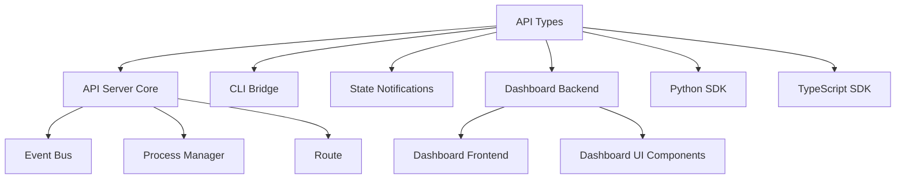

# API Types 模块文档

## 概述

API Types 模块是 Loki Mode 系统中 HTTP/SSE API 层的核心类型定义库，提供了完整的类型安全保障和数据结构规范。该模块定义了会话管理、任务处理、API 请求响应等核心数据结构，确保了系统各组件之间的数据交互一致性和可靠性。

该模块的设计目标是：
- 提供强类型支持，减少运行时错误
- 统一数据结构定义，便于系统维护和扩展
- 为 API 客户端和服务端提供共同的类型契约
- 支持类型安全的序列化和反序列化

## 核心组件

### Session 相关类型

#### Session 接口

`Session` 接口表示系统中的一个会话实例，包含了会话的完整状态信息。

```typescript
export interface Session {
  id: string;
  prdPath: string | null;
  provider: "claude" | "codex" | "gemini";
  status: SessionStatus;
  startedAt: string;
  updatedAt: string;
  pid: number | null;
  currentPhase: Phase | null;
  taskCount: number;
  completedTasks: number;
}
```

**字段说明：**
- `id`: 会话的唯一标识符，用于在系统中唯一标识一个会话
- `prdPath`: PRD（产品需求文档）的文件路径，可为 null
- `provider`: 使用的 AI 提供商，支持 claude、codex、gemini 三种
- `status`: 会话的当前状态，类型为 SessionStatus
- `startedAt`: 会话开始时间，ISO 8601 格式字符串
- `updatedAt`: 会话最后更新时间，ISO 8601 格式字符串
- `pid`: 会话进程的 PID（进程标识符），可为 null
- `currentPhase`: 会话当前所处的阶段，类型为 Phase，可为 null
- `taskCount`: 会话中的总任务数
- `completedTasks`: 会话中已完成的任务数

#### SessionStatus 类型

`SessionStatus` 定义了会话可能处于的所有状态：

```typescript
export type SessionStatus =
  | "starting"    // 会话正在启动
  | "running"     // 会话正在运行
  | "paused"      // 会话已暂停
  | "stopping"    // 会话正在停止
  | "stopped"     // 会话已停止
  | "failed"      // 会话失败
  | "completed";  // 会话已完成
```

**状态转换说明：**
- 会话通常从 "starting" 开始，成功启动后进入 "running" 状态
- 运行中的会话可以被暂停（"paused"）或停止（"stopping" → "stopped"）
- 如果会话执行过程中出现错误，会进入 "failed" 状态
- 正常完成的会话会进入 "completed" 状态

#### Phase 类型

`Phase` 定义了会话执行过程中的各个阶段：

```typescript
export type Phase =
  | "bootstrap"   // 引导阶段
  | "planning"    // 规划阶段
  | "development" // 开发阶段
  | "testing"     // 测试阶段
  | "deployment"  // 部署阶段
  | "monitoring"; // 监控阶段
```

**阶段说明：**
- `bootstrap`: 初始化环境，准备必要的资源
- `planning`: 分析需求，制定执行计划
- `development`: 执行主要的开发任务
- `testing`: 执行测试，验证成果
- `deployment`: 部署成果
- `monitoring`: 监控运行状态

### Task 相关类型

#### Task 接口

`Task` 接口表示会话中的一个任务单元：

```typescript
export interface Task {
  id: string;
  sessionId: string;
  title: string;
  description: string;
  status: TaskStatus;
  priority: number;
  createdAt: string;
  startedAt: string | null;
  completedAt: string | null;
  agent: string | null;
  output: string | null;
  error: string | null;
}
```

**字段说明：**
- `id`: 任务的唯一标识符
- `sessionId`: 任务所属会话的 ID
- `title`: 任务的标题
- `description`: 任务的详细描述
- `status`: 任务的当前状态，类型为 TaskStatus
- `priority`: 任务的优先级，数值越小优先级越高
- `createdAt`: 任务创建时间，ISO 8601 格式字符串
- `startedAt`: 任务开始执行时间，ISO 8601 格式字符串，可为 null
- `completedAt`: 任务完成时间，ISO 8601 格式字符串，可为 null
- `agent`: 执行该任务的代理标识，可为 null
- `output`: 任务的输出结果，可为 null
- `error`: 任务执行过程中的错误信息，可为 null

#### TaskStatus 类型

`TaskStatus` 定义了任务可能处于的所有状态：

```typescript
export type TaskStatus =
  | "pending"   // 待处理
  | "queued"    // 已排队
  | "running"   // 运行中
  | "completed" // 已完成
  | "failed"    // 失败
  | "skipped";  // 已跳过
```

**状态转换说明：**
- 任务创建后初始状态为 "pending"
- 当任务被加入执行队列时，状态变为 "queued"
- 任务开始执行时，状态变为 "running"
- 执行成功的任务进入 "completed" 状态
- 执行失败的任务进入 "failed" 状态
- 被系统跳过的任务进入 "skipped" 状态

### API 请求/响应类型

#### StartSessionRequest 接口

`StartSessionRequest` 定义了启动会话的请求参数：

```typescript
export interface StartSessionRequest {
  prdPath?: string;
  provider?: "claude" | "codex" | "gemini";
  options?: {
    dryRun?: boolean;
    verbose?: boolean;
    timeout?: number;
  };
}
```

**字段说明：**
- `prdPath`: 可选，PRD 文件路径
- `provider`: 可选，AI 提供商，默认为系统配置的默认提供商
- `options`: 可选，会话选项
  - `dryRun`: 是否为干运行模式（只模拟执行，不实际执行）
  - `verbose`: 是否启用详细日志输出
  - `timeout`: 会话超时时间（秒）

#### StartSessionResponse 接口

`StartSessionResponse` 定义了启动会话的响应数据：

```typescript
export interface StartSessionResponse {
  sessionId: string;
  status: SessionStatus;
  message: string;
}
```

**字段说明：**
- `sessionId`: 新创建会话的 ID
- `status`: 会话的初始状态
- `message`: 响应消息，包含启动结果的详细信息

#### SessionStatusResponse 接口

`SessionStatusResponse` 定义了获取会话状态的响应数据：

```typescript
export interface SessionStatusResponse {
  session: Session;
  tasks: TaskSummary;
  agents: AgentSummary;
}
```

**字段说明：**
- `session`: 会话的详细信息
- `tasks`: 任务统计摘要
- `agents`: 代理统计摘要

#### TaskSummary 接口

`TaskSummary` 提供了任务的统计信息：

```typescript
export interface TaskSummary {
  total: number;
  pending: number;
  running: number;
  completed: number;
  failed: number;
}
```

**字段说明：**
- `total`: 总任务数
- `pending`: 待处理任务数
- `running`: 运行中任务数
- `completed`: 已完成任务数
- `failed`: 失败任务数

#### AgentSummary 接口

`AgentSummary` 提供了代理的统计信息：

```typescript
export interface AgentSummary {
  active: number;
  spawned: number;
  completed: number;
}
```

**字段说明：**
- `active`: 当前活跃的代理数
- `spawned`: 已启动的代理总数
- `completed`: 已完成工作的代理数

#### InjectInputRequest 接口

`InjectInputRequest` 定义了向会话注入输入的请求参数：

```typescript
export interface InjectInputRequest {
  sessionId: string;
  input: string;
  context?: string;
}
```

**字段说明：**
- `sessionId`: 目标会话的 ID
- `input`: 要注入的输入内容
- `context`: 可选，输入的上下文信息

**使用场景：**
- 向运行中的会话提供额外的输入或指令
- 交互式地指导会话执行
- 提供会话请求的外部信息

#### ApiError 接口

`ApiError` 定义了 API 错误的标准格式：

```typescript
export interface ApiError {
  error: string;
  code: string;
  details?: Record<string, unknown>;
}
```

**字段说明：**
- `error`: 错误描述信息
- `code`: 错误代码，用于程序识别错误类型
- `details`: 可选，错误的详细信息，键值对形式

### 健康检查类型

#### HealthResponse 接口

`HealthResponse` 定义了系统健康检查的响应数据：

```typescript
export interface HealthResponse {
  status: "healthy" | "degraded" | "unhealthy";
  version: string;
  uptime: number;
  providers: {
    claude: boolean;
    codex: boolean;
    gemini: boolean;
  };
  activeSession: string | null;
}
```

**字段说明：**
- `status`: 系统健康状态
  - `healthy`: 系统运行正常
  - `degraded`: 系统性能下降，但仍可提供服务
  - `unhealthy`: 系统无法正常提供服务
- `version`: 系统版本号
- `uptime`: 系统运行时间（秒）
- `providers`: 各 AI 提供商的可用性状态
  - `claude`: Claude 提供商是否可用
  - `codex`: Codex 提供商是否可用
  - `gemini`: Gemini 提供商是否可用
- `activeSession`: 当前活跃会话的 ID，如无活跃会话则为 null

## 架构关系

API Types 模块在系统架构中处于核心位置，为多个关键模块提供类型支持：



**关系说明：**
- API Server Core 使用这些类型定义 API 路由和请求处理
- CLI Bridge 通过这些类型与 API 层进行通信
- State Notifications 使用这些类型传递状态更新
- Dashboard Backend 利用这些类型处理前端请求
- Python SDK 和 TypeScript SDK 使用这些类型提供类型安全的客户端接口

## 使用示例

### 基本类型使用

```typescript
import { 
  Session, 
  Task, 
  StartSessionRequest, 
  HealthResponse,
  InjectInputRequest 
} from 'api/types/api';

// 创建会话请求
const startRequest: StartSessionRequest = {
  prdPath: './docs/prd.md',
  provider: 'claude',
  options: {
    dryRun: false,
    verbose: true,
    timeout: 3600
  }
};

// 创建注入输入请求
const injectRequest: InjectInputRequest = {
  sessionId: 'session-123',
  input: 'Please focus on the authentication module first',
  context: 'User priority request'
};

// 处理健康检查响应
const handleHealthCheck = (response: HealthResponse) => {
  console.log(`System status: ${response.status}`);
  console.log(`Uptime: ${response.uptime} seconds`);
  
  if (response.activeSession) {
    console.log(`Active session: ${response.activeSession}`);
  }
  
  Object.entries(response.providers).forEach(([provider, available]) => {
    console.log(`${provider}: ${available ? 'available' : 'unavailable'}`);
  });
};
```

### 状态管理示例

```typescript
import { Session, Task, SessionStatus, TaskStatus } from 'api/types/api';

// 检查会话是否可以启动新任务
const canStartNewTask = (session: Session): boolean => {
  return session.status === 'running' && 
         session.currentPhase !== null;
};

// 计算任务完成率
const calculateTaskCompletionRate = (session: Session): number => {
  if (session.taskCount === 0) return 0;
  return (session.completedTasks / session.taskCount) * 100;
};

// 过滤特定状态的任务
const filterTasksByStatus = (tasks: Task[], status: TaskStatus): Task[] => {
  return tasks.filter(task => task.status === status);
};

// 按优先级排序任务
const sortTasksByPriority = (tasks: Task[]): Task[] => {
  return [...tasks].sort((a, b) => a.priority - b.priority);
};
```

## 注意事项与最佳实践

### 类型安全

1. **始终使用类型注解**：在使用这些类型时，始终确保变量有正确的类型注解，以获得完整的类型检查支持。

2. **避免类型断言**：尽量避免使用类型断言（`as`），因为这会绕过 TypeScript 的类型检查。

3. **使用类型守卫**：在处理联合类型时，使用类型守卫来确保类型安全：

```typescript
const isRunningSession = (session: Session): boolean => {
  return session.status === 'running';
};
```

### 时间处理

1. **ISO 8601 格式**：所有时间字段都使用 ISO 8601 格式字符串，在处理时应使用适当的日期库进行解析和格式化。

2. **时区处理**：注意时区差异，建议在服务器端使用 UTC 时间，在客户端根据用户时区进行显示。

### 错误处理

1. **标准错误格式**：所有 API 错误都应遵循 `ApiError` 格式，确保客户端能够统一处理错误。

2. **错误代码**：使用有意义的错误代码，便于客户端进行错误分类和处理。

### 状态管理

1. **状态转换验证**：在更新会话或任务状态时，验证状态转换是否合法，避免无效的状态变化。

2. **并发更新**：注意处理并发状态更新的情况，可能需要使用乐观锁或悲观锁机制。

## 扩展指南

### 添加新的会话状态

如需添加新的会话状态，按照以下步骤操作：

1. 在 `SessionStatus` 类型中添加新状态：

```typescript
export type SessionStatus =
  | "starting"
  | "running"
  | "paused"
  | "stopping"
  | "stopped"
  | "failed"
  | "completed"
  | "new-status"; // 添加新状态
```

2. 更新相关文档，说明新状态的含义和转换规则。

3. 在使用 `SessionStatus` 的代码中添加对新状态的处理逻辑。

### 创建自定义请求类型

如需创建新的 API 请求类型，遵循以下模式：

```typescript
export interface CustomRequest {
  // 必填字段
  sessionId: string;
  
  // 可选字段
  optionalField?: string;
  
  // 复杂字段
  options?: {
    option1: boolean;
    option2: number;
  };
}
```

### 添加新的 AI 提供商

如需添加新的 AI 提供商支持：

1. 在相关类型中添加新提供商：

```typescript
export interface Session {
  // ... 其他字段
  provider: "claude" | "codex" | "gemini" | "new-provider";
}

export interface StartSessionRequest {
  // ... 其他字段
  provider?: "claude" | "codex" | "gemini" | "new-provider";
}

export interface HealthResponse {
  // ... 其他字段
  providers: {
    claude: boolean;
    codex: boolean;
    gemini: boolean;
    "new-provider": boolean;
  };
}
```

2. 更新相关文档，说明新提供商的特性和使用方法。

## 相关模块

- [API Server Core](API Server Core.md) - 提供 API 服务器的核心功能
- [CLI Bridge](CLI Bridge.md) - 命令行界面与 API 层的桥接
- [Dashboard Backend](Dashboard Backend.md) - 仪表板后端服务
- [Python SDK](Python SDK.md) - Python 语言的 SDK
- [TypeScript SDK](TypeScript SDK.md) - TypeScript 语言的 SDK
