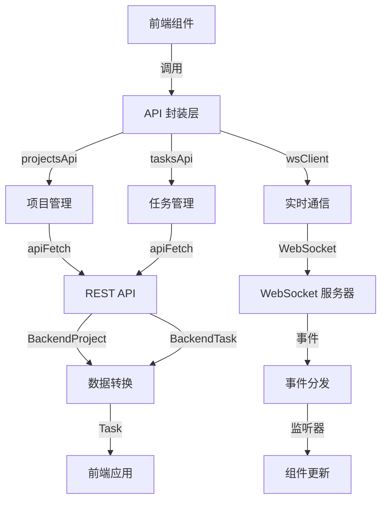

# API 客户端模块文档

## 概述

API 客户端模块是 Dashboard Frontend 系统的核心通信层，负责前端应用与后端 API 服务器之间的所有数据交互。该模块提供了类型安全的 REST API 封装和实时 WebSocket 通信功能，使前端组件能够高效地管理项目、任务和实时状态更新。

### 主要功能

- **REST API 封装**：提供完整的项目和任务 CRUD 操作
- **数据转换**：自动处理前端与后端数据格式的转换
- **错误处理**：统一的 API 错误处理机制
- **实时通信**：WebSocket 客户端支持实时状态更新
- **类型安全**：完整的 TypeScript 类型定义确保数据一致性

## 核心组件

### BackendProject 接口

`BackendProject` 是后端项目数据的类型定义，用于描述从 API 接收到的项目信息。

```typescript
interface BackendProject {
  id: number;
  name: string;
  description: string | null;
  prd_path: string | null;
  status: string;
  created_at: string;
  updated_at: string;
  task_count: number;
  completed_task_count: number;
}
```

**字段说明**：
- `id`：项目唯一标识符
- `name`：项目名称
- `description`：项目描述（可为空）
- `prd_path`：产品需求文档路径（可为空）
- `status`：项目状态
- `created_at`：创建时间戳
- `updated_at`：更新时间戳
- `task_count`：任务总数
- `completed_task_count`：已完成任务数

### WebSocketClient 类

`WebSocketClient` 是一个功能完整的 WebSocket 通信管理类，负责建立、维护和管理与后端的实时连接。

#### 构造与初始化

```typescript
export class WebSocketClient {
  private ws: WebSocket | null = null;
  private reconnectAttempts = 0;
  private maxReconnectAttempts = 5;
  private reconnectDelay = 1000;
  private reconnectTimeout: ReturnType<typeof setTimeout> | null = null;
  private listeners: Map<string, Set<(data: unknown) => void>> = new Map();
}
```

#### 核心方法

**connect()**

建立 WebSocket 连接，自动处理协议选择（ws:// 或 wss://）和重连逻辑。

```typescript
connect(): void {
  // 清除待处理的重连
  if (this.reconnectTimeout) {
    clearTimeout(this.reconnectTimeout);
    this.reconnectTimeout = null;
  }

  const protocol = window.location.protocol === 'https:' ? 'wss:' : 'ws:';
  const wsUrl = `${protocol}//${window.location.host}/ws`;

  this.ws = new WebSocket(wsUrl);
  
  // 事件处理...
}
```

**on(eventType, listener)**

注册事件监听器，支持特定事件类型和通配符监听。

```typescript
on(eventType: string, listener: (data: unknown) => void): () => void {
  if (!this.listeners.has(eventType)) {
    this.listeners.set(eventType, new Set());
  }
  this.listeners.get(eventType)!.add(listener);

  // 返回取消订阅函数
  return () => {
    this.listeners.get(eventType)?.delete(listener);
  };
}
```

**disconnect()**

关闭 WebSocket 连接并清理资源，防止内存泄漏。

```typescript
disconnect(): void {
  if (this.reconnectTimeout) {
    clearTimeout(this.reconnectTimeout);
    this.reconnectTimeout = null;
  }
  if (this.ws) {
    this.ws.close();
    this.ws = null;
  }
}
```

#### 重连机制

WebSocketClient 实现了智能的指数退避重连算法：

```typescript
private attemptReconnect(): void {
  if (this.reconnectAttempts < this.maxReconnectAttempts) {
    this.reconnectAttempts++;
    const delay = this.reconnectDelay * Math.pow(2, this.reconnectAttempts - 1);
    console.log(`Reconnecting in ${delay}ms (attempt ${this.reconnectAttempts})`);
    this.reconnectTimeout = setTimeout(() => this.connect(), delay);
  }
}
```

**重连特性**：
- 最大重连次数：5 次
- 初始延迟：1000ms
- 退避策略：指数退避（1s, 2s, 4s, 8s, 16s）

### wsClient 单例

```typescript
export const wsClient = new WebSocketClient();
```

提供全局唯一的 WebSocketClient 实例，确保整个应用共享同一个连接。

## API 接口封装

### projectsApi - 项目管理 API

提供项目的 CRUD 操作：

```typescript
export const projectsApi = {
  list: async (): Promise<BackendProject[]> => {
    return apiFetch<BackendProject[]>('/projects');
  },

  get: async (id: number): Promise<BackendProject> => {
    return apiFetch<BackendProject>(`/projects/${id}`);
  },

  create: async (data: { name: string; prd_path?: string; description?: string }): Promise<BackendProject> => {
    return apiFetch<BackendProject>('/projects', {
      method: 'POST',
      body: JSON.stringify(data),
    });
  },

  delete: async (id: number): Promise<void> => {
    return apiFetch<void>(`/projects/${id}`, {
      method: 'DELETE',
    });
  },
};
```

### tasksApi - 任务管理 API

提供任务的完整管理功能：

```typescript
export const tasksApi = {
  list: async (projectId?: number): Promise<Task[]> => {
    const query = projectId ? `?project_id=${projectId}` : '';
    const backendTasks = await apiFetch<BackendTask[]>(`/tasks${query}`);
    return backendTasks.map(transformTask);
  },

  get: async (id: number): Promise<Task> => {
    const backendTask = await apiFetch<BackendTask>(`/tasks/${id}`);
    return transformTask(backendTask);
  },

  create: async (task: Partial<Task>, projectId: number): Promise<Task> => {
    const payload = transformTaskForBackend(task, projectId);
    const backendTask = await apiFetch<BackendTask>('/tasks', {
      method: 'POST',
      body: JSON.stringify(payload),
    });
    return transformTask(backendTask);
  },

  update: async (id: number, task: Partial<Task>): Promise<Task> => {
    const payload: Record<string, unknown> = {};
    if (task.title !== undefined) payload.title = task.title;
    if (task.description !== undefined) payload.description = task.description;
    if (task.status !== undefined) payload.status = task.status;
    if (task.priority !== undefined) payload.priority = task.priority;

    const backendTask = await apiFetch<BackendTask>(`/tasks/${id}`, {
      method: 'PUT',
      body: JSON.stringify(payload),
    });
    return transformTask(backendTask);
  },

  delete: async (id: number): Promise<void> => {
    return apiFetch<void>(`/tasks/${id}`, {
      method: 'DELETE',
    });
  },

  move: async (id: number, status: TaskStatus, position: number): Promise<Task> => {
    const backendTask = await apiFetch<BackendTask>(`/tasks/${id}/move`, {
      method: 'POST',
      body: JSON.stringify({ status, position }),
    });
    return transformTask(backendTask);
  },
};
```

## 数据转换

### transformTask - 后端到前端转换

将后端的 snake_case 数据转换为前端的 camelCase 格式：

```typescript
function transformTask(backendTask: BackendTask): Task {
  return {
    id: String(backendTask.id),
    title: backendTask.title,
    description: backendTask.description || '',
    status: backendTask.status as TaskStatus,
    priority: backendTask.priority as TaskPriority,
    type: 'feature', // 后端没有类型，默认为 feature
    assignee: backendTask.assigned_agent_id ? `Agent-${backendTask.assigned_agent_id}` : undefined,
    createdAt: backendTask.created_at,
    updatedAt: backendTask.updated_at,
    completedAt: backendTask.completed_at || undefined,
    estimatedHours: backendTask.estimated_duration ? backendTask.estimated_duration / 60 : undefined,
    tags: [],
  };
}
```

### transformTaskForBackend - 前端到后端转换

将前端数据转换为后端期望的格式：

```typescript
function transformTaskForBackend(task: Partial<Task>, projectId: number): Record<string, unknown> {
  const payload: Record<string, unknown> = {
    project_id: projectId,
  };

  if (task.title !== undefined) payload.title = task.title;
  if (task.description !== undefined) payload.description = task.description;
  if (task.status !== undefined) payload.status = task.status;
  if (task.priority !== undefined) payload.priority = task.priority;
  if (task.estimatedHours !== undefined) payload.estimated_duration = task.estimatedHours * 60;

  return payload;
}
```

## 错误处理

### ApiError 类

自定义 API 错误类，包含状态码和错误信息：

```typescript
export class ApiError extends Error {
  status: number;

  constructor(message: string, status: number) {
    super(message);
    this.status = status;
    this.name = 'ApiError';
  }
}
```

### apiFetch - 通用请求包装器

提供统一的请求处理和错误管理：

```typescript
async function apiFetch<T>(
  endpoint: string,
  options: RequestInit = {}
): Promise<T> {
  const url = `${API_BASE}${endpoint}`;

  const response = await fetch(url, {
    ...options,
    headers: {
      'Content-Type': 'application/json',
      ...options.headers,
    },
  });

  if (!response.ok) {
    const errorText = await response.text();
    throw new ApiError(errorText || response.statusText, response.status);
  }

  if (response.status === 204) {
    return undefined as T;
  }

  return response.json();
}
```

## 架构与数据流



## 使用示例

### 基本 API 使用

```typescript
import { projectsApi, tasksApi, wsClient } from './api';

// 获取项目列表
async function loadProjects() {
  try {
    const projects = await projectsApi.list();
    console.log('Projects:', projects);
  } catch (error) {
    if (error instanceof ApiError) {
      console.error(`API Error ${error.status}:`, error.message);
    }
  }
}

// 创建任务
async function createNewTask(projectId: number, taskData: Partial<Task>) {
  try {
    const newTask = await tasksApi.create(taskData, projectId);
    console.log('Task created:', newTask);
  } catch (error) {
    console.error('Failed to create task:', error);
  }
}
```

### WebSocket 实时通信

```typescript
import { wsClient } from './api';

// 连接 WebSocket
wsClient.connect();

// 监听特定事件
const unsubscribeTaskUpdate = wsClient.on('task_update', (data) => {
  console.log('Task updated:', data);
  // 更新 UI
});

// 监听所有事件
const unsubscribeAll = wsClient.on('*', (message) => {
  console.log('Received message:', message);
});

// 清理资源
function cleanup() {
  unsubscribeTaskUpdate();
  unsubscribeAll();
  wsClient.disconnect();
}
```

## 配置与扩展

### 配置选项

目前 API 客户端的基础配置：

```typescript
const API_BASE = '/api';
```

### 扩展自定义 API

可以按照现有的模式轻松添加新的 API 端点：

```typescript
// 示例：添加用户管理 API
export const usersApi = {
  list: async (): Promise<User[]> => {
    return apiFetch<User[]>('/users');
  },
  
  get: async (id: number): Promise<User> => {
    return apiFetch<User>(`/users/${id}`);
  },
};
```

## 注意事项与限制

### 已知限制

1. **WebSocket 重连限制**：最多重连 5 次，超过后需要手动重新连接
2. **数据类型转换**：部分字段有默认值处理（如任务类型默认为 'feature'）
3. **错误信息**：后端错误信息直接透传，需要前端妥善处理展示

### 最佳实践

1. **错误处理**：始终使用 try-catch 包裹 API 调用
2. **资源清理**：组件卸载时记得取消 WebSocket 订阅并断开连接
3. **类型安全**：充分利用 TypeScript 类型系统，避免 any 类型
4. **单例使用**：始终使用导出的 wsClient 单例，不要创建新的 WebSocketClient 实例

### 性能考虑

1. **连接管理**：避免频繁连接和断开 WebSocket
2. **批量操作**：尽可能使用批量 API 减少网络请求
3. **数据缓存**：考虑在前端层实现数据缓存以减少重复请求

## 相关模块

- [类型定义模块](类型定义.md)：提供 Task、TaskStatus 等核心类型
- [Dashboard UI Components](Dashboard UI Components.md)：使用 API 客户端的 UI 组件
- [Dashboard Backend](Dashboard Backend.md)：API 客户端的后端对应服务

## 更新日志

- 初始版本：提供基础 REST API 封装和 WebSocket 通信
