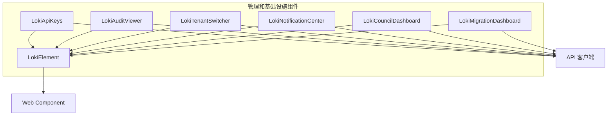

# 管理和基础设施组件

## 概述

管理和基础设施组件是 Dashboard UI Components 模块中的一个子模块，专门负责提供系统管理、监控和基础设施相关的用户界面组件。该模块包含六个核心组件，涵盖 API 密钥管理、审计日志查看、租户切换、通知中心、委员会仪表板和迁移仪表板等关键功能。

这些组件共同构成了一个完整的管理界面生态系统，使管理员和用户能够有效地管理系统资源、监控系统状态、查看审计信息、处理通知以及管理多租户环境。

## 架构

管理和基础设施组件采用模块化设计，每个组件都是独立的 Web Component，基于 LokiElement 基类构建。这种设计使得组件可以独立使用，也可以组合在一起形成完整的管理界面。



### 组件关系

- **基础层**: 所有组件都继承自 `LokiElement`，提供主题支持和基础功能
- **通信层**: 所有组件都使用 API 客户端与后端服务进行通信
- **功能层**: 每个组件专注于特定的管理功能领域

## 核心组件

### 1. API 密钥管理 (LokiApiKeys)

`LokiApiKeys` 组件提供了完整的 API 密钥生命周期管理功能，包括创建、查看、轮换和删除 API 密钥。该组件确保了密钥的安全性，仅在创建时显示完整密钥，并支持密钥轮换以提高安全性。

主要功能：
- 显示 API 密钥列表，包括名称、角色、创建时间、最后使用时间和状态
- 创建新的 API 密钥，支持设置名称、角色和可选的过期时间
- 密钥轮换功能，支持设置宽限期
- 删除 API 密钥，带有确认机制

详细信息请参考 [API 密钥管理组件文档](loki-api-keys.md)。

### 2. 审计日志查看器 (LokiAuditViewer)

`LokiAuditViewer` 组件提供了审计日志的浏览和筛选功能，支持按操作类型、资源类型和日期范围进行筛选。此外，该组件还提供了完整性验证功能，确保审计日志未被篡改。

主要功能：
- 显示审计日志条目列表
- 多维度筛选功能
- 审计链完整性验证
- 时间戳格式化显示

详细信息请参考 [审计日志查看器组件文档](loki-audit-viewer.md)。

### 3. 租户切换器 (LokiTenantSwitcher)

`LokiTenantSwitcher` 组件为多租户环境提供了租户上下文切换功能。用户可以通过下拉菜单选择不同的租户，组件会触发 `tenant-changed` 事件通知应用程序租户已更改。

主要功能：
- 显示可用租户列表
- 支持"所有租户"选项
- 租户切换事件通知
- 外部点击关闭下拉菜单

详细信息请参考 [租户切换器组件文档](loki-tenant-switcher.md)。

### 4. 通知中心 (LokiNotificationCenter)

`LokiNotificationCenter` 组件提供了系统通知的查看和管理功能，包括通知列表和触发器配置两个标签页。组件会定期轮询通知 API 以获取最新通知。

主要功能：
- 显示通知列表，按严重程度分类
- 通知确认功能
- 通知触发器管理
- 摘要统计显示

详细信息请参考 [通知中心组件文档](loki-notification-center.md)。

### 5. 委员会仪表板 (LokiCouncilDashboard)

`LokiCouncilDashboard` 组件提供了完成委员会的监控和管理界面，包括概览、决策日志、收敛跟踪和代理管理四个标签页。组件支持可见性感知的轮询，在组件不可见时暂停轮询以节省资源。

主要功能：
- 委员会状态概览
- 决策历史记录
- 收敛趋势可视化
- 代理生命周期管理

详细信息请参考 [委员会仪表板组件文档](loki-council-dashboard.md)。

### 6. 迁移仪表板 (LokiMigrationDashboard)

`LokiMigrationDashboard` 组件提供了迁移过程的监控和管理界面，显示迁移状态、阶段进度、功能跟踪、接缝摘要和迁移历史。组件会定期轮询迁移 API 以获取最新状态。

主要功能：
- 迁移状态显示
- 阶段进度可视化
- 功能跟踪统计
- 迁移历史记录

详细信息请参考 [迁移仪表板组件文档](loki-migration-dashboard.md)。

## 使用指南

### 基本使用

所有组件都可以作为独立的 Web Component 使用，只需在 HTML 中引入相应的组件文件，然后使用自定义标签即可：

```html
<!-- API 密钥管理 -->
<loki-api-keys api-url="http://localhost:57374" theme="dark"></loki-api-keys>

<!-- 审计日志查看器 -->
<loki-audit-viewer api-url="http://localhost:57374" limit="100" theme="dark"></loki-audit-viewer>

<!-- 租户切换器 -->
<loki-tenant-switcher api-url="http://localhost:57374" theme="dark"></loki-tenant-switcher>

<!-- 通知中心 -->
<loki-notification-center api-url="http://localhost:57374" theme="dark"></loki-notification-center>

<!-- 委员会仪表板 -->
<loki-council-dashboard api-url="http://localhost:57374" theme="dark"></loki-council-dashboard>

<!-- 迁移仪表板 -->
<loki-migration-dashboard api-url="http://localhost:57374" theme="dark"></loki-migration-dashboard>
```

### 事件处理

部分组件会触发自定义事件，应用程序可以监听这些事件以响应组件状态变化：

```javascript
// 监听租户切换事件
document.querySelector('loki-tenant-switcher').addEventListener('tenant-changed', (event) => {
  console.log('Tenant changed:', event.detail);
  // 处理租户切换逻辑
});

// 监听委员会操作事件
document.querySelector('loki-council-dashboard').addEventListener('council-action', (event) => {
  console.log('Council action:', event.detail);
  // 处理委员会操作逻辑
});
```

## 主题定制

所有组件都支持主题定制，可以通过 CSS 变量来调整组件的外观：

```css
:root {
  --loki-font-family: 'Inter', -apple-system, sans-serif;
  --loki-text-primary: #201515;
  --loki-text-secondary: #36342E;
  --loki-text-muted: #939084;
  --loki-accent: #553DE9;
  --loki-accent-muted: rgba(139, 92, 246, 0.15);
  --loki-bg-card: #ffffff;
  --loki-bg-secondary: #f8f9fa;
  --loki-bg-tertiary: #ECEAE3;
  --loki-bg-hover: #1f1f23;
  --loki-border: #ECEAE3;
  --loki-border-light: #C5C0B1;
  --loki-success: #22c55e;
  --loki-success-muted: rgba(34, 197, 94, 0.15);
  --loki-warning: #eab308;
  --loki-warning-muted: rgba(234, 179, 8, 0.15);
  --loki-error: #ef4444;
  --loki-error-muted: rgba(239, 68, 68, 0.15);
}
```

## 与其他模块的关系

管理和基础设施组件模块与以下模块密切相关：

- **Dashboard UI Components**: 本模块是 Dashboard UI Components 的子模块，共享相同的基础组件和主题系统
- **Dashboard Backend**: 本模块的组件通过 API 与 Dashboard Backend 进行通信
- **Dashboard Frontend**: 本模块的组件通常在 Dashboard Frontend 中使用

更多信息请参考相关模块的文档：
- [Dashboard UI Components](Dashboard UI Components.md)
- [Dashboard Backend](Dashboard Backend.md)
- [Dashboard Frontend](Dashboard Frontend.md)
