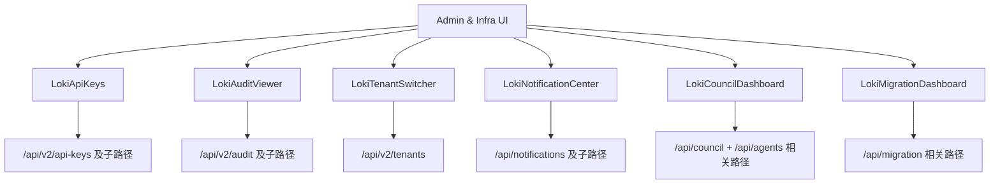

# Administration and Infrastructure Components

`Administration and Infrastructure Components` 是整个 Dashboard UI 里的“控制塔”：它不负责执行任务本身，而是负责回答平台治理最关键的几个问题——**谁能访问（API Keys）、谁在做什么（Audit）、当前在谁的租户上下文（Tenant）、系统是否在报警（Notifications）、多智能体是否收敛（Council）、迁移是否可控（Migration）**。如果把任务系统比作工厂产线，这个模块就是监控室+安保室+值班室。

---

## 1) 这个模块解决什么问题（先讲问题空间）

当系统从“单人开发工具”演进为“多租户、多人协作、持续运行的平台”后，核心痛点会从“能不能跑起来”变成“能不能安全、可追责、可运营地跑”。具体表现为：

- **安全面**：API Key 要创建、轮换、删除，还要避免明文泄露。
- **合规面**：管理员需要按条件查询审计日志，并验证日志链完整性。
- **租户面**：同一控制台要快速切换租户上下文，驱动其他组件联动。
- **运行面**：通知要可确认、规则要可开关、告警状态要可见。
- **治理面**：Council 决策、agent 生命周期和收敛趋势要可视化且可干预。
- **变更面**：迁移状态、phase 进度、checkpoint 要可追踪。

这个模块存在的本质，是把这些“平台治理能力”统一前端化，避免团队把运维动作散落在 CLI、日志平台、临时脚本和多个后台页面里。

---

## 2) 心智模型：把它当成“前端控制平面”

可以用一个简单类比来理解：

- `LokiApiKeys` = 门禁卡管理台
- `LokiAuditViewer` = 监控回放与取证屏
- `LokiTenantSwitcher` = 楼层切换器（切换观察范围）
- `LokiNotificationCenter` = 告警值班台
- `LokiCouncilDashboard` = 调度委员会观察台
- `LokiMigrationDashboard` = 改造工程进度墙

它们共享同一套基础设施：都继承 `LokiElement`，都遵循“状态驱动 render”的模式；大多数通过 `getApiClient` 调后端（`LokiNotificationCenter` 当前直接用 `fetch`）。

---

## 3) 架构总览与数据流

### 关键操作端到端路径

#### A. API Key 轮换
1. 用户在 `LokiApiKeys` 点击 Rotate。  
2. 组件读取宽限期输入，调用 `_rotateKey(keyId)`。  
3. 发起 `POST /api/v2/api-keys/{keyId}/rotate`，body 含 `grace_period_hours`。  
4. 响应中 token 存到 `_newToken`，只在 banner 中展示一次。  
5. 调 `_loadData()` 重新拉取 `/api/v2/api-keys`，避免本地状态漂移。

#### B. 审计筛选 + 完整性验证
1. 用户改过滤条件，`LokiAuditViewer._onFilterChange` 更新 `_filters` 并触发 `_loadData()`。  
2. `buildAuditQuery(filters)` 组 query，`GET /api/v2/audit?...`。  
3. 表格渲染 `timestamp/action/resource(user)/status`。  
4. 用户点 `Verify Integrity`，执行 `_verifyIntegrity()` -> `GET /api/v2/audit/verify`。  
5. 用 `_verifyResult` 渲染 valid / invalid 横幅。

#### C. 租户切换联动
1. `LokiTenantSwitcher` 拉取 `/api/v2/tenants`。  
2. 用户选中 tenant，调用 `_selectTenant(tenantId, tenantName)`。  
3. 派发 `tenant-changed`（`bubbles: true`, `composed: true`）。  
4. 宿主页面监听该事件，更新其它组件上下文（例如切换 API 网关前缀）。

#### D. Council 治理操作
1. `LokiCouncilDashboard` 每 3 秒 `_loadData()`，并发拉：
   - `/api/council/state`
   - `/api/council/verdicts`
   - `/api/council/convergence`
   - `/api/agents`
2. 使用 `Promise.allSettled` 合并部分成功结果。  
3. 通过数据哈希 (`_lastDataHash`) 判断是否跳过重渲染。  
4. 用户触发 `Force Review` / `pause|resume|kill agent`，发 POST 后刷新。

#### E. 迁移看板
1. `LokiMigrationDashboard` 首先 `GET /api/migration/list`。  
2. 若发现 active/in_progress，继续 `GET /api/migration/{id}/status`。  
3. 每 15 秒轮询当前 active migration 状态，渲染 phase、feature、step、seam、checkpoint。

---

## 4) 关键设计选择与权衡

### 4.1 选择“轮询”而非实时流
- **现状**：`LokiNotificationCenter`(5s)、`LokiCouncilDashboard`(3s)、`LokiMigrationDashboard`(15s) 都用 polling。  
- **好处**：实现简单、失败恢复直接、对后端协议要求低。  
- **代价**：有时间窗延迟；请求频率受组件数量叠加影响。

### 4.2 选择“全量 render + 重新绑定事件”
- **现状**：多个组件在 `render()` 后调用 `_attachEventListeners/_bindEvents`。  
- **好处**：状态模型直观，开发心智负担低。  
- **代价**：高频更新下有性能成本；事件重复绑定风险需要谨慎。

### 4.3 选择“后端契约宽容解析”
- **现状**：大量字段兜底（如 `id || key_id`、`resource || resource_type`、`token || key`）。  
- **好处**：兼容后端演进，降低发布耦合。  
- **代价**：容易掩盖契约漂移；错误可能被“静默吞掉”。

### 4.4 Council 用 `Promise.allSettled` 而不是全有或全无
- **好处**：部分接口失败时仍能展示其他面板，实用性高。  
- **代价**：页面可能出现“部分新、部分旧”数据，需要用户理解这是降级行为。

### 4.5 Notification Center 直接 `fetch` 而非 `getApiClient`
- **好处**：代码独立，快速接入。  
- **代价**：与其他组件的请求行为不一致（超时、错误封装、拦截策略无法统一）。

---

## 5) 子模块导读（已拆分页面）

### 5.1 安全管理（`security_management`）
涵盖 `LokiApiKeys` 与 `LokiTenantSwitcher`。前者关注密钥生命周期与一次性 token 展示，后者关注租户上下文广播。两者共同构成“访问控制入口 + 作用域切换入口”。  
详见：[security_management.md](security_management.md)

### 5.2 审计与合规（`audit_compliance`）
核心是 `LokiAuditViewer`：过滤查询、状态呈现、完整性校验触发。它是治理链路中“可追责证据面板”的前端承载。  
详见：[audit_compliance.md](audit_compliance.md)

### 5.3 系统监控与治理（`system_monitoring`）
覆盖 `LokiNotificationCenter`、`LokiCouncilDashboard`、`LokiMigrationDashboard`，分别对应通知运营、协同治理、迁移可观测。  
详见：[system_monitoring.md](system_monitoring.md)

---

## 6) 新贡献者最该注意的坑（高价值）

1. **清理资源**：有 `setInterval` 或全局监听的组件，必须在 `disconnectedCallback` 清理（本模块多数已做到）。  
2. **输入转义**：保持 `_escapeHtml/_escapeHTML` 路径，别在渲染字符串时绕过。  
3. **请求竞态**：连续属性变化或快速筛选可能导致“后返回的旧请求覆盖新状态”。目前多数组件未做 abort 控制。  
4. **契约一致性**：前后端参数命名要对齐，尤其审计筛选字段；否则 UI 看起来“可操作”，实际过滤不生效。  
5. **大数据量性能**：`LokiCouncilDashboard` 的数据哈希比对依赖 `JSON.stringify`；数据过大时要注意 CPU 开销。  
6. **批量操作成本**：`LokiNotificationCenter._acknowledgeAll()` 是逐条请求，通知量大时会慢。  
7. **多活跃迁移场景**：`LokiMigrationDashboard` 当前只跟踪首个 active migration，产品语义上要提前确认是否接受。

---

## 7) 与其他模块的依赖关系（阅读顺序建议）

- 后端 API 与数据模型：[`Dashboard Backend.md`](Dashboard%20Backend.md)
- UI 总体架构：[`Dashboard UI Components.md`](Dashboard%20UI%20Components.md)
- 前端 API/实时客户端：[`Dashboard Frontend.md`](Dashboard%20Frontend.md)
- 运行时通知与状态：[`API Server & Services.md`](API%20Server%20&%20Services.md)
- 审计链后端实现：[`Audit.md`](Audit.md)

> 建议阅读路径：先看本文（整体心智）→ 再看三个子模块文档（组件细节）→ 最后回到 Backend/Audit 文档（契约与真实性能边界）。