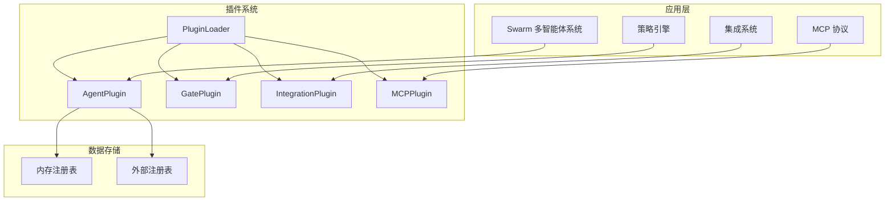
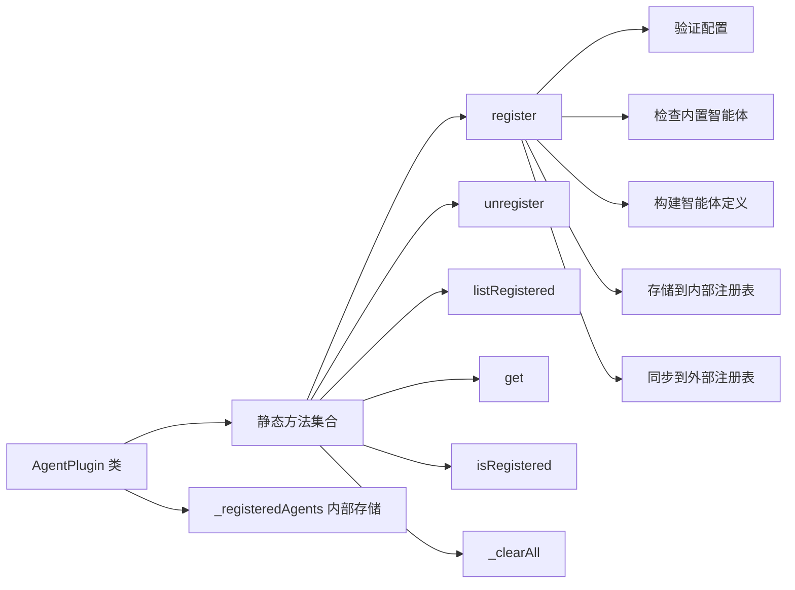

# AgentPlugin 模块文档

## 概述

AgentPlugin 模块是整个插件系统的核心组件之一，专门用于管理和扩展自定义智能体（Agent）。该模块允许开发者在不修改系统核心代码的情况下，通过注册自定义智能体来增强系统的能力。它遵循插件系统的统一设计模式，与 GatePlugin、IntegrationPlugin 和 MCPPlugin 共同构成了完整的可扩展架构。

### 设计理念

AgentPlugin 采用了开放式扩展设计，允许系统在运行时动态加载自定义智能体，同时保持了对内置智能体的保护，确保系统的核心功能不会被意外覆盖。该模块使用内存中的注册表来管理已注册的自定义智能体，并支持与外部注册表的同步，为多 Agent 协作提供了灵活的集成方式。

## 核心组件

### AgentPlugin 类

AgentPlugin 是一个纯静态类，提供了完整的自定义智能体生命周期管理功能。它包含了注册、注销、查询和管理自定义智能体的所有必要方法。

#### 主要方法

##### register

```javascript
static register(pluginConfig, registry)
```

**功能说明**：注册一个新的自定义智能体插件。该方法会验证插件配置，确保不会覆盖内置智能体，并将智能体定义添加到内部注册表中。

**参数**：
- `pluginConfig` (object): 验证过的智能体插件配置对象
  - `type` (string): 必须为 "agent"
  - `name` (string): 智能体名称，不能与内置智能体重名
  - `category` (string, 可选): 智能体分类，默认为 "custom"
  - `description` (string): 智能体描述
  - `prompt_template` (string): 智能体的提示模板
  - `trigger` (any, 可选): 触发条件
  - `quality_gate` (boolean, 可选): 是否启用质量门禁
  - `capabilities` (string[], 可选): 智能体能力列表
- `registry` (object, 可选): 可选的外部注册表对象，如果提供，也会在该注册表中注册

**返回值**：
- 成功时返回 `{ success: true }`
- 失败时返回 `{ success: false, error: "错误信息" }`

**实现细节**：
该方法首先验证插件配置的类型是否正确，然后检查智能体名称是否为内置智能体。如果通过所有验证，它会构建一个符合 swarm 注册表格式的智能体定义，并将其存储在内部注册表中。如果提供了外部注册表，还会同步更新外部注册表。

##### unregister

```javascript
static unregister(pluginName, registry)
```

**功能说明**：注销一个已注册的自定义智能体插件。

**参数**：
- `pluginName` (string): 要移除的智能体插件名称
- `registry` (object, 可选): 可选的外部注册表对象，如果提供，也会从该注册表中移除

**返回值**：
- 成功时返回 `{ success: true }`
- 失败时返回 `{ success: false, error: "错误信息" }`

##### listRegistered

```javascript
static listRegistered()
```

**功能说明**：列出所有已注册的自定义智能体插件。

**返回值**：
- `object[]`: 包含所有已注册智能体定义的数组

##### get

```javascript
static get(name)
```

**功能说明**：根据名称获取特定的已注册智能体插件。

**参数**：
- `name` (string): 智能体插件名称

**返回值**：
- `object|null`: 找到的智能体定义，未找到时返回 null

##### isRegistered

```javascript
static isRegistered(name)
```

**功能说明**：检查自定义智能体是否已注册。

**参数**：
- `name` (string): 智能体名称

**返回值**：
- `boolean`: 智能体是否已注册

##### _clearAll

```javascript
static _clearAll()
```

**功能说明**：清除所有已注册的自定义智能体。此方法主要用于测试目的。

## 架构设计

### 插件系统整体架构

AgentPlugin 模块是整个插件系统的一部分，与其他插件模块协同工作。整体架构如下：



### AgentPlugin 内部架构

AgentPlugin 模块内部采用简单而高效的设计，主要由以下部分组成：



## 智能体定义结构

当注册自定义智能体时，AgentPlugin 会将输入的插件配置转换为标准化的智能体定义结构，该结构与 swarm 注册表格式兼容：

```javascript
{
    name: "智能体名称",
    type: "custom",
    category: "分类名称",
    description: "智能体描述",
    prompt_template: "提示模板内容",
    trigger: 触发条件,
    quality_gate: 是否启用质量门禁,
    capabilities: ["能力1", "能力2"],
    registered_at: "ISO 格式的注册时间"
}
```

## 使用指南

### 基本使用示例

#### 注册自定义智能体

```javascript
const { AgentPlugin } = require('./src/plugins/agent-plugin');

// 定义自定义智能体配置
const myAgentConfig = {
    type: 'agent',
    name: 'my-custom-agent',
    category: 'analysis',
    description: '一个用于数据分析的自定义智能体',
    prompt_template: '你是一个专业的数据分析助手，请分析以下数据：{{data}}',
    trigger: { type: 'data_available' },
    quality_gate: true,
    capabilities: ['data_analysis', 'visualization', 'reporting']
};

// 注册智能体
const result = AgentPlugin.register(myAgentConfig);
if (result.success) {
    console.log('智能体注册成功');
} else {
    console.error('智能体注册失败:', result.error);
}
```

#### 使用外部注册表

```javascript
// 创建外部注册表对象
const externalRegistry = {
    customAgents: {}
};

// 注册智能体时传入外部注册表
AgentPlugin.register(myAgentConfig, externalRegistry);

// 此时智能体同时存储在内部注册表和外部注册表中
console.log(externalRegistry.customAgents['my-custom-agent']);
```

#### 查询和管理智能体

```javascript
// 列出所有已注册的自定义智能体
const allAgents = AgentPlugin.listRegistered();
console.log('已注册智能体:', allAgents);

// 获取特定智能体
const myAgent = AgentPlugin.get('my-custom-agent');
if (myAgent) {
    console.log('找到智能体:', myAgent);
}

// 检查智能体是否已注册
const isRegistered = AgentPlugin.isRegistered('my-custom-agent');
console.log('智能体是否已注册:', isRegistered);

// 注销智能体
AgentPlugin.unregister('my-custom-agent', externalRegistry);
```

### 与 PluginLoader 集成使用

AgentPlugin 通常与 PluginLoader 一起使用，以支持从文件系统加载插件配置：

```javascript
const { PluginLoader } = require('./src/plugins/loader');
const { AgentPlugin } = require('./src/plugins/agent-plugin');

// 创建插件加载器
const loader = new PluginLoader('./.loki/plugins');

// 加载所有插件
const { loaded, failed } = loader.loadAll();

// 注册所有 agent 类型的插件
for (const { config } of loaded) {
    if (config.type === 'agent') {
        AgentPlugin.register(config);
    }
}
```

## 配置选项

### 插件配置对象

AgentPlugin 接受以下配置选项：

| 配置项 | 类型 | 必填 | 默认值 | 说明 |
|--------|------|------|--------|------|
| type | string | 是 | - | 必须为 "agent" |
| name | string | 是 | - | 智能体名称，必须唯一且不能与内置智能体重名 |
| category | string | 否 | "custom" | 智能体分类 |
| description | string | 是 | - | 智能体描述 |
| prompt_template | string | 是 | - | 智能体的提示模板 |
| trigger | any | 否 | null | 触发条件 |
| quality_gate | boolean | 否 | false | 是否启用质量门禁 |
| capabilities | string[] | 否 | [] | 智能体能力列表 |

## 与其他模块的关系

### 与 Swarm 多智能体系统的关系

AgentPlugin 模块与 Swarm 多智能体系统紧密集成，为其提供自定义智能体的注册和管理功能。注册的自定义智能体可以被 Swarm 系统发现和使用，参与多智能体协作任务。

### 与 PluginLoader 的关系

PluginLoader 负责从文件系统发现和加载插件配置文件，而 AgentPlugin 则负责将这些配置注册到系统中。两者结合使用，可以实现完整的插件生命周期管理。

### 与其他插件模块的关系

AgentPlugin 与 GatePlugin、IntegrationPlugin 和 MCPPlugin 共同构成了完整的插件系统，它们遵循相似的设计模式，提供了不同类型的扩展能力。

## 注意事项与限制

### 内置智能体保护

AgentPlugin 不允许覆盖内置智能体类型。在注册自定义智能体时，系统会检查名称是否与内置智能体重名，如果是则会拒绝注册。内置智能体名称列表存储在 `BUILTIN_AGENT_NAMES` 常量中。

### 名称唯一性

自定义智能体名称必须唯一。如果尝试注册一个已存在的自定义智能体，系统会返回错误。

### 内存存储

当前实现使用内存中的 `Map` 来存储已注册的自定义智能体，这意味着在应用程序重启后，所有已注册的自定义智能体都会丢失。对于需要持久化的场景，建议结合外部注册表使用。

### 外部注册表同步

当提供外部注册表时，AgentPlugin 只会在注册和注销时同步更新，但不会自动监听外部注册表的变化。如果外部注册表被其他代码修改，可能会导致内部注册表和外部注册表不一致。

## 错误处理

AgentPlugin 的所有公共方法都返回标准化的结果对象，包含 `success` 字段指示操作是否成功，以及 `error` 字段在失败时提供错误信息。常见的错误情况包括：

1. 无效的插件配置类型
2. 尝试覆盖内置智能体
3. 尝试注册已存在的自定义智能体
4. 尝试注销不存在的自定义智能体

## 参考

- [PluginLoader 模块文档](PluginLoader.md)
- [GatePlugin 模块文档](GatePlugin.md)
- [IntegrationPlugin 模块文档](IntegrationPlugin.md)
- [MCPPlugin 模块文档](MCPPlugin.md)
- [Swarm 多智能体系统文档](SwarmMultiAgent.md)
