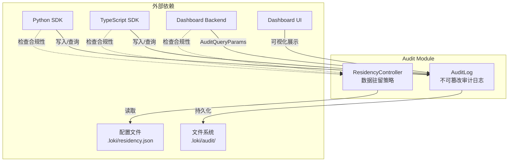
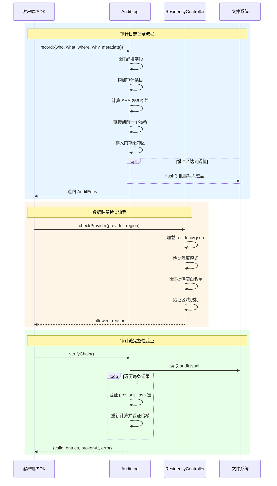

# Audit 模块

## 概述

Audit 模块是系统中负责**合规性、安全性和可审计性**的核心基础设施组件。该模块通过提供不可篡改的审计日志记录和数据驻留策略执行，确保系统操作的可追溯性和符合企业级合规要求。

### 设计背景与目标

在现代 AI 驱动的系统中，操作的可追溯性和数据主权日益重要。Audit 模块的设计目标包括：

1. **不可篡改的审计追踪**：采用区块链式哈希链技术，确保每条审计记录一旦写入就无法被篡改，任何修改都会导致哈希链断裂，从而被立即发现。

2. **数据驻留合规**：帮助企业满足 GDPR、数据本地化法规等合规要求，严格控制 LLM 提供商和数据处理区域的选择。

3. **零配置开箱即用**：即使在没有显式配置的情况下，模块也能提供合理的默认行为，确保系统的基本审计能力始终可用。

4. **低性能开销**：审计日志采用内存缓冲和批量写入策略，避免频繁的磁盘 I/O 操作对系统性能造成影响。

### 模块在整体系统中的位置

Audit 模块通常被以下模块依赖和使用：

- **Dashboard Backend**：通过 `AuditQueryParams` 接收审计查询请求，提供审计日志的检索和展示能力
- **Python SDK** (`sdk.python.loki_mode_sdk.types.AuditEntry`)：为 Python 客户端提供审计条目类型定义
- **TypeScript SDK** (`sdk.typescript.dist.types.d.AuditEntry`, `AuditQueryParams`, `AuditVerifyResult`)：为 TypeScript/JavaScript 客户端提供完整的审计操作支持
- **Dashboard UI Components** (`loki-audit-viewer`)：提供审计日志的可视化界面

## 架构设计

### 整体架构图



### 组件交互流程



## 核心组件

### AuditLog - 不可篡改审计日志

`AuditLog` 类实现了基于哈希链的不可篡改审计日志系统。其核心原理借鉴了区块链技术中的哈希链接机制，每条记录都包含前一条记录的哈希值，形成一条不可断裂的链条。

#### 核心设计原理

**哈希链机制**：
- 每条审计记录包含 `previousHash` 字段，指向前一条记录的哈希值
- 第一条记录的 `previousHash` 为特殊值 `"GENESIS"`
- 记录的哈希计算涵盖所有字段（包括 `previousHash`），形成密码学上的依赖关系
- 任何对历史记录的修改都会导致后续所有记录的哈希验证失败

**内存缓冲策略**：
- 为避免频繁磁盘写入，采用内存缓冲区（默认最多 1000 条记录）
- 当缓冲区满或显式调用 `flush()` 时，批量写入磁盘
- 这种设计在性能与持久性之间取得平衡

#### 审计条目结构

```javascript
{
  seq: number,              // 序列号，单调递增
  timestamp: string,        // ISO 8601 格式时间戳
  who: string,              // 执行者标识（必填）
  what: string,             // 执行的操作（必填）
  where: string | null,     // 操作位置/上下文
  why: string | null,       // 操作原因/目的
  metadata: object | null,  // 附加元数据
  previousHash: string,     // 前一条记录的哈希
  hash: string              // 本条记录的哈希
}
```

#### 主要方法

**`record(entry)`**

记录一条新的审计条目。这是模块最核心的方法。

- **参数**：`entry` 对象必须包含 `who` 和 `what` 字段，可选包含 `where`、`why`、`metadata`
- **验证**：如果缺少必填字段会抛出错误
- **深拷贝**：`metadata` 字段通过 `JSON.parse(JSON.stringify())` 进行深拷贝，防止外部修改影响已记录数据
- **哈希计算**：使用 SHA-256 算法，计算内容包括序列号、时间戳、所有字段值和前一个哈希
- **副作用**：更新内部状态（`_lastHash`、`_entryCount`），可能触发自动 flush
- **返回值**：返回构建完成的审计条目对象（包含生成的 `seq`、`timestamp`、`hash` 等字段）

**`flush()`**

将内存缓冲区中的审计条目批量写入磁盘。

- **幂等性**：如果缓冲区为空，直接返回不做任何操作
- **目录创建**：如果日志目录不存在，自动递归创建
- **文件格式**：使用 JSON Lines (`.jsonl`) 格式，每行一条 JSON 记录
- **同步写入**：使用 `fs.appendFileSync` 确保数据持久化后才返回

**`verifyChain()`**

验证整个审计链的完整性，检测是否被篡改。

- **自动 flush**：首先 flush 内存缓冲区，确保验证包含所有数据
- **逐条验证**：
  1. 验证 JSON 格式有效性
  2. 验证 `previousHash` 链的连续性
  3. 重新计算哈希并与存储值比对
- **返回值**：返回包含验证结果的对象
  ```javascript
  {
    valid: boolean,       // 链是否完整有效
    entries: number,      // 已验证的条目数
    brokenAt: number|null, // 断裂位置（如果有）
    error: string|null    // 错误描述（如果有）
  }
  ```

**`readEntries(filter)`**

读取审计条目，支持多种过滤条件。

- **自动 flush**：确保读取包含最新数据
- **过滤条件**：
  - `who`: 按执行者过滤
  - `what`: 按操作类型过滤
  - `since`: 按开始时间过滤（ISO 格式）
  - `until`: 按结束时间过滤（ISO 格式）
- **容错处理**：自动跳过无法解析的损坏行
- **返回值**：审计条目数组

**`getSummary()`**

获取审计日志的统计摘要。

返回信息包括：总条目数、所有执行者列表、所有操作类型列表、首条和末条记录的时间戳。

**`destroy()`**

清理资源，flush 剩余数据并清空内存缓冲区。

应在模块生命周期结束时调用，确保数据不丢失。

#### 配置选项

构造函数接收 `opts` 对象：

```javascript
{
  projectDir: string,  // 项目根目录，默认为 process.cwd()
  logDir: string       // 日志目录，默认为 path.join(projectDir, '.loki', 'audit')
}
```

实际日志文件路径为 `${logDir}/audit.jsonl`。

#### 常量定义

- `MAX_MEMORY_ENTRIES = 1000`：内存缓冲区最大条目数
- `HASH_ALGO = 'sha256'`：哈希算法

#### 错误处理与边界情况

1. **链损坏检测**：
   - 在构造函数中，如果检测到链尾损坏（`_loadChainTip` 失败），会输出警告并从头开始新链
   - `verifyChain` 会精确定位链断裂的位置

2. **磁盘空间**：
   - 模块本身没有磁盘空间检查，依赖底层文件系统抛出错误
   - 建议在生产环境中监控 `.loki/audit` 目录大小

3. **并发访问**：
   - 当前实现不是线程/进程安全的
   - 多进程同时写入可能导致文件损坏
   - 建议通过外部机制（如文件锁）确保单写者

---

### ResidencyController - 数据驻留控制器

`ResidencyController` 类负责执行数据驻留和合规策略，控制哪些 LLM 提供商和处理区域可以被使用。

#### 核心职责

**提供商白名单**：限制系统可以调用的 LLM 提供商（如 anthropic、openai、google、ollama 等）

**区域限制**：限制数据处理可以发生的地理区域（如 us、eu、asia）

**隔离模式（Air-gapped Mode）**：完全禁用外部云服务，仅允许本地提供商（如 Ollama）

#### 配置格式

从 `.loki/residency.json` 文件加载配置：

```json
{
  "allowed_providers": ["anthropic", "ollama"],
  "allowed_regions": ["us", "eu"],
  "air_gapped": false
}
```

配置规则：
- `allowed_providers`：空数组表示允许所有提供商（无限制）
- `allowed_regions`：空数组表示允许所有区域（无限制）
- `air_gapped`：为 `true` 时，仅允许 `ollama` 或 `local` 提供商

#### 已知提供商区域

```javascript
PROVIDER_REGIONS = {
  'anthropic': ['us', 'eu'],
  'openai': ['us', 'eu', 'asia'],
  'google': ['us', 'eu', 'asia'],
  'ollama': ['local'],
};
```

#### 主要方法

**`checkProvider(provider, region)`**

检查指定的提供商和区域是否符合驻留策略。

- **参数**：
  - `provider`：提供商名称（如 `'anthropic'`、`'openai'`）
  - `region`（可选）：区域标识符（如 `'us'`、`'eu'`）

- **检查逻辑**（按优先级）：
  1. 验证 `provider` 参数存在
  2. 如果启用隔离模式，只允许 `ollama` 或 `local`
  3. 如果配置了 `allowed_providers` 白名单，验证提供商在其中
  4. 如果配置了 `allowed_regions` 且提供了 `region` 参数，验证区域在其中

- **返回值**：
  ```javascript
  {
    allowed: boolean,    // 是否允许
    reason: string|null  // 拒绝原因（如果 allowed 为 false）
  }
  ```

**`getConfig()`**

获取当前驻留配置的副本。返回对象包含 `allowed_providers`、`allowed_regions`、`air_gapped` 的深拷贝。

**`isAirGapped()`**

检查是否处于隔离模式。

**`getAllowedProviders()` / `getAllowedRegions()`**

获取允许的提供商/区域列表（副本）。

**`reload()`**

从磁盘重新加载配置文件。适用于配置动态更新的场景。

#### 配置加载逻辑

1. 尝试读取 `.loki/residency.json`
2. 如果文件不存在或解析失败，使用默认配置：
   - `allowed_providers: []`（允许所有）
   - `allowed_regions: []`（允许所有）
   - `air_gapped: false`
3. 所有提供商名称会被转换为小写进行统一比较

#### 边界情况与注意事项

1. **大小写不敏感**：所有提供商名称在内部比较时都转为小写，但建议配置时使用小写保持一致性

2. **未知提供商**：如果提供商不在已知列表中，只要满足白名单检查就会被允许（不验证区域）

3. **区域参数可选**：`checkProvider` 的 `region` 参数是可选的，如果不提供，区域检查会被跳过（假设调用方在需要时会提供）

4. **配置热重载**：配置变更需要调用 `reload()` 或重新实例化才能生效

## 使用示例

### 基础审计日志记录

```javascript
const { AuditLog } = require('./src/audit/log');

// 创建审计日志实例（使用默认路径）
const audit = new AuditLog();

// 记录一条审计条目
try {
  const entry = audit.record({
    who: 'user@example.com',
    what: 'task.create',
    where: 'project-alpha',
    why: 'Sprint planning requirement',
    metadata: { taskId: 'T-123', priority: 'high' }
  });
  console.log('Recorded:', entry.hash);
} catch (err) {
  console.error('Failed to record:', err.message);
}

// 显式 flush（通常在进程退出前调用）
audit.flush();
```

### 审计链验证

```javascript
const result = audit.verifyChain();
if (result.valid) {
  console.log(`✓ Audit chain verified: ${result.entries} entries`);
} else {
  console.error(`✗ Chain broken at entry ${result.brokenAt}: ${result.error}`);
  // 触发警报或采取恢复措施
}
```

### 查询审计记录

```javascript
// 查询特定用户的操作
const userActions = audit.readEntries({
  who: 'user@example.com',
  since: '2024-01-01T00:00:00Z',
  until: '2024-12-31T23:59:59Z'
});

// 查询特定类型的操作
const creations = audit.readEntries({
  what: 'task.create'
});

// 获取统计摘要
const summary = audit.getSummary();
console.log(`Total entries: ${summary.totalEntries}`);
console.log(`Actors: ${summary.actors.join(', ')}`);
console.log(`Actions: ${summary.actions.join(', ')}`);
```

### 数据驻留控制

```javascript
const { ResidencyController } = require('./src/audit/residency');

const rc = new ResidencyController();

// 检查提供商是否允许
const check1 = rc.checkProvider('anthropic', 'us');
console.log(check1); // { allowed: true, reason: null }

const check2 = rc.checkProvider('openai', 'asia');
// 如果配置只允许 ['us', 'eu']，则返回：
// { allowed: false, reason: 'Region "asia" not in allowed list: us, eu' }

// 隔离模式检查
if (rc.isAirGapped()) {
  console.log('Running in air-gapped mode');
}
```

### 完整工作流示例

```javascript
const { AuditLog } = require('./src/audit/log');
const { ResidencyController } = require('./src/audit/residency');

class CompliantTaskManager {
  constructor() {
    this.audit = new AuditLog();
    this.residency = new ResidencyController();
  }

  async createTask(userId, taskData, provider, region) {
    // 1. 检查数据驻留合规性
    const residencyCheck = this.residency.checkProvider(provider, region);
    if (!residencyCheck.allowed) {
      this.audit.record({
        who: userId,
        what: 'task.create.denied',
        where: taskData.projectId,
        why: residencyCheck.reason,
        metadata: { provider, region }
      });
      throw new Error(`Residency policy violation: ${residencyCheck.reason}`);
    }

    // 2. 执行业务操作（假设）
    const taskId = await this._saveTask(taskData);

    // 3. 记录成功的审计日志
    const entry = this.audit.record({
      who: userId,
      what: 'task.create',
      where: taskData.projectId,
      why: taskData.reason,
      metadata: { 
        taskId, 
        provider, 
        region,
        compliance: 'verified'
      }
    });

    return { taskId, auditHash: entry.hash };
  }

  async verifyAuditIntegrity() {
    const result = this.audit.verifyChain();
    if (!result.valid) {
      await this._alertSecurityTeam(result);
    }
    return result;
  }

  destroy() {
    this.audit.destroy();
  }
}
```

## 部署与运维

### 文件系统布局

```
project-root/
├── .loki/
│   ├── audit/
│   │   └── audit.jsonl      # 审计日志文件
│   └── residency.json       # 数据驻留配置（可选）
```

### 日志轮转建议

Audit 模块本身不实现日志轮转，建议：

1. **基于时间的轮转**：每天或每周创建新文件
2. **基于大小的轮转**：当 `audit.jsonl` 达到一定大小时归档
3. **归档命名**：`audit-YYYY-MM-DD.jsonl` 或 `audit.jsonl.1`（配合日志轮转工具）

轮转时注意事项：
- 确保轮转过程不会中断审计写入（使用原子重命名）
- 保留哈希链的连续性，不要拆分文件

### 监控指标

建议监控以下指标：

- **审计队列深度**：内存缓冲区中的待写入条目数
- **审计写入延迟**：`flush()` 操作的耗时
- **链验证状态**：定期运行 `verifyChain()` 并报告结果
- **驻留策略违规**：被拒绝的提供商/区域请求数

### 安全建议

1. **文件权限**：
   - `.loki/audit/` 目录应设置为仅所有者可读写（`0700`）
   - 防止未授权修改或删除审计日志

2. **备份策略**：
   - 定期备份 `audit.jsonl` 到不可变存储（如 WORM 存储）
   - 备份后验证链完整性

3. **审计监控**：
   - 对 `audit.jsonl` 的修改进行实时监控
   - 异常修改（如删除行）应立即触发警报

4. **配置保护**：
   - `residency.json` 应受版本控制
   - 变更应经过审批流程

## 故障排查

### 常见问题

**Q: 审计日志文件损坏如何处理？**

如果 `verifyChain()` 报告链断裂：
1. 立即停止系统，防止进一步写入
2. 定位断裂位置（`brokenAt`）
3. 从备份恢复文件，或接受数据丢失并从该位置开始新链
4. 调查损坏原因（磁盘故障？恶意篡改？）

**Q: 内存缓冲区数据丢失？**

如果进程崩溃导致缓冲区数据未写入：
1. 检查是否有其他日志来源可以补充
2. 考虑减小 `MAX_MEMORY_ENTRIES` 或增加 `flush()` 调用频率
3. 对于关键操作，可在记录后立即调用 `flush()`

**Q: 驻留配置不生效？**

1. 确认配置文件路径正确（`.loki/residency.json`）
2. 调用 `reload()` 或重启服务加载新配置
3. 检查 JSON 语法有效性
4. 确认提供商名称大小写（内部已转为小写，但配置建议用小写）

## 扩展指南

### 自定义存储后端

如需将审计日志写入数据库而非文件系统，可以：

1. 继承 `AuditLog` 类并重写 `flush()` 方法
2. 或使用事件监听器模式，在记录时发送到外部队列

```javascript
class DatabaseAuditLog extends AuditLog {
  flush() {
    if (this._entries.length === 0) return;
    // 批量插入数据库
    await db.auditEntries.insertMany(this._entries);
    this._entries = [];
  }
}
```

### 集成外部审计系统

可以将审计日志转发到企业 SIEM 系统：

```javascript
audit.on('record', (entry) => {
  siemClient.send({
    type: 'loki.audit',
    timestamp: entry.timestamp,
    actor: entry.who,
    action: entry.what,
    // ...
  });
});
```

> 注意：当前 `AuditLog` 类未内置事件机制，需要自行扩展。

### 添加新的提供商区域

如需支持新的 LLM 提供商，修改 `PROVIDER_REGIONS` 常量：

```javascript
const PROVIDER_REGIONS = {
  ...require('./residency').PROVIDER_REGIONS,
  'new-provider': ['us', 'eu', 'asia'],
};
```

## 子模块摘要（建议先读）

- [tamper_evident_audit_log](tamper_evident_audit_log.md)：聚焦 `src.audit.log.AuditLog`。重点解释哈希链防篡改机制、`record → flush → verifyChain` 的完整生命周期，以及为什么该实现选择“本地文件 + 同步写入 + 批量落盘”的务实路线。
- [data_residency_policy_control](data_residency_policy_control.md)：聚焦 `src.audit.residency.ResidencyController`。重点解释 provider/region 白名单、`air_gapped` 短路规则、配置加载与 `reload()` 热更新语义，以及 fail-open 默认策略的合规风险。

## 跨模块依赖与集成点

基于当前提供的模块树（而非函数级调用图），Audit 模块主要与以下模块形成契约关系：

- [Dashboard Backend](Dashboard Backend.md)：暴露 `dashboard.server.AuditQueryParams`，承接审计查询参数与服务端检索。
- [Dashboard UI Components](Dashboard UI Components.md)：`dashboard-ui.components.loki-audit-viewer.LokiAuditViewer` 消费并展示审计数据。
- [Python SDK](Python SDK.md)：通过 `sdk.python.loki_mode_sdk.types.AuditEntry` 对外提供审计条目类型契约。
- [TypeScript SDK](TypeScript SDK.md)：通过 `sdk.typescript.dist.types.d.AuditEntry`、`AuditQueryParams`、`AuditVerifyResult` 暴露客户端审计能力。

> 说明：当前输入未提供精确 `depends_on / depended_by` 函数级关系，因此本文对跨模块调用链只做“模块级架构推断”，不声称具体调用发生在某个函数内。

## 新成员上手建议（TL;DR）

1. 先读 [tamper_evident_audit_log](tamper_evident_audit_log.md)，理解“为什么它是 tamper-evident 而非 tamper-proof”。
2. 再读 [data_residency_policy_control](data_residency_policy_control.md)，理解 `air_gapped` 与白名单优先级。
3. 落地改动前，先明确你是在改“审计留痕”（事后证明）还是“驻留准入”（事前阻断），两者职责边界不要混。
4. 若你要做高合规改造，优先关注：多进程写入冲突、配置解析失败默认放行、以及周期性 `verifyChain()` 的运行成本。

