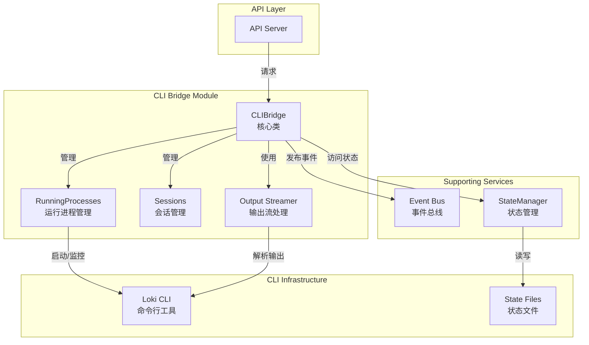
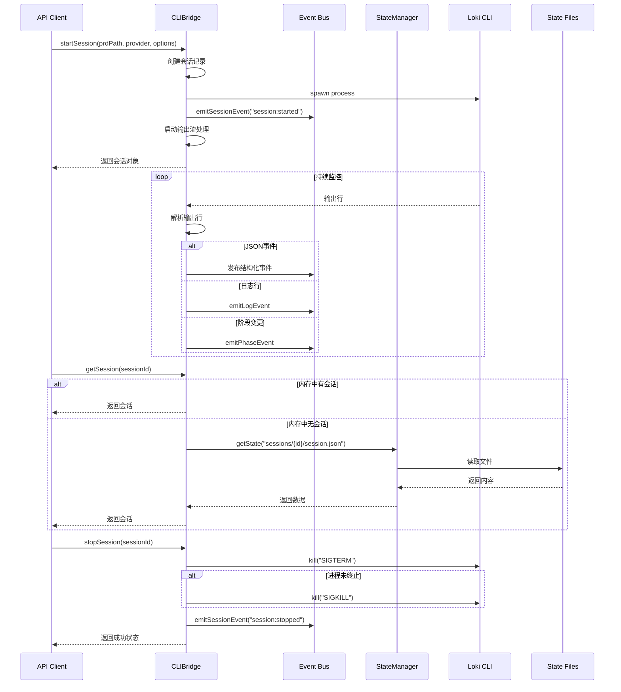

# CLI Bridge 模块文档

## 目录

1. [模块概述](#模块概述)
2. [架构设计](#架构设计)
3. [核心组件详解](#核心组件详解)
4. [使用指南](#使用指南)
5. [配置与扩展](#配置与扩展)
6. [边缘情况与注意事项](#边缘情况与注意事项)

---

## 模块概述

### 功能与目的

CLI Bridge 模块是一个关键的服务组件，它在 HTTP API 层与现有的 bash CLI 基础设施之间建立了一座桥梁。该模块的主要职责包括：

- 作为 API 服务与底层 CLI 工具之间的中介层
- 负责启动、管理和监控 `loki` 命令的执行
- 捕获 CLI 工具的输出并将其转换为可流式传输的事件
- 提供会话管理功能，包括会话的创建、查询和终止
- 通过 StateManager 实现对中央状态存储的访问

### 设计理念

CLI Bridge 模块的设计遵循了以下原则：

1. **无缝集成**：尽可能减少对现有 CLI 基础设施的改动，通过桥接模式实现 API 层与 CLI 层的解耦
2. **事件驱动**：采用事件驱动架构，将 CLI 输出转换为结构化事件，便于系统其他部分消费
3. **状态集中管理**：通过 StateManager 统一访问状态文件，确保状态一致性
4. **非侵入式监控**：不修改 CLI 工具本身，而是通过捕获其输出来监控执行状态

---

## 架构设计

### 系统上下文

CLI Bridge 模块位于 API Server & Services 层级中，作为连接 API 层与底层 CLI 工具的关键组件。它与以下模块有紧密交互：

- **Event Bus**：用于发布会话、阶段、任务和代理等事件
- **State Management**：通过 StateManager 访问和管理状态文件
- **API Server Core**：接收来自 API 层的请求并返回响应

### 组件关系图



### 数据流图



---

## 核心组件详解

### CLIBridge 类

`CLIBridge` 是该模块的核心类，提供了与 CLI 工具交互的所有功能。它采用单例模式实现，确保在整个应用中只有一个实例。

#### 主要属性

| 属性名 | 类型 | 描述 |
|-------|------|------|
| `lokiPath` | `string` | Loki CLI 脚本的完整路径 |
| `lokiDir` | `string` | Loki 项目的根目录 |
| `runningProcesses` | `Map<string, RunningProcess>` | 当前运行的进程映射，键为会话ID |
| `sessions` | `Map<string, Session>` | 会话缓存，键为会话ID |
| `stateManager` | `StateManager` | 状态管理器实例，用于访问状态文件 |

#### 构造函数

```typescript
constructor()
```

构造函数负责初始化 CLI Bridge 的基本配置：

1. **确定 Loki 路径**：首先尝试从环境变量 `LOKI_DIR` 获取路径，如果未设置，则使用当前模块的相对路径
2. **初始化 StateManager**：创建 StateManager 实例，配置为不启用文件监控和事件，以减少不必要的资源消耗

#### 核心方法

##### 1. `startSession`

```typescript
async startSession(
  prdPath?: string,
  provider: "claude" | "codex" | "gemini" = "claude",
  options: { dryRun?: boolean; verbose?: boolean } = {}
): Promise<Session>
```

**功能**：启动一个新的 Loki 会话

**参数**：
- `prdPath` (可选): PRD 文件的路径
- `provider`: AI 提供商，默认为 "claude"
- `options`: 附加选项
  - `dryRun`: 是否为 dry run 模式
  - `verbose`: 是否启用详细输出

**返回值**：返回新创建的会话对象

**工作流程**：
1. 生成唯一的会话 ID
2. 构建命令参数
3. 创建会话记录并设置初始状态
4. 启动子进程执行 Loki 命令
5. 配置环境变量 `LOKI_SESSION_ID` 和 `LOKI_API_MODE`
6. 启动输出流处理
7. 发布会话启动事件

**注意事项**：
- 会话 ID 采用时间戳和随机 UUID 组合生成，确保唯一性
- 进程启动后会立即开始流式处理输出，无需等待进程完成

##### 2. `stopSession`

```typescript
async stopSession(sessionId: string): Promise<boolean>
```

**功能**：停止正在运行的会话

**参数**：
- `sessionId`: 要停止的会话 ID

**返回值**：返回布尔值，表示操作是否成功

**工作流程**：
1. 检查会话是否存在且正在运行
2. 更新会话状态为 "stopping"
3. 发布会话停止事件
4. 发送 SIGTERM 信号尝试优雅终止进程
5. 等待 5 秒，如果进程仍在运行，则发送 SIGKILL 强制终止
6. 清理运行进程记录
7. 更新会话状态为 "stopped"

**注意事项**：
- 即使进程终止失败，也会从运行进程记录中移除该会话
- 强制终止可能导致某些资源未正确清理

##### 3. `getSession`

```typescript
async getSession(sessionId: string): Promise<Session | null>
```

**功能**：获取指定会话的信息

**参数**：
- `sessionId`: 要查询的会话 ID

**返回值**：返回会话对象，如果不存在则返回 null

**工作流程**：
1. 首先尝试从内存缓存中获取会话
2. 如果内存中没有，则尝试从文件系统加载
3. 返回找到的会话或 null

##### 4. `listSessions`

```typescript
async listSessions(): Promise<Session[]>
```

**功能**：列出所有会话

**返回值**：返回所有会话的数组

**工作流程**：
1. 创建内存中会话的副本
2. 扫描 `.loki/sessions` 目录，加载文件中存储的会话
3. 合并内存和文件中的会话，避免重复
4. 返回合并后的会话数组

##### 5. `getTasks`

```typescript
async getTasks(sessionId: string): Promise<Task[]>
```

**功能**：获取指定会话的所有任务

**参数**：
- `sessionId`: 会话 ID

**返回值**：返回任务数组

**工作流程**：
1. 使用 StateManager 读取任务文件
2. 解析文件内容，转换为标准任务格式
3. 映射任务状态为标准格式
4. 返回任务数组

##### 6. `injectInput`

```typescript
async injectInput(sessionId: string, input: string): Promise<boolean>
```

**功能**：向运行中的会话注入人工输入

**参数**：
- `sessionId`: 会话 ID
- `input`: 要注入的输入内容

**返回值**：返回布尔值，表示操作是否成功

**工作流程**：
1. 检查会话是否正在运行
2. 尝试写入输入 FIFO 文件
3. 如果成功，发布日志事件并返回 true
4. 如果失败，尝试备选方案（当前版本中仅记录警告）

**注意事项**：
- 当前版本中，备选方案（写入 stdin 管道）尚未完全实现
- 输入 FIFO 的路径为 `.loki/sessions/{sessionId}/input.fifo`

##### 7. `executeCommand`

```typescript
async executeCommand(
  args: string[],
  timeout = 30000
): Promise<{ stdout: string; stderr: string; code: number }>
```

**功能**：执行 CLI 命令并返回输出

**参数**：
- `args`: 命令参数数组
- `timeout`: 超时时间，默认为 30 秒

**返回值**：返回包含 stdout、stderr 和退出码的对象

**工作流程**：
1. 创建命令对象
2. 设置超时定时器
3. 执行命令并等待完成
4. 清除超时定时器
5. 返回命令输出

**注意事项**：
- 如果命令执行超时，会抛出异常
- 该方法会等待命令完全执行完成，不适合长时间运行的命令

#### 私有方法详解

##### `streamOutput`

```typescript
private async streamOutput(
  sessionId: string,
  process: Deno.ChildProcess
): Promise<void>
```

**功能**：流式处理进程输出并发布事件

**工作流程**：
1. 获取 stdout 和 stderr 的读取器
2. 定义处理流的辅助函数
3. 并发处理 stdout 和 stderr 流
4. 当两个流都处理完成后，等待进程状态
5. 更新会话状态
6. 清理运行进程记录
7. 发布会话完成或失败事件

**流处理逻辑**：
- 使用 TextDecoder 解码二进制数据
- 维护缓冲区以处理可能不完整的行
- 按行分割输出并处理每一行
- 处理完成后，处理缓冲区中剩余的内容

##### `processOutputLine`

```typescript
private processOutputLine(
  sessionId: string,
  line: string,
  isError: boolean
): void
```

**功能**：处理单行输出并发布适当的事件

**工作流程**：
1. 尝试将行解析为 JSON 事件
2. 如果解析成功，调用 `processJsonEvent` 处理
3. 如果不是 JSON，尝试匹配结构化日志格式 `[LEVEL] [SOURCE] message`
4. 尝试匹配阶段变更模式
5. 尝试匹配代理启动模式
6. 如果以上都不匹配，作为普通日志发布

##### `processJsonEvent`

```typescript
private processJsonEvent(
  sessionId: string,
  event: Record<string, unknown>
): void
```

**功能**：处理来自 CLI 的结构化 JSON 事件

**支持的事件类型**：
- `phase`: 阶段事件，发布 `phase:started` 事件
- `task`: 任务事件，根据任务状态发布 `task:started` 或 `task:completed` 事件
- `agent`: 代理事件，发布 `agent:spawned` 事件
- 其他类型：作为通用日志发布

##### `loadSessionFromFile`

```typescript
private async loadSessionFromFile(sessionId: string): Promise<Session | null>
```

**功能**：从文件系统加载会话

**工作流程**：
1. 使用 StateManager 读取会话文件
2. 返回解析后的会话对象或 null

##### `mapTaskStatus`

```typescript
private mapTaskStatus(status: string): TaskStatus
```

**功能**：将任务状态字符串映射为标准 TaskStatus 类型

**支持的状态映射**：
- `pending`, `queued` → `pending`
- `in progress`, `in_progress`, `running` → `running`
- `done`, `completed` → `completed`
- `failed` → `failed`
- `skipped` → `skipped`

### 辅助类型

#### RunningProcess 接口

```typescript
interface RunningProcess {
  process: Deno.ChildProcess;
  sessionId: string;
  startedAt: Date;
}
```

表示当前运行的进程，包含进程对象、会话 ID 和启动时间。

---

## 使用指南

### 基本使用

由于 `CLIBridge` 采用单例模式，您可以直接导入预创建的实例：

```typescript
import { cliBridge } from "./api/services/cli-bridge.ts";

// 启动会话
const session = await cliBridge.startSession(
  "/path/to/prd.md",
  "claude",
  { verbose: true }
);
console.log(`Session started: ${session.id}`);

// 获取会话信息
const retrievedSession = await cliBridge.getSession(session.id);
console.log(`Session status: ${retrievedSession?.status}`);

// 列出所有会话
const allSessions = await cliBridge.listSessions();
console.log(`Total sessions: ${allSessions.length}`);

// 获取会话任务
const tasks = await cliBridge.getTasks(session.id);
console.log(`Tasks in session: ${tasks.length}`);

// 向会话注入输入
const inputSuccess = await cliBridge.injectInput(session.id, "Yes, proceed");
console.log(`Input injected: ${inputSuccess}`);

// 停止会话
const stopSuccess = await cliBridge.stopSession(session.id);
console.log(`Session stopped: ${stopSuccess}`);
```

### 执行独立命令

```typescript
import { cliBridge } from "./api/services/cli-bridge.ts";

// 执行简单命令
try {
  const result = await cliBridge.executeCommand(["help"]);
  console.log("stdout:", result.stdout);
  console.log("stderr:", result.stderr);
  console.log("Exit code:", result.code);
} catch (error) {
  console.error("Command execution failed:", error);
}

// 执行带超时的命令
try {
  const result = await cliBridge.executeCommand(["long-running-command"], 60000);
  console.log("Command completed:", result.code === 0 ? "success" : "failure");
} catch (error) {
  console.error("Command timed out or failed:", error);
}
```

### 事件监听

CLI Bridge 通过 Event Bus 发布各种事件，您可以监听这些事件来实时监控会话状态：

```typescript
import { eventBus } from "./api/services/event-bus.ts";
import { cliBridge } from "./api/services/cli-bridge.ts";

// 监听会话事件
eventBus.on("session:started", (event) => {
  console.log(`Session ${event.sessionId} started`);
});

eventBus.on("session:completed", (event) => {
  console.log(`Session ${event.sessionId} completed with exit code ${event.exitCode}`);
});

eventBus.on("session:failed", (event) => {
  console.log(`Session ${event.sessionId} failed: ${event.message}`);
});

// 监听阶段事件
eventBus.on("phase:started", (event) => {
  console.log(`Session ${event.sessionId} entered phase: ${event.phase}`);
});

// 监听任务事件
eventBus.on("task:started", (event) => {
  console.log(`Task started: ${event.title}`);
});

eventBus.on("task:completed", (event) => {
  console.log(`Task completed: ${event.title}`);
});

// 监听代理事件
eventBus.on("agent:spawned", (event) => {
  console.log(`Agent spawned: ${event.type} (${event.agentId})`);
});

// 监听日志事件
eventBus.on("log", (event) => {
  console.log(`[${event.level}] ${event.message}`);
});

// 启动会话并开始监听
const session = await cliBridge.startSession("/path/to/prd.md");
```

---

## 配置与扩展

### 环境变量

CLI Bridge 支持以下环境变量配置：

| 环境变量 | 描述 | 默认值 |
|---------|------|-------|
| `LOKI_DIR` | Loki 项目的根目录 | 模块相对路径 `../../` |

### 扩展点

#### 自定义输出解析

如果您需要支持额外的输出格式，可以通过扩展 `processOutputLine` 方法来实现：

```typescript
class CustomCLIBridge extends CLIBridge {
  private processOutputLine(
    sessionId: string,
    line: string,
    isError: boolean
  ): void {
    // 自定义格式检测
    const customMatch = line.match(/^CUSTOM: (.*)$/);
    if (customMatch) {
      // 处理自定义格式
      const customData = customMatch[1];
      // 发布自定义事件或处理数据
      return;
    }
    
    // 调用父类方法处理其他格式
    super.processOutputLine(sessionId, line, isError);
  }
}
```

#### 自定义状态管理

如果需要自定义状态管理方式，可以在创建子类时替换 `stateManager`：

```typescript
class CustomCLIBridge extends CLIBridge {
  constructor() {
    super();
    
    // 替换为自定义 StateManager
    this.stateManager = new CustomStateManager({
      lokiDir: `${this.lokiDir}/.loki`,
      enableWatch: false,
      enableEvents: false,
    });
  }
}
```

### 与其他模块集成

CLI Bridge 设计为与系统的其他部分无缝集成，特别是：

1. **与 Event Bus 集成**：通过导入的事件发布函数，CLI Bridge 可以向系统其他部分通知状态变化
2. **与 State Management 集成**：通过 StateManager，CLI Bridge 可以访问和修改系统状态
3. **与 API Server 集成**：API 层可以直接调用 CLI Bridge 的方法来处理请求

更多关于这些模块的信息，请参考相应的文档：
- [Event Bus 模块](Event%20Bus.md)
- [State Management 模块](State%20Management.md)
- [API Server Core 模块](API%20Server%20Core.md)

---

## 边缘情况与注意事项

### 进程管理

1. **孤儿进程**：如果 Node.js 进程异常退出，可能会留下孤儿的 Loki 进程。建议在系统启动时检查并清理残留进程。

2. **资源泄漏**：长时间运行的会话可能会消耗大量内存，特别是在处理大量输出时。建议定期监控并限制会话持续时间。

3. **信号处理**：`stopSession` 方法首先发送 SIGTERM，然后在 5 秒后发送 SIGKILL。在某些系统上，进程可能无法正确响应这些信号。

### 状态一致性

1. **内存与文件状态不一致**：会话信息同时存储在内存和文件中。在异常情况下，两者可能会不一致。建议在需要最新状态时，优先使用 `getSession` 方法而不是直接访问内部映射。

2. **并发访问**：如果多个 API 请求同时访问同一会话，可能会导致竞态条件。当前实现没有提供并发控制机制。

3. **状态文件损坏**：如果状态文件损坏或格式不正确，`loadSessionFromFile` 和 `getTasks` 方法可能会返回 null 或空数组。

### 输入输出处理

1. **大输出处理**：如果 CLI 工具产生大量输出，可能会导致内存压力。当前实现没有对输出大小进行限制。

2. **非 UTF-8 输出**：当前实现假设所有输出都是 UTF-8 编码。如果输出包含其他编码，可能会导致乱码或解析错误。

3. **部分行处理**：流式处理中可能会收到不完整的行。当前实现通过缓冲区处理这种情况，但在进程意外终止时，缓冲区中剩余的部分行可能会丢失。

4. **输入注入限制**：`injectInput` 方法依赖于 FIFO 文件的存在。如果 CLI 工具没有创建该文件，输入注入将失败。

### 错误处理

1. **异常捕获**：许多方法使用 try-catch 块捕获异常，但在某些情况下，异常可能被静默处理（如文件不存在的情况）。建议在生产环境中添加适当的日志记录。

2. **错误事件**：进程的 stderr 输出被处理为日志，但不会自动导致会话标记为失败，除非进程本身返回非零退出码。

### 配置与部署

1. **路径问题**：`lokiPath` 和 `lokiDir` 的确定依赖于模块位置和环境变量。在不同的部署环境中，可能需要调整这些路径。

2. **权限问题**：确保 Node.js 进程有权限执行 Loki 脚本、读写状态文件和创建 FIFO 文件。

3. **环境变量**：`LOKI_SESSION_ID` 和 `LOKI_API_MODE` 环境变量被传递给子进程。确保这些变量不会与 CLI 工具的其他功能冲突。

通过了解这些边缘情况和注意事项，您可以更可靠地使用 CLI Bridge 模块，并在出现问题时更快地诊断和解决。
