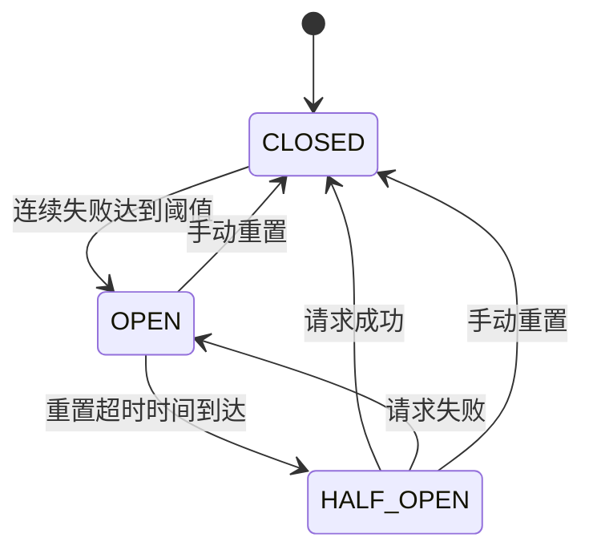

# CircuitBreaker 模块文档

## 概述

CircuitBreaker 模块提供了一个用于 MCP（Model Context Protocol）服务器连接的熔断器模式实现。熔断器模式是一种重要的系统保护机制，用于防止系统在出现故障时被不断重试的请求压垮，从而实现快速失败和自动恢复。

本模块位于 `src.protocols.mcp-circuit-breaker` 路径下，是 MCP 协议实现的核心组件之一，主要用于保护系统免受不稳定服务的影响，提高整体系统的可靠性和弹性。

### 设计理念

熔断器的设计基于以下核心思想：
1. **快速失败**：当检测到服务故障时，立即拒绝请求，避免等待超时
2. **自动恢复**：在故障发生后，定期尝试恢复服务
3. **状态监控**：提供清晰的状态转换和事件通知机制
4. **可配置性**：允许根据不同场景调整故障阈值和恢复时间

## 核心组件

### CircuitBreaker 类

`CircuitBreaker` 类是本模块的核心，继承自 `EventEmitter`，实现了完整的熔断器模式功能。

#### 状态定义

熔断器有三种核心状态：

| 状态 | 描述 |
|------|------|
| CLOSED | 正常操作状态，所有请求正常通过 |
| OPEN | 故障状态，故障次数超过阈值，请求立即被拒绝 |
| HALF_OPEN | 恢复测试状态，允许一个请求通过以测试服务是否恢复 |

#### 状态转换

熔断器的状态转换遵循以下逻辑：



### API 参考

#### 构造函数

```javascript
new CircuitBreaker(options)
```

**参数：**
- `options` (对象，可选)：配置选项
  - `failureThreshold` (数字，默认值：3)：连续失败次数阈值，超过此值后熔断器打开
  - `resetTimeout` (数字，默认值：30000)：熔断器打开后等待恢复的时间（毫秒）

**示例：**
```javascript
const { CircuitBreaker } = require('./src/protocols/mcp-circuit-breaker');

// 使用默认配置
const breaker = new CircuitBreaker();

// 自定义配置
const customBreaker = new CircuitBreaker({
  failureThreshold: 5,
  resetTimeout: 60000
});
```

#### 属性

##### `state`

获取当前熔断器状态。

**类型：** 字符串
**可能值：** `'CLOSED'`、`'OPEN'`、`'HALF_OPEN'`

**示例：**
```javascript
console.log(breaker.state); // 'CLOSED'
```

##### `failureCount`

获取当前连续失败次数。

**类型：** 数字

**示例：**
```javascript
console.log(breaker.failureCount); // 0
```

#### 方法

##### `execute(fn)`

通过熔断器执行一个异步函数。

**参数：**
- `fn` (函数)：要执行的异步函数，必须返回 Promise

**返回值：** Promise<any>，函数执行的结果

**异常：**
- 当熔断器处于 OPEN 状态时，抛出 `Error`，错误码为 `'CIRCUIT_OPEN'`
- 当执行的函数失败时，抛出原始错误

**示例：**
```javascript
try {
  const result = await breaker.execute(async () => {
    // 调用可能失败的服务
    const response = await fetch('https://api.example.com/data');
    return response.json();
  });
  console.log('成功:', result);
} catch (err) {
  if (err.code === 'CIRCUIT_OPEN') {
    console.log('熔断器已打开，请求被拒绝');
  } else {
    console.log('请求失败:', err);
  }
}
```

##### `recordSuccess()`

手动记录一次成功（适用于不使用 `execute()` 方法的场景）。

**参数：** 无
**返回值：** 无

**示例：**
```javascript
// 自定义成功/失败跟踪
try {
  const result = await someRiskyOperation();
  breaker.recordSuccess();
  return result;
} catch (err) {
  breaker.recordFailure();
  throw err;
}
```

##### `recordFailure()`

手动记录一次失败（适用于不使用 `execute()` 方法的场景）。

**参数：** 无
**返回值：** 无

##### `reset()`

将熔断器重置为 CLOSED 状态，清除所有失败计数。

**参数：** 无
**返回值：** 无

**示例：**
```javascript
// 手动重置熔断器
breaker.reset();
console.log(breaker.state); // 'CLOSED'
console.log(breaker.failureCount); // 0
```

##### `destroy()`

清理熔断器资源，清除定时器和所有事件监听器。

**参数：** 无
**返回值：** 无

**示例：**
```javascript
// 清理不再使用的熔断器
breaker.destroy();
```

#### 事件

CircuitBreaker 继承自 EventEmitter，会在状态变化时发出相应事件：

| 事件名 | 触发时机 |
|--------|----------|
| `'open'` | 熔断器从其他状态转换到 OPEN 状态 |
| `'half-open'` | 熔断器从其他状态转换到 HALF_OPEN 状态 |
| `'closed'` | 熔断器从其他状态转换到 CLOSED 状态 |
| `'rejected'` | 请求被熔断器拒绝（仅在 OPEN 状态） |

**示例：**
```javascript
breaker.on('open', () => {
  console.log('熔断器已打开！');
  // 可以在这里发送告警通知
});

breaker.on('closed', () => {
  console.log('熔断器已关闭，服务恢复正常');
});

breaker.on('rejected', () => {
  console.log('请求被熔断器拒绝');
});
```

## 使用场景

### 1. 保护 API 调用

```javascript
const { CircuitBreaker } = require('./src/protocols/mcp-circuit-breaker');
const fetch = require('node-fetch');

const apiBreaker = new CircuitBreaker({
  failureThreshold: 3,
  resetTimeout: 10000
});

async function callExternalApi(url) {
  return apiBreaker.execute(async () => {
    const response = await fetch(url);
    if (!response.ok) {
      throw new Error(`HTTP error! status: ${response.status}`);
    }
    return response.json();
  });
}
```

### 2. 数据库连接保护

```javascript
const dbBreaker = new CircuitBreaker({
  failureThreshold: 5,
  resetTimeout: 30000
});

async function queryDatabase(query) {
  return dbBreaker.execute(async () => {
    // 数据库查询操作
    const result = await db.query(query);
    return result;
  });
}

// 监听状态变化
dbBreaker.on('open', () => {
  console.error('数据库连接出现问题，熔断器已打开');
});

dbBreaker.on('closed', () => {
  console.log('数据库连接已恢复');
});
```

### 3. 与 MCPClient 集成

由于 CircuitBreaker 是 MCP 协议实现的一部分，它通常与 MCPClient 一起使用：

```javascript
const { CircuitBreaker } = require('./src/protocols/mcp-circuit-breaker');
const { MCPClient } = require('./src/protocols/mcp-client');

const mcpBreaker = new CircuitBreaker({
  failureThreshold: 3,
  resetTimeout: 15000
});

const client = new MCPClient();

async function sendMCPRequest(request) {
  return mcpBreaker.execute(async () => {
    return client.send(request);
  });
}
```

## 最佳实践

1. **合理设置阈值**：
   - `failureThreshold` 应根据服务的重要性和容忍度设置
   - 关键服务可设置较低的阈值（如 2-3），非关键服务可设置较高值
   - `resetTimeout` 应考虑服务恢复所需的平均时间

2. **事件监听**：
   - 始终监听状态变化事件，用于日志记录和告警
   - 可在 `'open'` 事件中发送告警通知
   - 在 `'closed'` 事件中记录恢复时间

3. **资源清理**：
   - 当熔断器不再使用时，务必调用 `destroy()` 方法清理资源
   - 这对于长期运行的应用程序尤为重要，可防止内存泄漏

4. **错误处理**：
   - 区分处理 `CIRCUIT_OPEN` 错误和实际服务错误
   - 考虑实现降级逻辑，当熔断器打开时提供备用响应

5. **监控和度量**：
   - 记录熔断器状态变化的时间点
   - 跟踪失败率和恢复时间
   - 可与可观测性模块集成，收集指标数据

## 注意事项和限制

### 线程安全性

当前实现不是线程安全的。在多线程环境中使用时，需要额外的同步机制。

### 错误类型

熔断器将所有异常都视为失败，包括编程错误。在实际使用中，可能需要区分临时性错误和永久性错误。

### 并发请求

在 HALF_OPEN 状态下，虽然只允许一个请求通过，但并发场景下可能仍有多个请求同时尝试执行。建议在高并发场景下添加额外的请求队列机制。

### 资源泄漏

如果不调用 `destroy()` 方法，定时器可能会阻止 Node.js 进程正常退出。务必在应用关闭前清理所有熔断器实例。

### 状态持久化

当前实现不支持状态持久化。如果应用重启，熔断器状态会重置为 CLOSED。对于需要保持状态的场景，需要扩展实现状态持久化功能。

## 与其他模块的关系

CircuitBreaker 模块是 MCP 协议实现的一部分，与以下模块有紧密关系：

- [MCPClient](MCPClient.md)：熔断器通常用于保护 MCPClient 的请求
- [MCPClientManager](MCPClientManager.md)：可能使用熔断器来管理多个客户端连接
- [Transport](Transport.md)：熔断器可以保护底层传输层的通信

## 示例：完整实现

下面是一个完整的示例，展示如何在实际应用中使用 CircuitBreaker：

```javascript
const { CircuitBreaker } = require('./src/protocols/mcp-circuit-breaker');

class ProtectedService {
  constructor(serviceName, options = {}) {
    this.serviceName = serviceName;
    this.breaker = new CircuitBreaker({
      failureThreshold: options.failureThreshold || 3,
      resetTimeout: options.resetTimeout || 30000
    });
    
    this._setupEventListeners();
  }
  
  _setupEventListeners() {
    this.breaker.on('open', () => {
      console.warn(`[${this.serviceName}] 熔断器已打开，停止请求`);
    });
    
    this.breaker.on('half-open', () => {
      console.info(`[${this.serviceName}] 熔断器进入半开状态，测试服务恢复`);
    });
    
    this.breaker.on('closed', () => {
      console.info(`[${this.serviceName}] 熔断器已关闭，服务恢复正常`);
    });
    
    this.breaker.on('rejected', () => {
      console.debug(`[${this.serviceName}] 请求被熔断器拒绝`);
    });
  }
  
  async execute(operation) {
    try {
      return await this.breaker.execute(operation);
    } catch (err) {
      if (err.code === 'CIRCUIT_OPEN') {
        // 熔断器打开时的降级处理
        return this._getFallbackResponse();
      }
      throw err;
    }
  }
  
  _getFallbackResponse() {
    // 自定义降级响应
    return {
      fallback: true,
      message: `服务 ${this.serviceName} 当前不可用，请稍后重试`
    };
  }
  
  destroy() {
    this.breaker.destroy();
  }
}

// 使用示例
async function main() {
  const protectedApi = new ProtectedService('external-api', {
    failureThreshold: 3,
    resetTimeout: 15000
  });
  
  try {
    const result = await protectedApi.execute(async () => {
      // 模拟可能失败的 API 调用
      const shouldFail = Math.random() < 0.7; // 70% 失败率
      if (shouldFail) {
        throw new Error('API 调用失败');
      }
      return { data: '成功响应' };
    });
    
    console.log('结果:', result);
  } catch (err) {
    console.error('错误:', err);
  } finally {
    protectedApi.destroy();
  }
}

main();
```

这个示例展示了如何创建一个受保护的服务类，包含完整的事件监听、降级处理和资源清理逻辑。
