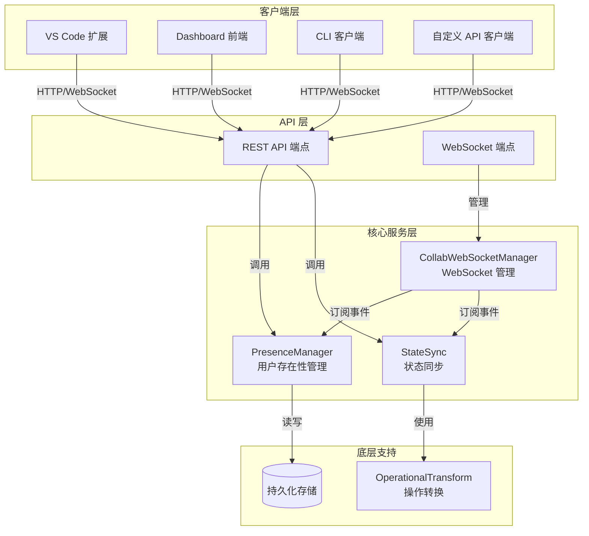

# Collaboration-API 模块文档

## 1. 概述

Collaboration-API 模块是 Loki Mode 实时协作系统的核心接口层，提供完整的 HTTP REST API 和 WebSocket 接口，支持多用户实时协作功能。该模块负责处理用户加入/离开会话、状态同步、光标位置共享、操作变更通知等协作核心功能。

### 主要功能特性

- **用户存在性管理**：追踪活跃用户状态、心跳检测、自动离线标记
- **实时状态同步**：通过操作转换（Operational Transformation）确保多用户编辑一致性
- **光标位置共享**：实时显示其他用户的编辑位置和选区
- **WebSocket 通信**：低延迟的实时事件广播和状态更新
- **完整的 REST API**：提供标准化的 HTTP 接口支持各种协作操作

### 设计理念

Collaboration-API 模块采用分层架构设计，将 API 层与核心协作逻辑分离，通过依赖注入的方式使用 PresenceManager、StateSync 和 CollabWebSocketManager 等核心组件，确保系统的可测试性和可扩展性。

## 2. 架构设计

### 系统架构图



### 组件关系说明

1. **API 路由层**：由 `create_collab_routes()` 函数创建，提供 REST 和 WebSocket 端点
2. **存在性管理**：PresenceManager 负责用户状态追踪、心跳管理和事件分发
3. **状态同步**：StateSync 处理共享状态的操作应用和历史记录
4. **WebSocket 管理**：CollabWebSocketManager 管理实时连接和事件广播
5. **操作转换**：OperationalTransform 确保并发操作的一致性

## 3. 核心组件详解

### 3.1 API 端点创建器

#### `create_collab_routes(app)`

这是模块的入口函数，用于将所有协作相关的 API 端点注册到 FastAPI 应用中。

**参数**：
- `app`：FastAPI 应用实例

**功能**：
- 定义所有 Pydantic 数据模型
- 初始化核心管理器实例
- 注册用户存在性相关端点
- 注册状态同步相关端点
- 注册 WebSocket 端点
- 注册状态检查端点

**使用示例**：
```python
from fastapi import FastAPI
from collab.api import create_collab_routes

app = FastAPI()
create_collab_routes(app)
```

### 3.2 数据模型

#### JoinRequest

请求加入协作会话的模型。

```python
class JoinRequest(BaseModel):
    name: str = Field(..., min_length=1, max_length=100)
    client_type: str = Field(default="api")
    metadata: Optional[Dict[str, Any]] = None
```

**字段说明**：
- `name`：用户显示名称（1-100字符）
- `client_type`：客户端类型，可选值包括 "cli"、"dashboard"、"vscode"、"api"、"mcp"
- `metadata`：可选的附加元数据

#### CursorUpdate

光标位置更新模型。

```python
class CursorUpdate(BaseModel):
    file_path: str
    line: int
    column: int
    selection_start: Optional[List[int]] = None
    selection_end: Optional[List[int]] = None
```

**字段说明**：
- `file_path`：当前编辑的文件路径
- `line`：光标所在行号
- `column`：光标所在列号
- `selection_start`：选区起始位置（可选）
- `selection_end`：选区结束位置（可选）

#### StatusUpdate

用户状态更新模型。

```python
class StatusUpdate(BaseModel):
    status: str
```

**字段说明**：
- `status`：用户状态，可选值包括 "online"、"away"、"busy"、"offline"

#### OperationRequest

状态操作请求模型。

```python
class OperationRequest(BaseModel):
    type: str
    path: List[Any]
    value: Optional[Any] = None
    index: Optional[int] = None
    dest_index: Optional[int] = None
```

**字段说明**：
- `type`：操作类型，包括 "set"、"delete"、"insert"、"remove"、"move"、"increment"、"append"
- `path`：操作路径，列表形式指向状态树中的位置
- `value`：操作值（set、insert、append 操作需要）
- `index`：列表索引（insert、remove 操作需要）
- `dest_index`：目标索引（move 操作需要）

#### SyncRequest

状态同步请求模型。

```python
class SyncRequest(BaseModel):
    state: Dict[str, Any]
    version: int
```

**字段说明**：
- `state`：完整的状态快照
- `version`：状态版本号

## 4. API 端点参考

### 4.1 用户存在性端点

#### 加入会话
```
POST /api/collab/join
```

加入协作会话，创建用户存在记录。

**请求体**：JoinRequest
**响应**：JoinResponse（包含 user_id、name、client_type、color、joined_at）

**示例**：
```bash
curl -X POST http://localhost:8000/api/collab/join \
  -H "Content-Type: application/json" \
  -d '{"name": "Alice", "client_type": "vscode"}'
```

#### 离开会话
```
POST /api/collab/leave?user_id={user_id}
```

从协作会话中移除用户。

**查询参数**：
- `user_id`：要离开的用户 ID

**响应**：204 No Content

#### 获取活跃用户
```
GET /api/collab/users?include_offline={bool}&client_type={type}
```

获取当前活跃用户列表。

**查询参数**：
- `include_offline`：是否包含心跳过期的用户（默认 false）
- `client_type`：按客户端类型过滤（可选）

**响应**：UserResponse 列表

#### 获取特定用户
```
GET /api/collab/users/{user_id}
```

根据用户 ID 获取用户信息。

**路径参数**：
- `user_id`：用户 ID

**响应**：UserResponse

#### 发送心跳
```
POST /api/collab/users/{user_id}/heartbeat
```

更新用户心跳时间戳，防止被标记为离线。

**路径参数**：
- `user_id`：用户 ID

**响应**：204 No Content

**使用建议**：建议每 10-15 秒调用一次

#### 更新光标位置
```
POST /api/collab/users/{user_id}/cursor
```

更新用户的光标位置和选区。

**路径参数**：
- `user_id`：用户 ID

**请求体**：CursorUpdate
**响应**：204 No Content

#### 更新用户状态
```
POST /api/collab/users/{user_id}/status
```

更新用户的在线状态。

**路径参数**：
- `user_id`：用户 ID

**请求体**：StatusUpdate
**响应**：204 No Content

#### 获取存在性摘要
```
GET /api/collab/presence
```

获取当前存在性状态的摘要信息。

**响应**：PresenceSummary，包含总用户数、按客户端类型分组、按文件分组等信息

#### 获取文件中的用户
```
GET /api/collab/file/{file_path}
```

获取当前正在查看特定文件的所有用户。

**路径参数**：
- `file_path`：文件路径

**响应**：UserResponse 列表

### 4.2 状态同步端点

#### 获取当前状态
```
GET /api/collab/state
```

获取当前的共享状态。

**响应**：
```json
{
  "state": {...},
  "version": 42,
  "hash": "abc123..."
}
```

#### 获取状态值
```
GET /api/collab/state/value?path={path}
```

获取状态树中特定路径的值。

**查询参数**：
- `path`：点分隔的路径，如 "tasks.0.status"

**响应**：
```json
{
  "path": "tasks.0.status",
  "value": "in_progress"
}
```

#### 应用操作
```
POST /api/collab/operation?user_id={user_id}
```

对共享状态应用一个操作。

**查询参数**：
- `user_id`：执行操作的用户 ID

**请求体**：OperationRequest

**响应**：
```json
{
  "success": true,
  "operation_id": "uuid",
  "version": 43
}
```

**操作类型说明**：
- `set`：设置路径处的值
- `delete`：删除路径处的值
- `insert`：在列表索引处插入值
- `remove`：从列表索引处删除值
- `move`：移动列表项
- `increment`：递增数值
- `append`：追加到列表或字符串

#### 同步状态
```
POST /api/collab/sync
```

使用完整状态快照进行同步。

**请求体**：SyncRequest

**响应**：
```json
{
  "state": {...},
  "version": 42,
  "hash": "abc123..."
}
```

**使用场景**：初始同步或从状态不一致中恢复

#### 获取操作历史
```
GET /api/collab/history?since_version={version}&limit={limit}
```

获取操作历史记录。

**查询参数**：
- `since_version`：起始版本（可选）
- `limit`：返回记录数量限制（默认 100，最大 1000）

**响应**：
```json
{
  "operations": [...],
  "current_version": 42
}
```

### 4.3 WebSocket 端点

#### 协作 WebSocket
```
WS /ws/collab?user_id={user_id}&session_id={session_id}
```

实时协作的 WebSocket 连接端点。

**查询参数**：
- `user_id`：可选的用户 ID（未提供时自动生成）
- `session_id`：会话 ID（默认 "default"）

**连接流程**：
1. 客户端建立连接
2. 服务器发送初始状态：
   ```json
   {
     "type": "connected",
     "user_id": "abc123",
     "session_id": "default",
     "users": [...],
     "state": {...},
     "version": 42
   }
   ```
3. 客户端和服务器进行双向消息交换
4. 服务器每 30 秒超时，发送 ping 保持连接

**客户端 → 服务器消息**：
- `join`：加入会话
- `leave`：离开会话
- `heartbeat`：发送心跳
- `cursor`：更新光标
- `operation`：应用操作
- `sync_request`：请求同步
- `subscribe`：订阅频道

**服务器 → 客户端消息**：
- `connected`：连接成功
- `presence`：存在性事件
- `cursors`：光标更新
- `operation`：操作应用
- `sync`：状态同步
- `error`：错误信息

### 4.4 状态端点

#### 获取协作系统状态
```
GET /api/collab/status
```

获取协作系统的整体状态。

**响应**：
```json
{
  "active_users": 5,
  "websocket_connections": 5,
  "state_version": 42,
  "state_hash": "abc123..."
}
```

## 5. 使用指南

### 5.1 基本使用流程

#### 1. 初始化 API 路由

```python
from fastapi import FastAPI
from collab.api import create_collab_routes

app = FastAPI(title="Loki Mode Collaboration API")
create_collab_routes(app)
```

#### 2. 客户端加入会话

```python
import requests

response = requests.post("http://localhost:8000/api/collab/join", json={
    "name": "Developer",
    "client_type": "api",
    "metadata": {"role": "admin"}
})

user_data = response.json()
user_id = user_data["user_id"]
print(f"Joined as {user_data['name']} (ID: {user_id})")
```

#### 3. 定期发送心跳

```python
import time
import threading

def heartbeat_loop():
    while True:
        requests.post(f"http://localhost:8000/api/collab/users/{user_id}/heartbeat")
        time.sleep(10)  # 每 10 秒发送一次心跳

threading.Thread(target=heartbeat_loop, daemon=True).start()
```

#### 4. 更新光标位置

```python
requests.post(f"http://localhost:8000/api/collab/users/{user_id}/cursor", json={
    "file_path": "src/main.py",
    "line": 42,
    "column": 10,
    "selection_start": [42, 5],
    "selection_end": [42, 15]
})
```

#### 5. 应用状态操作

```python
response = requests.post(
    f"http://localhost:8000/api/collab/operation?user_id={user_id}",
    json={
        "type": "set",
        "path": ["tasks", 0, "status"],
        "value": "completed"
    }
)

result = response.json()
if result["success"]:
    print(f"Operation applied, new version: {result['version']}")
```

### 5.2 WebSocket 使用示例

```python
import asyncio
import websockets
import json

async def collaboration_client():
    uri = f"ws://localhost:8000/ws/collab?user_id={user_id}"
    
    async with websockets.connect(uri) as websocket:
        # 接收初始状态
        initial = await websocket.recv()
        print(f"Connected: {initial}")
        
        # 发送加入消息
        await websocket.send(json.dumps({
            "type": "join",
            "name": "Developer",
            "client_type": "api"
        }))
        
        # 监听消息
        async for message in websocket:
            data = json.loads(message)
            
            if data["type"] == "presence":
                print(f"Presence update: {data['event']}")
            elif data["type"] == "operation":
                print(f"Operation applied: {data['operation']}")
            elif data["type"] == "ping":
                await websocket.send(json.dumps({"type": "pong"}))

asyncio.run(collaboration_client())
```

## 6. 架构集成

### 6.1 与其他模块的关系

Collaboration-API 模块与以下模块紧密集成：

1. **Collaboration-Sync**：提供状态同步和操作转换功能
   - 参考 [Collaboration-Sync.md](Collaboration-Sync.md) 了解详细信息

2. **Collaboration-Presence**：管理用户存在性和状态
   - 参考 [Collaboration-Presence.md](Collaboration-Presence.md) 了解详细信息

3. **Collaboration-WebSocket**：处理实时 WebSocket 通信
   - 参考 [Collaboration-WebSocket.md](Collaboration-WebSocket.md) 了解详细信息

### 6.2 扩展点

#### 自定义认证

可以通过中间件添加自定义认证：

```python
from fastapi import Request, HTTPException
from fastapi.security import HTTPBearer, HTTPAuthorizationCredentials

security = HTTPBearer()

@app.middleware("http")
async def auth_middleware(request: Request, call_next):
    if request.url.path.startswith("/api/collab/") or request.url.path.startswith("/ws/collab"):
        try:
            credentials: HTTPAuthorizationCredentials = await security(request)
            # 验证 token
            if not validate_token(credentials.credentials):
                raise HTTPException(status_code=401, detail="Invalid token")
        except HTTPException:
            raise
        except Exception:
            # WebSocket 连接可能需要特殊处理
            pass
    
    return await call_next(request)
```

#### 自定义事件监听

可以通过订阅 PresenceManager 和 StateSync 的事件来添加自定义处理逻辑：

```python
from collab.presence import get_presence_manager
from collab.sync import get_state_sync

presence = get_presence_manager()
sync = get_state_sync()

def handle_presence_event(event):
    print(f"Presence event: {event.type} for user {event.user_id}")

def handle_sync_event(event):
    print(f"Sync event: {event.type}")

presence.subscribe(handle_presence_event)
sync.subscribe(handle_sync_event)
```

## 7. 注意事项与最佳实践

### 7.1 错误处理

API 可能返回以下错误状态码：

- `400 Bad Request`：无效的请求参数，如错误的状态值、操作类型等
- `404 Not Found`：用户不存在或路径不存在
- `422 Validation Error`：请求数据验证失败

### 7.2 性能考虑

1. **心跳频率**：建议每 10-15 秒发送一次心跳，避免过频造成服务器负载
2. **操作批处理**：对于多个连续操作，考虑使用批量操作（如果支持）
3. **历史记录限制**：获取操作历史时合理设置 limit 参数，避免获取过多数据

### 7.3 安全性

1. **认证**：生产环境中必须为 API 添加认证机制
2. **用户 ID 验证**：确保请求的 user_id 与认证用户一致
3. **输入验证**：虽然 API 已有基本验证，客户端也应进行输入验证
4. **WebSocket 安全**：使用 wss:// 协议加密 WebSocket 连接

### 7.4 边缘情况

1. **网络中断**：实现重连机制和状态同步，处理临时网络故障
2. **并发冲突**：理解操作转换的优先级规则，设计用户界面处理冲突
3. **用户掉线**：客户端应检测心跳超时并提供重新加入的选项
4. **大状态同步**：对于大型状态，考虑实现增量同步机制

## 8. 总结

Collaboration-API 模块提供了完整的协作功能接口，是构建实时协作应用的基础。通过 REST API 和 WebSocket 的结合，该模块支持用户存在性管理、状态同步、光标共享等核心协作功能，同时通过操作转换技术确保多用户编辑的一致性。

开发者可以通过简单的 API 调用集成协作功能，也可以通过事件订阅和中间件进行扩展。在使用过程中，需要注意心跳管理、错误处理和安全性等方面的最佳实践，以确保系统的稳定性和可靠性。
