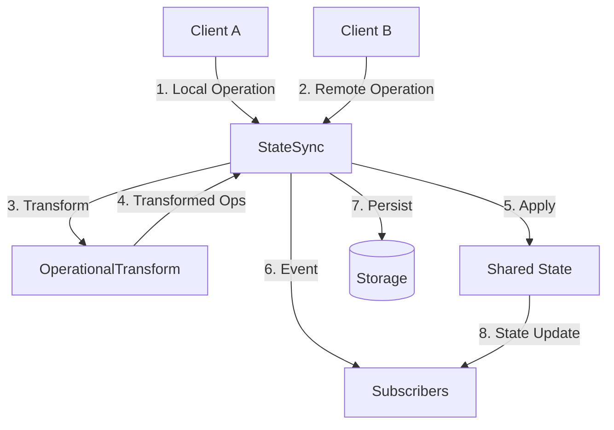
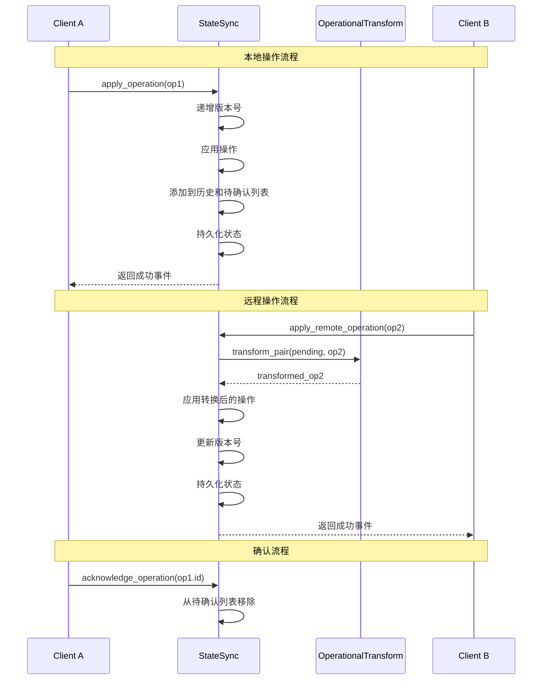
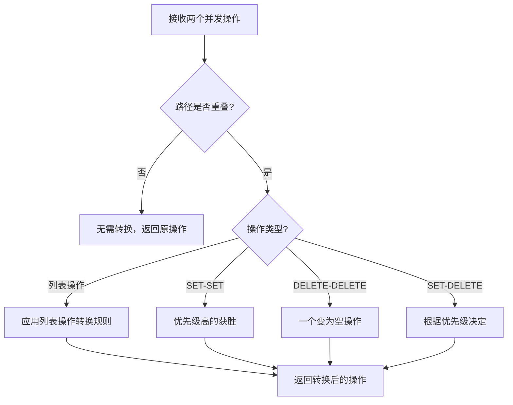

# Collaboration-Sync 模块文档

## 概述

Collaboration-Sync 模块是 Loki Mode 协作功能的核心组件，提供了基于操作转换（Operational Transformation, OT）的状态同步机制，用于解决多人协作场景下的并发编辑冲突问题。该模块实现了共享状态的实时同步、版本控制、操作历史记录和持久化存储，是构建协作编辑应用的基础。

### 设计理念

该模块采用操作转换（OT）算法作为核心技术，确保即使在网络延迟和并发操作的情况下，多个用户对同一状态的修改也能最终达成一致。通过 Lamport 时间戳进行版本管理，结合文件持久化和事件广播机制，实现了可靠的实时协作体验。

## 核心组件

### OperationType 枚举

定义了可应用于状态的操作类型。

```python
class OperationType(str, Enum):
    """Types of operations that can be applied to state."""
    SET = "set"           # 在路径设置值
    DELETE = "delete"     # 删除路径处的值
    INSERT = "insert"     # 在列表指定索引处插入
    REMOVE = "remove"     # 从列表指定索引处移除
    MOVE = "move"         # 将列表项从一个索引移动到另一个索引
    INCREMENT = "increment"  # 递增数值
    APPEND = "append"     # 追加到列表或字符串
```

### Operation 类

表示对共享状态的单个操作，使用基于路径的寻址方式访问嵌套数据结构。

#### 主要属性

- `type`: 操作类型（OperationType）
- `path`: 目标值的路径（键/索引列表），例如 `["tasks", 0, "status"]`
- `value`: SET、INSERT、APPEND、INCREMENT 操作的值
- `index`: INSERT、REMOVE、MOVE 操作的索引
- `dest_index`: MOVE 操作的目标索引
- `id`: 操作唯一标识符
- `timestamp`: 操作时间戳（ISO 格式）
- `user_id`: 执行操作的用户 ID
- `version`: Lamport 时间戳，用于排序

#### 主要方法

- `to_dict()`: 将操作转换为字典
- `from_dict(data)`: 从字典创建操作对象

#### 使用示例

```python
from collab.sync import Operation, OperationType

# 创建一个设置操作
op = Operation(
    type=OperationType.SET,
    path=["tasks", 0, "status"],
    value="done",
    user_id="alice"
)

# 转换为字典
op_dict = op.to_dict()

# 从字典恢复
restored_op = Operation.from_dict(op_dict)
```

### SyncEventType 枚举

定义了同步事件的类型，用于通知系统状态变化。

```python
class SyncEventType(str, Enum):
    """Types of synchronization events."""
    OPERATION_APPLIED = "operation_applied"    # 操作已应用
    OPERATION_REJECTED = "operation_rejected"  # 操作被拒绝
    STATE_SYNCED = "state_synced"              # 状态已同步
    CONFLICT_RESOLVED = "conflict_resolved"    # 冲突已解决
    VERSION_MISMATCH = "version_mismatch"      # 版本不匹配
```

### SyncEvent 类

表示同步事件，包含事件类型、相关操作 ID、时间戳和负载数据。

### OperationalTransform 类

实现了操作转换算法，用于解决并发操作冲突。

#### 核心方法

##### transform_pair

转换两个并发操作，使它们可以以任意顺序应用并得到一致结果。

```python
@staticmethod
def transform_pair(
    op1: Operation,
    op2: Operation,
    priority_to_first: bool = True
) -> Tuple[Operation, Operation]:
    """
    Transform two concurrent operations so they can be applied in either order.
    
    Args:
        op1: 第一个操作
        op2: 第二个操作
        priority_to_first: 如果为 True，冲突时 op1 优先
        
    Returns:
        转换后的操作对 (transformed_op1, transformed_op2)
    """
```

#### 转换规则

1. **独立路径操作**：如果两个操作的路径不重叠，则无需转换，直接返回原操作。

2. **列表操作转换**：
   - 两个 INSERT 操作：如果 op1 在 op2 之前插入，则 op2 的索引加 1，反之亦然
   - 两个 REMOVE 操作：如果 op1 在 op2 之前移除，则 op2 的索引减 1，反之亦然
   - INSERT 和 REMOVE 组合：根据操作顺序和位置调整索引

3. **SET 冲突**：如果两个操作在同一路径上设置值，优先级高的操作获胜，另一个操作的值被修改为与获胜者一致。

4. **DELETE 冲突**：如果两个操作删除同一路径，则其中一个变为空操作。

5. **SET 与 DELETE 冲突**：根据优先级决定哪个操作生效。

#### 内部辅助方法

- `_paths_overlap(path1, path2)`: 检查两个路径是否重叠（一个是另一个的前缀或完全相等）
- `_transform_list_ops(op1, op2, priority_to_first)`: 处理列表插入/删除操作的转换

### StateSync 类

管理多个客户端之间的共享状态同步，是整个模块的核心类。

#### 主要特性

- 基于操作转换的冲突解决
- 使用 Lamport 时间戳进行版本跟踪
- 操作历史记录，支持撤销/重做
- 基于文件的持久化存储
- 实时更新的事件广播

#### 初始化参数

```python
def __init__(
    self,
    loki_dir: Optional[Path] = None,
    max_history: int = 1000,
    enable_persistence: bool = True,
):
    """
    初始化状态同步器。
    
    Args:
        loki_dir: .loki 目录的路径
        max_history: 历史记录中保留的最大操作数
        enable_persistence: 启用基于文件的持久化
    """
```

#### 核心方法

##### apply_operation

应用本地操作到状态。

```python
def apply_operation(
    self,
    op: Operation,
    broadcast: bool = True
) -> Tuple[bool, SyncEvent]:
    """
    应用本地操作到状态。
    
    Args:
        op: 要应用的操作
        broadcast: 是否发出同步事件
        
    Returns:
        (success, event) 元组
    """
```

**工作流程**：
1. 获取状态锁
2. 增加版本号并设置操作的版本
3. 应用操作到内部状态
4. 如果成功，将操作添加到历史记录和待确认列表
5. 持久化状态
6. 创建并可能广播同步事件

##### apply_remote_operation

应用从远程客户端接收的操作。

```python
def apply_remote_operation(
    self,
    op: Operation,
    transform_against_pending: bool = True
) -> Tuple[bool, SyncEvent]:
    """
    应用从远程客户端接收的操作。
    
    Args:
        op: 要应用的远程操作
        transform_against_pending: 针对待处理的本地操作进行转换
        
    Returns:
        (success, event) 元组
    """
```

**工作流程**：
1. 获取状态锁
2. 如果启用了转换，针对所有待处理的本地操作转换远程操作
3. 应用转换后的操作
4. 如果成功，更新版本号为本地和远程版本的最大值加 1
5. 将操作添加到历史记录
6. 持久化状态
7. 创建并广播同步事件

##### acknowledge_operation

确认本地操作已被服务器接收。

```python
def acknowledge_operation(self, op_id: str) -> bool:
    """
    确认本地操作已被服务器接收。
    
    Args:
        op_id: 要确认的操作的 ID
        
    Returns:
        如果找到并确认了操作，则返回 True
    """
```

##### sync_state

与远程的完整状态快照同步。

```python
def sync_state(
    self,
    remote_state: Dict[str, Any],
    remote_version: int
) -> Tuple[Dict[str, Any], SyncEvent]:
    """
    与远程的完整状态快照同步。
    
    用于初始同步或从失步中恢复。
    
    Args:
        remote_state: 远程的完整状态
        remote_version: 远程状态的版本
        
    Returns:
        (merged_state, event) 元组
    """
```

##### 订阅机制

```python
def subscribe(self, callback: SyncCallback) -> Callable[[], None]:
    """订阅同步事件。"""

def subscribe_async(self, callback: Callable) -> Callable[[], None]:
    """使用异步回调订阅。"""
```

这两个方法允许注册回调函数，当同步事件发生时会被调用。它们都返回一个取消订阅的函数。

##### 状态查询方法

- `get_state()`: 获取当前状态的副本
- `get_value(path)`: 获取路径处的值
- `get_version()`: 获取当前版本号
- `get_state_hash()`: 获取当前状态的哈希值，用于一致性检查
- `get_history(since_version, limit)`: 获取操作历史记录

#### 内部状态管理方法

- `_get_value_at_path(path)`: 在状态中获取路径处的值
- `_set_value_at_path(path, value)`: 在状态中设置路径处的值
- `_delete_value_at_path(path)`: 删除路径处的值
- `_apply_operation_internal(op)`: 将操作应用到内部状态
- `_load_state()`: 加载持久化的状态
- `_persist_state()`: 持久化当前状态
- `_emit_event(event)`: 向所有订阅者发出同步事件
- `_emit_async_event(event)`: 为 WebSocket 广播排队异步事件

### 辅助函数

#### get_state_sync

获取默认的状态同步实例（单例模式）。

```python
def get_state_sync(
    loki_dir: Optional[Path] = None,
    **kwargs
) -> StateSync:
    """获取默认的状态同步实例。"""
```

#### reset_state_sync

重置默认的状态同步（用于测试）。

```python
def reset_state_sync() -> None:
    """重置默认的状态同步（用于测试）。"""
```

## 架构与工作流程

### 组件关系图



### 状态同步流程



### 操作转换工作流程



## 实际应用示例

### 基本使用

```python
from collab.sync import StateSync, Operation, OperationType, get_state_sync

# 创建 StateSync 实例
sync = StateSync(loki_dir="./.loki", max_history=1000)

# 或者使用单例
sync = get_state_sync(loki_dir="./.loki")

# 订阅同步事件
def handle_event(event):
    print(f"Sync event: {event.type}")
    if event.type == "operation_applied":
        print(f"Operation applied: {event.payload['operation']}")

unsubscribe = sync.subscribe(handle_event)

# 应用本地操作
op = Operation(
    type=OperationType.SET,
    path=["tasks", 0, "status"],
    value="done",
    user_id="alice"
)
success, event = sync.apply_operation(op)

# 获取当前状态
state = sync.get_state()
print(f"Current state: {state}")

# 稍后取消订阅
unsubscribe()
```

### 多客户端协作场景

```python
# 客户端 A
sync_a = StateSync()
op_a = Operation(
    type=OperationType.SET,
    path=["doc", "title"],
    value="Hello World",
    user_id="alice"
)
sync_a.apply_operation(op_a)

# 客户端 B（在另一个进程或机器上）
sync_b = StateSync()
op_b = Operation(
    type=OperationType.SET,
    path=["doc", "content"],
    value="This is a test",
    user_id="bob"
)
sync_b.apply_operation(op_b)

# 通过网络传输操作
# 客户端 A 接收客户端 B 的操作
sync_a.apply_remote_operation(op_b)

# 客户端 B 接收客户端 A 的操作
sync_b.apply_remote_operation(op_a)

# 现在两个客户端的状态应该一致
assert sync_a.get_state() == sync_b.get_state()
```

### 列表操作示例

```python
sync = StateSync()

# 初始化列表
sync.apply_operation(Operation(
    type=OperationType.SET,
    path=["items"],
    value=[]
))

# 插入项目
sync.apply_operation(Operation(
    type=OperationType.INSERT,
    path=["items"],
    value="A",
    index=0
))

sync.apply_operation(Operation(
    type=OperationType.INSERT,
    path=["items"],
    value="B",
    index=1
))

# 现在列表是 ["A", "B"]

# 模拟并发操作
op1 = Operation(
    type=OperationType.INSERT,
    path=["items"],
    value="X",
    index=1,
    user_id="alice"
)

op2 = Operation(
    type=OperationType.INSERT,
    path=["items"],
    value="Y",
    index=1,
    user_id="bob"
)

# 应用 op1 作为本地操作
sync.apply_operation(op1)

# 应用 op2 作为远程操作（会自动转换）
sync.apply_remote_operation(op2)

# 最终列表应该是 ["A", "X", "Y", "B"] 或 ["A", "Y", "X", "B"]
# 取决于优先级设置，但两个客户端会得到相同的结果
```

## 配置与扩展

### 配置选项

StateSync 类提供以下配置选项：

- `loki_dir`: 指定 .loki 目录的路径，用于存储持久化数据
- `max_history`: 设置历史记录中保留的最大操作数，默认为 1000
- `enable_persistence`: 启用或禁用基于文件的持久化，默认为 True

### 扩展点

1. **自定义操作类型**：可以通过扩展 OperationType 枚举添加新的操作类型，并在 OperationalTransform 和 StateSync 类中添加相应的处理逻辑。

2. **自定义持久化机制**：可以重写 StateSync 类的 `_load_state()` 和 `_persist_state()` 方法，实现自定义的持久化机制（如数据库存储）。

3. **自定义冲突解决策略**：可以扩展 OperationalTransform 类，添加或修改操作转换规则，实现自定义的冲突解决策略。

## 注意事项与限制

### 线程安全

StateSync 类使用 `threading.RLock` 来保护对共享状态的访问，因此在多线程环境中是安全的。但在异步环境中使用时，需要注意避免阻塞事件循环。

### 操作路径限制

- 路径中的键必须是可哈希的（如字符串、数字）
- 列表索引必须是有效的整数
- 对于嵌套结构，路径必须正确指向目标位置

### 性能考虑

- 历史记录和待确认操作列表的大小会影响内存使用，应根据实际情况调整 `max_history` 参数
- 操作转换的复杂度随着待确认操作数量的增加而增加
- 频繁的状态持久化可能会影响性能，可以考虑批量持久化或异步持久化

### 网络同步

- 该模块只提供状态同步的核心逻辑，不包括网络传输层
- 在实际应用中，需要结合 [Collaboration-WebSocket](Collaboration-WebSocket.md) 模块或其他网络通信机制来实现操作的网络传输
- 需要处理网络延迟、断线重连等情况，可能需要使用 `sync_state()` 方法进行状态全量同步

### 与其他模块的关系

- 该模块是 [Collaboration](Collaboration.md) 模块的子模块，与 [Collaboration-API](Collaboration-API.md)、[Collaboration-Presence](Collaboration-Presence.md) 和 [Collaboration-WebSocket](Collaboration-WebSocket.md) 模块紧密协作
- 可以与 [State Management](State-Management.md) 模块结合使用，实现更高级的状态管理功能

## 总结

Collaboration-Sync 模块提供了一个强大而灵活的状态同步机制，是构建实时协作应用的基础。通过操作转换算法，它能够解决并发编辑冲突，确保多个用户的操作最终能够达成一致。该模块设计良好，接口清晰，易于使用和扩展，可以满足各种协作场景的需求。
