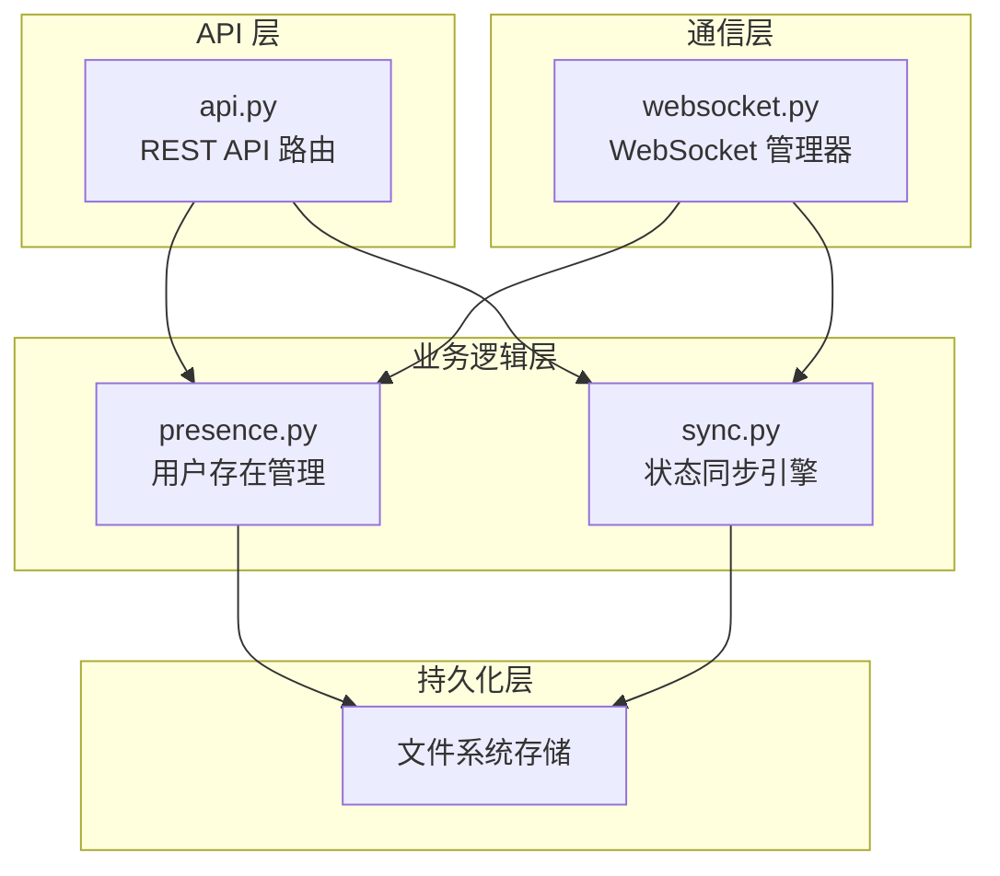

# Collaboration 模块

## 概述

Collaboration 模块为 Loki Mode 提供了实时协作功能，允许多个用户同时在同一项目中工作。该模块通过实现状态同步、用户存在管理和实时通信机制，确保所有协作者能够看到一致的项目状态并实时感知其他用户的活动。

### 核心功能

- **实时状态同步**：基于操作转换（Operational Transformation）算法实现并发编辑的冲突解决
- **用户存在管理**：跟踪活跃用户、光标位置、状态和文件访问
- **WebSocket 通信**：提供低延迟的实时数据传输通道
- **REST API 接口**：提供完整的 HTTP API 用于协作功能集成
- **持久化存储**：支持状态和用户信息的磁盘持久化

### 设计理念

Collaboration 模块采用了分布式系统中的经典设计模式，结合了操作转换（OT）算法来解决并发编辑冲突。模块被设计为可插拔的组件，可以轻松集成到现有系统中，同时提供强大的实时协作能力。

## 架构

Collaboration 模块采用分层架构，由四个核心子系统组成：



### 核心组件关系

1. **API 层** (`api.py`)：提供 RESTful 接口，处理 HTTP 请求并调用下层服务
2. **通信层** (`websocket.py`)：管理 WebSocket 连接，处理实时消息传递
3. **业务逻辑层**：
   - `presence.py`：管理用户存在、状态、光标位置等信息
   - `sync.py`：处理状态同步、操作转换和冲突解决
4. **持久化层**：将状态和用户信息保存到文件系统，支持重启恢复

## 子系统详解

### 1. API 层

API 层提供了完整的 RESTful 接口，用于协作功能的集成。主要包括：

- **用户管理接口**：加入/离开会话、获取用户信息、发送心跳
- **状态同步接口**：获取状态、应用操作、同步状态
- **WebSocket 端点**：提供实时通信通道

### 2. 通信层

通信层基于 WebSocket 协议实现，提供低延迟的实时数据传输。主要功能包括：

- 连接管理：处理 WebSocket 连接的建立和断开
- 消息路由：将消息分发到正确的处理程序
- 广播机制：向所有或部分连接的客户端发送消息
- 会话管理：支持多个协作会话的隔离

### 3. 用户存在管理

用户存在管理系统跟踪所有活跃用户的状态，包括：

- 用户基本信息：ID、名称、客户端类型
- 在线状态：在线、离开、忙碌、离线
- 光标位置：文件路径、行号、列号、选择范围
- 文件访问：当前打开的文件
- 心跳机制：自动检测用户离线

### 4. 状态同步引擎

状态同步引擎是 Collaboration 模块的核心，实现了：

- 操作转换（OT）算法：解决并发编辑冲突
- 版本控制：使用 Lamport 时间戳跟踪状态版本
- 操作历史：支持操作回放和状态恢复
- 状态持久化：将状态保存到磁盘

## 使用指南

### 基本集成

要在 FastAPI 应用中集成 Collaboration 模块：

```python
from fastapi import FastAPI
from collab.api import create_collab_routes

app = FastAPI()
create_collab_routes(app)
```

### 直接使用核心组件

```python
from collab.presence import PresenceManager, ClientType
from collab.sync import StateSync, Operation, OperationType

# 初始化管理器
presence = PresenceManager()
sync = StateSync()

# 用户加入
user = presence.join("Alice", ClientType.VSCODE)

# 应用操作
op = Operation(
    type=OperationType.SET,
    path=["tasks", 0, "status"],
    value="in_progress",
    user_id=user.id
)
success, event = sync.apply_operation(op)
```

## 配置选项

Collaboration 模块支持以下配置：

| 配置项 | 说明 | 默认值 |
|--------|------|--------|
| `loki_dir` | .loki 目录路径 | `./.loki` |
| `heartbeat_timeout` | 心跳超时时间（秒） | `30.0` |
| `max_history` | 最大操作历史记录数 | `1000` |
| `enable_persistence` | 是否启用持久化 | `True` |

## 注意事项和限制

1. **操作转换限制**：当前实现的 OT 算法主要处理基本操作类型，复杂的并发场景可能需要扩展
2. **心跳机制**：客户端需要定期发送心跳（建议 10-15 秒间隔），否则会被标记为离线
3. **状态大小**：建议保持共享状态合理大小，过大的状态会影响同步性能
4. **网络延迟**：在高延迟网络环境下，操作转换可能会导致感知到的编辑延迟

## 相关模块

- [API Server & Services](API Server & Services.md)：Collaboration 模块通常与 API 服务器配合使用
- [Dashboard Backend](Dashboard Backend.md)：Dashboard 后端使用 Collaboration 模块实现实时协作
- [VSCode Extension](VSCode Extension.md)：VSCode 扩展通过 Collaboration 模块与系统集成
