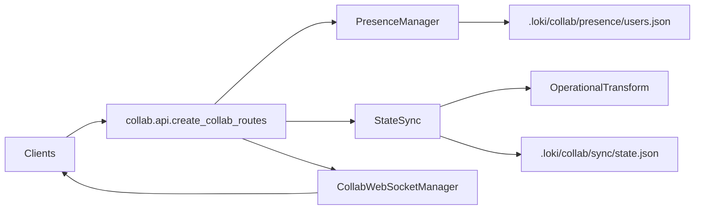

# Collaboration 模块深度解析

协作模块的本质，不是“加一个 WebSocket 就能多人编辑”，而是把**多人并发、网络抖动、客户端失步**这些天然混乱的问题，收敛成一套可解释的规则。你可以把它想成一个“实时协作控制塔”：`collab.api` 负责受理请求，`PresenceManager` 负责“谁在线、谁在哪个文件”，`StateSync` 负责“改动如何安全落地”，`CollabWebSocketManager` 负责“把变化广播给该看到的人”。

---

## 1) 这个模块解决什么问题？（先讲问题，再讲方案）

在单用户场景里，状态更新很简单：本地改完就结束。但在多人协作里会立即出现三类问题：

1. **并发冲突**：两个人同时改同一个列表或字段，如何保证最终状态一致？
2. **会话感知**：谁在线、谁离线、谁在看哪个文件、光标在哪？
3. **传输与恢复**：客户端断线重连后如何追平状态，避免“我看到的是旧世界”。

Collaboration 模块给出的答案是：

- 用 `Operation` + `OperationType` 把变更表达为可重放的“操作流”；
- 用 `OperationalTransform` 在冲突点做语义变换；
- 用 `StateSync` 维护版本、历史、pending 操作与快照同步；
- 用 `PresenceManager` + 心跳机制维持用户存在信息；
- 用 `CollabWebSocketManager` 实时广播 presence 与 sync 事件；
- 用 `create_collab_routes` 暴露统一 REST + WebSocket 边界。

**为什么不是“全量状态覆盖 + last write wins”？**
因为那种方案实现快，但在列表插删等并发场景里会出现语义漂移（同样的操作到不同客户端得到不同结果）。当前设计优先保证协作收敛性。

---

## 2) 心智模型：把它看成“两条面 + 一个共享内核”

可以用一个简单类比：

- REST 像“柜台业务”（显式请求：join、operation、sync、history）
- WebSocket 像“大厅广播”（实时通知：presence、sync_event、operation）
- `PresenceManager` 与 `StateSync` 是后台“系统记录本”（真实状态源）

这张图的关键点：`collab.api` 本身不是状态持有者，而是**边界编排层**。真正的协作语义在 `PresenceManager` 与 `StateSync`。

---

## 3) 数据如何流动？（关键链路端到端）

### A. 加入协作：`POST /api/collab/join`

`JoinRequest` → `ClientType(...)` 转换（失败降级为 `ClientType.API`）→ `presence.join(...)` → 返回 `JoinResponse`。

意图：把“客户端传来的松散字符串”正规化为内部枚举，降低外围输入污染。

### B. 应用操作：`POST /api/collab/operation`

`OperationRequest` → `OperationType(...)` 校验 → 构造 `Operation`（注入 `user_id`）→ `sync.apply_operation(op)`。

`StateSync.apply_operation` 内部会：

- 递增 `_version` 并写入 `op.version`
- `_apply_operation_internal` 修改状态
- 成功则写 `_history`、`_pending_ops` 并持久化
- 生成 `SyncEvent`

之后 API 层调用 `ws_manager.broadcast(..., exclude_user=user_id)` 给其他连接广播操作。

### C. 远端冲突处理（WebSocket/分布式场景）

`StateSync.apply_remote_operation` 会把远端操作逐个与 `_pending_ops` 做 `OperationalTransform.transform_pair(...)`，默认 `priority_to_first=True`（本地 pending 优先），再应用变换后的操作。

这是模块最重要的“收敛机制”。没有这层，操作顺序差异会导致状态分叉。

### D. 失步恢复：`POST /api/collab/sync`

`SyncRequest(state, version)` → `sync.sync_state(...)`：

- 若远端版本更高：接纳远端快照、更新版本、清空 pending
- 否则保留本地

该路径用于冷启动和 desync 恢复，是增量操作链路的兜底。

### E. 实时会话：`/ws/collab`

`ws_manager.connect(...)` 建立连接后，服务端先发 `connected`（users/state/version）。随后循环接收消息，交给 `ws_manager.handle_message(...)` 分发 join/heartbeat/cursor/operation/sync_request；超时发送 `ping` 保活；断开时 `ws_manager.disconnect(...)` 并触发 `presence.leave(...)`。

---

## 4) 关键设计取舍（为什么这么选）

### 取舍一：轻量 OT vs 完整形式化 OT

选择：`OperationalTransform` 重点覆盖常见冲突（尤其 list insert/remove 与 set/delete 组合），不是学术上最完整的 OT 系统。

收益：实现可读、可维护，足以覆盖任务协作主场景。
代价：复杂嵌套冲突的语义保证有限，需要后续扩展。

### 取舍二：乐观本地应用 vs 强一致确认后应用

选择：本地 `apply_operation` 先落地，再通过 `_pending_ops` + 远端变换补偿。

收益：交互延迟低，编辑体验更“即时”。
代价：实现复杂度上升，需要维护 ack/pending 语义。

### 取舍三：单例管理器 vs 显式依赖注入

选择：`get_state_sync()` / `get_presence_manager()` / `get_collab_ws_manager()` 使用进程内单例。

收益：REST 与 WebSocket 天然共享状态，接入成本低。
代价：多进程/多实例部署时，一致性与广播边界需要额外设计。

### 取舍四：鲁棒主流程 vs 完整错误暴露

在持久化与回调广播处存在 `except ...: pass`。

收益：外围故障不拖垮主同步链路。
代价：可观测性变弱，线上问题可能“静默失败”。

---

## 5) 新贡献者需要特别注意什么？

1. **`collab.api.Config` 的含义**  
   当前它来自 `UserResponse` 的内部 Pydantic `Config`（`from_attributes = True`），不是一个独立的运行时配置对象。

2. **路径语义很灵活，也很危险**  
   `Operation.path` 是 `List[Any]`；`get_state_value` 会把 dot path 中可转数字的段转成 `int`。如果你把字符串数字键当字典 key，容易与列表索引语义冲突。

3. **`acknowledge_operation` 返回值语义偏弱**  
   该方法当前总是返回 `True`，即便没匹配到 `op_id`。不要把它当严格确认信号。

4. **事件枚举不等于都已落地**  
   `SyncEventType` 定义了 `CONFLICT_RESOLVED`、`VERSION_MISMATCH`，但当前 `StateSync` 主要发 `OPERATION_APPLIED` / `OPERATION_REJECTED` / `STATE_SYNCED`。

5. **REST 与 WebSocket 是并行入口**  
   用户生命周期可能从 HTTP（join/leave/heartbeat）和 WS（disconnect）同时驱动。改用户状态语义时必须同时验证两条路径。

---

## 子模块导航（已拆分文档）

- [api_contracts](api_contracts.md)：`collab.api.Config`、`JoinRequest`、`OperationRequest`、`SyncRequest`、`CursorUpdate`、`StatusUpdate` 的边界契约与路由编排意图。
- [sync_conflict_resolution](sync_conflict_resolution.md)：`SyncEventType` 与 `OperationalTransform` 的冲突解决机制、版本策略与操作流语义。

---

## 与其他模块的依赖关系

从系统图角度，Collaboration 模块是“实时协作能力层”，向上被 API/前端/扩展消费，向下依赖状态与运行时基础设施：

- [API Server & Services](API Server & Services.md)：路由挂载与服务运行容器。
- [Dashboard Backend](Dashboard Backend.md)：管理端通过 API/WS 消费协作能力。
- [Dashboard Frontend](Dashboard Frontend.md) 与 [Dashboard UI Components](Dashboard UI Components.md)：实时呈现用户、任务与状态变化。
- [VSCode Extension](VSCode Extension.md)：编辑器侧协作入口。
- [State Management](State Management.md)：状态通道/管理理念上的邻近模块（尽管 Collaboration 自身在 `collab/*` 内维护独立状态与持久化）。

一句话总结：**Collaboration 是系统里的“协作一致性与实时传播中枢”**，它的价值不在 API 数量，而在于把并发协作从“运气正确”变成“机制正确”。
