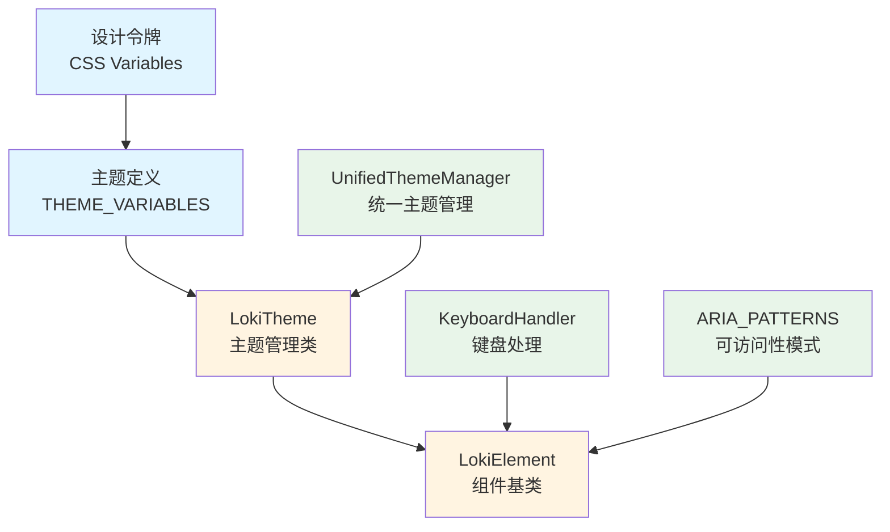
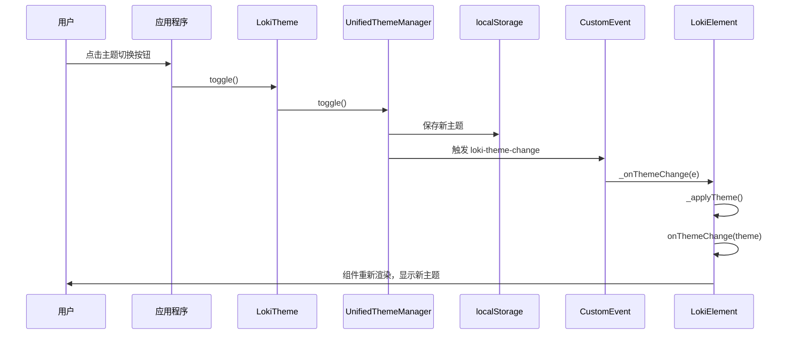

# Core Theme 模块文档

## 概述

Core Theme 模块是 Loki Mode Dashboard UI 组件库的基础主题系统，提供了统一的主题管理、样式定义和组件基类。该模块支持多种主题变体，包括亮色/深色模式、高对比度主题以及 VS Code 集成主题，并提供了完整的键盘快捷键处理和可访问性支持。

### 设计理念

Core Theme 模块采用了设计驱动的开发理念，基于 Anthropic 设计语言构建，确保所有 Loki UI 组件在视觉上保持一致。该模块同时保留了向后兼容性，同时推荐使用更强大的 Unified Styles 系统进行新功能开发。

### 主要功能

- **多主题支持**：包括亮色、深色、高对比度、VS Code 亮色和 VS Code 深色主题
- **主题切换**：支持用户手动切换、系统偏好检测和上下文感知
- **设计令牌系统**：使用 CSS 变量实现统一的样式管理
- **组件基类**：提供 LokiElement 基类，简化主题感知组件的开发
- **键盘快捷键**：集成 KeyboardHandler 支持可配置的键盘操作
- **可访问性**：内置 ARIA 模式支持，确保组件符合 WCAG 标准

## 核心组件

### LokiTheme 类

LokiTheme 是主题管理的核心类，负责处理主题的获取、设置、切换和应用。虽然该类保留了向后兼容性，但新开发推荐使用 UnifiedThemeManager。

```javascript
import { LokiTheme } from 'dashboard-ui/core/loki-theme.js';

// 初始化主题系统
LokiTheme.init();

// 获取当前主题
const currentTheme = LokiTheme.getTheme();

// 设置特定主题
LokiTheme.setTheme('dark');

// 切换主题
const newTheme = LokiTheme.toggle();
```

#### 主要方法

| 方法 | 描述 | 参数 | 返回值 |
|------|------|------|--------|
| `getTheme()` | 获取当前主题 | - | `string` 主题名称 |
| `setTheme(theme)` | 设置主题 | `theme: string` 主题名称 | - |
| `toggle()` | 在亮色和深色主题间切换 | - | `string` 新主题名称 |
| `getVariables(theme)` | 获取主题的 CSS 变量 | `theme?: string` 可选主题覆盖 | `object` CSS 变量对象 |
| `toCSSString(theme)` | 生成主题 CSS 字符串 | `theme?: string` 可选主题覆盖 | `string` CSS 字符串 |
| `applyToElement(element, theme)` | 应用主题到元素 | `element: HTMLElement, theme?: string` | - |
| `init()` | 初始化主题系统 | - | - |
| `detectContext()` | 检测当前运行上下文 | - | `'browser'|'vscode'|'cli'` |
| `getAvailableThemes()` | 获取所有可用主题 | - | `string[]` 主题名称数组 |

### LokiElement 类

LokiElement 是所有 Loki 主题感知 Web 组件的基类，继承自 HTMLElement，提供了自动主题应用、键盘快捷键处理和 ARIA 模式支持。

```javascript
import { LokiElement } from 'dashboard-ui/core/loki-theme.js';

class MyComponent extends LokiElement {
  constructor() {
    super();
  }

  connectedCallback() {
    super.connectedCallback();
    // 组件特定的初始化
  }

  render() {
    this.shadowRoot.innerHTML = `
      &lt;style&gt;${this.getBaseStyles()}&lt;/style&gt;
      &lt;div class="card"&gt;
        &lt;h2&gt;我的组件&lt;/h2&gt;
        &lt;button class="btn btn-primary"&gt;点击我&lt;/button&gt;
      &lt;/div&gt;
    `;
  }

  onThemeChange(newTheme) {
    console.log('主题已更改:', newTheme);
  }
}

customElements.define('my-component', MyComponent);
```

#### 主要特性

1. **自动主题管理**：
   - 自动监听 `loki-theme-change` 事件
   - 应用主题到 Shadow DOM 宿主元素
   - 设置 `data-loki-theme` 属性用于 CSS 选择器

2. **样式系统**：
   - `getBaseStyles()` 方法返回包含所有主题变体的完整 CSS
   - 支持系统主题偏好检测
   - 包含减少动画的媒体查询支持

3. **键盘快捷键**：
   - 内置 KeyboardHandler 实例
   - `registerShortcut(action, handler)` 方法注册快捷键
   - 自动处理事件附着和分离

4. **可访问性支持**：
   - `getAriaPattern(patternName)` 获取预定义的 ARIA 属性
   - `applyAriaPattern(element, patternName)` 应用 ARIA 模式到元素

### 主题变量系统

Core Theme 模块定义了完整的设计令牌系统，使用 CSS 变量实现一致的样式管理。

#### 主要变量类别

| 类别 | 描述 | 示例变量 |
|------|------|----------|
| 背景色 | 主背景、次要背景、卡片背景等 | `--loki-bg-primary`, `--loki-bg-card` |
| 强调色 | 主要强调色和变体 | `--loki-accent`, `--loki-accent-muted` |
| 文本色 | 主要文本、次要文本和静音文本 | `--loki-text-primary`, `--loki-text-muted` |
| 边框色 | 边框和边框变体 | `--loki-border`, `--loki-border-light` |
| 状态色 | 成功、警告、错误、信息等状态 | `--loki-green`, `--loki-red` |
| 模型色 | 不同 AI 模型的标识色 | `--loki-opus`, `--loki-sonnet`, `--loki-haiku` |
| 动画 | 过渡和动画配置 | `--loki-transition` |

#### 主题定义

```javascript
// 亮色主题示例
{
  '--loki-bg-primary': '#FFFEFB',
  '--loki-bg-secondary': '#F8F4F0',
  '--loki-accent': '#553DE9',
  '--loki-text-primary': '#201515',
  // ... 更多变量
}

// 深色主题示例
{
  '--loki-bg-primary': '#1A0F2E',
  '--loki-bg-secondary': '#140B24',
  '--loki-accent': '#7B6BF0',
  '--loki-text-primary': '#F0ECF8',
  // ... 更多变量
}
```

## 架构与工作流程

### 主题系统架构

Core Theme 模块的架构设计采用了分层结构，从底层的设计令牌到高层的组件基类，提供了完整的主题解决方案。



### 主题切换流程

当用户切换主题时，系统会按照以下流程执行：



## 使用指南

### 基础使用

#### 1. 初始化主题系统

```javascript
import { LokiTheme } from 'dashboard-ui/core/loki-theme.js';

// 在应用启动时初始化
LokiTheme.init();
```

#### 2. 创建主题感知组件

```javascript
import { LokiElement } from 'dashboard-ui/core/loki-theme.js';

class ExampleCard extends LokiElement {
  render() {
    this.shadowRoot.innerHTML = `
      &lt;style&gt;${this.getBaseStyles()}&lt;/style&gt;
      &lt;style&gt;
        .card-content { padding: 20px; }
        .card-title { 
          color: var(--loki-text-primary);
          margin-bottom: 12px;
        }
        .card-description {
          color: var(--loki-text-secondary);
        }
      &lt;/style&gt;
      &lt;div class="card"&gt;
        &lt;div class="card-content"&gt;
          &lt;h3 class="card-title"&gt;示例卡片&lt;/h3&gt;
          &lt;p class="card-description"&gt;这是一个主题感知的卡片组件。&lt;/p&gt;
        &lt;/div&gt;
      &lt;/div&gt;
    `;
  }
}

customElements.define('example-card', ExampleCard);
```

#### 3. 添加主题切换控制

```javascript
// 创建主题切换按钮
const themeToggle = document.createElement('button');
themeToggle.className = 'btn btn-secondary';
themeToggle.textContent = '切换主题';
themeToggle.addEventListener('click', () =&gt; {
  const newTheme = LokiTheme.toggle();
  themeToggle.textContent = `当前主题: ${newTheme}`;
});

document.body.appendChild(themeToggle);
```

### 高级使用

#### 1. 自定义键盘快捷键

```javascript
class SearchComponent extends LokiElement {
  connectedCallback() {
    super.connectedCallback();
    
    // 注册搜索快捷键
    this.registerShortcut('search.focus', () =&gt; {
      this.shadowRoot.querySelector('input').focus();
    });
  }

  render() {
    this.shadowRoot.innerHTML = `
      &lt;style&gt;${this.getBaseStyles()}&lt;/style&gt;
      &lt;input type="text" placeholder="搜索... (Ctrl+K)" /&gt;
    `;
  }
}
```

#### 2. 应用 ARIA 模式

```javascript
class AccessibleDialog extends LokiElement {
  render() {
    const dialog = document.createElement('div');
    this.applyAriaPattern(dialog, 'dialog');
    
    const closeBtn = document.createElement('button');
    this.applyAriaPattern(closeBtn, 'button');
    
    this.shadowRoot.appendChild(dialog);
    dialog.appendChild(closeBtn);
  }
}
```

#### 3. 直接使用主题变量

```javascript
import { LokiTheme } from 'dashboard-ui/core/loki-theme.js';

// 获取当前主题的变量
const themeVars = LokiTheme.getVariables();
console.log('当前强调色:', themeVars['--loki-accent']);

// 获取特定主题的变量
const darkVars = LokiTheme.getVariables('dark');

// 应用主题到任意元素
const myElement = document.getElementById('my-element');
LokiTheme.applyToElement(myElement, 'dark');
```

## 扩展与定制

### 创建自定义主题

虽然 Core Theme 模块推荐使用 Unified Styles 系统的主题，但也可以扩展现有主题：

```javascript
import { LokiTheme, THEME_VARIABLES } from 'dashboard-ui/core/loki-theme.js';

// 扩展现有主题
const customLightTheme = {
  ...THEME_VARIABLES.light,
  '--loki-accent': '#FF6B6B', // 自定义强调色
  '--loki-bg-primary': '#FAFAFA',
};

// 直接应用自定义变量
function applyCustomTheme(element, customVars) {
  for (const [key, value] of Object.entries(customVars)) {
    element.style.setProperty(key, value);
  }
}
```

### 扩展 LokiElement

```javascript
import { LokiElement } from 'dashboard-ui/core/loki-theme.js';

class EnhancedLokiElement extends LokiElement {
  constructor() {
    super();
    this._state = {};
  }

  setState(newState) {
    this._state = { ...this._state, ...newState };
    this.render();
  }

  getState() {
    return { ...this._state };
  }

  // 添加动画支持
  animateIn(element, animationClass = 'fade-in') {
    element.classList.add(animationClass);
    setTimeout(() =&gt; element.classList.remove(animationClass), 300);
  }
}
```

## 最佳实践

### 1. 样式组织

```javascript
class WellStructuredComponent extends LokiElement {
  render() {
    this.shadowRoot.innerHTML = `
      &lt;style&gt;
        /* 1. 基础样式 */
        ${this.getBaseStyles()}
        
        /* 2. 组件特定样式 */
        :host {
          display: block;
          padding: 16px;
        }
        
        /* 3. 响应式样式 */
        @media (min-width: 768px) {
          :host { padding: 24px; }
        }
      &lt;/style&gt;
      
      &lt;!-- 组件内容 --&gt;
      &lt;div class="component-content"&gt;
        &lt;!-- ... --&gt;
      &lt;/div&gt;
    `;
  }
}
```

### 2. 性能优化

```javascript
class OptimizedComponent extends LokiElement {
  connectedCallback() {
    super.connectedCallback();
    this._initialized = false;
  }

  _onThemeChange(e) {
    // 只在真正需要时重新渲染
    if (this._theme !== e.detail.theme) {
      super._onThemeChange(e);
    }
  }

  render() {
    if (!this._initialized) {
      // 初始渲染 - 创建完整 DOM
      this.shadowRoot.innerHTML = `
        &lt;style&gt;${this.getBaseStyles()}&lt;/style&gt;
        &lt;div class="content"&gt;
          &lt;span class="dynamic-text"&gt;&lt;/span&gt;
        &lt;/div&gt;
      `;
      this._initialized = true;
    }
    
    // 后续更新 - 只更新变化的部分
    const dynamicText = this.shadowRoot.querySelector('.dynamic-text');
    if (dynamicText) {
      dynamicText.textContent = this._getDynamicContent();
    }
  }
}
```

## 注意事项与限制

### 向后兼容性

- Core Theme 模块保留了 `THEME_VARIABLES` 和 `COMMON_STYLES` 用于向后兼容性，但这些已标记为弃用
- 新开发应优先使用 `UnifiedThemeManager` 和相关导出
- `LokiTheme` 类现在主要作为 `UnifiedThemeManager` 的包装器

### 主题上下文

- 主题系统会自动检测运行上下文（浏览器、VS Code、CLI）
- 在 VS Code 环境中，主题会自动与编辑器主题同步
- 手动设置的主题会覆盖上下文自动检测

### 事件处理

- 主题变更事件是 `loki-theme-change`，类型为 `CustomEvent`
- 事件详情包含 `theme` 和 `context` 属性
- 组件在 `disconnectedCallback` 中会自动移除事件监听器

### 已知限制

1. **Shadow DOM 隔离**：由于使用 Shadow DOM，外部样式不会影响组件内部，组件样式也不会泄漏到外部
2. **浏览器支持**：需要支持 Custom Elements v1 和 Shadow DOM v1 的现代浏览器
3. **主题持久化**：使用 localStorage 存储主题偏好，在隐私模式下可能不持久
4. **性能考虑**：大量组件同时重新渲染可能导致性能问题，建议实现增量更新

## 相关模块

- [Unified Styles](Unified Styles.md) - 提供更强大的主题系统，包括高对比度和 VS Code 主题
- [Type Definitions](Type Definitions.md) - 包含完整的类型定义，包括主题相关类型
- 各 UI 组件模块 - 所有 Loki 组件都基于 Core Theme 构建

## 示例项目

以下是一个完整的示例，展示如何使用 Core Theme 模块构建一个简单的应用：

```javascript
import { LokiTheme, LokiElement } from 'dashboard-ui/core/loki-theme.js';

// 初始化主题系统
LokiTheme.init();

// 创建主应用组件
class ThemeDemoApp extends LokiElement {
  connectedCallback() {
    super.connectedCallback();
    
    // 注册键盘快捷键
    this.registerShortcut('theme.toggle', () =&gt; {
      LokiTheme.toggle();
    });
  }

  render() {
    const currentTheme = LokiTheme.getTheme();
    
    this.shadowRoot.innerHTML = `
      &lt;style&gt;${this.getBaseStyles()}&lt;/style&gt;
      &lt;style&gt;
        .app-container {
          max-width: 800px;
          margin: 0 auto;
          padding: 24px;
        }
        .header {
          display: flex;
          justify-content: space-between;
          align-items: center;
          margin-bottom: 32px;
        }
        .theme-info {
          padding: 16px;
          margin-bottom: 24px;
        }
        .color-grid {
          display: grid;
          grid-template-columns: repeat(auto-fill, minmax(120px, 1fr));
          gap: 16px;
          margin-top: 24px;
        }
        .color-swatch {
          padding: 12px;
          border-radius: 4px;
          text-align: center;
          font-size: 12px;
        }
      &lt;/style&gt;
      
      &lt;div class="app-container"&gt;
        &lt;div class="header"&gt;
          &lt;h1&gt;主题演示应用&lt;/h1&gt;
          &lt;div&gt;
            &lt;button class="btn btn-secondary" id="toggleBtn"&gt;
              切换主题 (${currentTheme})
            &lt;/button&gt;
          &lt;/div&gt;
        &lt;/div&gt;
        
        &lt;div class="card theme-info"&gt;
          &lt;h2&gt;当前主题信息&lt;/h2&gt;
          &lt;p&gt;主题名称: &lt;strong&gt;${currentTheme}&lt;/strong&gt;&lt;/p&gt;
          &lt;p&gt;运行上下文: &lt;strong&gt;${LokiTheme.detectContext()}&lt;/strong&gt;&lt;/p&gt;
          &lt;p&gt;可用主题: ${LokiTheme.getAvailableThemes().join(', ')}&lt;/p&gt;
        &lt;/div&gt;
        
        &lt;div class="card"&gt;
          &lt;h2&gt;主题色彩&lt;/h2&gt;
          &lt;div class="color-grid"&gt;
            &lt;div class="color-swatch" style="background: var(--loki-bg-primary); border: 1px solid var(--loki-border);"&gt;
              主背景
            &lt;/div&gt;
            &lt;div class="color-swatch" style="background: var(--loki-accent); color: white;"&gt;
              强调色
            &lt;/div&gt;
            &lt;div class="color-swatch" style="background: var(--loki-green); color: white;"&gt;
              成功色
            &lt;/div&gt;
            &lt;div class="color-swatch" style="background: var(--loki-yellow); color: black;"&gt;
              警告色
            &lt;/div&gt;
            &lt;div class="color-swatch" style="background: var(--loki-red); color: white;"&gt;
              错误色
            &lt;/div&gt;
            &lt;div class="color-swatch" style="background: var(--loki-blue); color: white;"&gt;
              信息色
            &lt;/div&gt;
          &lt;/div&gt;
        &lt;/div&gt;
      &lt;/div&gt;
    `;
    
    // 绑定事件
    this.shadowRoot.getElementById('toggleBtn').addEventListener('click', () =&gt; {
      LokiTheme.toggle();
    });
  }

  onThemeChange() {
    this.render();
  }
}

customElements.define('theme-demo-app', ThemeDemoApp);

// 添加到页面
const app = document.createElement('theme-demo-app');
document.body.appendChild(app);
```

这个示例展示了 Core Theme 模块的主要功能，包括主题初始化、组件创建、主题切换、键盘快捷键支持和主题变量的使用。
