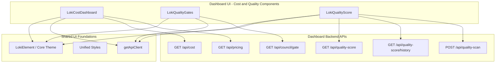
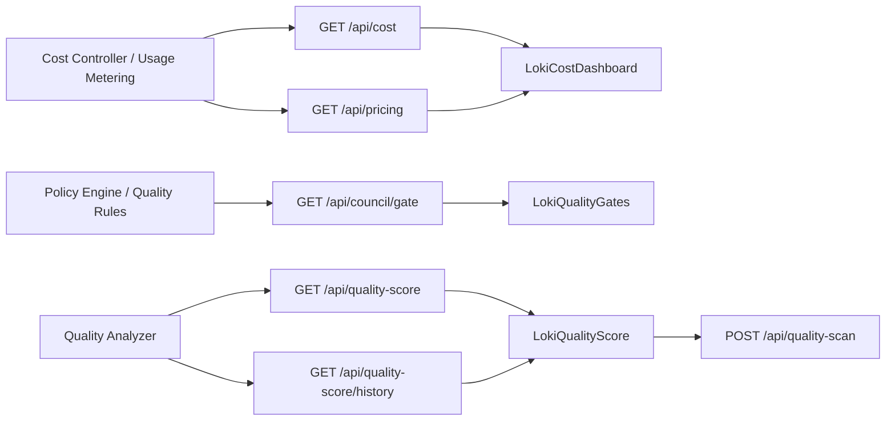
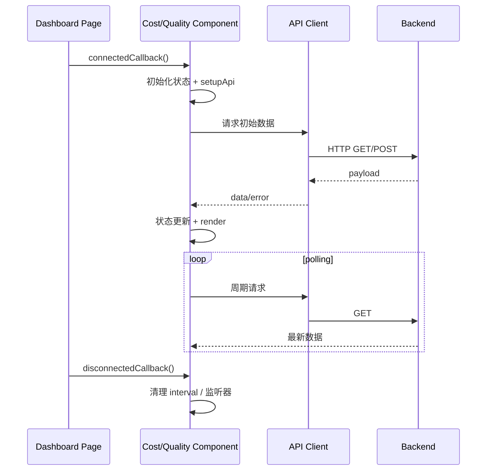

# Cost and Quality Components 模块文档

## 1. 模块定位与设计目标

`Cost and Quality Components` 是 Dashboard UI 中专门承载“成本治理 + 质量治理”可视化的组件组，核心由三个 Web Components 组成：

- `LokiCostDashboard`
- `LokiQualityGates`
- `LokiQualityScore`

这个模块存在的根本原因，是把运行系统中最容易被割裂的三类信号统一到同一操作视图中：**资源消耗（token / USD）**、**放行状态（quality gates）**、**质量趋势（score + findings）**。如果只有成本，没有质量，团队容易“省钱但降质”；如果只有质量，没有成本，团队容易“质量提高但预算失控”。该模块通过并列展示三个维度，帮助开发者、平台工程师和运营角色进行平衡决策。

从设计上，它采用了 Dashboard UI 体系里一致的实现范式：继承 `LokiElement` 获得主题与样式能力，使用统一 API client 拉取后端数据，组件内部自行轮询并在卸载时清理资源。这一范式使其可以稳定嵌入 Overview 页面、运维页面或租户控制台，并与其它 UI 模块保持一致行为。

---

## 2. 架构总览



该架构体现了一个重要边界：**前端组件只负责拉取与展示，不负责业务计算**。成本估算、门禁判断、质量分析都由后端完成，前端通过统一契约消费结果。这样既降低前端复杂度，也减少“前后端规则不一致”的风险。

### 2.1 组件交互与数据流



在实际运行中，`LokiQualityScore` 还能通过 `Run Scan` 主动触发扫描（`POST /api/quality-scan`），因此它不仅是“读数据组件”，也是“轻控制组件”。

---

## 3. 子模块职责总览（含交叉引用）

### 3.1 成本仪表：`LokiCostDashboard`

该组件负责 token 与成本观测的全链路展示，包括总量卡片、按模型/阶段分解、预算进度条和定价参考。它每 5 秒轮询成本数据，并在页面不可见时暂停轮询以降低资源占用。组件对 `/api/pricing` 失败有默认价格回退策略，保证面板在部分后端降级时仍可工作。

详细文档：[`cost_dashboard_component.md`](cost_dashboard_component.md)

### 3.2 门禁看板：`LokiQualityGates`

该组件将 gate 状态映射为 pass/fail/pending 三色卡片，并提供聚合摘要（通过/失败/待定数量）。它每 30 秒刷新一次，并通过 `JSON.stringify` 快照比较避免无变化时重复重绘。该组件适合“是否允许继续执行/合并/发布”的即时判断场景。

详细文档：[`quality_gates.md`](quality_gates.md)

### 3.3 质量评分：`LokiQualityScore`

该组件展示质量总分、A-F 等级、分类评分条、严重级别 findings 和历史趋势 sparkline。它并发拉取当前分与历史分，使用 `Promise.allSettled` 降低单接口失败对整体展示的影响，并支持用户手动触发扫描。若后端未提供 Rigour 能力，会进入“未安装引擎”提示分支。

详细文档：[`quality_score.md`](quality_score.md)

---

## 4. 运行机制与生命周期



三个组件都遵循“挂载即拉取、轮询更新、卸载清理”的模式，但轮询间隔不同（5s/30s/60s），反映了成本、门禁、评分三类信号的时效性差异。

---

## 5. 使用与配置指引

### 5.1 最小接入示例

```html
<loki-cost-dashboard api-url="http://localhost:57374" theme="dark"></loki-cost-dashboard>
<loki-quality-gates api-url="http://localhost:57374" theme="dark"></loki-quality-gates>
<loki-quality-score api-url="http://localhost:57374" theme="dark"></loki-quality-score>
```

### 5.2 通用属性

- `api-url`：后端 API 基地址（默认 `window.location.origin`）
- `theme`：主题模式（典型值 `light` / `dark`）

### 5.3 运维建议

建议在同一页面统一设置 `api-url`，避免跨组件指向不同后端导致观测口径不一致。对于大屏或长时间运行页面，建议配合后端缓存策略与限流策略，防止高频轮询在大规模租户下造成额外压力。

---

## 6. 与其他模块的关系（避免重复说明）

本模块本身不实现成本控制策略或质量判定策略，而是消费其他模块的结果。理解整体链路时建议配套阅读：

- UI 基础能力：[`Core Theme.md`](Core Theme.md), [`Unified Styles.md`](Unified Styles.md)
- 后端 API 面与契约：[`Dashboard Backend.md`](Dashboard Backend.md)
- 策略与门控来源：[`Policy Engine.md`](Policy Engine.md), [`Policy Engine - Approval Gate.md`](Policy Engine - Approval Gate.md)
- UI 组件总览：[`Dashboard UI Components.md`](Dashboard UI Components.md)

---

## 7. 错误处理、边界条件与限制

该模块整体采用“可用优先”的降级思路：接口失败时尽可能展示已有信息或空状态，而不是抛异常中断页面。常见行为包括：

- 成本接口不可用时，`LokiCostDashboard` 显示连接提示。
- 定价接口失败时，`LokiCostDashboard` 回退默认价格。
- 门禁接口失败时，`LokiQualityGates` 展示错误横幅并保留已有数据。
- 评分接口 404 或 not installed 时，`LokiQualityScore` 显示 Rigour 未安装提示。

已知限制主要有三类：

1. 轮询频率当前主要在组件内部硬编码，外部可调能力有限。  
2. 某些组件采用 `innerHTML` 全量重绘，极高刷新密度下可能有额外重排成本。  
3. 门禁和评分的字段兼容虽有兜底，但若后端契约发生较大漂移，前端只能降级显示默认值。

---

## 8. 扩展建议

若要扩展 `Cost and Quality Components`，推荐沿用现有的“单组件单职责”边界：

- 在成本组件中增加筛选/导出，不引入策略计算；
- 在门禁组件中增加详情跳转，不把 gate 判定迁入前端；
- 在评分组件中增加时间窗与比较视图，不复制后端评分引擎逻辑。

这样可以保持模块稳定性，减少与后端治理逻辑的耦合，并让前后端职责继续清晰分离。

---

## 9. 文档导航

- 主模块文档（本文件）：`Cost and Quality Components.md`
- 子模块细化文档（由生成流程产出并与本文件保持交叉引用）：
  - [`cost_dashboard_component.md`](cost_dashboard_component.md)
  - [`quality_gates_component.md`](quality_gates_component.md)
  - [`quality_score_component.md`](quality_score_component.md)

如果你是第一次接触该模块，建议先读本文件的架构与边界，再按上述三个子文档逐个深入实现细节。