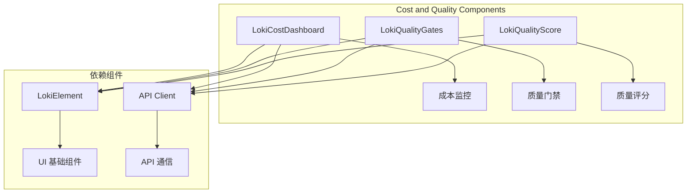

# Cost and Quality Components 模块文档

## 概述

Cost and Quality Components 模块是 Dashboard UI Components 的核心子模块，提供了一套完整的成本监控和质量评估组件，帮助用户实时跟踪 AI 系统的运行成本和代码质量指标。该模块包含三个主要组件：LokiCostDashboard、LokiQualityGates 和 LokiQualityScore，分别负责成本监控、质量门禁和质量评分功能。

### 设计理念

该模块的设计遵循以下原则：
- **实时性**：通过定时轮询机制确保数据的实时更新
- **可视化**：采用直观的图表和卡片式设计，便于快速理解关键指标
- **模块化**：每个组件独立封装，可单独使用或组合使用
- **可扩展**：支持自定义 API 接口和主题配置

## 架构概览



### 组件关系

Cost and Quality Components 模块的三个核心组件都继承自 LokiElement 基类，并使用统一的 API 客户端进行数据通信。每个组件都有独立的数据获取和渲染逻辑，但共享相同的主题系统和错误处理机制。

## 核心组件

### LokiCostDashboard

LokiCostDashboard 是一个成本监控组件，提供了全面的 AI 系统使用成本追踪功能。它显示代币使用量、按模型和阶段划分的成本估计、预算跟踪以及实时更新的 API 定价参考网格。

**主要功能：**
- 实时显示总代币使用量和成本估计
- 按模型和阶段统计成本分布
- 预算监控和进度条可视化
- API 定价参考表
- 自动轮询更新（每 5 秒）

**使用示例：**
```html
<loki-cost-dashboard api-url="http://localhost:57374" theme="dark"></loki-cost-dashboard>
```

详细信息请参考 [LokiCostDashboard 文档](LokiCostDashboard.md)。

### LokiQualityGates

LokiQualityGates 组件提供了质量门禁状态的可视化展示，以彩色编码卡片的形式显示所有质量门禁的状态。绿色表示通过，红色表示失败，黄色表示待处理。

**主要功能：**
- 显示所有质量门禁的状态
- 状态摘要统计
- 自动刷新（每 30 秒）
- 支持自定义 API 接口

**使用示例：**
```html
<loki-quality-gates api-url="http://localhost:57374" theme="dark"></loki-quality-gates>
```

详细信息请参考 [LokiQualityGates 文档](LokiQualityGates.md)。

### LokiQualityScore

LokiQualityScore 组件展示了质量评分趋势，包括类别细分、严重性发现和迷你折线图可视化。它通过轮询获取当前质量评分和历史数据。

**主要功能：**
- 显示当前质量评分和等级（A-F）
- 类别细分评分（安全性、代码质量、合规性、最佳实践）
- 严重性发现统计
- 历史趋势迷你折线图
- 手动触发质量扫描
- 自动轮询更新（每分钟）

**使用示例：**
```html
<loki-quality-score api-url="http://localhost:57374"></loki-quality-score>
```

详细信息请参考 [LokiQualityScore 文档](LokiQualityScore.md)。

## API 接口要求

### 成本监控 API

LokiCostDashboard 组件需要以下 API 接口：

1. **GET /api/cost** - 获取成本数据
   - 返回：包含总代币数、成本估计、按模型和阶段的成本数据等

2. **GET /api/pricing** - 获取定价信息
   - 返回：包含模型定价、更新时间、提供商等信息

### 质量门禁 API

LokiQualityGates 组件需要以下 API 接口：

1. **GET /api/council/gate** - 获取质量门禁状态
   - 返回：包含门禁列表、状态、描述、最后检查时间等

### 质量评分 API

LokiQualityScore 组件需要以下 API 接口：

1. **GET /api/quality-score** - 获取当前质量评分
   - 返回：包含总分、类别评分、发现统计等

2. **GET /api/quality-score/history** - 获取历史评分数据
   - 返回：包含历史评分数组

3. **POST /api/quality-scan** - 触发质量扫描
   - 请求：空对象
   - 返回：扫描结果

## 配置选项

### 通用属性

所有组件都支持以下属性：

- **api-url**：API 基础 URL（默认：window.location.origin）
- **theme**：主题设置，可选 "light" 或 "dark"（默认：自动检测）

### 组件特定配置

每个组件都有自己的内部配置，如轮询间隔、默认定价等，但这些通常不需要用户直接配置。

## 主题系统

Cost and Quality Components 模块使用 Loki 主题系统，支持自定义 CSS 变量：

- **--loki-bg-card**：卡片背景色
- **--loki-border**：边框颜色
- **--loki-text-primary**：主要文本颜色
- **--loki-text-muted**：次要文本颜色
- **--loki-accent**：强调色
- **--loki-success**：成功状态颜色（绿色）
- **--loki-warning**：警告状态颜色（黄色）
- **--loki-error**：错误状态颜色（红色）

## 错误处理和限制

### 错误处理

所有组件都内置了错误处理机制：
- API 请求失败时会显示友好的错误信息
- 保持组件可用，不会导致整个页面崩溃
- 自动重试机制（通过轮询）

### 已知限制

1. **LokiQualityScore 依赖 Rigour 分析引擎**：如果未安装 Rigour，组件将显示安装提示
2. **API 可用性**：组件依赖后端 API，API 不可用时会显示离线状态
3. **数据格式**：API 返回的数据格式需要符合组件预期格式

## 与其他模块的关系

Cost and Quality Components 模块与以下模块有紧密关系：

- **Dashboard UI Components - Core Theme**：提供主题系统和基础组件
- **Dashboard Backend**：提供 API 接口和数据服务
- **Policy Engine**：质量门禁和成本控制可能与策略引擎相关联

更多信息请参考相关模块的文档：
- [Dashboard UI Components](Dashboard UI Components.md)
- [Dashboard Backend](Dashboard Backend.md)
- [Policy Engine](Policy Engine.md)

### 子模块文档

本模块包含以下详细的子模块文档：

- [LokiCostDashboard 文档](LokiCostDashboard.md)：成本监控组件的详细说明和使用指南
- [LokiQualityGates 文档](LokiQualityGates.md)：质量门禁组件的详细说明和使用指南
- [LokiQualityScore 文档](LokiQualityScore.md)：质量评分组件的详细说明和使用指南

## 扩展和自定义

### 自定义 API 客户端

组件使用 `getApiClient()` 函数获取 API 客户端，可以通过替换该函数来实现自定义 API 通信逻辑。

### 自定义样式

组件使用 Shadow DOM 封装样式，但可以通过 CSS 变量和主题系统进行自定义。

### 添加新组件

可以基于 LokiElement 基类创建新的成本和质量相关组件，遵循现有组件的设计模式。

## 总结

Cost and Quality Components 模块提供了一套完整的成本监控和质量评估解决方案，帮助用户实时跟踪 AI 系统的运行成本和代码质量。通过直观的可视化界面和实时数据更新，用户可以快速了解系统状态，及时发现和解决问题。
