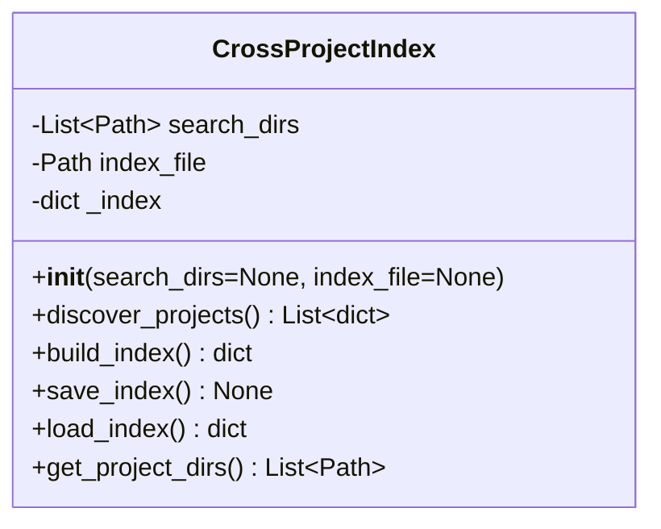
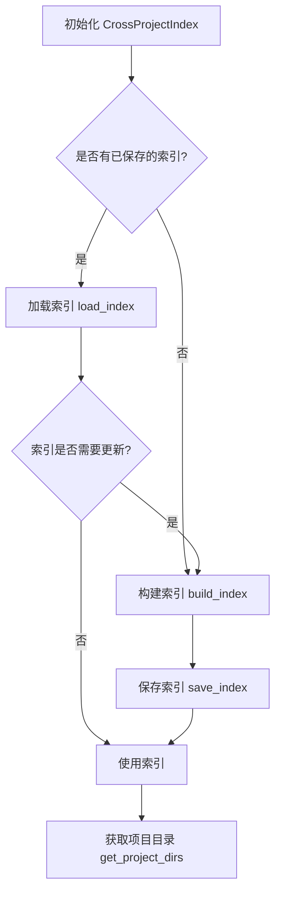
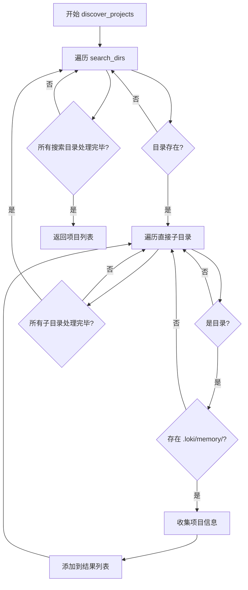

# Cross Project Index 模块文档

## 1. 模块概述

Cross Project Index 模块是 Memory System 的重要组成部分，主要用于发现、索引和管理跨多个项目的记忆存储。该模块提供了一种统一的方式来扫描配置的目录，查找包含 `.loki/memory/` 目录的项目，并构建一个包含各项目记忆统计信息的综合索引。

### 1.1 设计目的

在多项目开发环境中，开发者通常在多个项目间切换工作，每个项目都可能积累了自己的记忆数据（如 episodic memory、semantic patterns 和 procedural skills）。Cross Project Index 模块的设计目的就是：

- **统一发现**：自动扫描配置目录，发现所有启用记忆系统的项目
- **集中索引**：构建跨项目的记忆索引，提供项目级别的记忆统计概览
- **高效管理**：支持索引的保存和加载，避免重复扫描
- **便于集成**：为上层应用（如 Dashboard）提供项目记忆数据的统一访问接口

### 1.2 与其他模块的关系

Cross Project Index 模块是 Memory System 的基础组件，与其他模块的关系如下：

- 依赖 Memory System 的底层存储结构（`.loki/memory/` 目录及其子目录）
- 为 Memory System 的 [Unified Memory Access](Memory System.md) 提供项目发现支持
- 为 [Dashboard Backend](Dashboard Backend.md) 提供项目记忆数据
- 与 [Memory Engine](Memory System.md) 配合，提供跨项目记忆访问能力

## 2. 核心组件详解

### 2.1 CrossProjectIndex 类

`CrossProjectIndex` 是该模块的核心类，负责项目发现、索引构建和管理等核心功能。

#### 类定义

```python
class CrossProjectIndex:
    """Discovers and indexes memory across multiple projects."""

    def __init__(self, search_dirs=None, index_file=None):
        self.search_dirs = search_dirs or [
            Path.home() / 'git',
            Path.home() / 'projects',
            Path.home() / 'src',
        ]
        self.index_file = Path(index_file or os.path.expanduser('~/.loki/knowledge/project-index.json'))
        self._index = None
```

#### 初始化参数

| 参数名 | 类型 | 默认值 | 说明 |
|--------|------|--------|------|
| `search_dirs` | `List[Path]` 或 `None` | `[Path.home()/'git', Path.home()/'projects', Path.home()/'src']` | 要搜索的目录列表 |
| `index_file` | `Path` 或 `str` 或 `None` | `~/.loki/knowledge/project-index.json` | 索引文件的存储路径 |

#### 核心方法

##### 2.1.1 discover_projects

发现所有包含 `.loki/memory/` 目录的项目。

```python
def discover_projects(self):
    """Find all projects with .loki/memory/ directories.

    Searches immediate subdirectories (depth=1) of each search dir.

    Returns:
        List of project info dicts with path, name, memory_dir, discovered_at
    """
```

**工作原理**：
1. 遍历 `search_dirs` 中的每个目录
2. 检查目录是否存在，不存在则跳过
3. 在每个搜索目录的直接子目录（深度=1）中查找 `.loki/memory/` 目录
4. 对于找到的每个项目，收集路径、名称、记忆目录路径和发现时间

**返回值**：
项目信息字典列表，每个字典包含：
- `path`: 项目路径（字符串）
- `name`: 项目名称（字符串）
- `memory_dir`: 记忆目录路径（字符串）
- `discovered_at`: 发现时间（UTC ISO 格式字符串）

**注意事项**：
- 只搜索直接子目录，不进行递归搜索
- 搜索目录不存在时会被静默跳过，不会抛出异常

##### 2.1.2 build_index

构建跨项目索引，包含记忆统计信息。

```python
def build_index(self):
    """Build a cross-project index with memory statistics.

    Returns:
        Index dict with projects list and aggregate counts
    """
```

**工作原理**：
1. 调用 `discover_projects()` 发现所有项目
2. 初始化索引结构，包含项目列表、构建时间和总计数
3. 对每个项目：
   - 定位 `episodic`、`semantic` 和 `skills` 子目录
   - 统计各目录中的 JSON 文件数量
   - 将统计信息添加到项目信息中
   - 更新总计数
4. 保存索引到内部状态 `_index`

**返回值**：
索引字典，结构如下：
```python
{
    'projects': [  # 项目信息列表
        {
            'path': '/path/to/project',
            'name': 'project-name',
            'memory_dir': '/path/to/project/.loki/memory',
            'discovered_at': '2023-01-01T00:00:00Z',
            'episodic_count': 10,  # 事件记忆数量
            'semantic_count': 5,   # 语义模式数量
            'skills_count': 3       # 过程技能数量
        },
        # ... 更多项目
    ],
    'built_at': '2023-01-01T00:00:00Z',  # 索引构建时间
    'total_episodes': 100,   # 总事件记忆数
    'total_patterns': 50,     # 总语义模式数
    'total_skills': 30         # 总过程技能数
}
```

**注意事项**：
- 统计仅基于文件数量，不验证文件内容的有效性
- 如果记忆子目录不存在，对应计数为 0

##### 2.1.3 save_index

将索引保存到磁盘。

```python
def save_index(self):
    """Save index to disk."""
```

**工作原理**：
1. 检查 `_index` 是否为 `None`，如果是则直接返回
2. 确保索引文件的父目录存在（必要时创建）
3. 将 `_index` 序列化为 JSON 并写入文件

**注意事项**：
- 如果没有先调用 `build_index()` 或 `load_index()`，此方法不会执行任何操作
- 使用 `indent=2` 格式化 JSON，便于人类阅读

##### 2.1.4 load_index

从磁盘加载索引。

```python
def load_index(self):
    """Load index from disk."""
```

**工作原理**：
1. 检查索引文件是否存在，不存在则返回 `None`
2. 读取并解析 JSON 文件
3. 将解析结果保存到 `_index` 并返回

**返回值**：
- 成功加载：索引字典（结构同 `build_index()` 返回值）
- 文件不存在：`None`

##### 2.1.5 get_project_dirs

获取已发现项目的目录列表。

```python
def get_project_dirs(self):
    """Return list of discovered project directories as Path objects."""
```

**工作原理**：
1. 检查 `_index` 是否为 `None`，如果是则先调用 `build_index()`
2. 从索引中提取所有项目路径，转换为 `Path` 对象并返回

**返回值**：
`Path` 对象列表，每个代表一个项目目录

## 3. 架构与工作流程

### 3.1 模块架构

Cross Project Index 模块的架构相对简单，主要由单一的 `CrossProjectIndex` 类组成，负责处理所有核心功能。



### 3.2 工作流程

#### 3.2.1 典型使用流程



#### 3.2.2 项目发现流程



## 4. 使用示例

### 4.1 基本使用

```python
from memory.cross_project import CrossProjectIndex
from pathlib import Path

# 使用默认配置初始化
index = CrossProjectIndex()

# 构建索引
project_index = index.build_index()
print(f"发现 {len(project_index['projects'])} 个项目")
print(f"总事件记忆数: {project_index['total_episodes']}")
print(f"总语义模式数: {project_index['total_patterns']}")
print(f"总过程技能数: {project_index['total_skills']}")

# 保存索引
index.save_index()

# 获取项目目录列表
project_dirs = index.get_project_dirs()
for dir in project_dirs:
    print(f"项目目录: {dir}")
```

### 4.2 自定义搜索目录

```python
from memory.cross_project import CrossProjectIndex
from pathlib import Path

# 自定义搜索目录
custom_dirs = [
    Path('/workspace/projects'),
    Path('/home/user/dev')
]

# 自定义索引文件路径
custom_index_file = Path('/workspace/index/my-project-index.json')

# 初始化
index = CrossProjectIndex(search_dirs=custom_dirs, index_file=custom_index_file)

# 尝试加载现有索引
existing_index = index.load_index()

if existing_index:
    print("使用已保存的索引")
else:
    print("构建新索引")
    index.build_index()
    index.save_index()

# 处理项目
for project in index._index['projects']:
    print(f"项目: {project['name']}")
    print(f"  事件记忆: {project['episodic_count']}")
    print(f"  语义模式: {project['semantic_count']}")
    print(f"  过程技能: {project['skills_count']}")
```

### 4.3 定期更新索引

```python
from memory.cross_project import CrossProjectIndex
import time

def update_index_periodically(interval_hours=24):
    """定期更新项目索引"""
    index = CrossProjectIndex()
    
    while True:
        print("更新项目索引...")
        index.build_index()
        index.save_index()
        print(f"索引更新完成，下次更新在 {interval_hours} 小时后")
        time.sleep(interval_hours * 3600)

# 启动定期更新
update_index_periodically(interval_hours=12)
```

## 5. 配置与部署

### 5.1 配置选项

Cross Project Index 模块的配置主要通过初始化参数提供：

1. **搜索目录配置**
   - 默认搜索 `~/git`、`~/projects` 和 `~/src`
   - 可以通过 `search_dirs` 参数自定义
   - 建议配置包含所有开发项目的目录

2. **索引文件配置**
   - 默认保存到 `~/.loki/knowledge/project-index.json`
   - 可以通过 `index_file` 参数自定义
   - 确保有写入权限

### 5.2 部署建议

1. **与 Dashboard 集成**
   - 在 Dashboard Backend 启动时初始化 `CrossProjectIndex`
   - 定期更新索引（如每天一次）
   - 通过 API 暴露索引数据给前端

2. **与 Memory System 集成**
   - 作为 Unified Memory Access 的前置组件
   - 提供项目发现功能
   - 为跨项目记忆检索提供基础

3. **权限管理**
   - 确保对搜索目录有读取权限
   - 确保对索引文件目录有写入权限
   - 在多用户环境中，考虑为每个用户维护独立的索引

## 6. 注意事项与限制

### 6.1 行为约束

1. **搜索深度限制**
   - 只搜索直接子目录（深度=1）
   - 不会递归搜索更深层次的目录
   - 如果项目存储在更深层次，需要调整 `search_dirs`

2. **目录命名约定**
   - 依赖标准的 `.loki/memory/` 目录结构
   - 记忆子目录必须命名为 `episodic`、`semantic` 和 `skills`
   - 记忆文件必须是 JSON 格式

3. **索引更新**
   - 索引不会自动更新，需要显式调用 `build_index()`
   - 建议定期更新以反映项目变化
   - 更新频率取决于项目记忆的变化频率

### 6.2 错误条件

1. **权限问题**
   - 如果没有搜索目录的读取权限，该目录会被静默跳过
   - 如果没有索引文件目录的写入权限，`save_index()` 会抛出异常

2. **路径处理**
   - 路径处理依赖于操作系统的路径分隔符
   - 在 Windows 系统上使用反斜杠，在 Unix 系统上使用正斜杠
   - 建议使用 `Path` 对象处理路径，而不是字符串

3. **JSON 序列化**
   - 索引数据必须是可 JSON 序列化的
   - 自定义扩展索引结构时要注意这一点

### 6.3 已知限制

1. **文件数量统计**
   - 仅基于文件数量统计，不验证文件内容
   - 可能包含无效或损坏的 JSON 文件
   - 不会检查文件是否符合 Memory System 的 schema

2. **性能考虑**
   - 对于大量项目或大目录，`discover_projects()` 可能较慢
   - 建议使用索引缓存（`save_index()`/`load_index()`）
   - 考虑在后台线程中更新索引

3. **并发安全**
   - 该模块不是线程安全的
   - 多线程环境下使用需要额外的同步机制
   - 索引文件的并发写入可能导致数据损坏

## 7. 扩展与集成

### 7.1 扩展索引信息

可以通过继承 `CrossProjectIndex` 类来扩展索引信息：

```python
from memory.cross_project import CrossProjectIndex
from pathlib import Path
import json

class ExtendedCrossProjectIndex(CrossProjectIndex):
    def build_index(self):
        """扩展索引，添加额外的项目信息"""
        index = super().build_index()
        
        # 为每个项目添加额外信息
        for project in index['projects']:
            project_dir = Path(project['path'])
            
            # 添加项目描述（如果存在 README）
            readme = project_dir / 'README.md'
            if readme.exists():
                with open(readme, 'r') as f:
                    # 只取前 200 个字符作为描述
                    project['description'] = f.read(200) + '...'
            
            # 添加最后修改时间
            project['last_modified'] = self._get_dir_last_modified(project_dir)
        
        self._index = index
        return index
    
    def _get_dir_last_modified(self, dir_path):
        """获取目录的最后修改时间"""
        latest = 0
        for item in dir_path.rglob('*'):
            if item.is_file():
                mtime = item.stat().st_mtime
                if mtime > latest:
                    latest = mtime
        return datetime.fromtimestamp(latest, timezone.utc).isoformat() + 'Z'
```

### 7.2 与其他模块集成

#### 7.2.1 与 Unified Memory Access 集成

```python
from memory.cross_project import CrossProjectIndex
from memory.unified_access import UnifiedMemoryAccess

# 初始化索引
index = CrossProjectIndex()
index.load_index() or index.build_index()

# 为每个项目创建 UnifiedMemoryAccess 实例
project_memories = {}
for project in index._index['projects']:
    memory_path = Path(project['memory_dir'])
    project_memories[project['name']] = UnifiedMemoryAccess(memory_path)

# 现在可以跨项目访问记忆
for project_name, memory in project_memories.items():
    print(f"项目 {project_name} 的最近事件:")
    episodes = memory.episodic.get_recent(limit=5)
    for episode in episodes:
        print(f"  - {episode.goal}")
```

#### 7.2.2 与 Dashboard Backend 集成

可以创建 API 端点来暴露项目索引信息：

```python
from fastapi import FastAPI
from memory.cross_project import CrossProjectIndex

app = FastAPI()
index = CrossProjectIndex()

@app.on_event("startup")
async def startup_event():
    """应用启动时加载索引"""
    index.load_index() or index.build_index()

@app.get("/api/projects")
async def get_projects():
    """获取所有项目列表"""
    if index._index is None:
        index.build_index()
    return index._index['projects']

@app.get("/api/projects/stats")
async def get_project_stats():
    """获取项目统计信息"""
    if index._index is None:
        index.build_index()
    return {
        'total_projects': len(index._index['projects']),
        'total_episodes': index._index['total_episodes'],
        'total_patterns': index._index['total_patterns'],
        'total_skills': index._index['total_skills']
    }

@app.post("/api/projects/refresh")
async def refresh_projects():
    """刷新项目索引"""
    index.build_index()
    index.save_index()
    return {'status': 'success', 'message': '项目索引已刷新'}
```

## 8. 总结

Cross Project Index 模块是 Memory System 的重要组成部分，提供了跨项目记忆发现和索引的核心功能。通过该模块，开发者可以：

- 自动发现配置目录下所有启用记忆系统的项目
- 构建包含记忆统计信息的综合索引
- 保存和加载索引，提高效率
- 为上层应用提供统一的项目记忆数据访问接口

虽然该模块设计简单，但它为整个系统的跨项目记忆访问提供了基础支撑。在实际应用中，可以根据需要扩展其功能，如添加更多项目信息、优化性能、增强错误处理等。

对于需要了解更多相关模块信息的开发者，建议参考以下文档：
- [Memory System](Memory System.md) - 了解完整的记忆系统架构
- [Dashboard Backend](Dashboard Backend.md) - 了解如何将项目索引集成到 Dashboard
