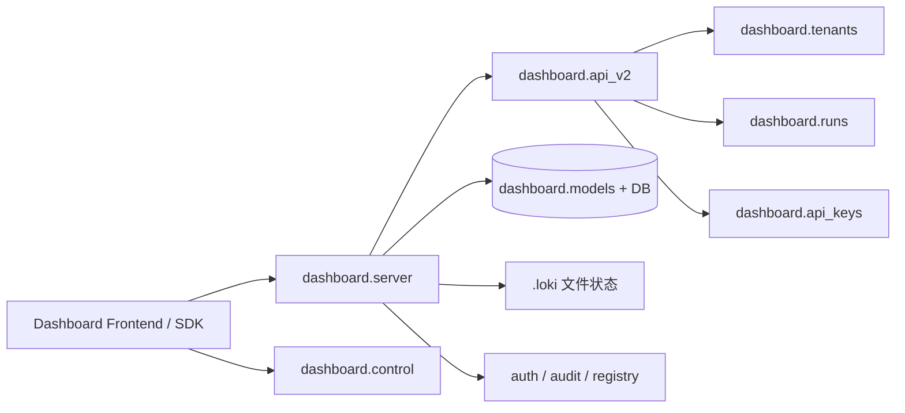

# Dashboard Backend.md

## 这块后端到底在解决什么问题？

如果把 Loki Mode 想象成一条“自动化生产线”，那 **Dashboard Backend** 就是这条线的“中控室 + 记账系统 + 监管台”。

它存在的根本原因不是“提供几个 CRUD 接口”，而是要同时解决三类冲突目标：

1. **运行态控制**：会话（session）要能 start/stop/pause/resume，且要看得到实时状态；
2. **业务态管理**：项目、任务、租户、run、API key、策略、审计这些治理对象要可管理；
3. **可观测与可恢复**：系统大量状态并不都在数据库里，还在 `.loki/` 文件中，后端必须把“文件事实”与“数据库事实”拼成一个可操作视图。

换句话说，这个模块是一个 **control-plane backend**：它本身不负责执行 AI 任务，而是负责让执行过程“可控、可见、可追责”。

---

## 心智模型：把它看成“双账本中枢”

理解这个模块最有效的方式，是记住它有两套状态来源：

- **结构化账本（SQLAlchemy + DB）**：`Tenant/Project/Task/Run/...` 等长期实体；
- **运行时账本（.loki 文件树）**：`dashboard-state.json`、`events.jsonl`、`PAUSE/STOP`、`metrics/*` 等瞬时状态与信号。

`dashboard.server` 做的核心工作是：
- 对外暴露统一 API；
- 在请求路径里选择“该读 DB 还是读文件”；
- 在修改动作后广播（`ConnectionManager.broadcast`）并写审计（`audit.log_event`）。

可以把它类比为机场塔台：
- DB 是飞行计划系统（结构化、可审计），
- `.loki` 文件是雷达与实时航迹（高频、近实时），
- Dashboard Backend 是塔台调度员，把两边信息整合给前端和 SDK。

---

## 架构总览

### 图解（按请求路径）

- **主入口**是 `dashboard.server`：大部分 `/api/*` 路由在这里，WebSocket 也在这里；
- **治理型 API**聚合在 `dashboard.api_v2`，但它并不重复实现业务，而是调用 `tenants.py` / `runs.py` / `api_keys.py`；
- **会话控制**有独立应用 `dashboard.control`，强调进程与文件信号控制；
- **数据落点**有两类：
  - DB（通过 `dashboard.models` + `get_db`），
  - `.loki` 文件（运行时状态、日志、指标、checkpoint、通知等）。

这种设计不是“混乱”，而是有意折中：执行系统本来就是文件驱动，Dashboard 需要尊重这个事实，而不是强行把一切塞进数据库。

---

## 关键数据流（端到端）

### 1) Run 创建到审计：`POST /api/v2/runs`

路径：
1. `dashboard.api_v2.create_run` 做 scope 校验（`auth.require_scope("control")`）；
2. 调用 `runs_mod.create_run`（即 `dashboard.runs.create_run`）；
3. `runs.create_run` 创建 `Run` ORM，`flush` 后用 `selectinload(Run.events)` 回读；
4. 转成 `RunResponse` 返回；
5. `api_v2` 同步调用 `audit.log_event` 记录 `resource_type="run"`。

设计意图：
- 业务写入与审计记录同路发生，降低“有操作无审计”的概率；
- `selectinload` 避免 async 环境下 lazy-load 陷阱。

### 2) API Key 轮换：`POST /api/v2/api-keys/{identifier}/rotate`

路径：
1. `api_v2.rotate_api_key` 接收 `ApiKeyRotateRequest`；
2. 调用 `api_keys.rotate_key`；
3. `rotate_key` 先 `_find_token_entry`，校验 revoked / 已轮换状态；
4. 先给旧 key 打 `rotation_expires_at` 并临时改名 `__rotating`，再 `auth.generate_token` 生成新 key；
5. 成功后写 `rotating_from`，拷贝 `description/allowed_ips/rate_limit` 元数据；
6. 失败则回滚旧 key 名称与 rotation 标记。

设计意图：
- 这是“热切换”而不是“断电换件”：旧 key 在宽限期继续可用，保证客户端平滑迁移；
- 用“先标记旧 key，再生成新 key”的顺序，避免重名约束冲突。

### 3) 会话控制：`POST /api/control/stop`（control.py）

路径：
1. 写 `.loki/STOP`（文件信号，runner 可感知）；
2. 尝试读取 `.loki/loki.pid` 并发 `SIGTERM`；
3. 若 `session.json` 存在，写 `status=stopped`，使用 `atomic_write_json`；
4. `emit_event("session_stop", ...)` 到 `events.jsonl`。

设计意图：
- 采用“文件信号 + 进程信号”双保险；
- `atomic_write_json` + lock 是为了降低并发状态写损坏风险。

### 4) WebSocket 实时广播

- 前端连接 `/ws`，由 `ConnectionManager.connect` 管理；
- 项目/任务变化后，REST handler 调用 `manager.broadcast({...})`；
- `broadcast` 对失败连接做摘除，避免连接泄漏。

隐含契约：
- 广播消息是轻量事件，不保证强一致补偿；前端需把它当“增量提示”，必要时回源 REST。

---

## 非显而易见的设计取舍

### 取舍 1：为什么不全量数据库化？

**已选方案**：DB + 文件混合。  
**替代方案**：所有状态入库。

权衡：
- 全量入库更整洁，但会与现有执行器（`run.sh`、信号文件、jsonl 事件）脱节；
- 混合模式让运行态信息能“无阻塞落地”，代价是读取逻辑分散、数据一致性更依赖约定。

### 取舍 2：为什么 `api_v2` 不是独立服务？

**已选方案**：在 `server.py` 中 `app.include_router(api_v2_router)`。  
**替代方案**：拆成单独进程。

权衡：
- 单进程共用 `auth/audit/get_db` 依赖，减少运维与部署复杂度；
- 代价是路由规模膨胀，`server.py` 变大，模块边界需要文档与约定维持。

### 取舍 3：为什么内存限流（`_RateLimiter`）？

**已选方案**：进程内 `defaultdict(list)`。  
**替代方案**：Redis/网关级限流。

权衡：
- 当前实现零外部依赖，足够本地/单实例；
- 多副本部署时不共享计数，不是严格全局限流。

### 取舍 4：Run 查询为何普遍 `selectinload(Run.events)`？

**已选方案**：显式 eager loading。  
**替代方案**：按需 lazy load。

权衡：
- 在 async SQLAlchemy 场景中，lazy load 常导致上下文错误或隐式 IO；
- eager 稍增查询成本，但行为更可预测，接口稳定性更高。

---

## 新同学最该注意的隐式契约与坑

1. **状态来源不唯一**：`/api/status` 与 `Project/Task` 接口并非都来自同一存储，调试要先分清“文件态 vs DB 态”。
2. **取消/重放语义要看实现**：`runs.cancel_run` 对终态 run 返回 `None`；`api_v2.cancel_run` 会映射成 404（语义上更像“不可取消”而非“未找到”）。
3. **`tenants.update_tenant` 会重算 slug**：更新 name 会改 slug，若外部把 slug 当稳定标识，需要额外约束。
4. **WebSocket token 在 query 参数**：`/ws?token=...` 是浏览器限制下的折中，生产环境要处理日志脱敏。
5. **文件写入原子性不等于事务一致性**：`atomic_write_json` 保护单文件，但跨文件更新仍可能部分成功。
6. **策略评估是轻量实现**：`api_v2.evaluate_policy` 是基于 `rules` 的简单匹配，不等同于完整策略引擎语义。
7. **迁移引擎有严格 phase gate**：`MigrationPipeline.advance_phase` 会检查门禁条件，跳阶段会失败。

---

## 子模块导读（深入阅读顺序）

1. **API 边界与传输层**：`[api_surface_and_transport.md](api_surface_and_transport.md)`  
   聚焦 `dashboard.server`：REST/WebSocket、连接管理、限流、静态资源、系统观测与控制 API。

2. **V2 治理 API**：`[v2_admin_and_governance_api.md](v2_admin_and_governance_api.md)`  
   解释 `dashboard.api_v2` 如何把 tenants/runs/api_keys/policies/audit 编排为统一治理面。

3. **API Key 生命周期**：`[api_key_management.md](api_key_management.md)`  
   重点看 `rotate_key` 的宽限期与回滚逻辑。

4. **会话运行时控制**：`[session_control_runtime.md](session_control_runtime.md)`  
   关注 `StartRequest` 校验、文件信号协议与 SSE。

5. **迁移编排内核**：`[migration_orchestration.md](migration_orchestration.md)`  
   重点是 `MigrationPipeline` 的 manifest、phase gate、checkpoint。

6. **领域模型与持久化**：`[domain_models_and_persistence.md](domain_models_and_persistence.md)`  
   了解枚举状态、关系、级联策略与数据边界。

7. **Run 生命周期**：`[run_lifecycle_management.md](run_lifecycle_management.md)`  
   看 `Run/RunEvent` 的 JSON 编解码、时间线与状态机。

8. **租户上下文**：`[tenant_context_management.md](tenant_context_management.md)`  
   看 slug 规则、settings 序列化、tenant-project 查询路径。

---

## 与其他模块的耦合关系（按依赖强弱）

- **强耦合**
  - [Dashboard Frontend](Dashboard Frontend.md)：大量 REST + `/ws` 事件协议直接消费；
  - [Python SDK](Python SDK.md)、[TypeScript SDK](TypeScript SDK.md)：类型契约与状态语义需要保持兼容。

- **中等耦合**
  - [Audit](Audit.md)：几乎所有治理动作通过 `audit.log_event` 留痕；
  - [Policy Engine](Policy Engine.md)：`/api/v2/policies` 与 `/policies/evaluate` 提供策略配置与轻评估入口。

- **文件契约耦合**
  - [Memory System](Memory System.md)：`/api/memory/*` 读取 `.loki/memory/*` 文件；
  - [Swarm Multi-Agent](Swarm Multi-Agent.md)：`/api/agents`、`/api/status` 通过 `.loki/state` 与 `dashboard-state.json` 观察代理运行态。

这意味着：只要上游模块改动 `.loki` 文件结构，Dashboard Backend 即使“代码没报错”，语义也可能悄悄漂移。

---

## 给新贡献者的实操建议

- 改接口前先确认：该接口是 DB 驱动还是文件驱动；
- 新增写操作时，优先补齐 `audit.log_event`；
- 在 async DB 路径避免隐式 lazy load，优先 `selectinload`；
- 对外输入（id/path）延续现有 sanitize 模式（如 `_sanitize_agent_id`、migration id regex）；
- 任何“看起来只是状态字段”的改动，都要验证前端组件与 SDK 是否依赖该字段名称/枚举值。

如果你只记住一句话：**Dashboard Backend 的难点不在单个 endpoint，而在“多状态源 + 治理一致性”的系统性约束。**