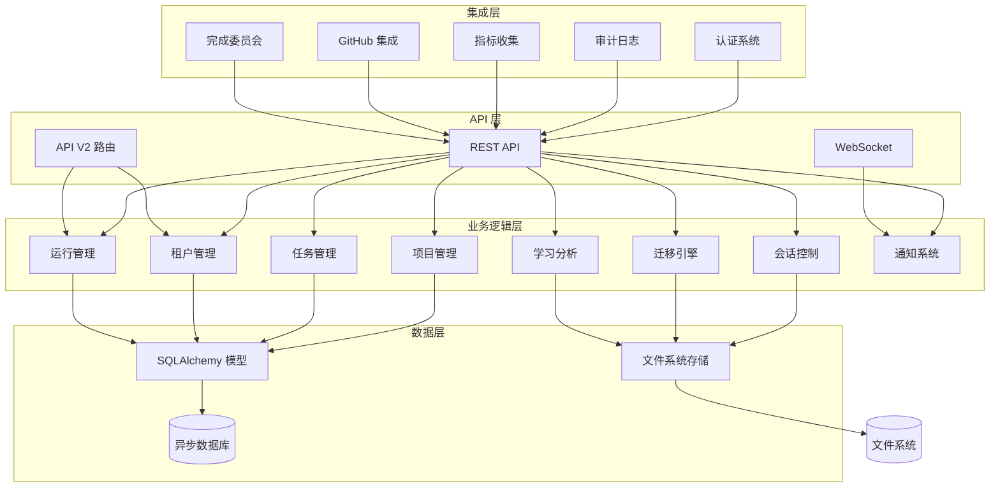

# Dashboard Backend 模块文档

## 概述

Dashboard Backend 是 Loki Mode 系统的核心后端服务，提供完整的项目管理、任务跟踪、会话控制和数据分析功能。该模块采用 FastAPI 构建，提供 RESTful API 和 WebSocket 实时通信，支持多租户隔离、企业级安全特性和丰富的集成能力。

### 设计理念

Dashboard Backend 的设计遵循以下核心原则：

1. **分层架构**：清晰分离 API 层、业务逻辑层和数据访问层
2. **异步优先**：采用异步 I/O 模型提高并发性能
3. **文件与数据库混合存储**：结合文件系统的实时性和数据库的结构化查询能力
4. **可扩展性**：模块化设计支持功能的渐进式增强
5. **企业级安全**：内置认证、授权、审计和多租户支持

## 架构概览



### 核心组件说明

#### 1. API 服务器 (server.py)
API 服务器是整个 Dashboard Backend 的入口点，提供：
- RESTful API 端点用于项目、任务、会话等管理
- WebSocket 连接用于实时更新
- 静态文件服务用于前端界面
- 健康检查和指标端点

关键特性包括速率限制、CORS 配置、TLS 支持和企业级认证集成。

#### 2. 会话控制 (control.py)
会话控制模块负责 Loki Mode 会话的生命周期管理：
- 启动、停止、暂停和恢复会话
- 实时状态监控和事件流
- 进程管理和信号处理
- 日志收集和流式传输

该模块直接与文件系统交互，读取和写入 `.loki/` 目录下的状态文件。

#### 3. 数据模型 (models.py)
数据模型定义了系统的核心实体结构：
- **Tenant**: 多租户隔离的根实体
- **Project**: 代表一个 Loki Mode 项目
- **Task**: 项目内的任务，支持看板式管理
- **Session**: 执行会话，包含代理和运行
- **Agent**: AI 代理实例
- **Run**: RARV 执行运行，带时间线事件

所有模型使用 SQLAlchemy 2.0 异步风格定义。

#### 4. 多租户支持 (tenants.py)
多租户模块提供租户级别的项目隔离：
- 租户创建、更新和删除
- 自动生成 URL 安全的 slug
- 租户配置管理
- 租户与项目的关联

#### 5. 运行管理 (runs.py)
运行管理模块处理 RARV 执行运行的生命周期：
- 运行创建和查询
- 运行取消和重放
- 时间线事件跟踪
- 运行状态更新

#### 6. API 密钥管理 (api_keys.py)
API 密钥模块提供企业级密钥管理：
- 密钥创建和撤销
- 密钥轮换，支持宽限期
- 使用统计和元数据管理
- 过期密钥清理

#### 7. API V2 (api_v2.py)
API V2 模块提供新一代 REST API 端点：
- 租户管理端点
- 运行管理端点
- API 密钥管理端点
- 策略管理端点
- 审计日志端点

#### 8. 迁移引擎 (migration_engine.py)
迁移引擎是企业级代码转换功能的核心：
- 迁移管道管理
- 阶段门控和检查点
- 功能跟踪和验证
- 成本估算和计划生成

## 子模块文档

Dashboard Backend 包含以下子模块，详细文档请参考各自的文件：

- [API 密钥管理](API Keys.md) - API 密钥的创建、轮换和使用跟踪
- [API V2](API V2.md) - 新一代 REST API 端点
- [会话控制](Session Control.md) - Loki Mode 会话的生命周期管理
- [迁移引擎](Migration Engine.md) - 企业级代码转换功能
- [数据模型](Data Models.md) - SQLAlchemy 模型定义和关系
- [运行管理](Run Management.md) - RARV 执行运行的管理
- [多租户支持](Multi-Tenancy.md) - 租户级别的项目隔离

## 与其他模块的关系

Dashboard Backend 在整个 Loki Mode 系统中扮演核心枢纽角色：

- **与 Dashboard Frontend 的交互**：提供 REST API 和 WebSocket 连接，供前端界面调用
- **与 API Server & Services 的协作**：利用 EventBus、StateWatcher 等服务
- **与 Memory System 的集成**：提供内存系统的查询和管理端点
- **与 Swarm Multi-Agent 的通信**：监控和管理代理集群
- **与 Python SDK / TypeScript SDK 的对接**：为 SDK 提供后端 API 支持

## 快速开始

### 配置

Dashboard Backend 支持以下环境变量配置：

| 环境变量 | 描述 | 默认值 |
|---------|------|--------|
| `LOKI_DIR` | Loki 数据目录 | `.loki` |
| `LOKI_DASHBOARD_HOST` | 服务器监听地址 | `127.0.0.1` |
| `LOKI_DASHBOARD_PORT` | 服务器监听端口 | `57374` |
| `LOKI_DASHBOARD_CORS` | CORS 允许的源 | `http://localhost:57374,http://127.0.0.1:57374` |
| `LOKI_TLS_CERT` | TLS 证书路径 | 未设置 |
| `LOKI_TLS_KEY` | TLS 私钥路径 | 未设置 |
| `LOKI_ENTERPRISE_AUTH` | 启用企业认证 | `false` |
| `LOKI_AUDIT_DISABLED` | 禁用审计日志 | `false` |

### 启动服务器

使用 Python 直接启动：

```python
from dashboard.server import run_server

run_server(host="0.0.0.0", port=57374)
```

或使用 uvicorn：

```bash
uvicorn dashboard.server:app --host 0.0.0.0 --port 57374
```

或使用 Loki CLI：

```bash
loki dashboard start
```

### 基本使用示例

#### 1. 创建项目

```python
import requests

response = requests.post(
    "http://localhost:57374/api/projects",
    json={
        "name": "My Project",
        "description": "A sample Loki Mode project",
        "prd_path": "./prd.md"
    }
)
project = response.json()
```

#### 2. 启动会话

```python
response = requests.post(
    "http://localhost:57374/api/control/start",
    json={
        "provider": "claude",
        "parallel": True,
        "background": True
    }
)
```

#### 3. WebSocket 实时更新

```javascript
const ws = new WebSocket("ws://localhost:57374/ws");
ws.onmessage = (event) => {
    const data = JSON.parse(event.data);
    console.log("Received update:", data);
};
```

## 安全考虑

Dashboard Backend 包含多层安全机制：

1. **认证**：支持 API 密钥、企业令牌和 OIDC/SSO
2. **授权**：基于范围的访问控制
3. **审计**：完整的操作审计日志
4. **多租户**：租户级数据隔离
5. **速率限制**：防止 API 滥用
6. **CORS**：严格的跨域控制

生产环境部署时，建议：
- 启用 TLS
- 配置企业认证
- 限制网络访问
- 定期轮换 API 密钥
- 监控审计日志

## 性能考虑

Dashboard Backend 采用多种优化技术：

1. **异步 I/O**：使用 asyncio 和异步数据库驱动
2. **连接池**：数据库和 WebSocket 连接管理
3. **缓存**：内存缓存常用数据
4. **流式响应**：大文件和日志的流式传输
5. **增量读取**：事件和日志的增量处理

高负载场景下，可以：
- 调整工作进程数
- 配置数据库连接池大小
- 启用响应压缩
- 使用 CDN 服务静态资源

## 监控和可观测性

Dashboard Backend 提供丰富的监控端点：

- `/health` - 健康检查
- `/metrics` - Prometheus 格式指标
- `/api/status` - 系统状态
- `/api/health/processes` - 进程健康状态
- `/api/enterprise/audit` - 审计日志查询

关键监控指标包括：
- 会话状态和迭代数
- 任务分布和完成率
- 代理活跃数和状态
- API 调用速率和延迟
- 成本估算和预算使用

## 扩展和定制

Dashboard Backend 设计为可扩展的系统：

1. **添加 API 端点**：在 server.py 或 api_v2.py 中添加新路由
2. **集成新服务**：创建新的业务逻辑模块
3. **自定义模型**：扩展 models.py 中的数据模型
4. **插件系统**：利用 Plugin System 模块集成新功能
5. **中间件**：添加自定义 FastAPI 中间件

扩展时建议遵循现有代码风格，保持异步优先，并添加适当的测试和文档。

## 故障排除

常见问题和解决方案：

1. **服务器无法启动**：检查端口占用和文件权限
2. **会话状态不同步**：验证 `.loki/` 目录的读写权限
3. **数据库连接错误**：检查数据库配置和网络连接
4. **WebSocket 断开**：检查网络稳定性和代理配置
5. **API 速率限制**：调整速率限制配置或实现重试逻辑

详细的故障排除指南请参考各子模块文档。
