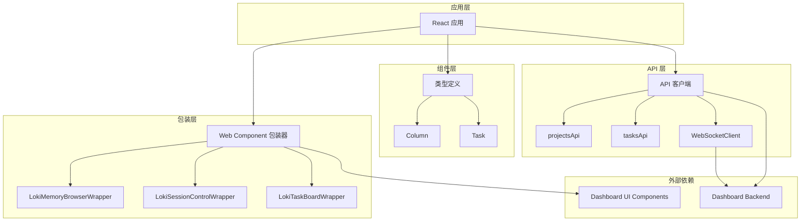

# Dashboard Frontend 模块文档

> 本文档面向新加入的高级工程师：重点解释“为什么这样设计”，并把关键实现细节下钻到数据契约、事件桥接和实时链路。建议先阅读本文，再进入 [api_client_and_realtime.md](api_client_and_realtime.md)、[kanban_type_system.md](kanban_type_system.md)、[web_component_wrappers.md](web_component_wrappers.md)。

## 1. 模块概述

Dashboard Frontend 是一个现代化的 React 前端应用，为 Loki Mode 系统提供直观的用户界面。该模块负责连接 Dashboard Backend 服务，展示任务管理、会话控制、内存浏览等核心功能，并通过 WebSocket 实现实时数据更新。

### 1.1 设计理念

Dashboard Frontend 采用组件化架构设计，将 UI 逻辑与业务逻辑分离。通过 Web Components 技术封装复杂的 UI 组件，提供类型安全的 React 包装器，确保代码的可维护性和可扩展性。模块遵循响应式设计原则，支持多种主题和显示模式，适应不同的使用场景。

### 1.2 核心功能

- **项目与任务管理**：提供 Kanban 风格的任务看板，支持任务创建、编辑、移动和状态更新
- **实时数据同步**：通过 WebSocket 连接实现与后端的实时通信，确保数据一致性
- **会话控制**：提供会话的启动、暂停、恢复和停止功能
- **内存系统浏览**：支持查看和管理 episodic、semantic 和 procedural 内存
- **主题与样式**：支持多种主题切换，包括亮色、暗色和高对比度模式

## 2. 架构设计

Dashboard Frontend 采用分层架构，将应用分为 API 层、组件层和包装层。各层之间通过明确的接口进行通信，确保代码的模块化和可测试性。



### 2.1 架构说明

1. **API 层**：负责与后端服务通信，包括 REST API 调用和 WebSocket 连接。该层封装了所有网络请求逻辑，提供统一的接口供上层使用。

2. **组件层**：定义了应用的核心数据结构和类型，包括任务、列、优先级等。这些类型在整个应用中共享，确保数据的一致性。

3. **包装层**：为 Dashboard UI Components 中的 Web Components 提供类型安全的 React 包装器。这些包装器处理属性绑定、事件处理和类型转换，使 Web Components 可以像普通 React 组件一样使用。

4. **应用层**：组合各个组件和功能，构建完整的用户界面。该层负责状态管理、路由控制和组件协调。

## 3. 核心组件

### 3.1 API 客户端

API 客户端模块 (`api.ts`) 是与后端通信的核心，提供了项目和任务的 CRUD 操作，以及 WebSocket 实时连接功能。

主要功能包括：
- 项目管理：列出、获取、创建和删除项目
- 任务管理：列出、获取、创建、更新、删除和移动任务
- WebSocket 连接：建立和维护与后端的实时通信
- 数据转换：在前端和后端数据格式之间进行转换

详细信息请参考 [api_client_and_realtime.md](api_client_and_realtime.md)。

### 3.2 类型定义

类型定义模块 (`components/types.ts`) 定义了应用中使用的核心数据结构，包括：
- 任务状态和优先级
- 任务类型定义
- 列配置
- 颜色和样式配置

这些类型确保了整个应用中的数据一致性，并提供了良好的开发体验。详细信息请参考 [kanban_type_system.md](kanban_type_system.md)。

### 3.3 Web Component 包装器

Dashboard Frontend 提供了三个主要的 Web Component 包装器，用于集成 Dashboard UI Components 中的功能：

1. **LokiTaskBoardWrapper**：包装任务看板组件，提供 Kanban 风格的任务管理界面
2. **LokiSessionControlWrapper**：将会话控制组件集成到 React 应用中
3. **LokiMemoryBrowserWrapper**：提供内存系统浏览功能的 React 接口

这些包装器处理了 Web Component 与 React 之间的兼容性问题，提供了类型安全的属性和事件处理。详细信息请参考 [web_component_wrappers.md](web_component_wrappers.md)。

## 4. 模块关系

Dashboard Frontend 与其他模块有着紧密的联系：

### 4.1 与 Dashboard Backend 的关系

Dashboard Frontend 通过 REST API 和 WebSocket 与 Dashboard Backend 通信。前端负责展示数据和接收用户输入，后端负责数据存储和业务逻辑处理。

### 4.2 与 Dashboard UI Components 的关系

Dashboard Frontend 使用 Dashboard UI Components 提供的 Web Components 作为其 UI 构建块。通过 React 包装器，这些 Web Components 可以无缝集成到 React 应用中。

### 4.3 与其他模块的关系

Dashboard Frontend 间接依赖于其他模块，如 Memory System 和 Swarm Multi-Agent，但这些交互都是通过 Dashboard Backend 进行的，前端不直接与这些模块通信。

## 5. 使用指南

### 5.1 基本设置

要使用 Dashboard Frontend，您需要：

1. 确保 Dashboard Backend 正在运行
2. 配置正确的 API 端点
3. 初始化 WebSocket 连接

### 5.2 组件使用示例

以下是使用主要组件的示例：

```tsx
import { wsClient, projectsApi, tasksApi } from './api';
import { LokiTaskBoardWrapper } from './components/wrappers/LokiTaskBoardWrapper';
import { LokiSessionControlWrapper } from './components/wrappers/LokiSessionControlWrapper';
import { LokiMemoryBrowserWrapper } from './components/wrappers/LokiMemoryBrowserWrapper';

// 初始化 WebSocket 连接
wsClient.connect();

// 使用任务看板组件
<LokiTaskBoardWrapper
  apiUrl="http://localhost:57374"
  projectId="1"
  theme="dark"
  onTaskMoved={({ taskId, oldStatus, newStatus }) => {
    console.log(`Task ${taskId} moved from ${oldStatus} to ${newStatus}`);
  }}
/>

// 使用会话控制组件
<LokiSessionControlWrapper
  apiUrl="http://localhost:57374"
  theme="dark"
  onSessionStart={(status) => {
    console.log('Session started:', status.mode);
  }}
/>

// 使用内存浏览器组件
<LokiMemoryBrowserWrapper
  apiUrl="http://localhost:57374"
  theme="dark"
  tab="episodes"
  onEpisodeSelect={(episode) => {
    console.log('Selected episode:', episode.id);
  }}
/>
```

更多详细的使用示例和配置选项请参考各子模块的文档。

## 6. 扩展性

Dashboard Frontend 设计具有良好的扩展性，可以通过以下方式进行扩展：

1. **添加新的 Web Component 包装器**：为 Dashboard UI Components 中的新组件创建 React 包装器
2. **扩展 API 客户端**：添加新的 API 端点和数据类型
3. **自定义主题**：创建新的主题配置，扩展应用的外观选项
4. **插件系统**：通过插件机制添加新的功能模块

## 7. 注意事项

### 7.1 错误处理

Dashboard Frontend 提供了统一的错误处理机制，但在使用时仍需注意：
- 网络错误：API 调用可能因网络问题失败，应提供适当的重试机制
- 数据验证：前端应验证用户输入，确保数据格式正确
- WebSocket 重连：当 WebSocket 连接断开时，系统会自动尝试重连，但在网络不稳定时可能需要手动干预

### 7.2 性能考虑

- 大量任务数据：当处理大量任务时，应考虑实现虚拟滚动或分页
- WebSocket 消息频率：高频的 WebSocket 消息可能影响性能，应适当节流
- 组件重渲染：注意避免不必要的组件重渲染，使用 React.memo 和 useMemo 优化性能

### 7.3 浏览器兼容性

Dashboard Frontend 支持现代浏览器，但需要注意：
- Web Components 支持：确保目标浏览器支持 Web Components 或提供适当的 polyfill
- WebSocket 支持：所有现代浏览器都支持 WebSocket，但在某些网络环境下可能被阻止
- CSS 特性：使用的某些 CSS 特性可能需要浏览器前缀或回退方案

## 8. 子模块文档导航（已生成）

为了避免在主文档中重复实现细节，Dashboard Frontend 的实现细节被拆分到以下子模块文档。建议按“API → 类型 → UI 包装器”的顺序阅读，这样可以先理解数据契约，再理解 UI 交互绑定。

- [api_client_and_realtime.md](api_client_and_realtime.md)：REST 与 WebSocket 通信层，重点解释 `apiFetch`、`ApiError`、任务/项目 DTO 转换、`WebSocketClient` 的监听与重连策略。
- [kanban_type_system.md](kanban_type_system.md)：看板领域类型系统，覆盖 `TaskStatus` / `TaskPriority` / `TaskType`、`Task` 与 `Column` 结构及配置常量的用途。
- [web_component_wrappers.md](web_component_wrappers.md)：React 与 Web Components 的桥接层，说明 `IntrinsicElements` 扩展、事件适配、属性映射和包装器的可扩展模式。

> 历史文档仍可参考：
> - [API 客户端.md](API 客户端.md)
> - [类型定义.md](类型定义.md)
> - [Web Component 包装器.md](Web Component 包装器.md)

## 9. 相关模块与系统边界

Dashboard Frontend 并不是一个“孤立的 SPA”，而是 Loki Mode 运行时观测与控制链路的前端入口。建议在阅读本模块时同时结合以下文档理解其上下游边界：

- [Dashboard Backend.md](Dashboard Backend.md)：前端调用的 REST/WebSocket 提供方，定义了任务、项目、运行会话、审计等核心后端契约。
- [Dashboard UI Components.md](Dashboard UI Components.md)：前端包装层所依赖的底层 `loki-*` Web Components 实现。
- [API Server & Services.md](API Server & Services.md)：系统级事件与状态基础设施，帮助理解前端实时事件的来源。
- [Memory System.md](Memory System.md)：`LokiMemoryBrowserWrapper` 所展示数据的后端语义来源。

## 10. 总结

Dashboard Frontend 的核心价值是把复杂的多模块后端能力（任务编排、会话控制、内存检索、实时事件）收敛为统一的交互入口。其设计重点不在“重业务计算”，而在“稳定的数据契约转换 + 可维护的 UI 集成边界”：

1. 通过 API 层隔离后端模型变化；
2. 通过类型系统确保看板与任务状态流转的一致性；
3. 通过 Web Component 包装器兼顾 UI 复用与 React 开发体验。

如果你准备扩展该模块，推荐优先遵循这三条边界，再新增能力；这样能最大化复用已有组件并降低前后端耦合风险。