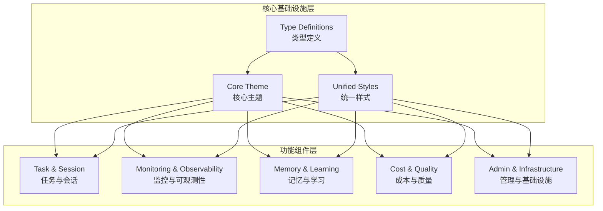

# Dashboard UI Components 模块概述

## 1. 模块简介

Dashboard UI Components 是一个专为 Loki Mode 设计的现代化、模块化 Web 组件库，提供了一套完整的可复用 UI 组件，用于构建 AI 系统的管理和监控界面。该模块采用 Web Components 技术，提供了从任务管理、会话控制、日志监控到成本分析、质量评估等全方位的用户界面组件。

### 核心价值
- **模块化设计**：每个组件都是独立的 Web Component，可单独使用或组合使用
- **统一设计语言**：基于 Anthropic 设计系统，提供一致的视觉体验
- **多环境支持**：支持浏览器、VS Code 扩展和 CLI 嵌入 HTML 环境
- **主题系统**：内置浅色/深色/高对比度主题，支持自动检测和手动切换
- **可访问性优先**：完整支持 ARIA 属性和键盘导航

## 2. 架构概览

Dashboard UI Components 模块采用分层架构设计，从核心基础设施到功能组件形成完整的组件生态系统。



### 架构特点
1. **类型安全**：完整的 TypeScript 类型定义，提供开发时类型检查
2. **主题驱动**：基于 CSS 变量的主题系统，支持运行时切换
3. **组件独立**：每个功能组件独立封装，可单独导入使用
4. **API 集成**：内置 API 客户端，与后端服务无缝通信
5. **事件驱动**：组件间通过自定义事件通信，降低耦合度

## 3. 核心功能模块

### 3.1 类型定义系统 (Type Definitions)

提供完整的 TypeScript 类型定义，包括主题配置、设计令牌、API 客户端、状态管理等类型。

**主要功能**：
- 主题和设计令牌类型
- API 客户端和数据模型类型
- Web Component 属性和事件类型
- 状态管理类型定义

**核心导出**：
- `ThemeName`、`ThemeDefinition` - 主题类型
- `Task`、`Project`、`SystemStatus` - 数据模型
- `LokiApiClient` - API 客户端类型
- `AppState`、`LokiState` - 状态管理类型

### 3.2 主题系统 (Core Theme & Unified Styles)

提供统一的主题管理和样式系统，支持多种主题变体和自动上下文检测。

**主要功能**：
- 5 种预定义主题（浅色、深色、高对比度、VS Code 浅色/深色）
- 设计令牌系统（间距、圆角、排版、动画等）
- 键盘快捷键管理
- ARIA 模式库
- 自动上下文检测（浏览器/VS Code/CLI）

**核心组件**：
- `UnifiedThemeManager` - 主题管理类
- `KeyboardHandler` - 键盘事件处理
- `LokiElement` - 组件基类

### 3.3 任务与会话管理 (Task and Session Management)

提供任务看板、会话控制、运行管理、检查点和 PRD 检查清单等组件。

**主要功能**：
- 看板式任务管理（拖放排序）
- 会话生命周期控制（启动/暂停/恢复/停止）
- 运行记录管理（取消/重放）
- 检查点管理（创建/回滚）
- PRD 检查清单（验证/豁免）

**核心组件**：
- `LokiTaskBoard` - 任务看板
- `LokiSessionControl` - 会话控制
- `LokiRunManager` - 运行管理
- `LokiCheckpointViewer` - 检查点查看器
- `LokiChecklistViewer` - 检查清单查看器

### 3.4 监控与可观测性 (Monitoring and Observability)

提供系统状态监控、日志流、上下文追踪、分析面板和 RARV 时间线等组件。

**主要功能**：
- 系统状态概览（会话、任务、代理等）
- 实时日志流（过滤、搜索、自动滚动）
- 上下文窗口使用率追踪
- 活动热力图和趋势分析
- RARV 执行周期可视化

**核心组件**：
- `LokiOverview` - 系统概览
- `LokiAppStatus` - 应用状态
- `LokiLogStream` - 日志流
- `LokiContextTracker` - 上下文追踪器
- `LokiAnalytics` - 分析面板
- `LokiRarvTimeline` - RARV 时间线

### 3.5 记忆与学习 (Memory and Learning)

提供记忆浏览器、学习仪表板和提示词优化器组件。

**主要功能**：
- 多类型记忆内容浏览（片段、模式、技能）
- 学习指标可视化（信号、趋势、效率）
- 提示词优化状态监控
- 记忆合并操作
- 跨工具学习分析

**核心组件**：
- `LokiMemoryBrowser` - 记忆浏览器
- `LokiLearningDashboard` - 学习仪表板
- `LokiPromptOptimizer` - 提示词优化器

### 3.6 成本与质量 (Cost and Quality)

提供成本仪表板、质量门控和质量评分组件。

**主要功能**：
- 实时成本监控（代币使用、模型/阶段统计）
- 预算追踪与预警
- 质量门控状态可视化
- 质量评分与趋势分析
- 发现统计与分类

**核心组件**：
- `LokiCostDashboard` - 成本仪表板
- `LokiQualityGates` - 质量门控
- `LokiQualityScore` - 质量评分

### 3.7 管理与基础设施 (Administration and Infrastructure)

提供 API 密钥管理、审计日志、租户切换、通知中心、委员会仪表板和迁移仪表板。

**主要功能**：
- API 密钥生命周期管理（创建/轮换/删除）
- 审计日志浏览与完整性验证
- 多租户上下文切换
- 系统通知管理
- 委员会监控与代理管理
- 迁移过程监控

**核心组件**：
- `LokiApiKeys` - API 密钥管理
- `LokiAuditViewer` - 审计日志查看器
- `LokiTenantSwitcher` - 租户切换器
- `LokiNotificationCenter` - 通知中心
- `LokiCouncilDashboard` - 委员会仪表板
- `LokiMigrationDashboard` - 迁移仪表板

## 4. 技术栈与依赖

| 技术/依赖 | 用途 |
|-----------|------|
| Web Components v1 | 组件化开发 |
| Shadow DOM v1 | 样式隔离 |
| CSS Custom Properties | 主题系统 |
| TypeScript 4.0+ | 类型安全 |
| Fetch API | HTTP 通信 |
| WebSocket (可选) | 实时通信 |
| Intersection Observer | 可见性感知 |

## 5. 快速开始

### 5.1 基础使用

```html
<!DOCTYPE html>
<html>
<head>
  <title>Loki Dashboard</title>
</head>
<body>
  <!-- 系统概览 -->
  <loki-overview api-url="http://localhost:57374"></loki-overview>
  
  <!-- 任务看板 -->
  <loki-task-board api-url="http://localhost:57374" theme="dark"></loki-task-board>
  
  <!-- 日志流 -->
  <loki-log-stream api-url="http://localhost:57374" auto-scroll></loki-log-stream>

  <script type="module">
    // 导入组件
    import 'dashboard-ui/components/loki-overview.js';
    import 'dashboard-ui/components/loki-task-board.js';
    import 'dashboard-ui/components/loki-log-stream.js';
    
    // 初始化主题系统
    import { UnifiedThemeManager } from 'dashboard-ui/core/loki-unified-styles';
    UnifiedThemeManager.init();
  </script>
</body>
</html>
```

### 5.2 TypeScript 集成

```typescript
import { init, getApiClient, getState } from 'dashboard-ui/types';

// 初始化组件库
const result = init({
  apiUrl: 'http://localhost:57374',
  autoDetectContext: true
});

console.log(`Theme: ${result.theme}, Context: ${result.context}`);

// 使用 API 客户端
const apiClient = getApiClient();
const projects = await apiClient.listProjects();

// 使用状态管理
const state = getState();
state.set('ui.theme', 'dark', true);
```

## 6. 核心特性

### 6.1 主题系统

- 5 种预定义主题
- 自动上下文检测
- 运行时主题切换
- 完整的 CSS 变量支持
- 系统偏好同步

### 6.2 可访问性

- 完整的键盘导航支持
- ARIA 属性和模式
- 高对比度主题
- 屏幕阅读器友好
- 语义化 HTML

### 6.3 性能优化

- 可见性感知轮询
- 虚拟滚动（日志组件）
- 数据缓存
- 懒加载
- 增量更新

### 6.4 开发体验

- TypeScript 类型支持
- 热模块替换（开发模式）
- 组件文档
- 示例代码
- 调试工具

## 7. 相关模块

- **[Dashboard Backend](../Dashboard%20Backend/README.md)** - 提供 REST API 和 WebSocket 服务
- **[Dashboard Frontend](../Dashboard%20Frontend/README.md)** - 提供 React 集成和 Web Component 包装器
- **[API Server & Services](../API%20Server%20&%20Services/README.md)** - 核心后端服务
- **[Observability](../Observability/README.md)** - 后端可观测性系统

## 8. 注意事项与限制

### 浏览器兼容性
- 支持现代浏览器（Chrome 67+, Firefox 63+, Safari 10.1+, Edge 79+）
- 需要 Web Components 和 Shadow DOM 支持
- 不支持 IE11 及更早版本

### API 依赖
- 组件需要后端 API 服务支持
- API 端点不可用时会显示错误状态
- 网络请求失败时有重试机制

### 性能考虑
- 大量数据加载时可能有延迟
- 日志组件有最大行数限制
- 建议在生产环境实现适当的缓存策略

### 安全注意事项
- 组件不会存储或传输敏感信息
- 确保 API 连接使用 HTTPS
- 用户输入进行了 HTML 转义，防止 XSS 攻击

## 9. 总结

Dashboard UI Components 模块为 Loki Mode 提供了一套完整、现代化的 UI 组件库，从核心基础设施到功能组件形成了完整的生态系统。该模块的设计注重模块化、可访问性、性能和开发体验，使开发者能够快速构建功能丰富的 AI 系统管理界面。

通过该模块，用户可以：
- 轻松管理和监控 AI 系统运行状态
- 实时查看日志和学习指标
- 控制任务和会话生命周期
- 分析成本和质量数据
- 管理系统配置和基础设施

所有组件都遵循统一的设计语言，提供一致的用户体验，并支持多种部署环境（浏览器、VS Code、CLI）。