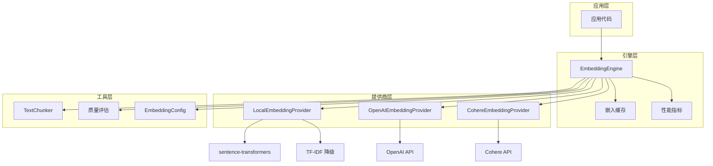
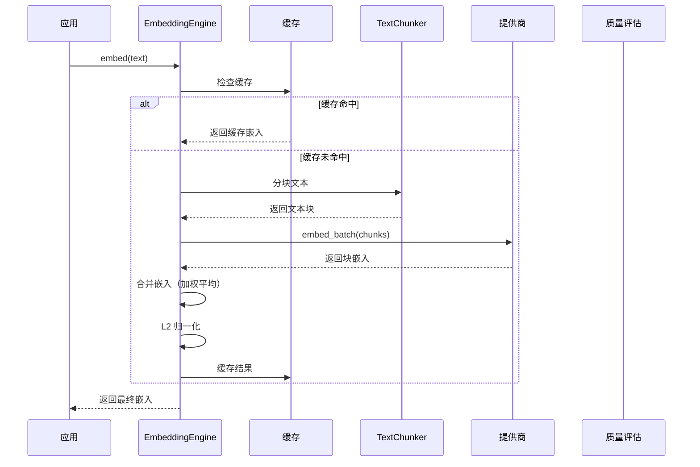
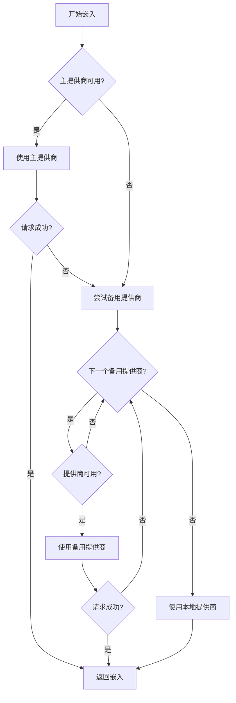

# Embeddings 模块文档

## 目录

- [概述](#概述)
- [核心组件](#核心组件)
- [架构设计](#架构设计)
- [使用指南](#使用指南)
- [配置选项](#配置选项)
- [扩展开发](#扩展开发)
- [注意事项](#注意事项)

---

## 概述

Embeddings 模块是 Loki Mode 系统中的核心组件，负责为文本数据生成高质量的向量嵌入表示。该模块提供了多提供商支持、智能文本分块、语义相似度计算和质量评估等功能，是整个记忆系统和检索系统的基础。

### 主要功能

- **多提供商嵌入生成**：支持本地（sentence-transformers）、OpenAI 和 Cohere 三种嵌入提供商
- **智能文本分块**：提供多种分块策略处理长文本
- **上下文感知嵌入**：支持为文本片段添加上下文信息
- **语义去重**：基于嵌入相似度的文本去重功能
- **质量评分**：对生成的嵌入进行质量评估
- **缓存机制**：避免重复计算，提升性能
- **故障转移**：主提供商失败时自动切换到备用提供商

### 设计理念

Embeddings 模块采用了灵活的架构设计，通过抽象接口隔离不同提供商的实现细节，同时提供统一的配置和使用方式。模块注重可靠性和性能，通过缓存、批处理和故障转移机制确保系统的稳定运行。

---

## 核心组件

### EmbeddingConfig

配置类，用于管理嵌入引擎的所有配置选项。

```python
@dataclass
class EmbeddingConfig:
    provider: str = "local"
    model: Optional[str] = None
    fallback_providers: List[str] = field(default_factory=lambda: ["local"])
    dimension: int = 384
    # ... 更多配置项
```

**主要功能**：
- 支持从环境变量加载配置
- 支持从 JSON 文件加载配置
- 自动设置默认模型和维度
- 安全地处理 API 密钥

**关键方法**：
- `from_env()`：从环境变量创建配置
- `from_file(path)`：从 JSON 文件加载配置
- `to_dict()`：转换为字典（不含敏感数据）

### TextChunker

文本分块器，负责将长文本分割成适合嵌入处理的小块。

```python
class TextChunker:
    @staticmethod
    def chunk_fixed(text: str, max_size: int = 512, overlap: int = 50) -> List[str]
    @staticmethod
    def chunk_sentence(text: str, max_size: int = 512) -> List[str]
    @staticmethod
    def chunk_semantic(text: str, max_size: int = 512) -> List[str]
    @staticmethod
    def add_context(text: str, full_content: str, context_lines: int = 3) -> str
```

**分块策略**：
- `NONE`：不分块，直接截断
- `FIXED`：固定大小分块，带重叠
- `SENTENCE`：按句子边界分块
- `SEMANTIC`：按语义边界（段落、代码块）分块

### BaseEmbeddingProvider

嵌入提供商抽象基类，定义了所有提供商必须实现的接口。

```python
class BaseEmbeddingProvider(ABC):
    @abstractmethod
    def embed(self, text: str) -> np.ndarray: pass
    @abstractmethod
    def embed_batch(self, texts: List[str]) -> np.ndarray: pass
    @abstractmethod
    def get_dimension(self) -> int: pass
    @abstractmethod
    def get_name(self) -> str: pass
    @abstractmethod
    def is_available(self) -> bool: pass
```

### LocalEmbeddingProvider

本地嵌入提供商，使用 sentence-transformers 库生成嵌入。

**特点**：
- 无需 API 密钥，完全本地运行
- 支持多种预训练模型
- 提供 TF-IDF 降级方案
- 延迟加载模型

**降级机制**：当 sentence-transformers 不可用时，自动切换到 TF-IDF 实现。

### OpenAIEmbeddingProvider

OpenAI 嵌入提供商，使用 OpenAI 的 text-embedding-3 系列模型。

**特点**：
- 支持批量处理（最多 2048 个输入）
- 自动处理 API 密钥
- 配置超时时间

### CohereEmbeddingProvider

Cohere 嵌入提供商，使用 Cohere 的 embed-v3 系列模型。

**特点**：
- 支持批量处理（最多 96 个文本）
- 配置输入类型为 "search_document"
- 自动处理 API 密钥

### EmbeddingEngine

主嵌入引擎，提供统一的接口和高级功能。

```python
class EmbeddingEngine:
    def __init__(self, config: Optional[EmbeddingConfig] = None, ...)
    def embed(self, text: str, with_context: bool = False, full_content: Optional[str] = None) -> np.ndarray
    def embed_batch(self, texts: List[str], ...) -> np.ndarray
    def similarity(self, a: np.ndarray, b: np.ndarray) -> float
    def similarity_search(self, query_embedding: np.ndarray, corpus_embeddings: np.ndarray, top_k: int = 5) -> List[Tuple[int, float]]
    def deduplicate(self, texts: List[str], threshold: Optional[float] = None) -> List[int]
```

**核心功能**：
- 多提供商管理和故障转移
- 智能缓存（LRU 策略）
- 文本分块和嵌入合并
- 相似度计算和搜索
- 语义去重
- 质量评估
- 性能指标统计

### EmbeddingQuality

嵌入质量评估数据类。

```python
@dataclass
class EmbeddingQuality:
    score: float  # 综合质量分数 (0-1)
    coverage: float  # 文本覆盖率 (0-1)
    density: float  # 非零元素比例 (0-1)
    variance: float  # 嵌入方差（越高越多样）
    provider: str  # 生成提供商
```

---

## 架构设计

### 系统架构图



### 数据流程图



### 故障转移流程



---

## 使用指南

### 基本使用

#### 创建嵌入引擎

```python
from memory.embeddings import EmbeddingEngine, EmbeddingConfig

# 使用默认配置（本地提供商）
engine = EmbeddingEngine()

# 使用特定提供商
config = EmbeddingConfig(provider="openai", model="text-embedding-3-small")
engine = EmbeddingEngine(config=config)

# 从环境变量加载配置
config = EmbeddingConfig.from_env()
engine = EmbeddingEngine(config=config)

# 从配置文件加载
config = EmbeddingConfig.from_file(".loki/config/embeddings.json")
engine = EmbeddingEngine(config=config)
```

#### 生成嵌入

```python
# 单个文本嵌入
text = "Hello, world!"
embedding = engine.embed(text)
print(f"Embedding shape: {embedding.shape}")  # (384,) 或其他维度

# 批量嵌入
texts = ["First text", "Second text", "Third text"]
embeddings = engine.embed_batch(texts)
print(f"Batch embeddings shape: {embeddings.shape}")  # (3, 384)

# 带上下文的嵌入
full_content = "This is a longer document.\n\nThe important part is here.\n\nMore text follows."
important_part = "The important part is here."
embedding_with_context = engine.embed(
    important_part, 
    with_context=True, 
    full_content=full_content
)
```

#### 相似度计算

```python
# 计算两个嵌入的相似度
emb1 = engine.embed("The quick brown fox")
emb2 = engine.embed("A fast brown fox")
similarity = engine.similarity(emb1, emb2)
print(f"Similarity: {similarity:.4f}")  # 接近 1.0

# 相似度搜索
corpus = [
    "The cat sat on the mat",
    "The dog played in the yard",
    "A fox jumped over the fence",
    "Birds are singing in the trees"
]
corpus_embeddings = engine.embed_batch(corpus)

query = "A furry animal jumped"
query_embedding = engine.embed(query)

results = engine.similarity_search(query_embedding, corpus_embeddings, top_k=2)
for idx, score in results:
    print(f"Match: {corpus[idx]} (score: {score:.4f})")
```

#### 语义去重

```python
texts = [
    "The quick brown fox jumps over the lazy dog",
    "A fast brown fox jumps over a lazy dog",
    "Completely different sentence",
    "The quick brown fox jumps over the lazy dog",  # 完全重复
    "A quick brown fox leaps over a sleeping dog"  # 语义相似
]

unique_indices = engine.deduplicate(texts, threshold=0.9)
unique_texts = [texts[i] for i in unique_indices]

print("Original texts:", len(texts))
print("Unique texts:", len(unique_texts))
for text in unique_texts:
    print(f"- {text}")
```

#### 质量评估

```python
text = "This is a sample text for quality assessment."
embedding, quality = engine.embed_with_quality(text)

print(f"Quality score: {quality.score:.4f}")
print(f"Coverage: {quality.coverage:.4f}")
print(f"Density: {quality.density:.4f}")
print(f"Variance: {quality.variance:.4f}")
print(f"Provider: {quality.provider}")
```

### 高级功能

#### 性能监控

```python
# 获取性能指标
metrics = engine.get_metrics()
print(f"Total requests: {metrics['total_requests']}")
print(f"Cache hits: {metrics['cache_hits']}")
print(f"Cache hit rate: {metrics['cache_hits'] / metrics['total_requests']:.2%}")
print(f"Avg latency: {metrics['avg_latency_ms']:.2f}ms")
print(f"Current provider: {metrics['current_provider']}")
print(f"Using fallback: {metrics['using_fallback']}")

# 查看缓存大小
print(f"Cache size: {engine.get_cache_size()}")

# 清空缓存
engine.clear_cache()
```

#### 配置管理

```python
# 获取当前配置
config_dict = engine.get_config()
print("Current configuration:")
for key, value in config_dict.items():
    print(f"  {key}: {value}")

# 创建配置文件
from memory.embeddings import create_config_file

create_config_file(".loki/config/embeddings.json")

# 使用自定义配置创建文件
custom_config = EmbeddingConfig(
    provider="openai",
    model="text-embedding-3-large",
    chunking_strategy="semantic",
    max_chunk_size=1024,
    batch_size=64
)
create_config_file("custom_config.json", custom_config)
```

#### 快速相似度检查

```python
from memory.embeddings import quick_similarity

# 快速检查两个文本的相似度（创建临时引擎）
similarity = quick_similarity(
    "The quick brown fox jumps over the lazy dog",
    "A fast brown fox leaps over a sleeping dog"
)
print(f"Quick similarity: {similarity:.4f}")
```

---

## 配置选项

### EmbeddingConfig 配置项

| 配置项 | 类型 | 默认值 | 说明 |
|--------|------|--------|------|
| `provider` | str | `"local"` | 主嵌入提供商 |
| `model` | Optional[str] | `None` | 提供商特定的模型名称 |
| `fallback_providers` | List[str] | `["local"]` | 备用提供商列表 |
| `dimension` | int | `384` | 嵌入维度 |
| `openai_api_key` | Optional[str] | `None` | OpenAI API 密钥 |
| `cohere_api_key` | Optional[str] | `None` | Cohere API 密钥 |
| `chunking_strategy` | str | `"semantic"` | 文本分块策略 |
| `max_chunk_size` | int | `512` | 每个块的最大字符数 |
| `chunk_overlap` | int | `50` | 块之间的重叠字符数 |
| `include_context` | bool | `True` | 是否包含上下文 |
| `context_lines` | int | `3` | 上下文行数 |
| `min_quality_score` | float | `0.5` | 最低可接受质量分数 |
| `dedup_threshold` | float | `0.95` | 去重相似度阈值 |
| `batch_size` | int | `32` | 批处理大小 |
| `cache_enabled` | bool | `True` | 是否启用缓存 |
| `timeout` | float | `30.0` | API 超时时间（秒） |

### 环境变量

| 环境变量 | 说明 |
|----------|------|
| `LOKI_EMBEDDING_PROVIDER` | 嵌入提供商 |
| `LOKI_EMBEDDING_MODEL` | 嵌入模型 |
| `LOKI_EMBEDDING_CHUNKING` | 分块策略 |
| `LOKI_EMBEDDING_CONTEXT` | 是否包含上下文 |
| `OPENAI_API_KEY` | OpenAI API 密钥 |
| `COHERE_API_KEY` | Cohere API 密钥 |

### 预定义模型

#### 本地模型

| 模型名称 | 维度 | 说明 |
|----------|------|------|
| `all-MiniLM-L6-v2` | 384 | 默认模型，速度快 |
| `all-mpnet-base-v2` | 768 | 高质量，较慢 |
| `paraphrase-multilingual-MiniLM-L12-v2` | 384 | 多语言支持 |

#### OpenAI 模型

| 模型名称 | 维度 | 说明 |
|----------|------|------|
| `text-embedding-3-small` | 1536 | 默认模型，性价比高 |
| `text-embedding-3-large` | 3072 | 高质量 |
| `text-embedding-ada-002` | 1536 |  legacy 模型 |

#### Cohere 模型

| 模型名称 | 维度 | 说明 |
|----------|------|------|
| `embed-english-v3.0` | 1024 | 默认英语模型 |
| `embed-english-light-v3.0` | 384 | 轻量英语模型 |
| `embed-multilingual-v3.0` | 1024 | 多语言模型 |

---

## 扩展开发

### 添加新的嵌入提供商

要添加新的嵌入提供商，需要继承 `BaseEmbeddingProvider` 并实现所有抽象方法：

```python
from memory.embeddings import BaseEmbeddingProvider
import numpy as np

class MyCustomProvider(BaseEmbeddingProvider):
    def __init__(self, api_key: str, model: str = "my-model", dimension: int = 512):
        self.api_key = api_key
        self.model = model
        self.dimension = dimension
        self._client = None
    
    def _get_client(self):
        if self._client is None:
            # 初始化你的客户端
            self._client = MyAPIClient(api_key=self.api_key)
        return self._client
    
    def embed(self, text: str) -> np.ndarray:
        client = self._get_client()
        result = client.embed(text, model=self.model)
        return np.array(result, dtype=np.float32)
    
    def embed_batch(self, texts: List[str]) -> np.ndarray:
        if not texts:
            return np.empty((0, self.dimension), dtype=np.float32)
        
        client = self._get_client()
        results = []
        # 分批处理
        batch_size = 100
        for i in range(0, len(texts), batch_size):
            batch = texts[i:i + batch_size]
            batch_results = client.embed_batch(batch, model=self.model)
            results.extend(batch_results)
        
        return np.array(results, dtype=np.float32)
    
    def get_dimension(self) -> int:
        return self.dimension
    
    def get_name(self) -> str:
        return "my-custom-provider"
    
    def is_available(self) -> bool:
        # 检查依赖和 API 密钥
        try:
            import my_api_client
            return self.api_key is not None
        except ImportError:
            return False
```

### 自定义分块策略

虽然 `TextChunker` 是一个静态类，但你可以通过继承或组合的方式添加新的分块策略：

```python
from memory.embeddings import TextChunker
import re

class AdvancedTextChunker(TextChunker):
    @staticmethod
    def chunk_code(text: str, max_size: int = 512) -> List[str]:
        """按代码结构分块（函数、类等）"""
        # 简单的代码分块示例
        code_breaks = re.compile(r'(?<=\n)(def |class |import |from )')
        parts = code_breaks.split(text)
        
        chunks = []
        current_chunk = ""
        
        for part in parts:
            if not part:
                continue
            
            if len(current_chunk) + len(part) <= max_size:
                current_chunk += part
            else:
                if current_chunk:
                    chunks.append(current_chunk)
                if len(part) > max_size:
                    # 如果单个部分太大，使用固定分块
                    chunks.extend(TextChunker.chunk_fixed(part, max_size))
                    current_chunk = ""
                else:
                    current_chunk = part
        
        if current_chunk:
            chunks.append(current_chunk)
        
        return chunks
```

### 集成到 EmbeddingEngine

要将自定义提供商集成到 `EmbeddingEngine`，你需要修改 `_init_providers` 方法，或者在创建引擎后手动添加提供商：

```python
# 手动添加自定义提供商
config = EmbeddingConfig(provider="my-custom-provider")
engine = EmbeddingEngine(config=config)

# 手动添加提供商
custom_provider = MyCustomProvider(api_key="your-api-key")
engine._providers["my-custom-provider"] = custom_provider

# 如果这是主提供商，重新初始化
if engine.config.provider == "my-custom-provider":
    engine._primary_provider = custom_provider
    engine._current_provider_name = "my-custom-provider"
    engine.dimension = custom_provider.get_dimension()
```

---

## 注意事项

### 性能考虑

1. **批量处理**：尽可能使用 `embed_batch` 而不是循环调用 `embed`，特别是对于本地提供商，批处理可以显著提升性能。

2. **缓存配置**：合理配置缓存大小和启用状态。默认缓存大小为 10000，可以根据内存情况调整。

3. **提供商选择**：
   - 本地提供商：适合小批量、低延迟要求，但首次加载模型较慢
   - OpenAI/Cohere：适合大批量、高质量要求，但有 API 调用成本和延迟

4. **分块策略**：
   - `SEMANTIC`：适合文档和代码，保持语义完整性
   - `SENTENCE`：适合纯文本
   - `FIXED`：适合需要严格控制块大小的场景
   - `NONE`：适合短文本

### 错误处理

1. **API 故障**：EmbeddingEngine 会自动处理 API 故障并切换到备用提供商，但建议监控 `metrics['fallback_count']` 来检测持续的问题。

2. **模型加载**：本地模型是延迟加载的，首次调用 `embed` 时会有模型加载延迟。可以在应用启动时预加载模型：
   ```python
   engine = EmbeddingEngine()
   # 预加载模型
   engine.embed("warmup")
   ```

3. **TF-IDF 降级**：当 sentence-transformers 不可用时，会使用 TF-IDF 降级方案。注意监控日志中的警告信息，并考虑安装 sentence-transformers 以获得更好的质量。

### 内存使用

1. **嵌入缓存**：缓存会占用内存，特别是对于高维度嵌入（如 OpenAI 的 1536 或 3072 维）。可以通过 `get_cache_size()` 监控缓存大小。

2. **模型内存**：本地模型会占用一定内存，特别是大模型（如 all-mpnet-base-v2）。可以选择合适的模型在质量和内存之间权衡。

### 质量考虑

1. **质量评分**：使用 `embed_with_quality` 可以获取嵌入质量信息。低质量分数可能表明文本太短、噪音太多或提供商问题。

2. **去重阈值**：去重阈值需要根据具体场景调整。0.95 适合大多数场景，但对于高度相似的文本可能需要调整。

3. **上下文添加**：添加上下文可以提升语义理解，但也会增加噪音。需要根据具体场景调整 `context_lines` 参数。

### 安全考虑

1. **API 密钥**：不要在代码中硬编码 API 密钥。使用环境变量或安全的配置文件。

2. **配置输出**：`to_dict()` 方法不会输出 API 密钥，但会标记密钥是否存在。注意不要将完整配置对象记录到日志中。

3. **缓存安全**：缓存包含原始文本的哈希，但不包含原始文本。对于敏感数据，可以禁用缓存。

---

## 相关模块

- [Memory Engine](MemoryEngine.md)：使用 Embeddings 模块进行语义记忆存储和检索
- [Unified Memory Access](UnifiedMemoryAccess.md)：提供统一的内存访问接口
- [Vector Index](VectorIndex.md)：高效的向量索引和检索

---

## 参考文献

- [sentence-transformers 文档](https://www.sbert.net/)
- [OpenAI Embeddings API](https://platform.openai.com/docs/guides/embeddings)
- [Cohere Embeddings](https://docs.cohere.com/reference/embed)
- [向量嵌入最佳实践](https://www.pinecone.io/learn/vector-embeddings/)
