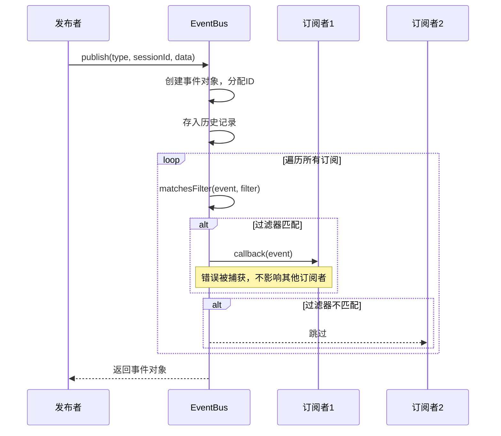

# Event Bus 模块文档

## 概述

Event Bus 模块是系统的核心事件分发系统，实现了发布/订阅（pub/sub）模式，专门用于支持 Server-Sent Events (SSE) 流式通信。该模块提供了事件的集中管理、灵活过滤、历史记录和可靠分发功能，是系统中各组件之间异步通信的基础设施。

### 设计理念

Event Bus 的设计遵循以下原则：
- **松耦合通信**：允许组件间无需直接引用即可通信
- **类型安全**：使用 TypeScript 提供完整的类型定义和检查
- **灵活过滤**：支持按事件类型、会话ID和日志级别进行订阅过滤
- **历史记录**：维护事件历史，支持新订阅者获取过去的事件
- **错误隔离**：单个订阅者的错误不会影响其他订阅者

## 架构与核心组件

### 核心类：EventBus

`EventBus` 类是模块的核心，负责管理订阅、分发事件和维护历史记录。

#### 主要属性

```typescript
private subscriptions: Map<string, Subscription>
private eventHistory: AnySSEEvent[]
private maxHistorySize = 1000
private eventCounter = 0
```

- `subscriptions`：存储所有活跃订阅的 Map，键为订阅 ID
- `eventHistory`：事件历史记录数组
- `maxHistorySize`：历史记录最大容量（默认 1000 条）
- `eventCounter`：用于生成唯一事件 ID 的计数器

#### 订阅管理

EventBus 使用 `Subscription` 接口管理订阅：

```typescript
interface Subscription {
  id: string;
  filter: EventFilter;
  callback: EventCallback;
}
```

每个订阅包含：
- 唯一的订阅 ID（使用 `crypto.randomUUID()` 生成）
- 事件过滤器
- 事件回调函数

### 事件类型系统

Event Bus 支持多种预定义的事件类型，详见 [API Types](API Types.md) 中的 `events.ts` 定义。主要事件类别包括：

- **会话事件**：`session:*` - 会话生命周期事件
- **阶段事件**：`phase:*` - 处理阶段进度事件  
- **任务事件**：`task:*` - 任务状态变化事件
- **代理事件**：`agent:*` - 代理活动事件
- **日志事件**：`log:*` - 不同级别的日志消息
- **指标事件**：`metrics:update` - 性能和资源指标
- **输入请求**：`input:requested` - 用户输入请求
- **心跳事件**：`heartbeat` - 系统健康状态

### 事件过滤器

`EventFilter` 接口提供了灵活的订阅过滤机制：

```typescript
interface EventFilter {
  types?: EventType[];        // 按事件类型过滤
  sessionId?: string;         // 按会话 ID 过滤
  minLevel?: "debug" | "info" | "warn" | "error";  // 日志最低级别
}
```

## 工作流程

### 发布-订阅流程



### 事件匹配逻辑

`matchesFilter` 方法实现了事件过滤逻辑，按以下步骤执行：

1. **类型过滤**：如果过滤器指定了类型列表，事件类型必须在列表中
2. **会话过滤**：如果指定了会话 ID，事件的会话 ID 必须完全匹配
3. **日志级别过滤**：对于 `log:*` 类型事件，检查是否满足最低级别要求

日志级别优先级从低到高为：`debug` < `info` < `warn` < `error`

## 核心 API 方法

### 订阅管理

#### subscribe(filter, callback)

订阅事件流，返回订阅 ID 用于后续取消订阅。

**参数：**
- `filter: EventFilter` - 事件过滤器
- `callback: (event: AnySSEEvent) => void` - 事件回调函数

**返回值：** `string` - 唯一的订阅 ID

**示例：**
```typescript
const subId = eventBus.subscribe(
  { types: ['task:created', 'task:completed'], sessionId: 'session-123' },
  (event) => {
    console.log('收到事件:', event);
  }
);
```

#### unsubscribe(subscriptionId)

取消订阅。

**参数：**
- `subscriptionId: string` - 订阅 ID

**返回值：** `boolean` - 是否成功取消订阅

### 事件发布

#### publish<T>(type, sessionId, data)

发布事件到所有匹配的订阅者。

**参数：**
- `type: EventType` - 事件类型
- `sessionId: string` - 会话 ID
- `data: T` - 事件数据

**返回值：** `SSEEvent<T>` - 创建的事件对象

**事件对象结构：**
```typescript
{
  id: string;           // 格式：evt_{counter}_{timestamp}
  type: EventType;
  timestamp: string;    // ISO 格式时间戳
  sessionId: string;
  data: T;
}
```

### 历史记录管理

#### getHistory(filter, limit?)

获取匹配过滤器的历史事件。

**参数：**
- `filter: EventFilter` - 事件过滤器
- `limit: number` - 返回的最大事件数（默认 100）

**返回值：** `AnySSEEvent[]` - 匹配的历史事件数组（最新的在前）

#### clearHistory()

清空事件历史记录。

### 状态查询

#### getSubscriberCount()

获取当前活跃订阅者数量。

**返回值：** `number` - 订阅者数量

## 便捷函数

Event Bus 提供了一系列类型安全的便捷发布函数，简化特定类型事件的发布：

### emitSessionEvent(type, sessionId, data)

发布会话事件。

```typescript
emitSessionEvent('session:started', 'session-123', {
  status: 'running',
  message: '会话已启动'
});
```

### emitPhaseEvent(type, sessionId, data)

发布处理阶段事件。

```typescript
emitPhaseEvent('phase:started', 'session-123', {
  phase: 'analysis',
  progress: 0
});
```

### emitTaskEvent(type, sessionId, data)

发布任务事件。

```typescript
emitTaskEvent('task:created', 'session-123', {
  taskId: 'task-456',
  title: '分析代码库',
  status: 'pending'
});
```

### emitAgentEvent(type, sessionId, data)

发布代理事件。

```typescript
emitAgentEvent('agent:spawned', 'session-123', {
  agentId: 'agent-789',
  type: 'code-analyzer'
});
```

### emitLogEvent(level, sessionId, message, source?)

发布日志事件。

```typescript
emitLogEvent('info', 'session-123', '处理中...', 'main-module');
```

### emitHeartbeat(sessionId, data)

发布心跳事件。

```typescript
emitHeartbeat('session-123', {
  uptime: 3600,
  activeAgents: 5,
  queuedTasks: 10
});
```

## 使用示例

### 基本订阅模式

```typescript
import { eventBus } from './api/services/event-bus';

// 订阅特定会话的所有事件
const subscriptionId = eventBus.subscribe(
  { sessionId: 'my-session-id' },
  (event) => {
    console.log(`收到事件 [${event.type}]:`, event.data);
  }
);

// 完成后取消订阅
// eventBus.unsubscribe(subscriptionId);
```

### 多条件过滤订阅

```typescript
// 只订阅特定类型和级别的事件
eventBus.subscribe(
  {
    types: ['log:error', 'log:warn', 'task:failed'],
    sessionId: 'session-123',
    minLevel: 'warn'
  },
  (event) => {
    // 处理警告和错误事件
    handleCriticalEvent(event);
  }
);
```

### 获取历史事件

```typescript
// 新连接建立时，获取最近的重要事件
const recentEvents = eventBus.getHistory(
  { sessionId: 'session-123', minLevel: 'info' },
  50
);

// 重放历史事件
recentEvents.forEach(event => {
  processEvent(event);
});
```

## 与其他模块的集成

Event Bus 在系统中与多个关键模块紧密协作：

- **[API Server Core](API Server Core.md)**：通过 SSE 端点将事件推送到客户端
- **[State Notifications](State Notifications.md)**：发布状态变化事件
- **[State Watcher](State Watcher.md)**：监听并响应系统状态变化事件
- **[CLI Bridge](CLI Bridge.md)**：将 CLI 输出转换为事件
- **[Learning Collector](Learning Collector.md)**：收集学习相关事件

## 性能考虑与限制

### 事件历史容量

默认最大历史记录为 1000 条事件。当超过此限制时，最早的事件会被移除。对于高吞吐量系统，可以根据需要调整此值。

### 回调执行

- 回调函数在发布者的执行上下文中同步执行
- 单个回调的错误会被捕获并记录，但不会中断其他回调
- 长时间运行的回调可能会阻塞事件分发，建议在回调中使用异步处理

### 内存使用

EventBus 会保留所有历史事件直到达到最大容量。对于长时间运行的系统，应该注意监控内存使用情况，必要时调用 `clearHistory()`。

## 线程安全

当前的 EventBus 实现是单线程的，基于 JavaScript 的事件循环模型。在并发环境中使用时不需要额外的同步机制，但要注意：

- 所有操作都是原子的
- 回调函数应该避免共享状态的修改，或自行处理同步

## 错误处理

EventBus 采用了隔离的错误处理策略：

- 单个订阅者回调中的异常不会影响其他订阅者
- 错误会被捕获并记录到控制台
- 发布操作总是返回创建的事件对象，即使有订阅者失败

## 扩展点

### 自定义过滤器

虽然当前版本不支持自定义过滤器函数，但可以通过在回调中进行额外的过滤来实现：

```typescript
eventBus.subscribe(baseFilter, (event) => {
  if (customCondition(event)) {
    processEvent(event);
  }
});
```

### 持久化事件历史

可以通过扩展 EventBus 类来添加事件持久化：

```typescript
class PersistentEventBus extends EventBus {
  // 重写 publish 方法，添加持久化逻辑
  publish<T>(type: EventType, sessionId: string, data: T) {
    const event = super.publish(type, sessionId, data);
    this.persistEvent(event);
    return event;
  }
  
  private persistEvent(event: AnySSEEvent) {
    // 实现持久化逻辑
  }
}
```

## 总结

Event Bus 模块提供了一个强大、灵活且类型安全的事件分发系统，是系统异步通信的核心基础设施。通过合理使用其过滤机制和历史记录功能，可以构建高效、可靠的实时通信系统。

在使用 Event Bus 时，需要注意及时清理不再需要的订阅，避免内存泄漏，并合理配置历史记录大小以平衡功能需求和资源使用。
