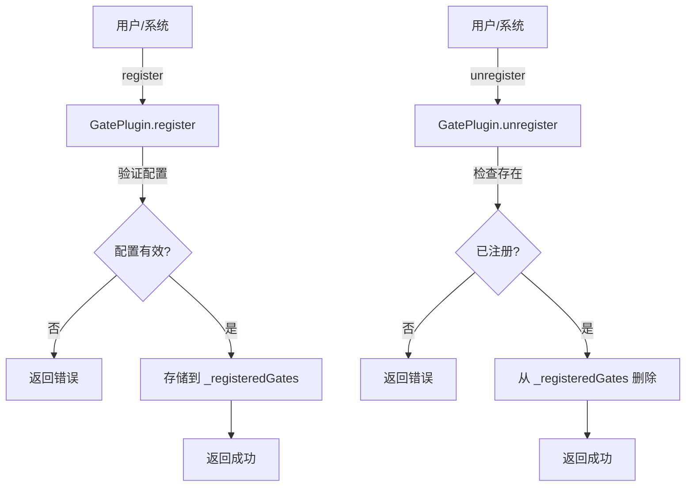
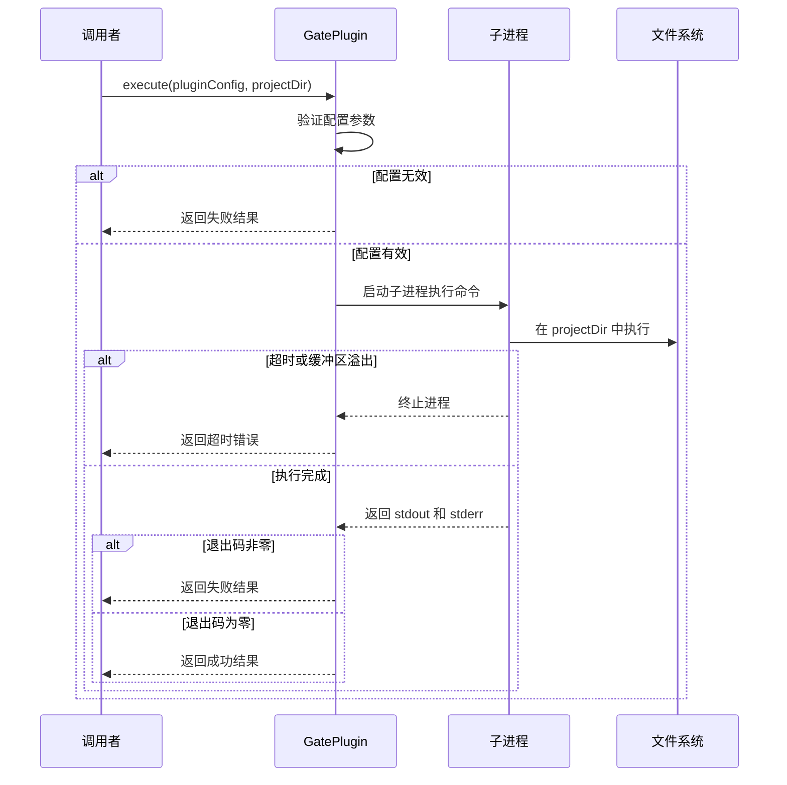

# GatePlugin 模块文档

## 概述

GatePlugin 模块是系统插件系统的核心组件之一，提供了一个灵活的质量门禁管理框架。该模块允许开发者注册、执行和管理自定义质量门禁插件，这些插件可以在软件开发生命周期（SDLC）的不同阶段执行自动化检查、验证和质量控制操作。

GatePlugin 的设计理念是通过可插拔的方式实现质量门禁功能，使得团队可以根据自身需求定制和扩展质量检查流程，而无需修改核心系统代码。这一设计特别适合于需要严格质量控制的开发环境，如持续集成/持续部署（CI/CD）流水线、代码审查流程和发布管理等场景。

## 核心组件

### GatePlugin 类

GatePlugin 是一个静态类，提供了完整的质量门禁插件管理功能。它不依赖于实例化，所有方法都通过类直接调用。

#### 主要特性

- 插件注册与注销管理
- 质量门禁命令执行
- 按阶段获取门禁插件
- 插件状态查询

## 架构与工作原理

### 插件注册机制

GatePlugin 使用内存注册表 `_registeredGates` 来存储所有已注册的质量门禁插件。这个注册表是一个 Map 结构，以插件名称为键，插件配置对象为值。



### 执行流程

当执行质量门禁时，GatePlugin 会通过子进程执行配置的命令，并监控执行过程。



## 核心方法详解

### register(pluginConfig)

注册一个自定义质量门禁插件。

**参数：**
- `pluginConfig` (object): 质量门禁插件配置对象
  - `type` (string): 必须为 "quality_gate"
  - `name` (string): 插件名称（唯一标识）
  - `description` (string, 可选): 插件描述
  - `phase` (string, 可选): 执行阶段，默认为 "pre-commit"
  - `command` (string): 要执行的命令
  - `timeout_ms` (number, 可选): 超时时间（毫秒），默认为 30000
  - `blocking` (boolean, 可选): 是否为阻塞式门禁，默认为 true
  - `severity` (string, 可选): 严重程度，默认为 "high"

**返回值：**
- `{ success: boolean, error?: string }` 操作结果对象

**使用示例：**
```javascript
const { GatePlugin } = require('./src/plugins/gate-plugin');

const result = GatePlugin.register({
    type: 'quality_gate',
    name: 'eslint-check',
    description: 'Run ESLint to check code quality',
    phase: 'pre-commit',
    command: 'npx eslint .',
    timeout_ms: 60000,
    blocking: true,
    severity: 'high'
});

if (result.success) {
    console.log('Gate plugin registered successfully');
} else {
    console.error('Failed to register gate plugin:', result.error);
}
```

### unregister(pluginName)

注销一个已注册的质量门禁插件。

**参数：**
- `pluginName` (string): 要移除的门禁插件名称

**返回值：**
- `{ success: boolean, error?: string }` 操作结果对象

**使用示例：**
```javascript
const result = GatePlugin.unregister('eslint-check');
if (result.success) {
    console.log('Gate plugin unregistered successfully');
}
```

### execute(pluginConfig, projectDir)

执行质量门禁命令。

**参数：**
- `pluginConfig` (object): 门禁插件配置对象
- `projectDir` (string): 执行命令的项目目录

**返回值：**
- `Promise<{ passed: boolean, output: string, duration_ms: number }>` 执行结果Promise

**使用示例：**
```javascript
const pluginConfig = {
    name: 'eslint-check',
    command: 'npx eslint .',
    timeout_ms: 60000
};

GatePlugin.execute(pluginConfig, '/path/to/project')
    .then(result => {
        if (result.passed) {
            console.log('Quality gate passed!');
        } else {
            console.log('Quality gate failed:', result.output);
        }
        console.log(`Execution time: ${result.duration_ms}ms`);
    });
```

### getByPhase(phase)

获取特定阶段注册的所有门禁。

**参数：**
- `phase` (string): SDLC 阶段名称

**返回值：**
- `object[]` 门禁定义数组

**使用示例：**
```javascript
const preCommitGates = GatePlugin.getByPhase('pre-commit');
console.log(`Found ${preCommitGates.length} pre-commit gates`);
```

### listRegistered()

列出所有已注册的门禁插件。

**返回值：**
- `object[]` 门禁定义数组

### isRegistered(name)

检查门禁是否已注册。

**参数：**
- `name` (string): 门禁名称

**返回值：**
- `boolean` 是否已注册

### _clearAll()

清除所有已注册的门禁（主要用于测试）。

## 插件配置详解

### 配置对象结构

质量门禁插件配置对象包含以下关键属性：

| 属性 | 类型 | 必填 | 默认值 | 说明 |
|------|------|------|--------|------|
| type | string | 是 | - | 必须为 "quality_gate" |
| name | string | 是 | - | 插件唯一标识符 |
| description | string | 否 | - | 插件功能描述 |
| phase | string | 否 | "pre-commit" | 执行阶段标识 |
| command | string | 是 | - | 要执行的Shell命令 |
| timeout_ms | number | 否 | 30000 | 执行超时时间（毫秒） |
| blocking | boolean | 否 | true | 是否为阻塞式门禁 |
| severity | string | 否 | "high" | 严重程度标识 |

### 执行阶段

系统预定义了一些常见的执行阶段，但用户可以根据需要自定义阶段名称：

- `pre-commit`: 提交前检查
- `pre-push`: 推送前检查
- `pre-merge`: 合并前检查
- `pre-deploy`: 部署前检查
- `post-deploy`: 部署后验证

### 阻塞与非阻塞门禁

`blocking` 属性决定了门禁失败时是否阻止后续流程：

- **阻塞式门禁**（`blocking: true`）：门禁失败会阻止流程继续，通常用于关键质量检查
- **非阻塞式门禁**（`blocking: false`）：门禁失败仅记录结果，不会阻止流程，适用于建议性检查

### 环境变量

执行命令时，系统会自动设置 `LOKI_GATE` 环境变量，值为当前执行的门禁插件名称，方便命令脚本根据不同门禁做出相应处理。

## 使用场景与最佳实践

### 场景1：代码质量检查

```javascript
// 注册ESLint检查门禁
GatePlugin.register({
    type: 'quality_gate',
    name: 'eslint',
    description: 'JavaScript/TypeScript code quality check',
    phase: 'pre-commit',
    command: 'npx eslint src/ --ext .js,.ts',
    timeout_ms: 60000,
    blocking: true,
    severity: 'high'
});

// 注册类型检查门禁
GatePlugin.register({
    type: 'quality_gate',
    name: 'type-check',
    description: 'TypeScript type checking',
    phase: 'pre-commit',
    command: 'npx tsc --noEmit',
    timeout_ms: 120000,
    blocking: true,
    severity: 'high'
});
```

### 场景2：测试验证

```javascript
// 注册单元测试门禁
GatePlugin.register({
    type: 'quality_gate',
    name: 'unit-tests',
    description: 'Run unit tests',
    phase: 'pre-push',
    command: 'npm test -- --coverage',
    timeout_ms: 300000,
    blocking: true,
    severity: 'critical'
});

// 注册覆盖率门禁（非阻塞）
GatePlugin.register({
    type: 'quality_gate',
    name: 'coverage-check',
    description: 'Check test coverage (advisory)',
    phase: 'pre-push',
    command: 'npx nyc check-coverage --lines 80',
    timeout_ms: 10000,
    blocking: false,
    severity: 'medium'
});
```

### 场景3：安全扫描

```javascript
// 注册依赖漏洞扫描
GatePlugin.register({
    type: 'quality_gate',
    name: 'npm-audit',
    description: 'Check for vulnerable dependencies',
    phase: 'pre-merge',
    command: 'npm audit --audit-level=high',
    timeout_ms: 60000,
    blocking: true,
    severity: 'critical'
});

// 注册代码安全扫描
GatePlugin.register({
    type: 'quality_gate',
    name: 'sast-scan',
    description: 'Static Application Security Testing',
    phase: 'pre-deploy',
    command: 'npm run sast-scan',
    timeout_ms: 600000,
    blocking: true,
    severity: 'critical'
});
```

## 集成与扩展

### 与 PolicyEngine 集成

GatePlugin 可以与 PolicyEngine 模块协同工作，将质量门禁结果作为策略评估的输入：

```javascript
// 参考 PolicyEngine.md 了解更多集成详情
```

### 与 PluginLoader 集成

PluginLoader 模块可以用于动态加载和管理 GatePlugin 插件：

```javascript
// 参考 PluginLoader.md 了解如何自动加载插件
```

## 注意事项与限制

### 执行环境

- 命令在 `/bin/sh` 环境中执行，确保命令兼容该Shell
- 命令执行的工作目录由 `projectDir` 参数指定，默认为当前进程工作目录
- 环境变量会继承自当前进程，并额外添加 `LOKI_GATE` 变量

### 资源限制

- 默认最大输出缓冲区为 1MB，超过会导致命令失败
- 默认超时时间为 30秒，可根据需要调整
- 长时间运行的命令可能会影响系统性能，应合理设置超时时间

### 错误处理

- 命令退出码为 0 表示通过，非 0 表示失败
- 超时会被视为失败，输出会包含超时信息
- 缓冲区溢出也会被视为失败

### 安全考虑

- 执行任意命令存在安全风险，应限制插件注册权限
- 避免在命令中直接使用用户输入，防止命令注入攻击
- 建议在隔离环境中执行门禁命令

## 故障排除

### 常见问题

1. **命令执行超时**
   - 检查 `timeout_ms` 设置是否合理
   - 确认命令本身的执行时间
   - 考虑优化命令或增加超时时间

2. **命令找不到**
   - 确认命令在执行环境中可用
   - 检查工作目录设置是否正确
   - 使用绝对路径或确保命令在 PATH 中

3. **权限问题**
   - 确认执行用户有足够权限
   - 检查文件和目录权限
   - 考虑使用 sudo 或调整权限

### 调试技巧

- 在命令中添加详细输出，帮助诊断问题
- 检查返回的 `output` 字段，包含 stdout 和 stderr
- 使用简单命令（如 `echo`、`pwd`）验证执行环境
- 测试不同的工作目录设置

## 总结

GatePlugin 模块提供了一个强大而灵活的质量门禁管理框架，通过可插拔的设计使得质量控制流程可以根据团队需求进行定制和扩展。正确使用该模块可以显著提升代码质量、降低缺陷率，并确保软件开发过程遵循最佳实践。

更多相关模块信息，请参考：
- [PluginLoader](PluginLoader.md) - 插件加载器
- [PolicyEngine](PolicyEngine.md) - 策略引擎
- [AgentPlugin](AgentPlugin.md) - 代理插件
- [MCPPlugin](MCPPlugin.md) - MCP协议插件
- [IntegrationPlugin](IntegrationPlugin.md) - 集成插件
