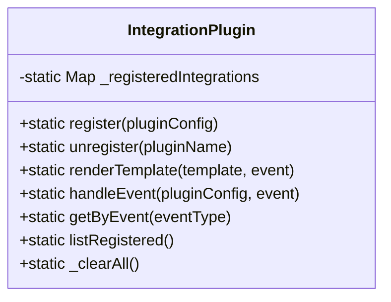
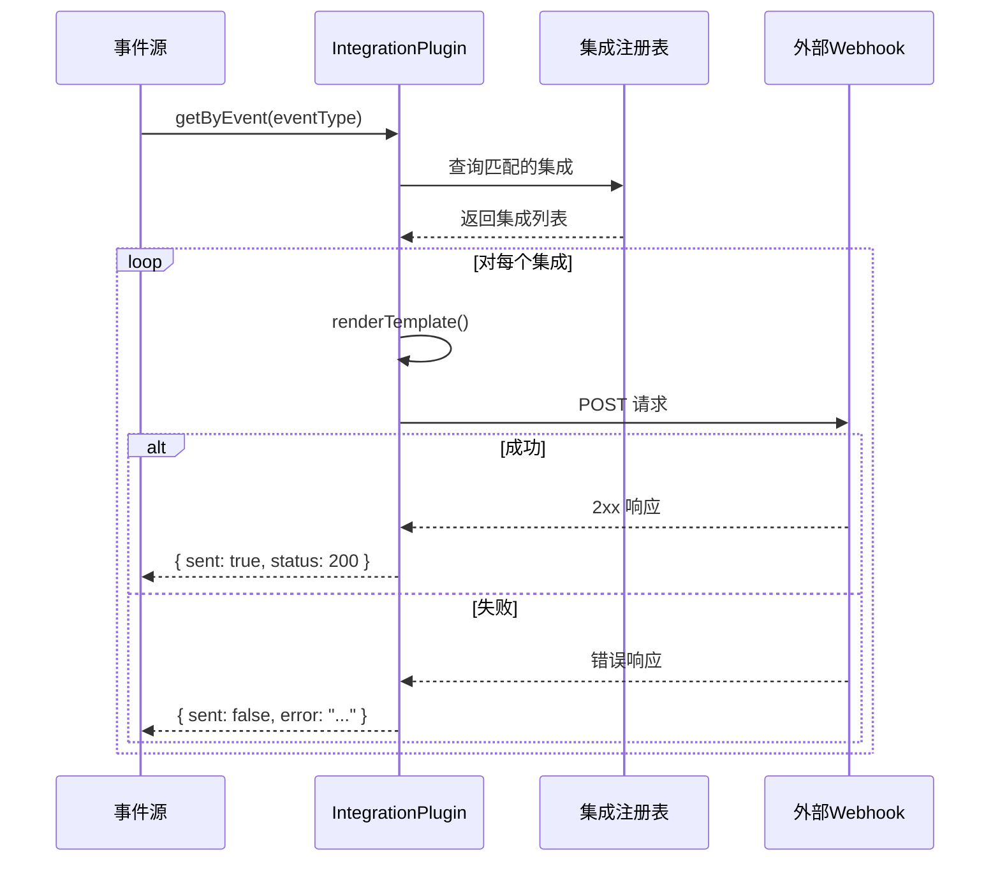

# IntegrationPlugin 模块文档

## 概述

IntegrationPlugin 模块是一个灵活的集成插件系统，允许开发者注册和管理自定义集成，用于将系统事件发送到外部服务。该模块提供了一种标准化的方式来扩展系统的集成能力，支持通过 webhook 将事件数据推送到第三方服务。

### 核心功能
- 集成插件的注册与注销管理
- 事件数据的模板化渲染
- 安全可靠的 webhook 事件发送
- 基于事件类型的集成匹配

## 架构设计

IntegrationPlugin 模块采用简洁的设计模式，核心是一个内存中的集成注册表，配合静态方法提供完整的生命周期管理。模块不依赖外部存储，所有集成配置都保存在内存中，适合轻量级集成场景。



### 核心组件关系

IntegrationPlugin 模块与系统中的其他组件有以下关系：

- **PluginLoader**：可以通过 [PluginLoader](PluginLoader.md) 模块动态加载 IntegrationPlugin 实例
- **EventBus**：事件总线系统可以使用 IntegrationPlugin 将事件分发到外部集成
- **StateNotificationsManager**：状态通知管理器可以利用此模块发送状态变更通知

## 核心组件详解

### IntegrationPlugin 类

IntegrationPlugin 是一个纯静态类，提供所有集成管理功能。

#### 注册表管理

**register(pluginConfig)**

注册一个新的集成插件。该方法验证配置并将其存储在内存注册表中。

**参数：**
- `pluginConfig` (object)：集成插件配置对象，必须包含：
  - `type` (string)：必须为 "integration"
  - `name` (string)：集成的唯一名称
  - `webhook_url` (string)：接收事件的 webhook URL
  - `description` (string)：集成描述
  - `events` (string[])：要监听的事件类型数组，支持 "*" 通配符
  - `payload_template` (string)：可选的负载模板，默认值为 '{"event": "{{event.type}}", "message": "{{event.message}}"}'
  - `headers` (object)：可选的 HTTP 请求头
  - `timeout_ms` (number)：可选的超时时间（毫秒），默认 5000
  - `retry_count` (number)：可选的重试次数，默认 1

**返回值：**
- `{ success: boolean, error?: string }`：操作结果对象

**示例：**
```javascript
const result = IntegrationPlugin.register({
    type: 'integration',
    name: 'slack-notifications',
    description: 'Send notifications to Slack',
    webhook_url: 'https://hooks.slack.com/services/xxx/yyy/zzz',
    events: ['task.created', 'task.completed'],
    headers: {
        'Authorization': 'Bearer token'
    },
    timeout_ms: 10000
});
```

**unregister(pluginName)**

注销已注册的集成插件。

**参数：**
- `pluginName` (string)：要移除的集成名称

**返回值：**
- `{ success: boolean, error?: string }`：操作结果对象

**listRegistered()**

列出所有已注册的集成插件。

**返回值：**
- `object[]`：集成定义对象数组

**getByEvent(eventType)**

获取订阅了特定事件类型的所有集成。

**参数：**
- `eventType` (string)：事件类型

**返回值：**
- `object[]`：匹配的集成定义数组

#### 模板渲染

**renderTemplate(template, event)**

使用事件数据渲染模板字符串，替换 `{{event.field}}` 模式为实际的事件值。

**参数：**
- `template` (string)：模板字符串
- `event` (object)：事件数据对象

**返回值：**
- `string`：渲染后的字符串

**模板语法：**
- 支持点号路径访问嵌套属性：`{{event.user.name}}`
- 对象类型会自动序列化为 JSON
- 字符串会进行 JSON 安全转义
- 不存在的属性会被替换为空字符串

**示例：**
```javascript
const template = '{"type": "{{event.type}}", "data": {{event.data}}}';
const event = {
    type: 'task.created',
    data: { id: '123', title: 'New Task' }
};
const result = IntegrationPlugin.renderTemplate(template, event);
// 输出: '{"type": "task.created", "data": {"id":"123","title":"New Task"}}'
```

#### 事件处理

**handleEvent(pluginConfig, event)**

处理事件并将其发送到集成的 webhook。这是一个 fire-and-forget 风格的方法，带有超时控制。

**参数：**
- `pluginConfig` (object)：集成插件配置对象
- `event` (object)：事件数据对象

**返回值：**
- `Promise<{ sent: boolean, status?: number, error?: string }>`：发送结果的 Promise

**工作流程：**
1. 渲染负载模板
2. 解析 webhook URL 确定协议（HTTP/HTTPS）
3. 配置请求选项（超时、头信息等）
4. 发送 POST 请求
5. 处理响应或错误

**示例：**
```javascript
const config = {
    webhook_url: 'https://example.com/webhook',
    timeout_ms: 5000,
    headers: { 'X-API-Key': 'secret' }
};
const event = { type: 'test', message: 'Hello' };

IntegrationPlugin.handleEvent(config, event)
    .then(result => {
        if (result.sent) {
            console.log('Event sent with status:', result.status);
        } else {
            console.error('Failed to send:', result.error);
        }
    });
```

## 使用指南

### 基本使用流程

1. **注册集成**
   ```javascript
   const { IntegrationPlugin } = require('./src/plugins/integration-plugin');
   
   IntegrationPlugin.register({
       type: 'integration',
       name: 'my-integration',
       description: 'My custom integration',
       webhook_url: 'https://example.com/webhook',
       events: ['*'] // 监听所有事件
   });
   ```

2. **查找匹配的集成**
   ```javascript
   const integrations = IntegrationPlugin.getByEvent('task.created');
   ```

3. **发送事件**
   ```javascript
   const event = {
       type: 'task.created',
       taskId: '123',
       title: 'New Task',
       timestamp: new Date().toISOString()
   };
   
   for (const integration of integrations) {
       IntegrationPlugin.handleEvent(integration, event);
   }
   ```

### 高级配置

#### 自定义负载模板

```javascript
IntegrationPlugin.register({
    type: 'integration',
    name: 'custom-webhook',
    webhook_url: 'https://example.com/webhook',
    events: ['task.completed'],
    payload_template: JSON.stringify({
        notification: {
            title: 'Task Completed: {{event.task.title}}',
            description: 'Task {{event.task.id}} was completed by {{event.user.name}}',
            metadata: '{{event}}'
        }
    })
});
```

#### 安全头配置

```javascript
IntegrationPlugin.register({
    type: 'integration',
    name: 'secure-integration',
    webhook_url: 'https://example.com/webhook',
    events: ['audit.log'],
    headers: {
        'Authorization': 'Bearer your-access-token',
        'X-Signature': 'hmac-signature-here',
        'User-Agent': 'IntegrationPlugin/1.0'
    },
    timeout_ms: 10000
});
```

## 架构与流程

### 事件处理流程



### 数据结构

集成定义对象包含以下字段：

```javascript
{
    name: string,                    // 集成名称
    description: string,             // 描述
    webhook_url: string,            // Webhook URL
    events: string[],               // 监听的事件类型
    payload_template: string,        // 负载模板
    headers: object,                // HTTP 头
    timeout_ms: number,             // 超时时间（毫秒）
    retry_count: number,            // 重试次数
    registered_at: string           // 注册时间（ISO 字符串）
}
```

## 注意事项与限制

### 安全考虑

1. **Webhook URL 验证**：虽然模块会尝试解析 URL，但建议在注册前额外验证 URL 的合法性
2. **敏感数据**：避免在事件数据中包含敏感信息，或在模板中进行适当过滤
3. **认证头**：headers 配置会完整保留在内存中，确保部署环境的安全性

### 性能与可靠性

1. **内存存储**：所有集成配置存储在内存中，重启后会丢失，生产环境建议配合持久化机制
2. **无重试机制**：当前版本的 `handleEvent` 方法虽有 `retry_count` 配置，但实际未实现重试逻辑
3. **并发处理**：事件发送是异步的，但没有内置的并发控制
4. **超时设置**：默认 5 秒超时，对于慢速网络可适当调整

### 错误处理

- `handleEvent` 方法不会抛出异常，所有错误都通过返回值的 `error` 字段传达
- URL 解析错误、网络错误、超时都会被捕获并返回适当的错误信息
- 模板渲染失败时会返回原始模板或空字符串，不会中断事件处理

### 限制

- 仅支持 HTTP/HTTPS POST 请求
- 模板语法简单，不支持条件或循环逻辑
- 事件匹配仅支持精确匹配或 "*" 通配符，不支持模式匹配
- 没有内置的请求签名验证机制

## 测试工具

**_clearAll()**

清除所有已注册的集成，主要用于测试。

```javascript
// 在测试前后使用
beforeEach(() => {
    IntegrationPlugin._clearAll();
});

afterEach(() => {
    IntegrationPlugin._clearAll();
});
```

## 相关模块

- [PluginLoader](PluginLoader.md)：插件加载器，可用于动态加载 IntegrationPlugin
- [AgentPlugin](AgentPlugin.md)：代理插件系统
- [GatePlugin](GatePlugin.md)：网关插件系统
- [MCPPlugin](MCPPlugin.md)：MCP 协议插件系统
