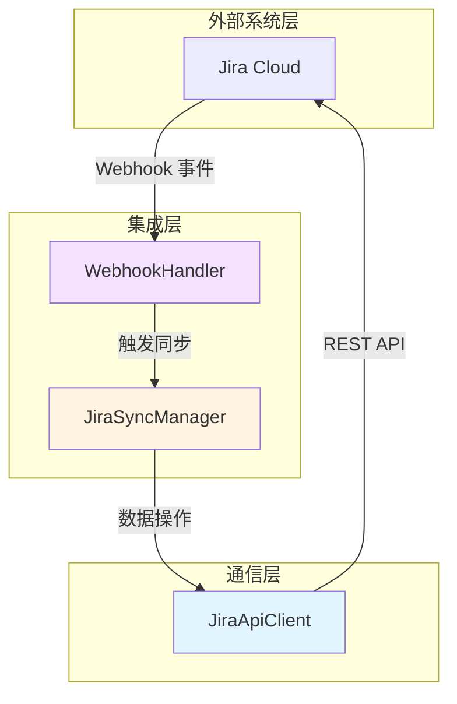
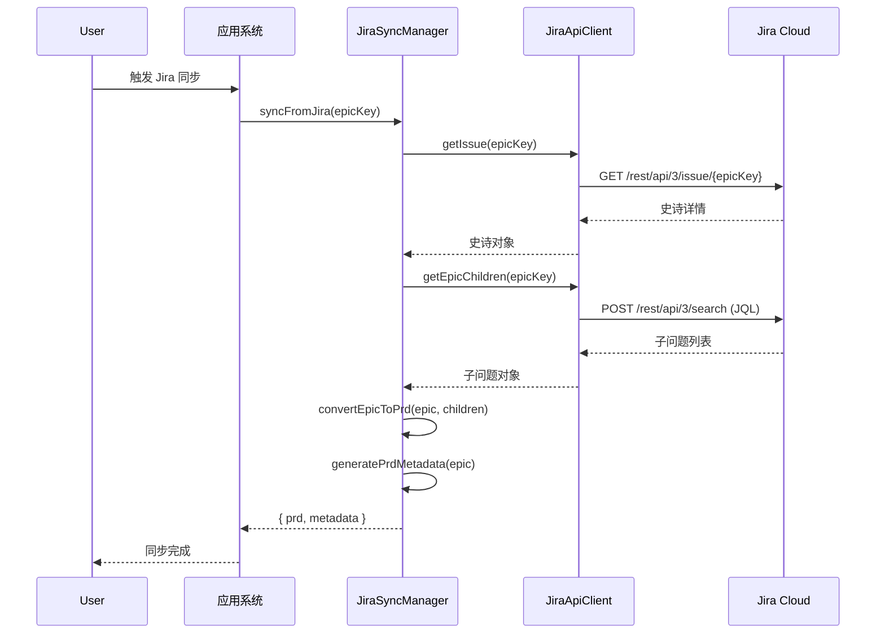
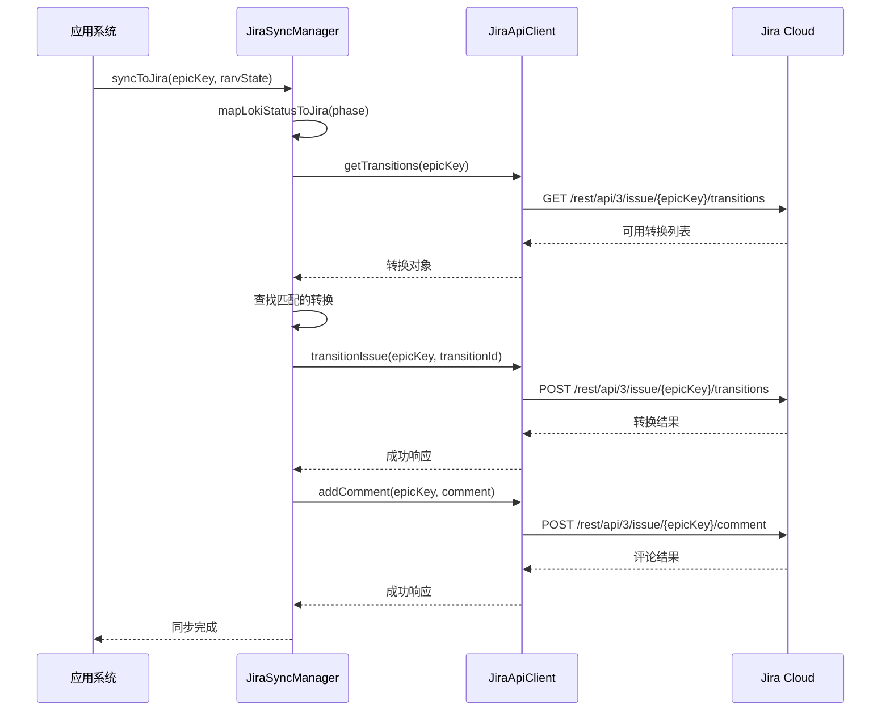
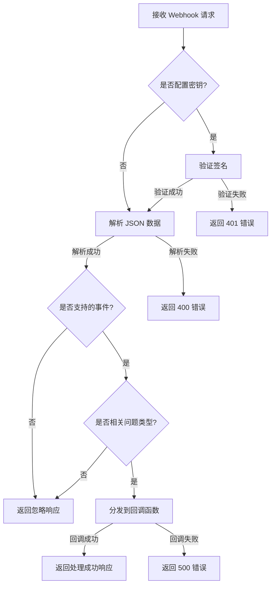

# Integrations-Jira 模块文档

## 1. 模块概述

Integrations-Jira 模块提供了与 Jira Cloud 平台集成的核心功能，实现了系统与 Jira 之间的双向数据同步、状态管理和事件交互。该模块允许用户将 Jira 中的史诗（Epic）转换为产品需求文档（PRD），同时将系统中的任务状态、质量报告和进度信息同步回 Jira，实现了开发流程的无缝衔接。

模块设计遵循组件化架构，通过清晰的职责划分确保了代码的可维护性和可扩展性。核心组件包括 API 客户端、同步管理器和 Webhook 处理器，分别负责与 Jira API 的通信、双向数据同步以及 Jira 事件的接收和处理。

## 2. 系统架构

Integrations-Jira 模块采用三层架构设计，各层之间通过明确的接口进行通信，确保了系统的高内聚低耦合。



### 架构组件说明

1. **通信层**：由 `JiraApiClient` 负责，封装了与 Jira REST API v3 的所有交互，提供了统一的接口进行身份验证、请求发送和响应处理。

2. **集成层**：
   - `JiraSyncManager` 负责双向数据同步逻辑，将 Jira 史诗转换为 PRD，并将系统状态同步回 Jira。
   - `WebhookHandler` 处理来自 Jira 的 Webhook 事件，支持签名验证和事件分发。

3. **外部系统层**：即 Jira Cloud 平台，通过 REST API 和 Webhook 机制与集成模块进行交互。

## 3. 核心组件详解

### 3.1 JiraApiClient

`JiraApiClient` 是与 Jira Cloud REST API v3 交互的核心组件，提供了完整的 API 封装，处理身份验证、请求限流、错误处理等底层细节。

#### 主要功能

- 身份验证：使用 Basic Auth 机制，通过邮箱和 API Token 进行认证
- 请求限流：通过配置请求间隔避免触发 Jira API 速率限制
- 响应处理：统一处理 API 响应，解析 JSON 数据，处理错误状态码
- 常用操作封装：提供获取问题、搜索问题、创建/更新问题、添加评论等常用功能

#### 核心方法

| 方法名 | 描述 | 参数 | 返回值 |
|--------|------|------|--------|
| `getIssue(issueKey)` | 获取指定问题详情 | `issueKey`: 问题键（如 PROJ-123） | 问题对象 Promise |
| `searchIssues(jql, fields)` | 使用 JQL 搜索问题 | `jql`: JQL 查询字符串<br>`fields`: 可选字段列表 | 搜索结果 Promise |
| `getEpicChildren(epicKey)` | 获取史诗的子问题 | `epicKey`: 史诗问题键 | 子问题列表 Promise |
| `createIssue(fields)` | 创建新问题 | `fields`: 问题字段对象 | 创建结果 Promise |
| `updateIssue(issueKey, fields)` | 更新问题 | `issueKey`: 问题键<br>`fields`: 要更新的字段 | 更新结果 Promise |
| `addComment(issueKey, body)` | 添加评论 | `issueKey`: 问题键<br>`body`: 评论内容（字符串或 ADF 对象） | 评论结果 Promise |
| `getTransitions(issueKey)` | 获取可用状态转换 | `issueKey`: 问题键 | 转换列表 Promise |
| `transitionIssue(issueKey, transitionId)` | 执行状态转换 | `issueKey`: 问题键<br>`transitionId`: 转换 ID | 转换结果 Promise |
| `addRemoteLink(issueKey, linkUrl, title)` | 添加远程链接 | `issueKey`: 问题键<br>`linkUrl`: 链接 URL<br>`title`: 链接标题 | 链接结果 Promise |

#### 配置选项

```javascript
const client = new JiraApiClient({
  baseUrl: 'https://company.atlassian.net',  // Jira Cloud 基础 URL
  email: 'user@example.com',                   // Jira 用户邮箱
  apiToken: 'your-api-token',                  // Jira API 令牌
  rateDelayMs: 100                              // 请求间隔（毫秒，默认 100）
});
```

#### 错误处理

`JiraApiClient` 定义了专用的 `JiraApiError` 类，用于封装 API 错误信息，包含状态码、错误消息和原始响应内容，便于错误处理和调试。

### 3.2 JiraSyncManager

`JiraSyncManager` 是实现双向同步的核心组件，负责将 Jira 数据转换为系统可处理的格式，并将系统状态同步回 Jira。

#### 主要功能

- 从 Jira 同步：获取史诗及其子问题，转换为 PRD 格式
- 向 Jira 同步：将系统状态、进度和质量报告更新到 Jira
- 任务状态管理：更新 Jira 问题的状态和添加进度评论
- 子任务创建：根据系统分解结果在 Jira 中创建子任务

#### 核心方法

| 方法名 | 描述 | 参数 | 返回值 |
|--------|------|------|--------|
| `syncFromJira(epicKey)` | 从 Jira 同步史诗到 PRD | `epicKey`: 史诗问题键 | `{ prd: string, metadata: object }` Promise |
| `syncToJira(epicKey, rarvState)` | 将系统状态同步到 Jira | `epicKey`: 史诗问题键<br>`rarvState`: 系统状态对象 | Promise |
| `updateTaskStatus(issueKey, status, details)` | 更新任务状态 | `issueKey`: 问题键<br>`status`: 状态<br>`details`: 详情 | Promise |
| `postQualityReport(issueKey, report)` | 发布质量报告 | `issueKey`: 问题键<br>`report`: 质量报告对象 | Promise |
| `addDeploymentLink(issueKey, deployUrl, env)` | 添加部署链接 | `issueKey`: 问题键<br>`deployUrl`: 部署 URL<br>`env`: 环境 | Promise |
| `createSubTasks(parentKey, tasks)` | 创建子任务 | `parentKey`: 父问题键<br>`tasks`: 任务列表 | `string[]` Promise（创建的问题键列表） |

#### 状态映射

`JiraSyncManager` 使用预定义的状态映射表将系统状态转换为 Jira 状态：

| 系统状态 | Jira 状态 |
|----------|-----------|
| planning, building | In Progress |
| testing, reviewing | In Review |
| deployed, completed | Done |
| failed, blocked | Blocked |

#### 使用示例

```javascript
const syncManager = new JiraSyncManager({
  apiClient: jiraClient,  // JiraApiClient 实例
  projectKey: 'PROJ'       // 默认项目键（可选）
});

// 从 Jira 同步史诗
const { prd, metadata } = await syncManager.syncFromJira('PROJ-123');

// 向 Jira 同步系统状态
await syncManager.syncToJira('PROJ-123', {
  phase: 'building',
  details: '正在实现核心功能模块',
  progress: 65
});
```

### 3.3 WebhookHandler

`WebhookHandler` 负责处理来自 Jira 的 Webhook 事件，支持签名验证、事件解析和回调分发。

#### 主要功能

- 签名验证：使用 HMAC-SHA256 验证 Webhook 请求的真实性
- 事件解析：解析 Jira Webhook 事件数据
- 事件过滤：根据事件类型和问题类型过滤事件
- 回调分发：将处理后的事件分发给注册的回调函数

#### 支持的事件

- `jira:issue_created`：问题创建事件
- `jira:issue_updated`：问题更新事件
- `sprint_started`：冲刺开始事件

#### 核心方法

| 方法名 | 描述 | 参数 | 返回值 |
|--------|------|------|--------|
| `handleRequest(headers, rawBody)` | 处理 Webhook 请求 | `headers`: 请求头<br>`rawBody`: 原始请求体 | `{ status: number, response: object }` |
| `verifySignature(headers, rawBody)` | 验证请求签名 | `headers`: 请求头<br>`rawBody`: 原始请求体 | `boolean` |
| `parseEvent(body)` | 解析事件数据 | `body`: Webhook 事件体 | `{ eventType: string, issue: object, changelog: object } \| null` |

#### 配置选项

```javascript
const webhookHandler = new WebhookHandler({
  secret: 'your-webhook-secret',  // Webhook 密钥（可选，用于签名验证）
  onEpicCreated: (issue) => {      // 史诗创建回调（可选）
    console.log('New epic created:', issue.key);
  },
  onIssueUpdated: (issue, changelog) => {  // 问题更新回调（可选）
    console.log('Issue updated:', issue.key);
  },
  issueTypes: ['Epic', 'Story']    // 要处理的问题类型（可选，默认：['Epic', 'Story']）
});
```

#### 使用示例

```javascript
// 在 HTTP 服务器中使用
app.post('/webhooks/jira', (req, res) => {
  const result = webhookHandler.handleRequest(req.headers, req.body);
  res.status(result.status).json(result.response);
});
```

## 4. 工作流程

### 4.1 从 Jira 同步数据流程



### 4.2 向 Jira 同步状态流程



### 4.3 Webhook 处理流程



## 5. 配置与部署

### 5.1 Jira 配置

要使用 Integrations-Jira 模块，需要在 Jira Cloud 中进行以下配置：

1. **创建 API 令牌**：
   - 访问 https://id.atlassian.com/manage-profile/security/api-tokens
   - 创建新的 API 令牌并保存

2. **配置 Webhook（可选）**：
   - 进入 Jira 设置 → 系统 → Webhooks
   - 创建新的 Webhook，配置 URL 和触发事件
   - （可选）设置 Secret 用于签名验证

3. **项目配置**：
   - 确保有适当的项目权限
   - 确认项目使用的问题类型和工作流

### 5.2 模块初始化

```javascript
// 1. 创建 API 客户端
const jiraClient = new JiraApiClient({
  baseUrl: 'https://your-domain.atlassian.net',
  email: 'your-email@example.com',
  apiToken: 'your-api-token'
});

// 2. 创建同步管理器
const syncManager = new JiraSyncManager({
  apiClient: jiraClient,
  projectKey: 'PROJ'
});

// 3. 创建 Webhook 处理器（如需要）
const webhookHandler = new WebhookHandler({
  secret: 'your-webhook-secret',
  onEpicCreated: async (issue) => {
    // 处理新创建的史诗
    const { prd, metadata } = await syncManager.syncFromJira(issue.key);
    // 进一步处理...
  },
  onIssueUpdated: async (issue, changelog) => {
    // 处理问题更新
  }
});
```

## 6. 最佳实践

1. **错误处理**：
   - 始终使用 try-catch 包装 API 调用，处理可能的网络错误和 API 错误
   - 利用 `JiraApiError` 中的状态码和响应信息进行适当的错误处理

2. **性能优化**：
   - 合理设置 `rateDelayMs` 参数，避免触发 Jira API 速率限制
   - 批量操作时考虑使用 `searchIssues` 方法减少 API 调用次数

3. **安全性**：
   - 始终使用 HTTPS 与 Jira Cloud 通信
   - 妥善保管 API 令牌和 Webhook 密钥，不要提交到版本控制系统
   - 配置 Webhook 时使用签名验证确保请求真实性

4. **扩展性**：
   - 利用 `STATUS_MAP` 自定义状态映射，适应不同的 Jira 工作流
   - 通过继承 `JiraSyncManager` 扩展同步逻辑，添加自定义转换
   - 注册更多 Webhook 回调函数处理特定业务场景

## 7. 限制与注意事项

1. **API 限制**：
   - Jira Cloud API 有速率限制，默认是每个用户每分钟 1000 个请求
   - 响应大小限制为 10 MB，超出限制会导致请求失败

2. **功能限制**：
   - 当前实现主要针对 Scrum 项目和 Epic/Story 问题类型
   - 状态转换依赖于 Jira 工作流配置，需要确保目标状态可用
   - Webhook 处理仅支持有限的事件类型

3. **操作注意事项**：
   - 创建子任务时需要确保项目中已启用子任务问题类型
   - 更新问题状态前应先检查可用的转换，避免无效操作
   - 处理大量数据时建议分批处理，避免超时或内存问题

## 8. 相关模块

Integrations-Jira 模块与以下模块存在依赖关系或协作关系：

- [Swarm Multi-Agent](Swarm-Multi-Agent.md)：接收 Swarm Multi-Agent 模块的任务状态更新并同步到 Jira
- [Dashboard Backend](Dashboard-Backend.md)：提供 Jira 集成配置和同步状态管理
- [Plugin System](Plugin-System.md)：可以通过插件系统扩展 Jira 集成功能

## 9. 总结

Integrations-Jira 模块提供了一个完整的 Jira 集成解决方案，通过清晰的组件设计和灵活的配置选项，实现了系统与 Jira 之间的无缝集成。该模块不仅简化了数据同步流程，还提供了丰富的扩展点，允许根据具体业务需求进行定制。无论是作为开发流程的一部分，还是作为项目管理工具的补充，Integrations-Jira 都能有效地连接系统与 Jira，提升团队协作效率。
