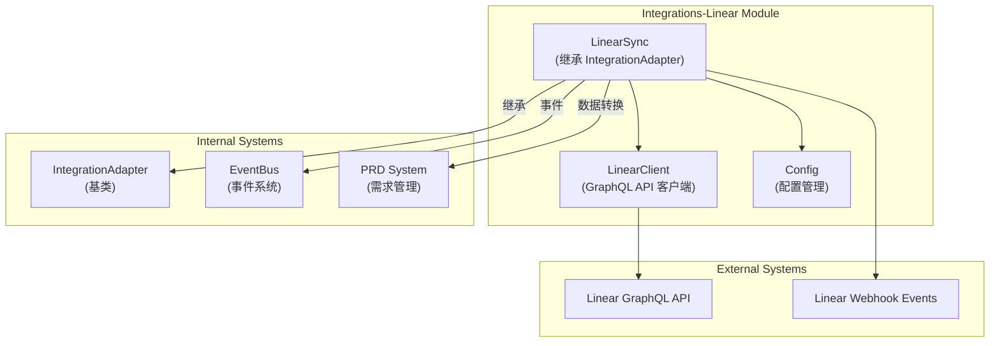
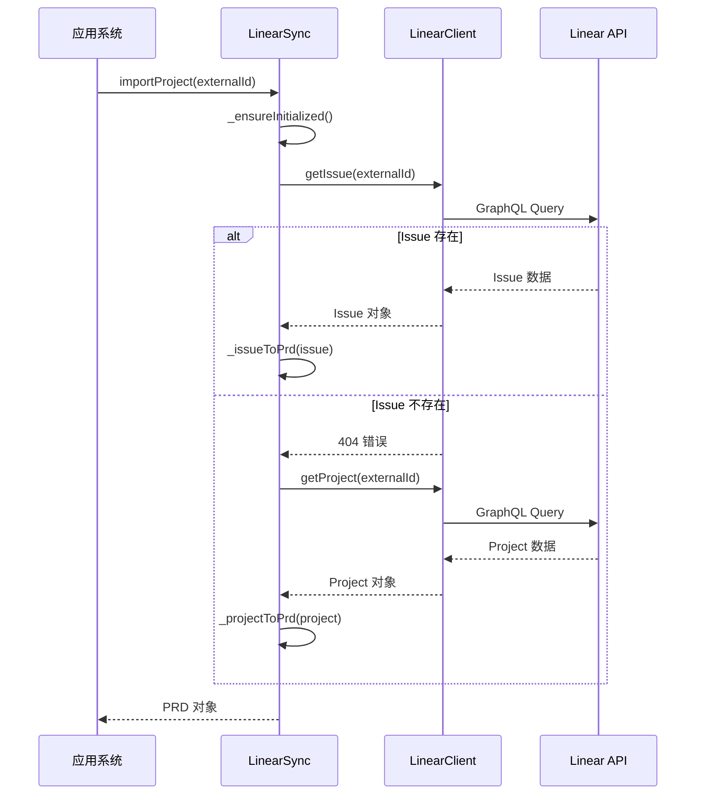
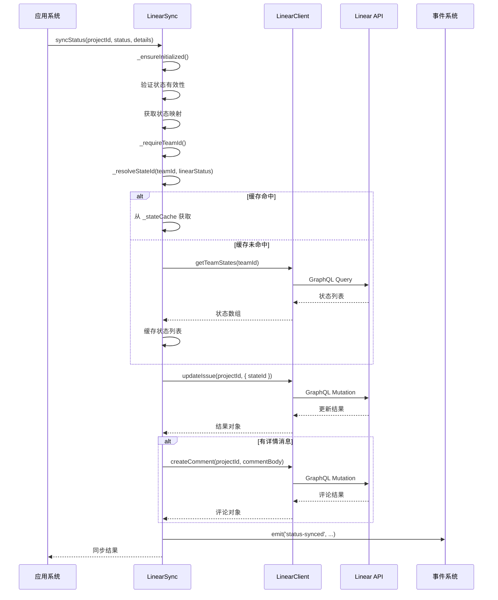
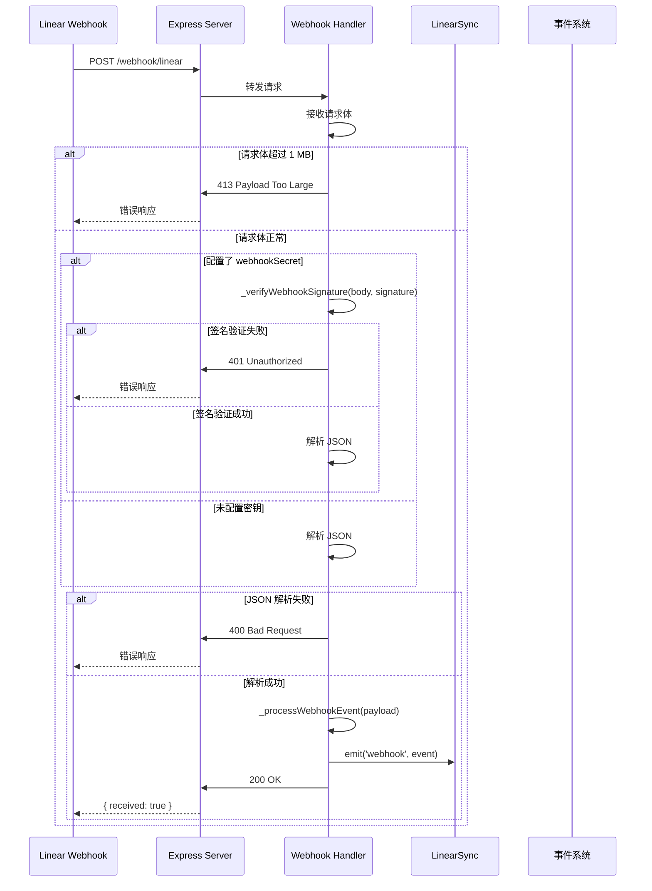

# Integrations-Linear 模块文档

## 目录
1. [模块概述](#模块概述)
2. [核心组件](#核心组件)
3. [架构设计](#架构设计)
4. [使用指南](#使用指南)
5. [配置说明](#配置说明)
6. [事件与通知](#事件与通知)
7. [错误处理](#错误处理)
8. [最佳实践](#最佳实践)
9. [参考模块](#参考模块)

---

## 模块概述

Integrations-Linear 模块是系统与 Linear 项目管理平台的集成适配器，负责实现双向的数据同步和交互。该模块提供了从 Linear 导入项目/任务、同步状态更新、发布评论、创建子任务以及处理 Webhook 事件等核心功能。

### 设计理念

本模块采用适配器模式设计，继承自通用的 `IntegrationAdapter` 基类，确保与其他集成模块（如 Jira、Slack、Teams）保持一致的接口和行为。模块设计注重可靠性，包含了速率限制处理、请求重试机制、状态缓存等特性，以应对 API 限制和网络异常情况。

### 主要功能

- **项目/任务导入**：支持从 Linear 导入单个 Issue 或完整 Project 作为系统内部的 PRD（产品需求文档）
- **状态同步**：将系统内部的 RARV（REASON、ACT、REFLECT、VERIFY、DONE）状态映射到 Linear 的工作流状态
- **评论发布**：在 Linear Issue 上发布自动化评论
- **子任务创建**：基于系统任务批量创建 Linear 子 Issue
- **Webhook 处理**：接收和验证 Linear 的 Webhook 事件，实现实时更新

---

## 核心组件

### LinearClient

`LinearClient` 是 Linear GraphQL API 的轻量级客户端实现，使用 Node.js 内置的 `https` 模块，无外部依赖。

#### 主要功能

- 执行 GraphQL 查询和变更操作
- 管理速率限制状态
- 处理 API 错误和异常
- 提供便捷的 Issue 和 Project 操作方法

#### 核心方法

**构造函数**
```javascript
constructor(apiKey, options = {})
```
- **参数**：
  - `apiKey`：Linear API 密钥（必需）
  - `options`：可选配置对象
    - `timeout`：请求超时时间（毫秒，默认 15000）
- **异常**：如果未提供 API 密钥，将抛出 `Error`

**graphql**
```javascript
async graphql(query, variables = {})
```
- **功能**：执行 GraphQL 查询或变更
- **参数**：
  - `query`：GraphQL 查询字符串
  - `variables`：查询变量对象
- **返回值**：Promise，解析为响应数据对象
- **异常**：
  - `RateLimitError`：当超过 API 速率限制时
  - `LinearApiError`：当 API 返回错误状态码或 GraphQL 错误时

**getIssue**
```javascript
async getIssue(issueId)
```
- **功能**：获取单个 Issue 的详细信息
- **参数**：`issueId` - Linear Issue ID
- **返回值**：Promise，解析为 Issue 对象，包含标识符、标题、描述、优先级、状态、经办人、标签、父子关系、关联关系等信息

**getProject**
```javascript
async getProject(projectId)
```
- **功能**：获取 Project 及其包含的 Issues
- **参数**：`projectId` - Linear Project ID
- **返回值**：Promise，解析为 Project 对象，包含名称、描述、状态、负责人、Issue 列表等

**updateIssue**
```javascript
async updateIssue(issueId, input)
```
- **功能**：更新 Issue 的字段（如状态、标题、描述等）
- **参数**：
  - `issueId`：Issue ID
  - `input`：包含要更新字段的对象（如 `stateId`、`title`、`description`）
- **返回值**：Promise，解析为更新结果对象

**createComment**
```javascript
async createComment(issueId, body)
```
- **功能**：在 Issue 上创建评论
- **参数**：
  - `issueId`：Issue ID
  - `body`：评论内容（支持 Markdown）
- **返回值**：Promise，解析为评论创建结果

**createSubIssue**
```javascript
async createSubIssue(parentId, teamId, title, description)
```
- **功能**：创建子 Issue
- **参数**：
  - `parentId`：父 Issue ID
  - `teamId`：团队 ID
  - `title`：子 Issue 标题
  - `description`：可选的子 Issue 描述
- **返回值**：Promise，解析为子 Issue 创建结果

**getTeamStates**
```javascript
async getTeamStates(teamId)
```
- **功能**：获取团队的工作流状态列表（用于状态名称到 ID 的映射）
- **参数**：`teamId` - 团队 ID
- **返回值**：Promise，解析为状态对象数组

#### 错误类

**LinearApiError**
- 继承自 `Error`
- 属性：
  - `statusCode`：HTTP 状态码（0 表示网络错误）

**RateLimitError**
- 继承自 `LinearApiError`
- 属性：
  - `retryAfterMs`：建议的重试等待时间（毫秒）

---

### LinearSync

`LinearSync` 是 Linear 集成的核心同步管理器，继承自 `IntegrationAdapter`，负责协调 Linear 与系统内部的数据交互。

#### 主要功能

- 配置加载和验证
- 项目/任务导入与格式转换
- 状态同步与映射
- 评论发布
- 子任务批量创建
- Webhook 事件处理与验证

#### 核心方法

**构造函数**
```javascript
constructor(config, options = {})
```
- **参数**：
  - `config`：可选的配置对象
  - `options`：可选的选项对象

**init**
```javascript
init(configDir)
```
- **功能**：初始化 LinearSync 实例
- **参数**：`configDir` - 配置文件目录
- **返回值**：布尔值，表示初始化是否成功
- **异常**：如果配置无效，将抛出 `Error`

**importProject**
```javascript
async importProject(externalId)
```
- **功能**：从 Linear 导入项目（自动识别是 Issue 还是 Project）
- **参数**：`externalId` - Linear Issue 或 Project ID
- **返回值**：Promise，解析为标准化的 PRD 对象
- **说明**：首先尝试作为 Issue 获取，如果失败则尝试作为 Project 获取

**syncStatus**
```javascript
async syncStatus(projectId, status, details)
```
- **功能**：将系统状态同步到 Linear
- **参数**：
  - `projectId`：Linear Issue ID
  - `status`：RARV 状态（REASON、ACT、REFLECT、VERIFY、DONE）
  - `details`：可选的详情对象，包含 `message` 字段用于发布评论
- **返回值**：Promise，解析为同步结果
- **异常**：如果状态无效或配置缺失，将抛出 `Error`
- **事件**：触发 `status-synced` 事件

**postComment**
```javascript
async postComment(externalId, content)
```
- **功能**：在 Linear Issue 上发布评论
- **参数**：
  - `externalId`：Linear Issue ID
  - `content`：评论内容
- **返回值**：Promise，解析为评论发布结果
- **事件**：触发 `comment-posted` 事件

**createSubtasks**
```javascript
async createSubtasks(externalId, tasks)
```
- **功能**：批量创建子任务（避免重复创建）
- **参数**：
  - `externalId`：父 Issue ID
  - `tasks`：任务对象数组，每个对象包含 `title` 和可选的 `description`
- **返回值**：Promise，解析为创建结果数组
- **事件**：触发 `subtasks-created` 事件

**getWebhookHandler**
```javascript
getWebhookHandler()
```
- **功能**：获取 Express 中间件函数，用于处理 Linear Webhook
- **返回值**：Express 中间件函数
- **功能特性**：
  - 限制请求体大小（1 MB）
  - 验证 Webhook 签名（如果配置了密钥）
  - 解析 JSON  payload
  - 处理并标准化事件
  - 触发 `webhook` 事件

#### 内部方法

**_issueToPrd**
- **功能**：将 Linear Issue 转换为标准化的 PRD 对象
- **映射内容**：
  - 基本信息（ID、标识符、标题、描述）
  - 优先级映射（Linear 数值优先级到文本优先级）
  - 标签提取
  - 状态信息
  - 经办人信息
  - 依赖关系（blocks 和 related 类型）
  - 子任务列表
  - PRD 结构化数据

**_projectToPrd**
- **功能**：将 Linear Project 转换为标准化的 PRD 对象
- **映射内容**：
  - 项目基本信息
  - 包含的 Issues 列表
  - PRD 结构化数据（将 Issues 作为需求和任务）

**_extractRequirements**
- **功能**：从描述文本中提取需求列表
- **识别模式**：
  - 以 `- ` 或 `* ` 开头的行（无序列表）
  - 以数字+点+空格开头的行（有序列表）

**_resolveStateId**
- **功能**：将状态名称解析为 Linear 状态 ID（使用缓存）
- **缓存策略**：按团队 ID 缓存状态列表，避免重复请求

**_verifyWebhookSignature**
- **功能**：验证 Linear Webhook 的 HMAC-SHA256 签名
- **安全特性**：使用 `crypto.timingSafeEqual` 防止时序攻击

---

## 架构设计

### 模块架构图



### 数据流程图

#### 项目导入流程



#### 状态同步流程



#### Webhook 处理流程



---

## 使用指南

### 基本使用

#### 初始化 LinearSync

```javascript
const { LinearSync } = require('./src/integrations/linear/sync');

// 方式 1：通过配置目录初始化
const sync = new LinearSync();
const initialized = sync.init('/path/to/config/dir');

// 方式 2：直接传入配置对象
const config = {
  apiKey: 'lin_api_xxxxxxxxxx',
  teamId: 'xxxxxxxx-xxxx-xxxx-xxxx-xxxxxxxxxxxx',
  statusMapping: {
    REASON: 'Backlog',
    ACT: 'In Progress',
    REFLECT: 'Review',
    VERIFY: 'QA',
    DONE: 'Done'
  }
};
const sync = new LinearSync(config);
const initialized = sync.init(); // 不需要 configDir
```

#### 导入项目

```javascript
// 导入 Issue
const prdFromIssue = await sync.importProject('ISSUE-123');

// 导入 Project
const prdFromProject = await sync.importProject('project-xxx');

console.log(prdFromIssue);
/*
{
  source: 'linear',
  externalId: '...',
  identifier: 'ISSUE-123',
  title: 'Implement user authentication',
  description: '...',
  priority: 'high',
  labels: ['feature', 'security'],
  status: 'In Progress',
  statusType: 'started',
  assignee: { name: 'John Doe', email: 'john@example.com' },
  url: 'https://linear.app/...',
  dependencies: [...],
  subtasks: [...],
  prd: {
    overview: 'Implement user authentication',
    description: '...',
    requirements: [...],
    priority: 'high',
    tags: ['feature', 'security']
  }
}
*/
```

#### 同步状态

```javascript
// 基本状态同步
await sync.syncStatus('ISSUE-123', 'ACT');

// 带评论的状态同步
await sync.syncStatus('ISSUE-123', 'REFLECT', {
  message: 'Initial implementation complete. Ready for review.'
});
```

#### 发布评论

```javascript
await sync.postComment('ISSUE-123', `
## Automated Update

The system has completed the following tasks:
- Generated test cases
- Ran security scan
- Updated documentation

All checks passed.
`);
```

#### 创建子任务

```javascript
const tasks = [
  { title: 'Design database schema', description: 'Create ER diagram and schema definition' },
  { title: 'Implement API endpoints', description: 'RESTful API for CRUD operations' },
  { title: 'Write unit tests', description: 'Achieve 80% test coverage' }
];

const results = await sync.createSubtasks('ISSUE-123', tasks);
console.log(`Created ${results.length} subtasks`);
```

#### 处理 Webhook

```javascript
const express = require('express');
const app = express();

// 获取 Webhook 处理器
const webhookHandler = sync.getWebhookHandler();

// 注册路由
app.post('/webhook/linear', webhookHandler);

// 监听事件
sync.on('webhook', (event) => {
  console.log('Received Linear webhook:', event);
  // 处理事件：
  // - action: 'create', 'update', 'delete' 等
  // - type: 'Issue', 'Comment', 'Project' 等
  // - data: 事件数据
  // - updatedFrom: 更新前的值（如果是 update 事件）
});

app.listen(3000);
```

---

## 配置说明

### 配置文件结构

Linear 集成的配置文件通常位于 `.loki/config.yaml`，结构如下：

```yaml
linear:
  apiKey: "lin_api_xxxxxxxxxxxxxxxxxxxxxxxxxxxxxxxx"
  teamId: "xxxxxxxx-xxxx-xxxx-xxxx-xxxxxxxxxxxx"
  webhookSecret: "your-webhook-secret-here"
  statusMapping:
    REASON: "Backlog"
    ACT: "In Progress"
    REFLECT: "Review"
    VERIFY: "QA"
    DONE: "Done"
```

### 配置项详解

**apiKey** (必需)
- 类型：字符串
- 说明：Linear API 密钥
- 获取方式：Linear 设置 → API → 新建个人 API 密钥

**teamId** (必需)
- 类型：字符串
- 说明：Linear 团队 ID
- 获取方式：在 Linear 中访问团队设置，URL 中的 UUID 即为团队 ID

**webhookSecret** (可选)
- 类型：字符串
- 说明：用于验证 Linear Webhook 签名的密钥
- 安全性：强烈建议配置，以防止伪造的 Webhook 请求

**statusMapping** (可选)
- 类型：对象
- 说明：将系统 RARV 状态映射到 Linear 工作流状态
- 默认值：
  ```javascript
  {
    REASON: 'Backlog',
    ACT: 'In Progress',
    REFLECT: 'Review',
    VERIFY: 'QA',
    DONE: 'Done'
  }
  ```
- 注意：映射的状态名称必须与 Linear 团队中实际配置的状态名称一致（不区分大小写）

---

## 事件与通知

LinearSync 继承自 EventEmitter，会在关键操作完成时触发事件。

### 事件列表

**status-synced**
- **触发时机**：状态同步成功后
- **事件数据**：
  ```javascript
  {
    externalId: 'issue-id',
    status: 'ACT',
    linearStatus: 'In Progress',
    stateId: 'state-id'
  }
  ```

**comment-posted**
- **触发时机**：评论发布成功后
- **事件数据**：
  ```javascript
  {
    externalId: 'issue-id',
    commentId: 'comment-id'
  }
  ```

**subtasks-created**
- **触发时机**：子任务创建完成后
- **事件数据**：
  ```javascript
  {
    externalId: 'issue-id',
    count: 3
  }
  ```

**webhook**
- **触发时机**：收到并处理 Linear Webhook 后
- **事件数据**：
  ```javascript
  {
    action: 'update',
    type: 'Issue',
    data: { /* Linear 事件数据 */ },
    updatedFrom: { /* 更新前的值 */ },
    timestamp: '2024-01-01T00:00:00.000Z',
    processed: true
  }
  ```

---

## 错误处理

### 错误类型

**LinearApiError**
- 场景：API 请求失败、网络错误、响应解析失败
- 属性：
  - `message`：错误描述
  - `statusCode`：HTTP 状态码（0 表示网络错误）

**RateLimitError**
- 场景：超过 Linear API 速率限制
- 属性：
  - `message`：错误描述
  - `statusCode`：429
  - `retryAfterMs`：建议的重试等待时间（毫秒）

**配置错误**
- 场景：配置缺失、无效状态映射
- 类型：普通 `Error`

### 错误处理示例

```javascript
const { LinearSync } = require('./src/integrations/linear/sync');
const { RateLimitError, LinearApiError } = require('./src/integrations/linear/client');

const sync = new LinearSync(config);

async function safeSyncStatus(issueId, status, details) {
  try {
    await sync.syncStatus(issueId, status, details);
    console.log('Status synced successfully');
  } catch (error) {
    if (error instanceof RateLimitError) {
      console.warn(`Rate limited. Retry after ${error.retryAfterMs}ms`);
      // 实现指数退避重试
      setTimeout(() => safeSyncStatus(issueId, status, details), error.retryAfterMs);
    } else if (error instanceof LinearApiError) {
      if (error.statusCode === 404) {
        console.error('Issue not found');
      } else if (error.statusCode === 401) {
        console.error('Invalid API key');
      } else {
        console.error(`API error (${error.statusCode}): ${error.message}`);
      }
    } else {
      console.error('Unexpected error:', error.message);
    }
  }
}
```

---

## 最佳实践

### 1. 错误重试策略

对于 RateLimitError，建议实现指数退避重试：

```javascript
async function withRetry(fn, maxRetries = 3, baseDelay = 1000) {
  let retries = 0;
  while (true) {
    try {
      return await fn();
    } catch (error) {
      if (error instanceof RateLimitError) {
        if (retries >= maxRetries) throw error;
        const delay = error.retryAfterMs || baseDelay * Math.pow(2, retries);
        await new Promise(resolve => setTimeout(resolve, delay));
        retries++;
      } else {
        throw error;
      }
    }
  }
}
```

### 2. Webhook 安全

始终配置 `webhookSecret` 并使用 HTTPS 端点：

```yaml
linear:
  webhookSecret: "${LINEAR_WEBHOOK_SECRET}"  # 使用环境变量
```

### 3. 状态映射验证

初始化后验证状态映射的有效性：

```javascript
async function validateStatusMapping(sync) {
  const teamId = sync.config.teamId;
  const states = await sync.client.getTeamStates(teamId);
  const stateNames = new Set(states.map(s => s.name.toLowerCase()));
  
  const mapping = sync.config.statusMapping || DEFAULT_STATUS_MAPPING;
  for (const [rarvStatus, linearStatus] of Object.entries(mapping)) {
    if (!stateNames.has(linearStatus.toLowerCase())) {
      console.warn(`Status "${linearStatus}" (mapped from ${rarvStatus}) not found in team states`);
    }
  }
}
```

### 4. 批量操作

对于大量子任务，考虑分批创建以避免速率限制：

```javascript
async function createSubtasksInBatches(externalId, tasks, batchSize = 5) {
  const results = [];
  for (let i = 0; i < tasks.length; i += batchSize) {
    const batch = tasks.slice(i, i + batchSize);
    const batchResults = await sync.createSubtasks(externalId, batch);
    results.push(...batchResults);
    if (i + batchSize < tasks.length) {
      await new Promise(resolve => setTimeout(resolve, 1000));
    }
  }
  return results;
}
```

### 5. 监控和日志

监听所有事件并记录日志：

```javascript
sync.on('status-synced', (data) => {
  logger.info('Status synced', data);
});

sync.on('comment-posted', (data) => {
  logger.info('Comment posted', data);
});

sync.on('subtasks-created', (data) => {
  logger.info('Subtasks created', data);
});

sync.on('webhook', (event) => {
  logger.debug('Webhook received', event);
});
```

---

## 参考模块

- [Integrations-Jira](Integrations-Jira.md) - Jira 平台集成模块，提供类似的项目管理集成功能
- [Integrations-Slack](Integrations-Slack.md) - Slack 消息平台集成模块
- [Integrations-Teams](Integrations-Teams.md) - Microsoft Teams 集成模块
- [Plugin System](Plugin-System.md) - 插件系统，了解如何将集成模块作为插件加载
- [API Server & Services](API-Server-&-Services.md) - API 服务器和核心服务，了解集成模块如何与系统其他部分交互

---

## 附录

### A. 优先级映射

Linear 使用数值优先级，本模块将其映射为文本优先级：

| Linear 数值 | 映射结果 |
|------------|---------|
| 0 | none |
| 1 | urgent |
| 2 | high |
| 3 | medium |
| 4 | low |

### B. RARV 状态说明

- **REASON**：理解和分析问题阶段
- **ACT**：执行解决方案阶段
- **REFLECT**：反思和审查阶段
- **VERIFY**：验证和测试阶段
- **DONE**：完成阶段

### C. API 速率限制

Linear API 的标准速率限制为：
- 每分钟 250 个请求
- 每小时 2500 个请求

客户端会跟踪 `x-ratelimit-remaining` 和 `x-ratelimit-reset` 头，并在超出限制时抛出 `RateLimitError`。
