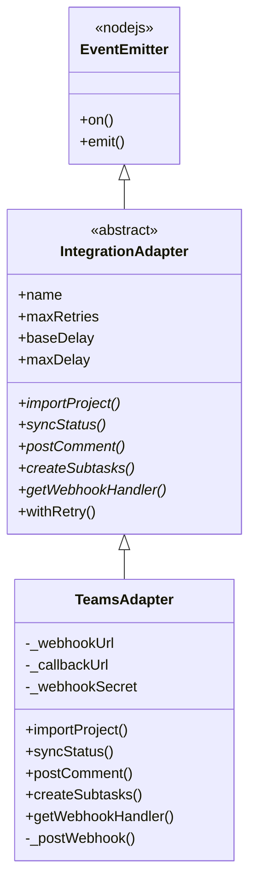
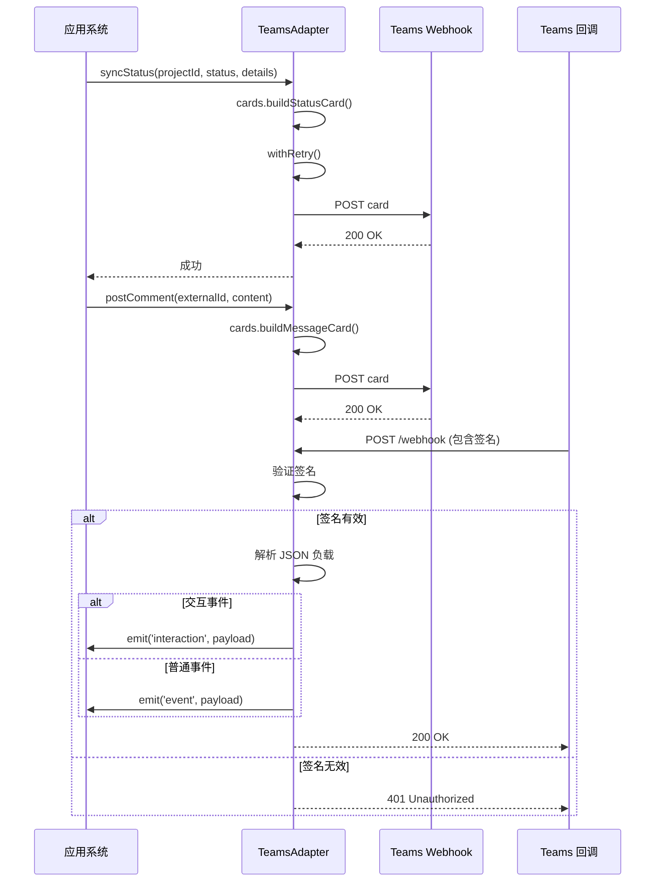

# Integrations-Teams 模块文档

## 概述

Integrations-Teams 模块提供了与 Microsoft Teams 平台的集成功能，使系统能够与 Teams 进行双向通信。该模块实现了状态同步、消息通知、任务列表创建等功能，并支持接收来自 Teams 的交互式回调事件。

### 设计理念

Teams 集成采用了适配器模式，继承自通用的 `IntegrationAdapter` 基类，确保了与其他集成模块（如 Jira、Linear、Slack）的接口一致性。该模块专注于利用 Teams 的 Webhook 机制进行消息推送，并提供安全的回调处理能力，支持交互式操作（如审批按钮）。

### 核心功能

- **状态同步**：将项目状态实时推送至 Teams 频道
- **消息通知**：向 Teams 发送自定义内容的消息卡片
- **任务列表**：在 Teams 中展示结构化的任务列表
- **交互式回调**：支持处理 Teams 中的按钮点击等交互事件
- **安全验证**：通过 HMAC-SHA256 签名确保 Webhook 回调的安全性

## 核心组件

### TeamsAdapter 类

`TeamsAdapter` 是该模块的核心类，负责所有与 Teams 平台的通信和交互。

#### 类定义

```javascript
class TeamsAdapter extends IntegrationAdapter {
    constructor(options) {
        // 初始化代码
    }
    // 方法实现
}
```

#### 构造函数

**参数**：
- `options` (Object, 可选)：配置选项对象
  - `webhookUrl` (String)：Teams 入站 Webhook URL
  - `callbackUrl` (String)：回调 URL，用于 Teams 交互事件
  - `webhookSecret` (String)：用于验证回调请求签名的密钥

**环境变量支持**：
- `LOKI_TEAMS_WEBHOOK_URL`：默认 Webhook URL
- `LOKI_TEAMS_CALLBACK_URL`：默认回调 URL
- `LOKI_TEAMS_WEBHOOK_SECRET`：默认 Webhook 密钥

**使用示例**：
```javascript
const { TeamsAdapter } = require('./src/integrations/teams/adapter');

// 通过配置选项初始化
const teamsAdapter = new TeamsAdapter({
    webhookUrl: 'https://example.com/teams/webhook',
    callbackUrl: 'https://example.com/teams/callback',
    webhookSecret: 'your-secret-key'
});

// 或者通过环境变量配置（推荐生产环境使用）
process.env.LOKI_TEAMS_WEBHOOK_URL = 'https://example.com/teams/webhook';
process.env.LOKI_TEAMS_WEBHOOK_SECRET = 'your-secret-key';
const teamsAdapter = new TeamsAdapter();
```

#### 主要方法

##### importProject(externalId)

从 Teams 导入项目。由于 Teams 频道不适合直接导入项目内容，此方法返回一个基本的项目结构。

**参数**：
- `externalId` (String)：外部标识符

**返回值**：
- `Promise<Object>`：包含项目信息的对象
  - `title` (String)：项目标题
  - `content` (String)：项目内容（空字符串）
  - `source` (String)：来源标识，固定为 'teams'

**示例**：
```javascript
const project = await teamsAdapter.importProject('channel-id-123');
console.log(project);
// 输出: { title: 'Teams Import: channel-id-123', content: '', source: 'teams' }
```

##### syncStatus(projectId, status, details)

将项目状态同步到 Teams。此方法会构建一个状态卡片并通过 Webhook 发送。

**参数**：
- `projectId` (String)：项目 ID
- `status` (String)：状态值
- `details` (Object, 可选)：额外的状态详情

**返回值**：
- `Promise<void>`

**示例**：
```javascript
await teamsAdapter.syncStatus('project-123', 'IN_PROGRESS', {
    progress: 75,
    lastUpdate: '2023-05-15T10:30:00Z'
});
```

##### postComment(externalId, content)

向 Teams 发送评论消息。

**参数**：
- `externalId` (String)：外部标识符（此实现中未使用）
- `content` (String)：评论内容

**返回值**：
- `Promise<void>`

**示例**：
```javascript
await teamsAdapter.postComment('unused', '这是一条重要的更新消息！');
```

##### createSubtasks(externalId, tasks)

在 Teams 中创建任务列表卡片。

**参数**：
- `externalId` (String)：外部标识符（此实现中未使用）
- `tasks` (Array)：任务对象数组
  - `title` (String)：任务标题
  - `description` (String)：任务描述

**返回值**：
- `Promise<Array>`：包含已创建任务状态的数组
  - `id` (String)：任务 ID（使用原任务标题）
  - `status` (String)：状态，固定为 'posted'

**示例**：
```javascript
const tasks = [
    { title: '设计用户界面', description: '创建移动端和桌面端的UI设计' },
    { title: '开发后端API', description: '实现RESTful API接口' },
    { title: '编写测试用例', description: '为核心功能编写单元测试' }
];

const results = await teamsAdapter.createSubtasks('unused', tasks);
console.log(results);
// 输出: [
//   { id: '设计用户界面', status: 'posted' },
//   { id: '开发后端API', status: 'posted' },
//   { id: '编写测试用例', status: 'posted' }
// ]
```

##### getWebhookHandler()

获取用于处理 Teams Webhook 回调的 HTTP 请求处理函数。

**返回值**：
- `Function`：HTTP 请求处理函数 `(req, res) => void`

**事件**：
- `interaction`：当收到交互回调（如按钮点击）时触发
- `event`：当收到其他类型事件时触发

**安全机制**：
- 验证请求大小不超过 1MB
- 检查 `x-loki-signature` 头部的 HMAC-SHA256 签名
- 使用 `crypto.timingSafeEqual` 防止时序攻击

**示例**：
```javascript
const express = require('express');
const app = express();

// 注册 Teams webhook 处理端点
app.post('/teams/webhook', teamsAdapter.getWebhookHandler());

// 监听交互事件
teamsAdapter.on('interaction', (payload) => {
    console.log('收到 Teams 交互:', payload);
    // 处理按钮点击等交互
});

// 监听其他事件
teamsAdapter.on('event', (payload) => {
    console.log('收到 Teams 事件:', payload);
});

app.listen(3000);
```

#### 私有方法

##### _postWebhook(card)

向 Teams Webhook 发送卡片数据。

**参数**：
- `card` (Object)：Teams 卡片对象

**返回值**：
- `Promise<string>`：Webhook 响应数据

**异常**：
- 当未配置 Webhook URL 时抛出错误
- 当 HTTP 请求失败或超时时抛出错误

**配置细节**：
- 支持 HTTP 和 HTTPS 协议
- 30 秒超时设置
- 自动设置正确的 Content-Type 头部

## 架构与组件关系

### 类继承关系



### 数据流与交互

Teams 集成模块的数据流主要分为两个方向：向外发送消息和接收回调事件。



## 使用指南

### 基本配置

要使用 Teams 集成，需要进行以下配置：

1. **创建 Teams 入站 Webhook**：
   - 在 Teams 频道中添加 "Incoming Webhook" 连接器
   - 配置 Webhook 名称和图标
   - 复制生成的 Webhook URL

2. **初始化适配器**：
   ```javascript
   const { TeamsAdapter } = require('./src/integrations/teams/adapter');
   
   const teamsAdapter = new TeamsAdapter({
       webhookUrl: 'YOUR_TEAMS_WEBHOOK_URL',
       webhookSecret: 'YOUR_SECRET_KEY'  // 用于验证回调
   });
   ```

### 发送状态更新

```javascript
// 同步项目状态
teamsAdapter.syncStatus('project-123', 'DONE', {
    completionTime: '2023-05-15T14:30:00Z',
    summary: '项目已成功完成'
}).then(() => {
    console.log('状态已同步到 Teams');
}).catch(error => {
    console.error('同步失败:', error);
});
```

### 发送自定义消息

```javascript
// 发送评论或通知
teamsAdapter.postComment(null, '### 重要通知\n\n系统将在今晚进行维护，请保存好您的工作。')
    .then(() => console.log('消息已发送'))
    .catch(error => console.error('发送失败:', error));
```

### 创建任务列表

```javascript
// 创建任务列表
const tasks = [
    { title: '完成需求分析', description: '与客户确认需求细节' },
    { title: '设计系统架构', description: '制定技术方案和架构设计' },
    { title: '开发实现', description: '编写代码并进行单元测试' }
];

teamsAdapter.createSubtasks(null, tasks)
    .then(results => console.log('任务已创建:', results))
    .catch(error => console.error('创建失败:', error));
```

### 设置 Webhook 回调处理

```javascript
const express = require('express');
const app = express();

// 设置 Teams webhook 处理路由
app.post('/teams/callback', teamsAdapter.getWebhookHandler());

// 处理交互事件（如按钮点击）
teamsAdapter.on('interaction', (payload) => {
    console.log('用户交互:', payload);
    
    // 例如：处理审批按钮点击
    if (payload.value && payload.value.action === 'approve') {
        console.log('用户批准了请求');
        // 执行批准逻辑
    } else if (payload.value && payload.value.action === 'reject') {
        console.log('用户拒绝了请求');
        // 执行拒绝逻辑
    }
});

// 处理其他事件
teamsAdapter.on('event', (payload) => {
    console.log('收到事件:', payload);
});

// 启动服务器
app.listen(3000, () => {
    console.log('服务器运行在端口 3000');
});
```

## 配置与依赖

### 环境变量

| 环境变量 | 描述 | 必填 |
|---------|------|------|
| `LOKI_TEAMS_WEBHOOK_URL` | Teams 入站 Webhook URL | 是（除非通过 options 提供） |
| `LOKI_TEAMS_CALLBACK_URL` | 回调 URL | 否 |
| `LOKI_TEAMS_WEBHOOK_SECRET` | 用于验证回调签名的密钥 | 是（使用 webhook 时） |

### 依赖项

- `../adapter`：提供 `IntegrationAdapter` 基类
- `./cards`：提供 Teams 卡片构建函数
- Node.js 内置模块：
  - `crypto`：用于 HMAC 签名验证
  - `https` 和 `http`：用于发送 Webhook 请求
  - `url`：用于解析 Webhook URL

## 注意事项与限制

### 安全考虑

1. **签名验证**：始终配置 `webhookSecret` 以确保回调请求的真实性。未配置密钥时，所有回调请求将被拒绝（401 Unauthorized）。

2. **HTTPS**：生产环境中应使用 HTTPS 协议保护回调端点。

3. **密钥管理**：不要将密钥硬编码在代码中，应使用环境变量或安全的密钥管理系统。

### 错误处理

1. **重试机制**：适配器使用指数退避算法进行重试，默认最多重试 3 次。可通过构造函数选项自定义重试行为。

2. **超时处理**：Webhook 请求设置了 30 秒超时，超时后会自动重试。

3. **事件监听**：建议监听 `success`、`retry` 和 `failure` 事件以监控操作状态：

```javascript
teamsAdapter.on('success', ({ integration, operation, attempt }) => {
    console.log(`${operation} 成功，尝试次数: ${attempt + 1}`);
});

teamsAdapter.on('retry', ({ integration, operation, attempt, delay, error }) => {
    console.log(`${operation} 失败，${delay}ms 后进行第 ${attempt} 次重试: ${error}`);
});

teamsAdapter.on('failure', ({ integration, operation, error, attempts }) => {
    console.error(`${operation} 在 ${attempts} 次尝试后失败: ${error}`);
});
```

### 限制与约束

1. **导入功能限制**：由于 Teams 频道结构不适合直接导入为项目，`importProject` 方法仅返回基本结构。如需完整的项目导入功能，考虑使用其他集成（如 Jira 或 Linear）。

2. **消息大小限制**：Webhook 请求体被限制为 1MB，超过此限制的请求将被拒绝。

3. **卡片格式**：依赖于 `./cards` 模块中的卡片构建函数，确保这些函数生成的卡片符合 Teams 消息卡片格式规范。

4. **任务创建限制**：`createSubtasks` 方法不会在 Teams 中创建真正的 Planner 任务，而是发送一个任务列表卡片。如需真正的任务集成，需要扩展功能以使用 Microsoft Graph API。

## 扩展与自定义

### 自定义重试策略

可以通过构造函数选项自定义重试行为：

```javascript
const teamsAdapter = new TeamsAdapter({
    webhookUrl: 'YOUR_WEBHOOK_URL',
    maxRetries: 5,           // 增加重试次数
    baseDelay: 2000,         // 增加初始延迟
    maxDelay: 60000           // 增加最大延迟
});
```

### 自定义卡片

虽然当前实现依赖内部的 `cards` 模块，但可以通过继承 `TeamsAdapter` 并重写相关方法来自定义卡片：

```javascript
class CustomTeamsAdapter extends TeamsAdapter {
    async syncStatus(projectId, status, details) {
        return this.withRetry('syncStatus', async () => {
            // 创建自定义卡片
            const customCard = {
                '@type': 'MessageCard',
                '@context': 'https://schema.org/extensions',
                'summary': `状态更新: ${status}`,
                'themeColor': status === 'DONE' ? '008000' : '0000FF',
                'sections': [{
                    'activityTitle': `项目 ${projectId} 状态更新`,
                    'activitySubtitle': `新状态: ${status}`,
                    'facts': Object.entries(details || {}).map(([key, value]) => ({
                        name: key,
                        value: String(value)
                    }))
                }]
            };
            
            await this._postWebhook(customCard);
        });
    }
}
```

## 相关模块

- [Integrations](Integrations.md)：集成模块的通用文档
- [Integrations-Jira](Integrations-Jira.md)：Jira 集成模块
- [Integrations-Linear](Integrations-Linear.md)：Linear 集成模块
- [Integrations-Slack](Integrations-Slack.md)：Slack 集成模块
- [Plugin System](Plugin-System.md)：了解如何将集成作为插件加载
