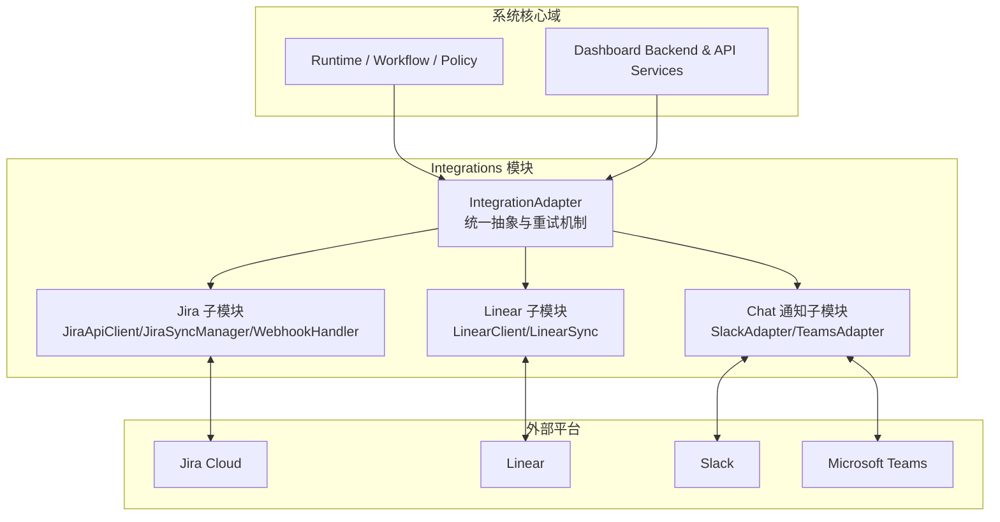
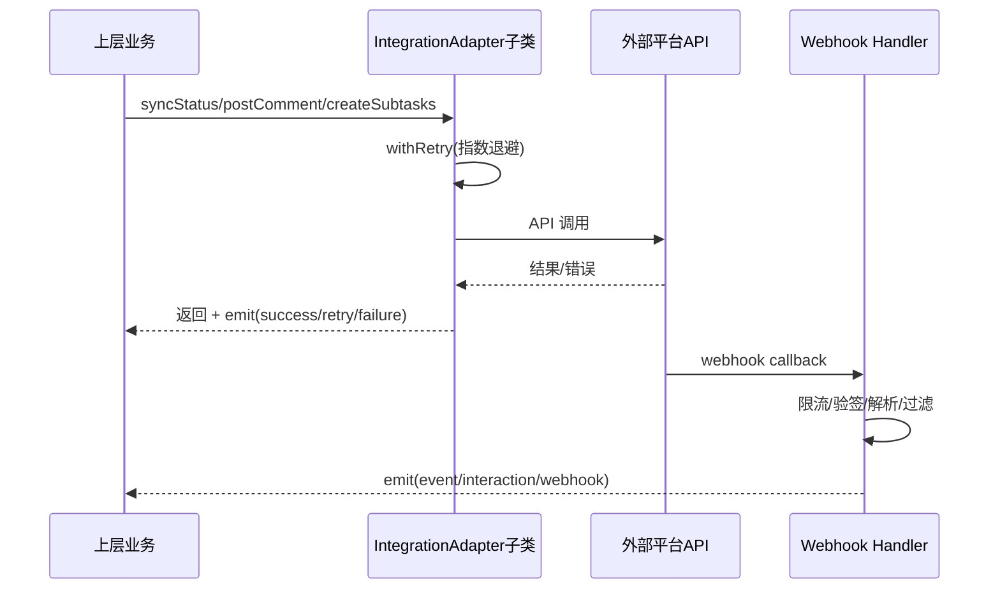
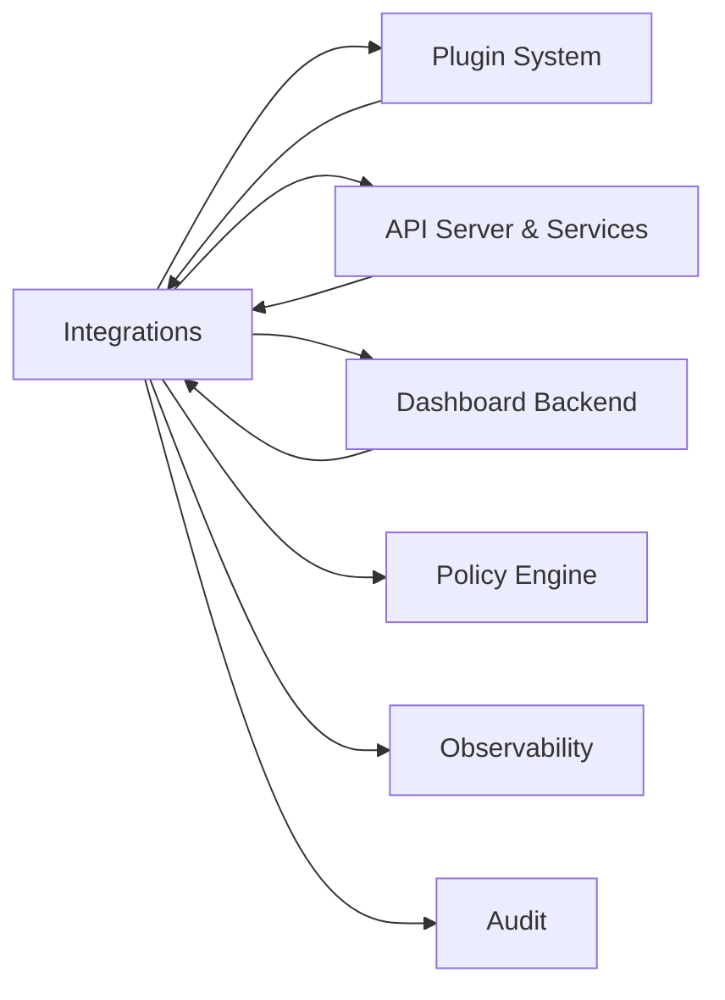

# Integrations 模块文档

## 1. 模块定位与设计目标

`Integrations` 模块是系统对接外部协作与项目管理生态的统一边界层，负责把内部运行语义（如 RARV 阶段、任务拆解、质量结果、部署链接、人工审批交互）映射到外部平台（Jira、Linear、Slack、Teams），并把外部事件（Webhook）安全地回流到系统。它存在的根本原因是：内部系统关注“执行与治理”，外部工具关注“协作与记录”，二者在数据结构、状态定义、交互方式上天然不一致；没有适配层就会导致业务逻辑散落在各服务中，难以维护与扩展。

> 可以把 `Integrations` 想象成“机场的国际转机层”：
> - 内部系统说的是一套“本地流程语言”（RARV、策略结果、运行事件）
> - 外部平台各说各的“国家语言”（Jira workflow、Linear GraphQL、Slack/Teams webhook）
> - `Integrations` 不创造业务本身，但保证“语义翻译 + 安全通关 + 稳定投递”

从代码设计上看，该模块采用“抽象契约 + 平台适配器”的方式：通过 `IntegrationAdapter` 约束统一能力（导入、状态同步、评论、子任务、Webhook），具体平台实现只关心自己协议与语义。这样做的收益是可组合、可替换、可观测：上层不必知道 Jira 是 REST 还是 Linear 是 GraphQL，也不必关心 Slack/Teams 各自签名细节。

### 1.1 新同学最关心的 5 个问题（速答）

1. **它解决什么问题？** 解决“内部执行语义”和“外部协作语义”不一致的问题，避免业务层直接耦合多平台 API。  
2. **心智模型是什么？** 一个统一的 `IntegrationAdapter` 契约 + 多个具体平台翻译器。  
3. **数据怎么流动？** 出站：业务事件 → 适配器 → 外部 API；入站：外部 webhook → 验签过滤 → 适配器事件 → 内部服务。  
4. **关键权衡是什么？** 选择“统一接口 + 平台特化实现”，牺牲部分平台高级能力直达性，换来可维护性与可替换性。  
5. **新人要注意什么？** Webhook 安全（验签、限流、重放）、状态映射漂移、聊天平台子任务是“通知化降级”而非真实工单创建。


---

## 2. 架构总览

### 2.1 分层架构图



该架构强调 `Integrations` 是“统一边界”而非“单个平台 SDK 封装集合”。`IntegrationAdapter` 把跨平台共性（重试、事件、生命周期）收敛，平台子模块承接异构协议细节。对调用方而言，扩展新平台时只需增加一个新适配器，不需要改动既有业务服务。

### 2.2 关键交互时序



这个时序展示了典型双向闭环：出站由适配器负责稳定投递，入站由 Webhook 处理器做安全过滤并转为内部事件。

---

## 3. 核心抽象：IntegrationAdapter（跨子模块共性）

`IntegrationAdapter`（源码：`src.integrations.adapter.IntegrationAdapter`）是所有平台适配器的基类，继承 `EventEmitter`，并显式禁止直接实例化（抽象类语义）。它定义了 5 个标准能力：`importProject`、`syncStatus`、`postComment`、`createSubtasks`、`getWebhookHandler`。这套契约让上层编排逻辑可以“平台无感调用”。

其最关键能力是 `withRetry(operation, fn)`：默认 `maxRetries=3`、`baseDelay=1000ms`、`maxDelay=30000ms`，采用指数退避并发射三类事件：
- `retry`：将要重试（含 attempt/delay/error）
- `success`：操作成功
- `failure`：重试耗尽

这使集成调用天然具备可观测性，也方便与 [Observability.md](Observability.md) 与 [Audit.md](Audit.md) 形成闭环。

---

## 4. 子模块功能导览（含跳转）

### 4.1 Jira 集成子模块

Jira 子模块围绕三件核心组件构建：`JiraApiClient` 负责 REST v3 通信，`JiraSyncManager` 负责 Jira 语义与内部状态映射，`WebhookHandler` 负责入站事件验签与分发。它支持 Epic 拉取并转换为 PRD、状态迁移、质量评论、部署链接写回，以及 issue created/updated 事件处理。

该实现偏稳健、偏保守：有基础请求节流、30s 超时、10MB 响应上限；状态迁移采用“读取可用 transition 后匹配目标状态名”；Webhook 支持 HMAC 校验与 issueType 过滤。详细字段、流程和边界行为见：**[jira_integration.md](jira_integration.md)**。

### 4.2 Linear 集成子模块

Linear 子模块由 `LinearClient`（GraphQL API 客户端）与 `LinearSync`（业务同步层）组成。`LinearClient` 统一封装 GraphQL 调用、HTTP 错误、GraphQL errors 与 rate limit；`LinearSync` 处理导入策略（Issue 优先，失败回退 Project）、RARV 状态映射、状态 ID 缓存、子任务去重创建、Webhook 验签与事件标准化。

该子模块在工程上强调“失败可解释”：`LinearApiError` / `RateLimitError` 区分明确，可直接用于调度层重试/延迟策略。配置加载与校验来自 `linear/config`。详细实现与示例见：**[linear_integration.md](linear_integration.md)**。

### 4.3 Chat 通知集成子模块（Slack + Teams）

聊天通知子模块强调“通知与交互”，并不追求像 Jira/Linear 那样完整项目实体同步。`SlackAdapter` 使用 Slack Web API 发送 Block Kit 消息并处理交互事件；`TeamsAdapter` 通过 Incoming Webhook 投递卡片并接收回调。两者都遵循 `IntegrationAdapter` 契约，因此在上层可统一接入。

这类适配器通常承担人工决策入口（例如审批按钮、异常提醒）与状态广播出口。由于平台能力差异，`createSubtasks` 多为“通知化降级实现”，返回 posted 占位结果而非真实外部任务 ID。详细说明见：**[chat_notification_integrations.md](chat_notification_integrations.md)**。

---

## 5. 依赖关系与系统协作



- 与 **Plugin System**：适配器可被插件化加载与治理，见 [Plugin System.md](Plugin System.md)。
- 与 **API Server & Services**：API/运行时服务常作为状态同步与 webhook 消费入口，见 [API Server & Services.md](API Server & Services.md)。
- 与 **Dashboard Backend**：任务/项目/运行态通常由后台域模型产出并驱动同步，见 [Dashboard Backend.md](Dashboard Backend.md)。
- 与 **Policy Engine**：审批、质量、成本策略结果可作为评论或状态回写输入，见 [Policy Engine.md](Policy Engine.md)。
- 与 **Observability / Audit**：重试、失败、外部回调应纳入可观测与审计，见 [Observability.md](Observability.md)、[Audit.md](Audit.md)。

---

## 6. 配置与运行建议

不同平台配置项不同，但有一组共性：凭据（token/api key）、目标上下文（project/team/channel/webhook URL）、Webhook 密钥。建议全部走环境变量或密钥管理服务，不写入仓库。

以 Linear 为例，配置支持 `.loki/config.yaml|json` 的 `integrations.linear` 节点，并有 `validateConfig` 校验。Slack/Teams/Jira 则多通过构造参数 + 环境变量注入。对于生产环境，建议在服务启动时做“配置自检 + 明确告警”，避免运行时首次调用才暴露缺失配置。

---

## 7. 扩展新平台的推荐路径

新增集成时建议遵循现有模式：
1. 新建 `XxxAdapter extends IntegrationAdapter`，先实现最小闭环（`syncStatus` + `postComment` + `getWebhookHandler`）。
2. 将平台特有协议细节封装在客户端层（如 JiraApiClient / LinearClient 的做法），不要泄漏到业务层。
3. 对入站 Webhook 统一执行：请求体大小限制、签名校验（fail-closed）、事件白名单过滤。
4. 复用 `withRetry`，并补充业务事件 `emit`（如 `status-synced`）。
5. 为幂等场景设计去重策略（delivery id / 外部ID / title+trace token）。

---

## 8. 常见风险、边界条件与限制

Integrations 是系统最容易受外部不确定性影响的模块，以下风险应优先治理：

- **限流与超时**：不同平台限流策略不同，Jira/Linear/Slack/Teams 都可能触发节流或连接超时；建议把错误类型结构化上报。
- **Webhook 重放与伪造**：务必启用签名校验；Slack 还需检查时间窗，其他平台建议补充防重放机制。
- **语义映射失配**：内部状态到外部工作流名的映射若漂移（例如外部状态被重命名）会造成同步失败或静默不生效。
- **降级行为误解**：聊天平台的 `createSubtasks` 多为通知，不是实体创建；调用方不可把返回 ID 当外部主键。
- **幂等性不足**：Webhook 或重试可能导致重复写入；上层应按业务场景设计幂等键。

---

## 9. 实操建议（最小可行接入）

```js
// 伪代码：统一管理适配器
const adapters = [jiraSync, linearSync, slackAdapter, teamsAdapter];

for (const a of adapters) {
  a.on('retry', (e) => logger.warn('integration retry', e));
  a.on('failure', (e) => alerting.notify('integration failure', e));
}

// 统一调用
await currentAdapter.syncStatus(externalId, status, details);
```

落地时建议将“调用重试日志 + webhook 安全日志 + 外部响应摘要”三类日志统一接入观测系统，并为关键操作记录审计轨迹。

---

## 10. 文档导航

- Jira 详细文档： [jira_integration.md](jira_integration.md)
- Linear 详细文档： [linear_integration.md](linear_integration.md)
- 聊天通知集成详细文档： [chat_notification_integrations.md](chat_notification_integrations.md)
- 插件与装载机制： [Plugin System.md](Plugin System.md)
- 策略、审计、观测： [Policy Engine.md](Policy Engine.md) / [Audit.md](Audit.md) / [Observability.md](Observability.md)

如果你是首次接触本模块，建议阅读顺序：`Integrations.md` → `linear_integration.md`（语义最完整）→ `jira_integration.md` → `chat_notification_integrations.md`。
