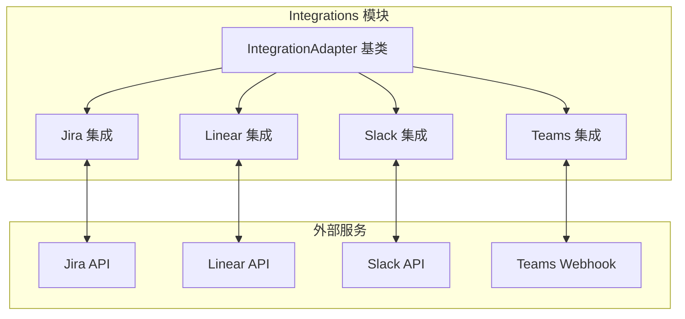

# Integrations 模块文档

## 概述

Integrations 模块是系统与外部工具和服务进行集成的核心组件。它提供了标准化的接口，使得系统能够与流行的项目管理工具（如 Jira、Linear）和协作平台（如 Slack、Microsoft Teams）进行双向通信。

### 设计理念

该模块采用适配器模式设计，为每个外部服务提供专门的适配器实现。这种架构允许：
- 统一的集成接口，便于扩展新的外部服务
- 双向同步能力，支持从外部系统导入数据和向外部系统推送状态更新
- 事件驱动的通信机制，通过 Webhook 处理实时事件
- 安全的认证和签名验证机制，确保通信的安全性

## 架构概览

### 核心组件说明

Integrations 模块包含以下主要集成组件：

1. **Jira 集成**：提供与 Jira Cloud 的双向同步，包括史诗（Epic）导入、状态同步、任务管理和 Webhook 处理。
2. **Linear 集成**：支持与 Linear 项目管理工具的集成，实现项目导入、状态同步、评论发布和子任务创建。
3. **Slack 集成**：允许在 Slack 频道中发布状态更新、处理交互式消息和接收事件。
4. **Microsoft Teams 集成**：通过自适应卡片在 Teams 中发布状态更新和处理交互。

每个集成组件都继承自 `IntegrationAdapter` 基类，该基类定义了统一的接口和公共功能，如重试机制和事件发射。

## 子模块详细文档

有关每个集成的详细信息，请参阅以下子模块文档：

- [Jira 集成](Integrations-Jira.md)：详细介绍 JiraApiClient、JiraSyncManager 和 WebhookHandler 的使用方法和配置，包括与 Jira Cloud 的双向同步、史诗转换为 PRD、状态同步、任务管理和 Webhook 处理
- [Linear 集成](Integrations-Linear.md)：说明 LinearClient 和 LinearSync 的功能和实现细节，包括项目导入、状态同步、评论发布、子任务创建和 Webhook 处理
- [Slack 集成](Integrations-Slack.md)：介绍 SlackAdapter 的使用方法和事件处理，包括状态更新发布、交互式消息处理和事件接收
- [Teams 集成](Integrations-Teams.md)：详细说明 TeamsAdapter 的配置和自适应卡片使用，包括状态更新、消息发布和交互处理

## 通用功能

### 重试机制

所有集成适配器都继承自 `IntegrationAdapter`，该基类提供了 `withRetry` 方法，用于自动重试可能失败的网络请求。这提高了在网络不稳定情况下的可靠性。

### 事件驱动架构

集成适配器使用 Node.js 的事件发射机制，在重要操作完成时发射事件，例如：
- `status-synced`：状态同步完成
- `comment-posted`：评论发布成功
- `subtasks-created`：子任务创建完成
- `webhook`：接收到 Webhook 事件

### 安全验证

所有 Webhook 处理都包含签名验证机制，确保传入的请求来自可信的源。不同的集成使用不同的验证方法：
- Jira：使用 HMAC-SHA256 签名验证
- Linear：使用 HMAC-SHA256 签名验证
- Slack：使用 Slack 特定的签名验证
- Teams：使用 HMAC-SHA256 签名验证

## 与其他模块的关系

Integrations 模块与系统中的其他模块紧密协作：

- **Dashboard 后端**：通过集成适配器同步外部项目状态到仪表板
- **Plugin System**：集成可以作为插件加载和配置
- **State Management**：同步外部状态变化到系统状态管理

## 使用指南

### 基本配置

每个集成都需要特定的配置参数，通常包括：
- API 密钥或访问令牌
- 基础 URL 或 Webhook 地址
- 项目或团队标识符
- Webhook 密钥（用于签名验证）

配置可以通过环境变量、配置文件或代码中直接传递选项来提供。

### 扩展新集成

要添加新的集成，需要：
1. 创建一个继承自 `IntegrationAdapter` 的新类
2. 实现核心方法：`importProject`、`syncStatus`、`postComment`、`createSubtasks`
3. 可选地实现 `getWebhookHandler` 方法以处理 Webhook 事件
4. 提供适当的错误处理和重试逻辑

## 注意事项

- 所有网络请求都应考虑速率限制，避免触发外部服务的限制
- Webhook 处理应该是幂等的，因为同一事件可能会被多次发送
- 应该实现适当的日志记录，以便调试集成问题
- 敏感信息（如 API 密钥）应该安全存储，不应硬编码在代码中
