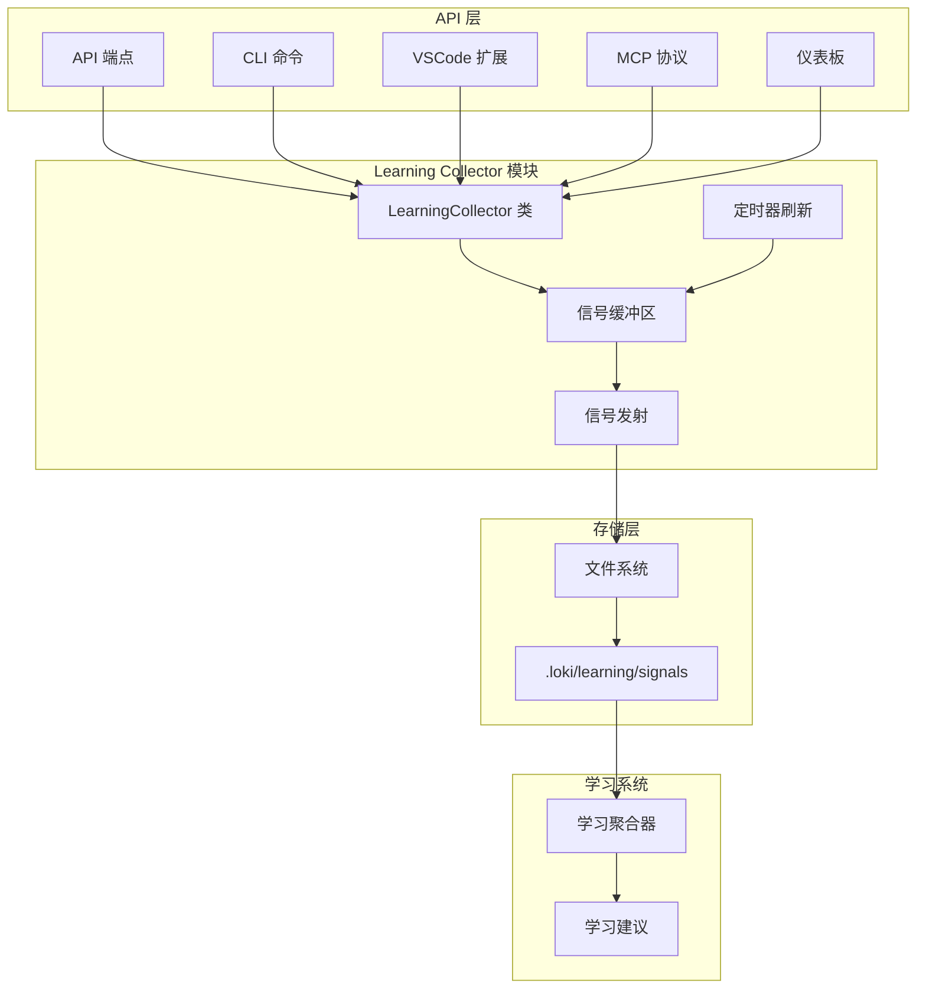
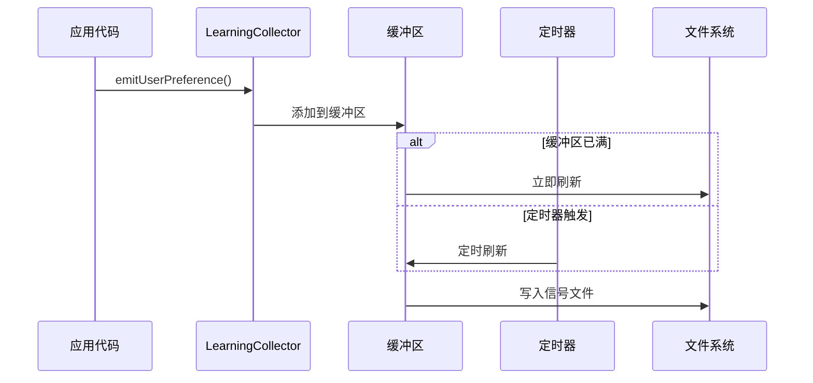

# Learning Collector 模块文档

## 目录
- [模块概述](#模块概述)
- [架构设计](#架构设计)
- [核心组件](#核心组件)
- [信号类型](#信号类型)
- [使用指南](#使用指南)
- [配置选项](#配置选项)
- [扩展性](#扩展性)
- [注意事项](#注意事项)

---

## 模块概述

Learning Collector 模块是 Loki Mode 系统中的关键组件，负责从 API 操作中收集学习信号，实现跨工具学习功能。该模块设计为异步、非阻塞的架构，确保不会影响 API 性能。

### 主要功能

- **信号收集**：从各种操作中收集学习信号，包括用户偏好、错误模式、成功模式、工具效率等
- **异步处理**：所有信号发射都是异步非阻塞的，避免影响 API 性能
- **缓冲机制**：使用内存缓冲和批量处理来优化性能
- **持久化存储**：将信号存储到文件系统中，供后续学习系统分析
- **便捷 API**：提供多种便捷方法来简化常见场景的信号发射

### 设计理念

Learning Collector 的设计遵循以下原则：

1. **性能优先**：信号收集不应影响主系统的性能
2. **可靠性**：即使在高负载下也能确保信号不丢失
3. **灵活性**：支持多种信号类型和自定义扩展
4. **兼容性**：与系统中的其他学习组件无缝集成

---

## 架构设计

### 系统架构图



### 工作流程

Learning Collector 的工作流程包括以下几个关键步骤：

1. **信号创建**：通过专用方法创建特定类型的学习信号
2. **信号缓冲**：将信号添加到内存缓冲区中
3. **批量处理**：根据缓冲区大小或定时器触发批量处理
4. **持久化存储**：将信号写入文件系统
5. **后台处理**：学习聚合器定期处理收集的信号

### 数据流向



---

## 核心组件

### LearningCollector 类

`LearningCollector` 是模块的核心类，提供信号收集、缓冲和发射功能。

#### 构造函数

```typescript
constructor(lokiDir: string = DEFAULT_LOKI_DIR)
```

**参数：**
- `lokiDir`：Loki 目录路径，默认为 `.loki`

**功能：**
初始化 LearningCollector 实例，设置目录路径并启动后台刷新定时器。

#### 主要方法

##### 信号控制方法

###### `setEnabled(enabled: boolean): void`

启用或禁用信号收集功能。

**参数：**
- `enabled`：布尔值，表示是否启用信号收集

**使用场景：**
在需要临时关闭信号收集时使用，例如在测试环境中。

###### `isCollectorEnabled(): boolean`

检查收集器是否启用。

**返回值：**
布尔值，表示收集器是否启用。

##### 缓冲区管理方法

###### `startFlushTimer(): void`

启动后台刷新定时器。

**注意：**
此方法为私有方法，内部自动调用，通常不需要手动调用。

###### `stopFlushTimer(): void`

停止后台刷新定时器。

**使用场景：**
在应用关闭前调用，以确保资源正确释放。

###### `flush(): Promise<number>`

手动刷新缓冲区中的信号到存储。

**返回值：**
成功发射的信号数量。

**使用场景：**
在应用关闭前或需要立即持久化信号时调用。

###### `getBufferSize(): number`

获取当前缓冲区中的信号数量。

**返回值：**
缓冲区中的信号数量。

##### 信号发射方法

LearningCollector 提供了多种专门的信号发射方法，每种方法对应一种信号类型。

###### `emitUserPreference()`

发射用户偏好信号。

**参数：**
- `action`：操作描述
- `preferenceKey`：偏好键
- `preferenceValue`：偏好值
- `options`：可选配置项

**使用场景：**
当用户做出表明偏好的选择时使用，如设置更改、提供程序选择、配置更新等。

###### `emitErrorPattern()`

发射错误模式信号。

**参数：**
- `action`：操作描述
- `errorType`：错误类型
- `errorMessage`：错误消息
- `options`：可选配置项

**使用场景：**
当发生可能影响未来行为的错误时使用，如 API 错误、验证失败、集成错误等。

###### `emitSuccessPattern()`

发射成功模式信号。

**参数：**
- `action`：操作描述
- `patternName`：模式名称
- `actionSequence`：操作序列
- `options`：可选配置项

**使用场景：**
当操作成功完成时使用，如会话启动、记忆检索、任务完成等。

###### `emitToolEfficiency()`

发射工具效率信号。

**参数：**
- `action`：操作描述
- `toolName`：工具名称
- `options`：可选配置项

**使用场景：**
用于跟踪 API 端点性能，如响应时间、令牌使用、成功率等。

###### `emitContextRelevance()`

发射上下文相关性信号。

**参数：**
- `action`：操作描述
- `query`：查询
- `retrievedContextIds`：检索到的上下文 ID
- `options`：可选配置项

**使用场景：**
在检索上下文/记忆时使用，如记忆查询、模式查找、技能检索等。

##### 便捷方法

LearningCollector 还提供了一些便捷方法，用于常见场景的信号发射。

###### `emitApiRequest()`

发射 API 请求信号，包含计时信息。

**参数：**
- `endpoint`：API 端点
- `method`：HTTP 方法
- `startTime`：开始时间
- `success`：是否成功
- `options`：可选配置项

**功能：**
根据请求是否成功，自动发射工具效率信号或错误模式信号。

###### `emitMemoryRetrieval()`

发射记忆检索操作信号。

**参数：**
- `query`：查询
- `retrievedIds`：检索到的 ID
- `startTime`：开始时间
- `options`：可选配置项

**功能：**
同时发射上下文相关性信号和工具效率信号。

###### `emitSessionOperation()`

发射会话操作信号。

**参数：**
- `operation`：操作类型（start/stop/pause/resume）
- `sessionId`：会话 ID
- `success`：是否成功
- `options`：可选配置项

**功能：**
根据操作是否成功，自动发射成功模式信号或错误模式信号。

###### `emitSettingsChange()`

发射设置/偏好更改信号。

**参数：**
- `settingKey`：设置键
- `newValue`：新值
- `oldValue`：旧值（可选）
- `options`：可选配置项

**功能：**
发射用户偏好信号，表示设置更改。

---

## 信号类型

Learning Collector 支持多种信号类型，每种类型用于捕获不同方面的学习信息。

### 信号类型枚举

```typescript
export const SignalType = {
  USER_PREFERENCE: "user_preference",
  ERROR_PATTERN: "error_pattern",
  SUCCESS_PATTERN: "success_pattern",
  TOOL_EFFICIENCY: "tool_efficiency",
  WORKFLOW_PATTERN: "workflow_pattern",
  CONTEXT_RELEVANCE: "context_relevance",
} as const;
```

### 信号源枚举

```typescript
export const SignalSource = {
  CLI: "cli",
  API: "api",
  VSCODE: "vscode",
  MCP: "mcp",
  MEMORY: "memory",
  DASHBOARD: "dashboard",
} as const;
```

### 结果枚举

```typescript
export const Outcome = {
  SUCCESS: "success",
  FAILURE: "failure",
  PARTIAL: "partial",
  UNKNOWN: "unknown",
} as const;
```

### 信号类型详解

#### 1. 用户偏好信号 (UserPreferenceSignal)

用于捕获用户的偏好选择。

**字段：**
- `preference_key`：偏好键（如 "code_style"）
- `preference_value`：偏好值
- `alternatives_rejected`：被拒绝的替代选项

**使用场景：**
- 用户更改设置
- 选择特定的提供程序
- 自定义配置选项

#### 2. 错误模式信号 (ErrorPatternSignal)

用于捕获错误及其解决方案。

**字段：**
- `error_type`：错误类型（如 "TypeScript compilation"）
- `error_message`：错误消息
- `resolution`：解决方案（如果已知）
- `stack_trace`：可选的堆栈跟踪
- `recovery_steps`：恢复步骤

**使用场景：**
- API 调用失败
- 验证错误
- 集成问题

#### 3. 成功模式信号 (SuccessPatternSignal)

用于捕获导致成功的操作序列。

**字段：**
- `pattern_name`：模式名称
- `action_sequence`：操作序列
- `preconditions`：前置条件
- `postconditions`：后置条件
- `duration_seconds`：持续时间

**使用场景：**
- 成功的任务完成
- 工作流程执行
- 问题解决

#### 4. 工具效率信号 (ToolEfficiencySignal)

用于捕获工具的性能指标。

**字段：**
- `tool_name`：工具名称
- `tokens_used`：使用的令牌数
- `execution_time_ms`：执行时间（毫秒）
- `success_rate`：成功率
- `alternative_tools`：替代工具

**使用场景：**
- API 端点性能监控
- 工具使用统计
- 资源消耗跟踪

#### 5. 工作流模式信号 (WorkflowPatternSignal)

用于捕获工作流模式。

**字段：**
- `workflow_name`：工作流名称
- `steps`：工作流步骤
- `parallel_steps`：可并行执行的步骤
- `branching_conditions`：分支条件
- `total_duration_seconds`：总持续时间

**注意：**
Learning Collector 模块中未直接实现此信号类型的便捷方法，但基础架构支持。

#### 6. 上下文相关性信号 (ContextRelevanceSignal)

用于捕获上下文检索的相关性。

**字段：**
- `query`：查询
- `retrieved_context_ids`：检索到的上下文 ID
- `relevant_ids`：相关 ID
- `irrelevant_ids`：不相关 ID
- `precision`：精确率
- `recall`：召回率

**使用场景：**
- 记忆检索质量评估
- 搜索结果相关性
- 上下文选择优化

---

## 使用指南

### 基本使用

#### 1. 导入和初始化

```typescript
import { learningCollector } from "./api/services/learning-collector";

// 使用单例实例（推荐）
const collector = learningCollector;

// 或者创建自定义实例
import { LearningCollector } from "./api/services/learning-collector";
const customCollector = new LearningCollector("/path/to/custom/loki/dir");
```

#### 2. 发射用户偏好信号

```typescript
// 记录用户的代码风格偏好
collector.emitUserPreference(
  "settings_change",
  "code_style",
  "typescript",
  {
    alternativesRejected: ["javascript", "python"],
    context: { project: "my-project" }
  }
);
```

#### 3. 发射错误模式信号

```typescript
try {
  // 某些可能失败的操作
  await riskyOperation();
} catch (error) {
  collector.emitErrorPattern(
    "api_call",
    "network_error",
    error.message,
    {
      resolution: "Retry with exponential backoff",
      stackTrace: error.stack,
      recoverySteps: ["wait 1s", "retry", "wait 2s", "retry again"],
      context: { endpoint: "/api/data" }
    }
  );
}
```

#### 4. 发射成功模式信号

```typescript
collector.emitSuccessPattern(
  "task_completion",
  "code_review_workflow",
  ["analyze_code", "identify_issues", "suggest_fixes", "apply_changes"],
  {
    preconditions: ["code_available", "analysis_enabled"],
    postconditions: ["code_improved", "issues_resolved"],
    durationSeconds: 45.5,
    context: { project: "my-project", complexity: "high" }
  }
);
```

#### 5. 发射工具效率信号

```typescript
const startTime = Date.now();
try {
  const result = await apiCall();
  const duration = Date.now() - startTime;
  
  collector.emitToolEfficiency(
    "api_call",
    "api:users:get",
    {
      tokensUsed: result.tokens,
      executionTimeMs: duration,
      successRate: 0.95,
      alternativeTools: ["api:users:v2", "api:users:legacy"],
      outcome: Outcome.SUCCESS,
      context: { userId: "123" }
    }
  );
} catch (error) {
  const duration = Date.now() - startTime;
  collector.emitToolEfficiency(
    "api_call",
    "api:users:get",
    {
      executionTimeMs: duration,
      successRate: 0.95,
      outcome: Outcome.FAILURE,
      context: { userId: "123", error: error.message }
    }
  );
}
```

#### 6. 发射上下文相关性信号

```typescript
const query = "How to implement authentication?";
const retrievedIds = ["mem-123", "mem-456", "mem-789"];
const relevantIds = ["mem-123", "mem-456"];

collector.emitContextRelevance(
  "memory_query",
  query,
  retrievedIds,
  {
    relevantIds,
    irrelevantIds: ["mem-789"],
    precision: 0.67,
    recall: 0.85,
    context: { taskType: "code_generation" }
  }
);
```

### 使用便捷方法

#### 1. API 请求监控

```typescript
const startTime = Date.now();
try {
  const response = await fetch("/api/data", { method: "POST" });
  const success = response.ok;
  
  collector.emitApiRequest(
    "/api/data",
    "POST",
    startTime,
    success,
    {
      statusCode: response.status,
      context: { requestId: "abc123" }
    }
  );
} catch (error) {
  collector.emitApiRequest(
    "/api/data",
    "POST",
    startTime,
    false,
    {
      errorMessage: error.message,
      context: { requestId: "abc123" }
    }
  );
}
```

#### 2. 记忆检索监控

```typescript
const startTime = Date.now();
const query = "Best practices for error handling";
const results = await memorySystem.retrieve(query);

collector.emitMemoryRetrieval(
  query,
  results.map(r => r.id),
  startTime,
  {
    taskType: "documentation",
    relevantIds: results.filter(r => r.relevant).map(r => r.id),
    context: { userRole: "developer" }
  }
);
```

#### 3. 会话操作监控

```typescript
// 启动会话
collector.emitSessionOperation(
  "start",
  "session-123",
  true,
  {
    provider: "claude",
    durationMs: 1500,
    context: { project: "my-project" }
  }
);

// 会话失败
collector.emitSessionOperation(
  "stop",
  "session-123",
  false,
  {
    errorMessage: "Connection timeout",
    context: { errorCode: "ECONNTIMEOUT" }
  }
);
```

#### 4. 设置更改监控

```typescript
collector.emitSettingsChange(
  "theme",
  "dark",
  "light",
  {
    source: "dashboard",
    context: { userId: "user-123" }
  }
);
```

### 高级用法

#### 1. 手动控制缓冲区

```typescript
// 检查缓冲区大小
const bufferSize = collector.getBufferSize();
console.log(`当前缓冲区中有 ${bufferSize} 个信号`);

// 手动刷新缓冲区
const emittedCount = await collector.flush();
console.log(`成功发射 ${emittedCount} 个信号`);

// 停止刷新定时器（在应用关闭前）
collector.stopFlushTimer();
```

#### 2. 临时禁用信号收集

```typescript
// 禁用信号收集
collector.setEnabled(false);

// 执行一些不需要收集信号的操作
await sensitiveOperation();

// 重新启用信号收集
collector.setEnabled(true);
```

---

## 配置选项

### 构造函数配置

| 配置项 | 类型 | 默认值 | 说明 |
|--------|------|--------|------|
| `lokiDir` | `string` | `".loki"` | Loki 目录路径 |

### 内部配置常量

LearningCollector 类内部有一些可配置的常量，虽然没有直接暴露为公共 API，但了解它们有助于理解系统行为：

| 常量 | 默认值 | 说明 |
|------|--------|------|
| `maxBufferSize` | `50` | 缓冲区最大大小，超过此值会立即刷新 |
| `flushIntervalMs` | `5000` | 刷新间隔（毫秒） |
| `DEFAULT_LOKI_DIR` | `".loki"` | 默认 Loki 目录 |

### 信号存储位置

信号文件存储在以下路径：

```
{lokiDir}/learning/signals/{timestamp}_{signalId}.json
```

例如：
```
.loki/learning/signals/2023-05-20T14-30-00.000Z_sig-abc12345.json
```

---

## 扩展性

### 创建自定义信号类型

虽然 LearningCollector 提供了预定义的信号类型，但你可以通过以下方式扩展：

1. **使用基础信号接口**：
```typescript
// 创建自定义信号
const customSignal = createSignal(
  "custom_type" as SignalType,
  SignalSource.API,
  "custom_action",
  {
    context: { customField: "value" },
    metadata: { additionalInfo: "more data" }
  }
);
```

2. **直接使用 queueSignal 方法**：
虽然 `queueSignal` 是私有方法，但你可以通过创建自定义的发射方法来扩展功能。

### 与其他模块集成

Learning Collector 设计为与系统中的其他学习组件无缝集成：

1. **与 Memory System 集成**：
   - 使用 `emitMemoryRetrieval()` 方法记录记忆检索操作
   - 信号会被存储并用于改进未来的检索结果

2. **与 Dashboard 集成**：
   - 仪表板组件可以显示收集的学习信号
   - 参考 [Dashboard UI Components](Dashboard%20UI%20Components.md) 了解更多

3. **与 Learning Aggregator 集成**：
   - 收集的信号会被学习聚合器处理
   - 生成学习建议和改进建议

---

## 注意事项

### 性能考虑

1. **异步操作**：所有信号发射都是异步的，但创建信号对象本身仍有一些开销。在性能关键路径上，考虑是否真的需要发射信号。

2. **缓冲区大小**：默认的缓冲区大小为 50，刷新间隔为 5 秒。根据你的使用场景，可能需要调整这些值：
   - 高吞吐量场景：增大缓冲区大小
   - 低延迟场景：减小刷新间隔

3. **文件 I/O**：信号最终会写入文件系统，确保存储位置有足够的磁盘空间。

### 错误处理

1. **信号发射失败**：如果信号发射失败，错误会被记录到控制台，但不会影响主应用流程。

2. **无效信号**：虽然 LearningCollector 内部会创建有效的信号，但如果你直接使用底层函数，确保信号符合预期格式。

3. **目录创建**：如果信号目录无法创建，会抛出错误。确保应用有适当的文件系统权限。

### 资源管理

1. **定时器清理**：在应用关闭前，记得调用 `stopFlushTimer()` 来清理定时器，防止内存泄漏。

2. **缓冲区刷新**：在应用关闭前，调用 `flush()` 确保所有缓冲的信号都被持久化。

### 数据隐私

1. **敏感信息**：避免在信号中包含敏感信息，如密码、令牌等。

2. **上下文过滤**：使用 `context` 字段时，确保不包含不应被记录的信息。

### 限制

1. **信号类型限制**：LearningCollector 主要关注 API 层的信号收集，对于其他来源（如 CLI、VSCode），可能需要使用相应的专用收集器。

2. **工作流模式信号**：当前版本没有提供 `WORKFLOW_PATTERN` 信号的便捷方法，需要使用基础方法创建。

3. **信号验证**：与 `learning/signals.ts` 模块不同，Learning Collector 不执行严格的信号验证，依赖于内部工厂函数确保信号有效性。

---

## 相关模块

- [API Server & Services](API%20Server%20&%20Services.md)：包含 Learning Collector 的父模块
- [Event Bus](Event%20Bus.md)：事件总线，可与 Learning Collector 配合使用
- [Memory System](Memory%20System.md)：记忆系统，Learning Collector 会收集其操作信号
- [Dashboard UI Components](Dashboard%20UI%20Components.md)：仪表板组件，可显示学习信号

---

## 总结

Learning Collector 模块是 Loki Mode 学习系统的基础组件，提供了灵活、高效的信号收集机制。通过使用这个模块，系统可以持续学习和改进，为用户提供更好的体验。

无论是记录用户偏好、跟踪错误模式，还是监控工具性能，Learning Collector 都提供了简单易用的 API，同时确保对主系统性能的影响最小化。
