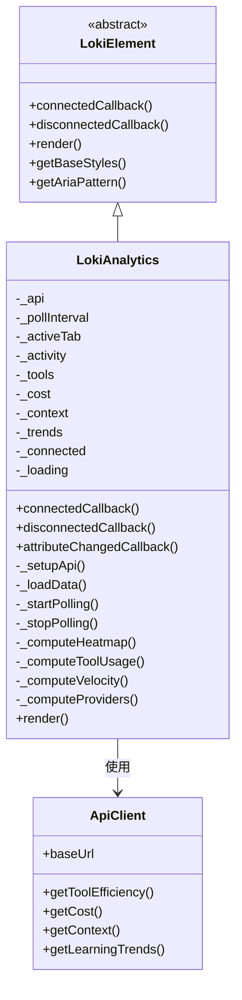

# LokiAnalytics 模块文档

## 概述

LokiAnalytics 是一个功能强大的分析仪表板 Web Component，提供跨提供商的数据分析能力，包括活动热力图、工具使用统计、执行速度指标和提供商对比分析。该组件采用纯 CSS 可视化方式实现，无需依赖外部图表库，并通过客户端数据聚合处理从现有 API 端点获取的数据。

### 主要特性

- **活动热力图**：可视化展示 52 周的活动频率分布
- **工具使用统计**：统计和显示工具调用频率的横向条形图
- **执行速度指标**：计算迭代速率、总迭代次数，并提供每小时活动趋势图
- **提供商对比**：按 AI 模型提供商（Claude、Codex、Gemini 等）进行成本、Token 使用量等指标的对比分析
- **响应式设计**：自适应不同屏幕尺寸的布局
- **主题支持**：支持多种主题和暗色模式
- **智能轮询**：自动刷新数据并在页面不可见时暂停轮询以节省资源

## 架构与组件关系

LokiAnalytics 组件继承自 `LokiElement` 基类，利用其主题系统和生命周期管理。组件通过 API 客户端与后端服务通信，获取分析数据并在客户端进行聚合处理。



## 核心功能详解

### 1. 组件生命周期管理

LokiAnalytics 实现了完整的 Web Component 生命周期管理：

#### `connectedCallback()`
组件挂载到 DOM 时调用，执行以下操作：
- 调用父类 `connectedCallback()` 方法
- 配置 API 客户端连接
- 初始加载分析数据
- 启动定期数据轮询

#### `disconnectedCallback()`
组件从 DOM 移除时调用，执行：
- 调用父类 `disconnectedCallback()` 方法
- 停止数据轮询定时器
- 清理事件监听器

#### `attributeChangedCallback(name, oldValue, newValue)`
监听 `api-url` 和 `theme` 属性变化，当 `api-url` 变更时重新配置 API 客户端并重新加载数据。

### 2. 数据获取与管理

#### API 设置
```javascript
_setupApi() {
  const apiUrl = this.getAttribute('api-url') || window.location.origin;
  this._api = getApiClient({ baseUrl: apiUrl });
}
```
组件支持通过 `api-url` 属性自定义 API 端点，默认使用当前页面的 origin。

#### 数据加载
```javascript
async _loadData() {
  const results = await Promise.allSettled([
    this._fetchActivity(),
    this._api.getToolEfficiency(50),
    this._api.getCost(),
    this._api.getContext(),
    this._api.getLearningTrends({ timeRange: this._toolTimeRange }),
  ]);
  // 处理各 API 响应并更新状态
}
```
组件使用 `Promise.allSettled()` 并行获取多个数据源，即使部分请求失败也不会影响其他数据的展示。

#### 智能轮询机制
```javascript
_startPolling() {
  this._pollInterval = setInterval(() => this._loadData(), 30000);
  this._visibilityHandler = () => {
    if (document.hidden) {
      if (this._pollInterval) { 
        clearInterval(this._pollInterval); 
        this._pollInterval = null; 
      }
    } else if (!this._pollInterval) {
      this._loadData();
      this._pollInterval = setInterval(() => this._loadData(), 30000);
    }
  };
  document.addEventListener('visibilitychange', this._visibilityHandler);
}
```
- 每 30 秒自动刷新数据
- 监听页面可见性变化，在页面不可见时暂停轮询，可见时恢复
- 这种优化可以节省网络请求和客户端资源

### 3. 数据分析模块

#### 3.1 活动热力图计算

```javascript
_computeHeatmap() {
  const counts = {};
  // 统计每日活动数量
  for (const entry of items) {
    const key = this._localDateKey(d);
    counts[key] = (counts[key] || 0) + 1;
  }
  
  // 构建 52 周的网格数据
  const startDate = new Date(today);
  startDate.setDate(startDate.getDate() - (52 * 7 + dayOfWeek));
  
  // 生成热力图单元格
  const cells = [];
  while (current <= endDate) {
    // ...
  }
  
  return { cells, maxCount };
}
```

热力图特点：
- 展示过去 52 周的活动频率
- 按周几和周次组织成网格布局
- 使用 5 级颜色强度表示活动量
- 支持月份标签和图例说明
- 鼠标悬停显示具体日期和活动数量

#### 3.2 工具使用统计

```javascript
_computeToolUsage() {
  const byName = {};
  for (const t of tools) {
    // 处理不同的数据结构获取工具名称和调用次数
    const name = t.tool || t.name || t.tool_name || (t.data && t.data.tool_name) || 'unknown';
    const count = t.count ?? t.calls ?? t.frequency ?? (t.data && t.data.count) ?? 1;
    byName[name] = (byName[name] || 0) + count;
  }
  
  // 排序并返回前 15 个工具
  return Object.entries(byName)
    .sort((a, b) => b[1] - a[1])
    .slice(0, 15);
}
```

工具统计特点：
- 兼容多种数据结构格式
- 按使用频率降序排列
- 展示前 15 个最常用工具
- 使用横向条形图可视化，便于比较
- 条形宽度与使用次数成正比

#### 3.3 执行速度指标

```javascript
_computeVelocity() {
  // 计算总迭代次数
  const totalIterations = Array.isArray(iterations) && iterations.length > 0
    ? iterations.length
    : ((ctx.totals && ctx.totals.iterations_tracked) || ctx.total_iterations || 0);
  
  // 计算每小时迭代速率
  if (Array.isArray(iterations) && iterations.length >= 2) {
    const spanHours = (timestamps[timestamps.length - 1] - timestamps[0]) / 3600000;
    if (spanHours > 0) {
      iterPerHour = Math.max(timestamps.length - 1, 1) / spanHours;
    }
  }
  
  // 生成每小时活动趋势数据
  const hourlyBuckets = [];
  // ...
  
  return { iterPerHour, totalIterations, hourlyBuckets };
}
```

速度指标包含：
- **迭代速率**：平均每小时的迭代次数
- **总迭代数**：累计的迭代总量
- **活动趋势**：过去 24 小时的每小时活动分布图
- 支持多种时间范围选择（1小时、24小时、7天、30天）

#### 3.4 提供商对比分析

```javascript
_computeProviders() {
  const providers = {};
  
  for (const [model, data] of Object.entries(byModel)) {
    const prov = classifyProvider(model);
    // 初始化或累加提供商数据
    providers[prov].cost += cost;
    providers[prov].tokens += tokens;
    providers[prov].models.push(model);
  }
  
  // 根据成本占比估算每个提供商的迭代次数
  for (const prov of Object.values(providers)) {
    const costShare = prov.cost / totalCost;
    prov.iterations = Math.round(costShare * totalIter);
  }
  
  return providers;
}
```

提供商识别使用关键词匹配：
```javascript
const MODEL_TO_PROVIDER = {
  opus: 'claude', sonnet: 'claude', haiku: 'claude', claude: 'claude',
  'gpt': 'codex', codex: 'codex',
  gemini: 'gemini',
};
```

提供商对比展示：
- 总成本
- 每次迭代成本
- 每次迭代 Token 使用量
- 总 Token 使用量
- 该提供商下的模型列表

## 使用说明

### 基本使用

在 HTML 中直接使用自定义元素：

```html
<loki-analytics api-url="http://localhost:57374"></loki-analytics>
```

### 属性配置

| 属性名 | 类型 | 默认值 | 说明 |
|--------|------|--------|------|
| `api-url` | string | 当前页面 origin | 后端 API 服务的基础 URL |
| `theme` | string | - | 主题设置（light、dark、high-contrast、vscode-light、vscode-dark） |

### JavaScript 编程使用

```javascript
// 创建组件实例
const analytics = document.createElement('loki-analytics');
analytics.setAttribute('api-url', 'https://api.example.com');
document.body.appendChild(analytics);

// 或使用属性设置
const analytics = new LokiAnalytics();
analytics._api.baseUrl = 'https://api.example.com';
document.body.appendChild(analytics);
```

### 与其他模块的集成

LokiAnalytics 依赖以下模块：

- [LokiElement](LokiTheme.md) - 提供主题系统和基础组件功能
- [ApiClient](DashboardBackend.md) - 提供与后端 API 通信的客户端

更多信息请参考相关模块的文档。

## 样式与主题

### CSS 变量

组件使用 CSS 自定义属性（CSS Variables）实现主题系统，主要变量包括：

```css
:host {
  --loki-accent: /* 主色调 */;
  --loki-success: /* 成功色 */;
  --loki-info: /* 信息色 */;
  --loki-text-primary: /* 主要文本颜色 */;
  --loki-text-muted: /* 次要文本颜色 */;
  --loki-bg-primary: /* 主要背景色 */;
  --loki-bg-secondary: /* 次要背景色 */;
  --loki-bg-tertiary: /* 第三级背景色 */;
  --loki-bg-card: /* 卡片背景色 */;
  --loki-bg-hover: /* 悬停背景色 */;
  --loki-border: /* 边框颜色 */;
  --loki-border-light: /* 浅边框颜色 */;
  /* 玻璃态效果变量 */
  --loki-glass-bg: /* 玻璃背景 */;
  --loki-glass-border: /* 玻璃边框 */;
  --loki-glass-shadow: /* 玻璃阴影 */;
}
```

### 响应式设计

组件在小屏幕（< 600px）下自动调整布局：
- 工具统计行压缩为更紧凑的布局
- 速度指标卡片从两列变为单列
- 标签栏只显示图标，隐藏文字标签

## 数据格式要求

### API 端点期望格式

LokiAnalytics 组件需要以下 API 端点：

1. **活动数据** `GET /api/activity?limit=1000`
   ```json
   [
     {
       "timestamp": "2024-01-15T10:30:00Z",
       "type": "iteration",
       "details": "..."
     }
   ]
   ```

2. **工具效率** `GET /api/tools/efficiency?limit=50`
   ```json
   [
     {
       "tool": "file_reader",
       "count": 125,
       "success_rate": 0.95
     }
   ]
   ```

3. **成本数据** `GET /api/cost`
   ```json
   {
     "estimated_cost_usd": 45.75,
     "by_model": {
       "claude-3-opus": {
         "cost_usd": 25.50,
         "input_tokens": 50000,
         "output_tokens": 25000
       }
     }
   }
   ```

4. **上下文数据** `GET /api/context`
   ```json
   {
     "totals": {
       "iterations_tracked": 1500
     },
     "per_iteration": [
       { "timestamp": "2024-01-15T10:30:00Z" }
     ]
   }
   ```

5. **学习趋势** `GET /api/learning/trends?timeRange=7d`
   ```json
   {
     "dataPoints": [
       { "hour": "2024-01-15T10:00:00Z", "count": 15 }
     ]
   }
   ```

## 扩展与自定义

### 添加新的分析标签页

1. 在 `tabs` 数组中添加新标签配置：
```javascript
const tabs = [
  // 现有标签...
  { id: 'custom', label: 'Custom', icon: '<svg>...</svg>' }
];
```

2. 添加数据计算方法：
```javascript
_computeCustomData() {
  // 计算自定义数据
  return this._customData;
}
```

3. 添加渲染方法：
```javascript
_renderCustom() {
  const data = this._computeCustomData();
  return `<div class="custom-visualization">${/* 渲染内容 */}</div>`;
}
```

4. 在 `render()` 方法的 switch 语句中添加处理分支：
```javascript
switch (this._activeTab) {
  // 现有 case...
  case 'custom': content = this._renderCustom(); break;
}
```

5. 添加对应的 CSS 样式

## 注意事项与限制

### 已知限制

1. **客户端数据处理**：所有数据聚合都在客户端进行，大数据量可能影响性能
2. **热力图范围**：固定展示 52 周历史数据，无法自定义时间范围
3. **工具统计限制**：只显示前 15 个工具，更多工具不会显示
4. **模型识别**：基于关键词匹配，可能无法识别新型号或非标准命名
5. **无图表库**：纯 CSS 实现，不支持复杂图表交互（如缩放、筛选等）

### 错误处理

组件具有以下容错机制：
- 使用 `Promise.allSettled()` 处理部分 API 失败情况
- 对无效时间戳有保护检查
- 活动数据请求有 10 秒超时保护
- 处理空数据情况，显示友好的空状态提示

### 性能优化建议

1. 对于大数据量，可以在服务端进行预聚合
2. 调整轮询间隔（当前 30 秒）以平衡实时性和资源消耗
3. 使用适当的缓存策略减少 API 请求
4. 考虑使用虚拟滚动处理大量数据项

## 浏览器兼容性

- 支持所有现代浏览器（Chrome 67+, Firefox 63+, Safari 10.1+, Edge 79+）
- 需要 Shadow DOM 和 Custom Elements 支持
- 可以通过 polyfills 支持旧版浏览器（如 webcomponents.js）

## 相关文档

- [LokiTheme](LokiTheme.md) - 主题系统和基础组件
- [DashboardBackend](DashboardBackend.md) - 后端 API 服务
- [LokiOverview](LokiOverview.md) - 总览仪表板组件
- [LokiCostDashboard](LokiCostDashboard.md) - 成本分析仪表板
