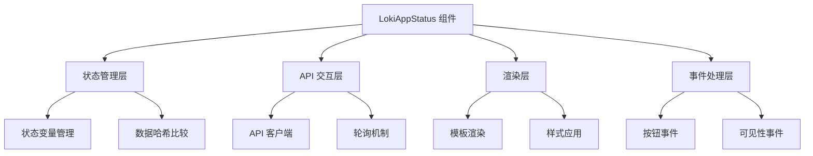
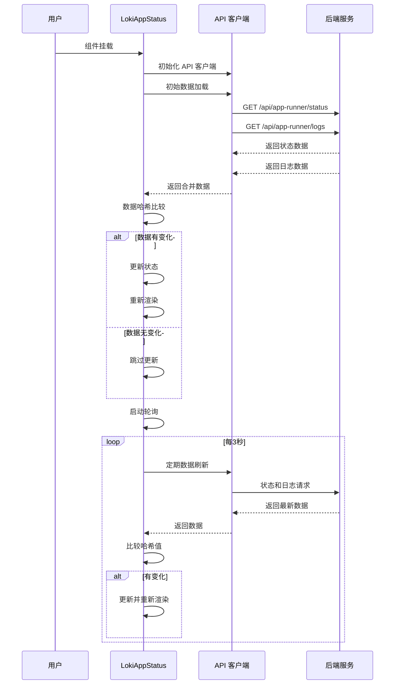
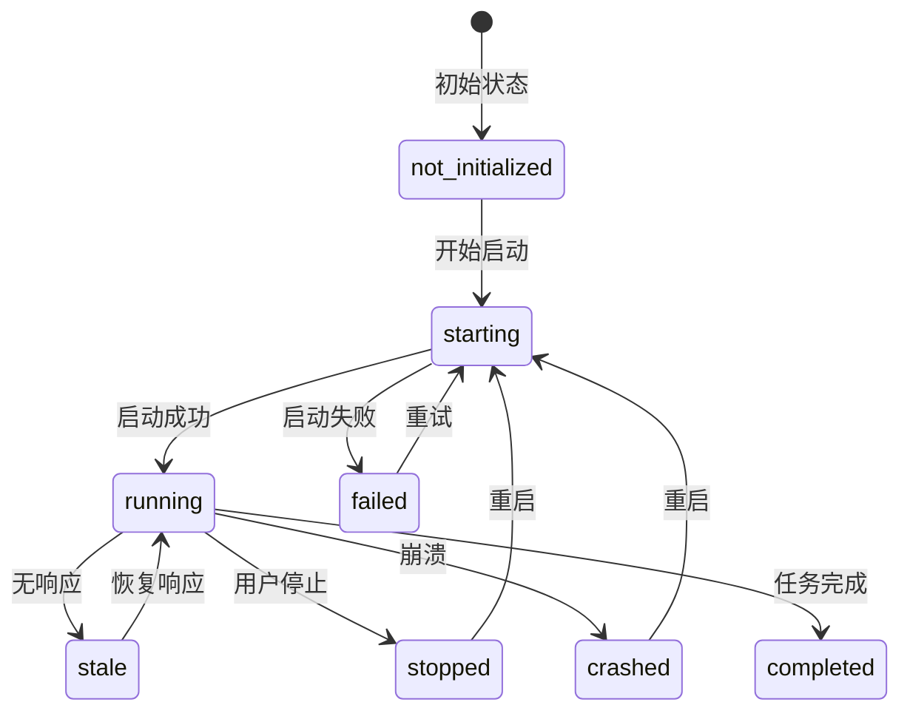

# LokiAppStatus 模块文档

## 目录
1. [模块概述](#模块概述)
2. [核心组件](#核心组件)
3. [架构设计](#架构设计)
4. [API 参考](#api-参考)
5. [使用指南](#使用指南)
6. [配置选项](#配置选项)
7. [状态管理](#状态管理)
8. [主题系统](#主题系统)
9. [性能优化](#性能优化)
10. [错误处理](#错误处理)
11. [最佳实践](#最佳实践)

---

## 模块概述

### 功能定位

LokiAppStatus 是一个专门用于监控和管理应用程序运行状态的 Web 组件。该组件提供实时状态监控、日志查看和应用控制功能，是 Loki Dashboard UI 组件库中监控和可观察性组件的重要组成部分。

### 设计理念

组件采用现代化的 Web Components 架构，基于 LokiElement 基类构建，确保了良好的封装性和可复用性。设计理念包括：

1. **实时监控**：通过周期性轮询获取最新状态
2. **用户友好**：清晰的状态指示和直观的操作界面
3. **性能优化**：智能更新机制，避免不必要的渲染
4. **可访问性**：支持主题切换和良好的视觉反馈
5. **资源高效**：页面可见性感知的轮询策略

### 核心能力

- 实时显示应用运行状态（启动中、运行中、已停止、失败等）
- 展示关键运行参数（端口、URL、重启次数、运行时间）
- 提供日志查看功能，支持自动滚动到最新日志
- 支持应用重启和停止操作
- 可视化状态指示器，支持脉冲动画效果
- 完整的错误处理和用户反馈机制

---

## 核心组件

### LokiAppStatus 类

LokiAppStatus 是一个继承自 LokiElement 的自定义 Web 组件，实现了完整的应用状态监控功能。

#### 类定义

```javascript
export class LokiAppStatus extends LokiElement {
  static get observedAttributes() {
    return ['api-url', 'theme'];
  }

  constructor() {
    super();
    this._loading = false;
    this._error = null;
    this._api = null;
    this._pollInterval = null;
    this._status = null;
    this._logs = [];
    this._lastDataHash = null;
    this._lastLogsHash = null;
  }
}
```

#### 属性说明

| 属性名 | 类型 | 默认值 | 说明 |
|--------|------|--------|------|
| `api-url` | string | `window.location.origin` | API 基础 URL |
| `theme` | string | 自动检测 | 主题设置（'light' 或 'dark'） |

#### 内部状态

| 状态变量 | 类型 | 说明 |
|----------|------|------|
| `_loading` | boolean | 数据加载状态标志 |
| `_error` | string | 错误信息 |
| `_api` | object | API 客户端实例 |
| `_pollInterval` | number | 轮询定时器 ID |
| `_status` | object | 当前应用状态 |
| `_logs` | array | 应用日志数组 |
| `_lastDataHash` | string | 上次数据的哈希值，用于检测变化 |
| `_lastLogsHash` | string | 上次日志的哈希值，用于检测变化 |

---

## 架构设计

### 组件架构

LokiAppStatus 组件采用分层架构设计，主要包括以下层次：



### 数据流程

组件的数据流程遵循清晰的单向数据流模式：



### 状态定义

组件预定义了多种应用状态，每种状态都有对应的视觉配置：

```javascript
const STATUS_CONFIG = {
  not_initialized: { color: 'var(--loki-text-muted, #71717a)', label: 'Not Started', pulse: false },
  starting:        { color: 'var(--loki-yellow, #ca8a04)',      label: 'Starting...',  pulse: true },
  running:         { color: 'var(--loki-green, #16a34a)',       label: 'Running',      pulse: true },
  stale:           { color: 'var(--loki-yellow, #ca8a04)',      label: 'Stale',        pulse: false },
  completed:       { color: 'var(--loki-text-muted, #a1a1aa)',  label: 'Completed',    pulse: false },
  failed:          { color: 'var(--loki-red, #dc2626)',         label: 'Failed',       pulse: false },
  crashed:         { color: 'var(--loki-red, #dc2626)',         label: 'Crashed',      pulse: false },
  stopped:         { color: 'var(--loki-text-muted, #a1a1aa)',  label: 'Stopped',      pulse: false },
  unknown:         { color: 'var(--loki-text-muted, #71717a)',  label: 'Unknown',      pulse: false },
};
```

---

## API 参考

### 公共方法

#### `connectedCallback()`

组件挂载到 DOM 时调用的生命周期方法。

**功能**：
- 调用父类的 `connectedCallback()`
- 设置 API 客户端
- 加载初始数据
- 启动轮询机制

**示例**：
```javascript
// 内部调用，无需手动调用
```

#### `disconnectedCallback()`

组件从 DOM 中移除时调用的生命周期方法。

**功能**：
- 调用父类的 `disconnectedCallback()`
- 停止轮询
- 清理事件监听器

**示例**：
```javascript
// 内部调用，无需手动调用
```

#### `attributeChangedCallback(name, oldValue, newValue)`

监听属性变化的回调方法。

**参数**：
- `name` (string): 变化的属性名
- `oldValue` (string): 旧值
- `newValue` (string): 新值

**功能**：
- 处理 `api-url` 变化，更新 API 客户端并重新加载数据
- 处理 `theme` 变化，应用新主题

**示例**：
```javascript
// 内部调用，无需手动调用
```

#### `render()`

渲染组件内容的方法。

**功能**：
- 根据当前状态生成 HTML 结构
- 应用样式
- 附加事件监听器

**示例**：
```javascript
// 内部调用，通常在数据变化后自动调用
// 也可以手动调用强制重新渲染
component.render();
```

### 私有方法

#### `_setupApi()`

设置 API 客户端。

**功能**：
- 从属性获取 API URL 或使用默认值
- 初始化 API 客户端实例

#### `_startPolling()`

启动状态轮询机制。

**功能**：
- 设置 3 秒间隔的定时器
- 添加页面可见性变化监听器
- 实现智能暂停/恢复轮询

#### `_stopPolling()`

停止状态轮询机制。

**功能**：
- 清除轮询定时器
- 移除可见性变化监听器

#### `_loadData()`

异步加载状态和日志数据。

**功能**：
- 并行获取状态和日志数据
- 计算数据哈希值检测变化
- 更新组件状态
- 触发重新渲染
- 错误处理

#### `_scrollLogsToBottom()`

自动滚动日志区域到底部。

**功能**：
- 查找日志区域元素
- 设置滚动位置到最底部

#### `_handleRestart()`

处理重启按钮点击事件。

**功能**：
- 调用重启 API
- 重新加载数据
- 错误处理

#### `_handleStop()`

处理停止按钮点击事件。

**功能**：
- 调用停止 API
- 重新加载数据
- 错误处理

#### `_formatUptime(startedAt)`

格式化运行时间显示。

**参数**：
- `startedAt` (string): 启动时间 ISO 字符串

**返回值**：
- (string): 格式化的运行时间字符串

**示例**：
```javascript
_formatUptime('2023-01-01T00:00:00Z') 
// 返回类似 "2h 30m" 的格式
```

#### `_isValidUrl(str)`

验证 URL 是否有效。

**参数**：
- `str` (string): 要验证的字符串

**返回值**：
- (boolean): URL 是否有效

**示例**：
```javascript
_isValidUrl('https://example.com') // true
_isValidUrl('not-a-url') // false
```

#### `_getStyles()`

获取组件样式字符串。

**返回值**：
- (string): CSS 样式字符串

#### `_renderStatusBadge(st)`

渲染状态徽章。

**参数**：
- `st` (object): 状态对象

**返回值**：
- (string): HTML 字符串

#### `_renderStatusCard(st)`

渲染状态信息卡片。

**参数**：
- `st` (object): 状态对象

**返回值**：
- (string): HTML 字符串

#### `_renderLogs()`

渲染日志区域。

**返回值**：
- (string): HTML 字符串

#### `_renderActions(st)`

渲染操作按钮。

**参数**：
- `st` (object): 状态对象

**返回值**：
- (string): HTML 字符串

#### `_renderEmpty()`

渲染空状态。

**返回值**：
- (string): HTML 字符串

#### `_attachEventListeners()`

附加事件监听器。

**功能**：
- 为重启和停止按钮添加点击事件

#### `_escapeHtml(str)`

转义 HTML 字符串，防止 XSS 攻击。

**参数**：
- `str` (string): 要转义的字符串

**返回值**：
- (string): 转义后的字符串

**示例**：
```javascript
_escapeHtml('<script>alert("xss")</script>')
// 返回 "&lt;script&gt;alert(&quot;xss&quot;)&lt;/script&gt;"
```

---

## 使用指南

### 基本使用

在 HTML 中直接使用自定义元素：

```html
<loki-app-status api-url="http://localhost:57374" theme="dark"></loki-app-status>
```

### 在 JavaScript 中动态创建

```javascript
// 创建元素
const appStatus = document.createElement('loki-app-status');

// 设置属性
appStatus.setAttribute('api-url', 'http://localhost:57374');
appStatus.setAttribute('theme', 'light');

// 添加到 DOM
document.body.appendChild(appStatus);
```

### 在框架中使用

#### React

```jsx
function AppStatusComponent() {
  const ref = useRef(null);
  
  useEffect(() => {
    if (ref.current) {
      // 可以直接操作 DOM 元素
      ref.current.setAttribute('theme', 'dark');
    }
  }, []);
  
  return (
    <loki-app-status 
      ref={ref}
      api-url="http://localhost:57374"
      theme="light"
    />
  );
}
```

#### Vue

```vue
<template>
  <loki-app-status 
    :api-url="apiUrl" 
    :theme="theme"
  />
</template>

<script>
export default {
  data() {
    return {
      apiUrl: 'http://localhost:57374',
      theme: 'dark'
    };
  }
};
</script>
```

#### Angular

```typescript
// 在模块中声明
import { CUSTOM_ELEMENTS_SCHEMA } from '@angular/core';

@NgModule({
  schemas: [CUSTOM_ELEMENTS_SCHEMA]
})

// 在模板中使用
@Component({
  template: `
    <loki-app-status 
      [attr.api-url]="apiUrl"
      [attr.theme]="theme"
    ></loki-app-status>
  `
})
export class AppComponent {
  apiUrl = 'http://localhost:57374';
  theme = 'dark';
}
```

---

## 配置选项

### 属性配置

#### `api-url`

API 服务的基础 URL。

**类型**：string
**默认值**：`window.location.origin`
**示例**：
```html
<loki-app-status api-url="https://api.example.com"></loki-app-status>
```

#### `theme`

组件的主题设置。

**类型**：string
**可选值**：`'light'`、`'dark'`
**默认值**：自动检测系统主题
**示例**：
```html
<loki-app-status theme="dark"></loki-app-status>
```

### CSS 变量

组件使用 CSS 变量进行样式配置，支持通过 CSS 自定义：

```css
/* 自定义颜色方案 */
loki-app-status {
  --loki-text-primary: #1f2937;
  --loki-text-secondary: #6b7280;
  --loki-text-muted: #9ca3af;
  --loki-bg-card: #ffffff;
  --loki-bg-secondary: #f3f4f6;
  --loki-bg-tertiary: #111827;
  --loki-border: #e5e7eb;
  --loki-accent: #553DE9;
  --loki-green: #16a34a;
  --loki-yellow: #ca8a04;
  --loki-red: #dc2626;
  --loki-font-family: 'Inter', system-ui, sans-serif;
}
```

---

## 状态管理

### 状态对象结构

从 API 获取的状态对象包含以下字段：

```javascript
{
  status: 'running',        // 状态标识
  method: 'direct',         // 启动方法
  port: 3000,               // 端口号
  url: 'http://localhost:3000', // 访问 URL
  restart_count: 0,         // 重启次数
  started_at: '2023-01-01T00:00:00Z', // 启动时间
  error: null               // 错误信息（如果有）
}
```

### 状态转换逻辑

组件根据不同的状态显示不同的界面元素：



### 按钮状态控制

根据当前应用状态，操作按钮会有不同的启用/禁用状态：

| 状态 | 重启按钮 | 停止按钮 |
|------|---------|---------|
| not_initialized | ❌ 禁用 | ❌ 禁用 |
| starting | ❌ 禁用 | ✅ 启用 |
| running | ✅ 启用 | ✅ 启用 |
| stale | ❌ 禁用 | ❌ 禁用 |
| completed | ❌ 禁用 | ❌ 禁用 |
| failed | ❌ 禁用 | ❌ 禁用 |
| crashed | ✅ 启用 | ❌ 禁用 |
| stopped | ✅ 启用 | ❌ 禁用 |
| unknown | ❌ 禁用 | ❌ 禁用 |

---

## 主题系统

### 主题集成

LokiAppStatus 组件与 LokiTheme 系统完全集成，支持自动和手动主题切换。

### 主题切换

#### 通过属性切换

```html
<!-- 浅色主题 -->
<loki-app-status theme="light"></loki-app-status>

<!-- 深色主题 -->
<loki-app-status theme="dark"></loki-app-status>
```

#### 通过 JavaScript 切换

```javascript
const appStatus = document.querySelector('loki-app-status');

// 切换到深色主题
appStatus.setAttribute('theme', 'dark');

// 切换到浅色主题
appStatus.setAttribute('theme', 'light');
```

### 自定义主题

可以通过 CSS 变量创建自定义主题：

```css
/* 自定义深色主题 */
.loki-app-status-custom-dark {
  --loki-text-primary: #f9fafb;
  --loki-text-secondary: #d1d5db;
  --loki-text-muted: #6b7280;
  --loki-bg-card: #1f2937;
  --loki-bg-secondary: #374151;
  --loki-bg-tertiary: #111827;
  --loki-border: #4b5563;
  --loki-accent: #818cf8;
}

/* 自定义浅色主题 */
.loki-app-status-custom-light {
  --loki-text-primary: #111827;
  --loki-text-secondary: #4b5563;
  --loki-text-muted: #9ca3af;
  --loki-bg-card: #ffffff;
  --loki-bg-secondary: #f9fafb;
  --loki-bg-tertiary: #f3f4f6;
  --loki-border: #e5e7eb;
  --loki-accent: #4f46e5;
}
```

---

## 性能优化

### 智能更新机制

组件实现了高效的更新机制，通过计算数据哈希值避免不必要的渲染：

```javascript
// 计算状态数据的哈希值
const dataHash = JSON.stringify({
  status: status?.status,
  port: status?.port,
  restarts: status?.restart_count,
  url: status?.url,
});

// 计算日志的哈希值（只比较最后5行）
const logsHash = JSON.stringify(logsData?.lines?.slice(-5) || []);

// 只有当数据真正变化时才更新
if (dataHash === this._lastDataHash && !logsChanged) return;
```

### 可见性感知轮询

组件监听页面可见性变化，在页面不可见时暂停轮询，可见时恢复：

```javascript
_visibilityHandler = () => {
  if (document.hidden) {
    // 页面不可见，暂停轮询
    if (this._pollInterval) {
      clearInterval(this._pollInterval);
      this._pollInterval = null;
    }
  } else {
    // 页面可见，恢复轮询
    if (!this._pollInterval) {
      this._loadData(); // 立即刷新一次
      this._pollInterval = setInterval(() => this._loadData(), 3000);
    }
  }
};
```

### 日志优化

- 只显示最后 20 条日志，避免大量 DOM 元素
- 日志自动滚动到最新内容
- 只比较最后 5 条日志的变化

---

## 错误处理

### 错误类型

组件处理以下类型的错误：

1. **API 请求错误**：网络问题、服务器错误等
2. **数据解析错误**：响应数据格式不正确
3. **URL 验证错误**：无效的 URL 格式

### 错误显示

当发生错误时，组件会显示错误横幅：

```html
<div class="error-banner">Failed to load app status: Network error</div>
```

### 错误恢复

组件具有自动恢复能力：
- 单次请求失败不会中断轮询
- 只在第一次出现错误时显示错误信息
- 后续成功的请求会清除错误状态

---

## 最佳实践

### 部署建议

1. **API 端点配置**：确保正确配置 `api-url` 属性，指向正确的后端服务
2. **网络环境**：确保前端可以访问后端 API，处理好 CORS 问题
3. **错误监控**：建议配合其他监控工具一起使用，全面监控应用状态

### 使用建议

1. **合理放置**：将组件放置在用户容易看到的位置，便于及时发现问题
2. **权限控制**：确保只有授权用户可以看到和操作应用控制功能
3. **日志管理**：对于长时间运行的应用，考虑实现日志的分页或搜索功能

### 扩展建议

1. **自定义状态**：可以通过扩展 `STATUS_CONFIG` 对象添加自定义状态
2. **集成通知**：可以在状态变化时添加桌面通知功能
3. **历史记录**：可以添加状态历史记录功能，便于问题追踪

### 性能建议

1. **轮询间隔**：默认 3 秒的轮询间隔适合大多数场景，可根据实际需求调整
2. **数据量控制**：确保后端 API 返回的数据量适中，避免传输大量不必要的数据
3. **缓存策略**：可以考虑添加客户端缓存，进一步优化性能

---

## 相关模块

- [LokiTheme](LokiTheme.md) - 主题系统核心模块
- [LokiElement](LokiElement.md) - 组件基类
- [LokiOverview](LokiOverview.md) - 概览组件
- [LokiLogStream](LokiLogStream.md) - 日志流组件

---

## 更新日志

### v1.0.0
- 初始版本发布
- 实现基本的状态监控功能
- 支持应用重启和停止操作
- 添加日志查看功能
- 实现主题支持
