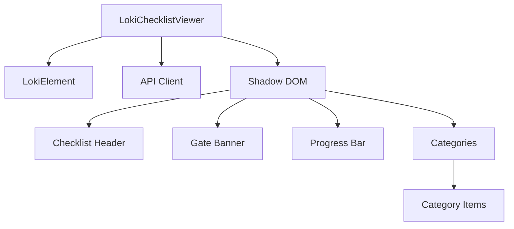
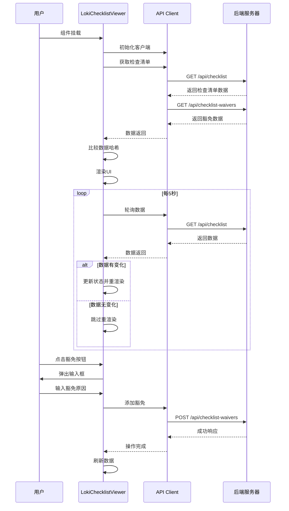
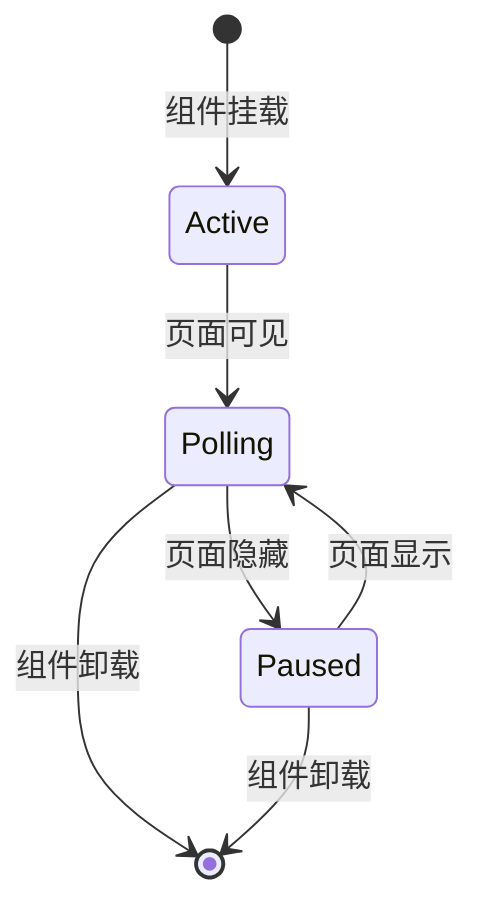

# LokiChecklistViewer 模块文档

## 目录
- [模块概述](#模块概述)
- [核心组件](#核心组件)
- [架构与数据流](#架构与数据流)
- [使用指南](#使用指南)
- [API 参考](#api-参考)
- [配置选项](#配置选项)
- [扩展与自定义](#扩展与自定义)
- [注意事项与限制](#注意事项与限制)

---

## 模块概述

LokiChecklistViewer 是一个用于展示产品需求文档（PRD）检查清单的 Web 组件。它提供了直观的用户界面，用于跟踪需求验证状态、显示进度条、分类展示检查项，并支持豁免机制。该组件具有以下主要特点：

### 主要功能
- 实时轮询检查清单数据，默认每 5 秒更新一次
- 基于页面可见性自动暂停/恢复轮询，优化性能
- 按分类折叠/展开查看检查项
- 可视化展示验证状态（已验证、失败、待处理）
- 支持检查项豁免机制
- 响应式设计，支持深色/浅色主题
- 委员会关卡（Council Gate）状态指示

### 设计理念
该组件采用 Web Components 标准构建，确保在不同框架和环境中的兼容性。它继承自 `LokiElement` 基类，利用统一的主题系统和 API 客户端。组件设计注重用户体验，提供清晰的视觉反馈和直观的交互方式。

---

## 核心组件

### LokiChecklistViewer 类

`LokiChecklistViewer` 是模块的核心类，负责整个检查清单的渲染和交互。

#### 继承关系
```javascript
LokiChecklistViewer extends LokiElement
```

#### 核心属性

| 属性名 | 类型 | 默认值 | 描述 |
|--------|------|--------|------|
| `api-url` | string | `window.location.origin` | API 基础 URL |
| `theme` | string | 自动检测 | 主题设置（'light' 或 'dark'） |

#### 内部状态

| 状态变量 | 类型 | 描述 |
|----------|------|------|
| `_loading` | boolean | 数据加载状态 |
| `_error` | string \| null | 错误信息 |
| `_api` | ApiClient | API 客户端实例 |
| `_pollInterval` | number \| null | 轮询定时器 ID |
| `_checklist` | object \| null | 检查清单数据 |
| `_waivers` | array | 豁免列表 |
| `_expandedCategories` | Set | 已展开的分类集合 |
| `_lastDataHash` | string \| null | 上一次数据的哈希值 |

#### 主要方法

##### 生命周期方法

- **`connectedCallback()`**
  - 组件挂载时调用
  - 设置 API 客户端
  - 加载初始数据
  - 启动轮询机制

- **`disconnectedCallback()`**
  - 组件卸载时调用
  - 停止轮询
  - 清理事件监听器

- **`attributeChangedCallback(name, oldValue, newValue)`**
  - 监听属性变化
  - 处理 `api-url` 和 `theme` 属性变更

##### 数据管理方法

- **`_setupApi()`**
  - 初始化 API 客户端
  - 配置基础 URL

- **`_loadData()`**
  - 异步加载检查清单和豁免数据
  - 比较数据哈希，避免不必要的重渲染
  - 更新组件状态并触发渲染

- **`_startPolling()`**
  - 启动数据轮询（每 5 秒）
  - 注册页面可见性变化监听器
  - 页面隐藏时暂停轮询，显示时恢复

- **`_stopPolling()`**
  - 停止轮询定时器
  - 移除页面可见性监听器

##### 豁免管理方法

- **`_isItemWaived(itemId)`**
  - 检查指定项是否已豁免
  - 返回布尔值

- **`_getWaiverForItem(itemId)`**
  - 获取指定项的豁免信息
  - 返回豁免对象或 null

- **`_waiveItem(itemId)`**
  - 弹出输入框获取豁免原因
  - 调用 API 添加豁免
  - 刷新数据

- **`_unwaiveItem(itemId)`**
  - 调用 API 移除豁免
  - 刷新数据

##### UI 交互方法

- **`_toggleCategory(name)`**
  - 切换分类的展开/折叠状态
  - 触发重新渲染

- **`render()`**
  - 主渲染方法
  - 构建 Shadow DOM 内容
  - 附加事件监听器

- **`_renderGateBanner()`**
  - 渲染委员会关卡状态横幅
  - 根据未豁免的严重失败项显示阻塞或通过状态

- **`_renderBadges(summary)`**
  - 渲染摘要徽章
  - 显示已验证、失败、豁免和待处理的数量

- **`_renderProgress(summary)`**
  - 渲染进度条
  - 可视化显示验证进度

- **`_renderCategories(categories)`**
  - 渲染分类列表
  - 处理展开/折叠状态

- **`_renderItems(items)`**
  - 渲染检查项列表
  - 按优先级排序
  - 显示状态、优先级、豁免状态和验证点

- **`_renderEmpty()`**
  - 渲染空状态
  - 提示用户检查清单尚未初始化

- **`_attachEventListeners()`**
  - 为分类头部、豁免按钮等附加事件监听器

##### 工具方法

- **`_escapeHtml(str)`**
  - 转义 HTML 特殊字符
  - 防止 XSS 攻击

- **`_getUnwaivedCriticalFailures()`**
  - 获取未豁免的严重失败项
  - 用于委员会关卡判断

---

## 架构与数据流

### 组件架构

LokiChecklistViewer 采用标准的 Web Components 架构，使用 Shadow DOM 封装样式和结构。



### 数据流



### 页面可见性处理

组件实现了智能的轮询管理机制：



---

## 使用指南

### 基本使用

在 HTML 中直接使用自定义元素：

```html
<loki-checklist-viewer></loki-checklist-viewer>
```

### 自定义 API URL

```html
<loki-checklist-viewer api-url="http://localhost:57374"></loki-checklist-viewer>
```

### 指定主题

```html
<loki-checklist-viewer theme="dark"></loki-checklist-viewer>
<loki-checklist-viewer theme="light"></loki-checklist-viewer>
```

### 完整示例

```html
<!DOCTYPE html>
<html lang="zh-CN">
<head>
    <meta charset="UTF-8">
    <meta name="viewport" content="width=device-width, initial-scale=1.0">
    <title>PRD Checklist Viewer</title>
</head>
<body>
    <loki-checklist-viewer 
        api-url="http://localhost:57374" 
        theme="dark">
    </loki-checklist-viewer>

    <script type="module" src="path/to/loki-checklist-viewer.js"></script>
</body>
</html>
```

### 在 JavaScript 中动态创建

```javascript
// 创建元素
const checklistViewer = document.createElement('loki-checklist-viewer');

// 设置属性
checklistViewer.setAttribute('api-url', 'http://localhost:57374');
checklistViewer.setAttribute('theme', 'dark');

// 添加到文档
document.body.appendChild(checklistViewer);
```

---

## API 参考

### 属性

#### `api-url`
- **类型**: string
- **默认值**: `window.location.origin`
- **描述**: 后端 API 的基础 URL
- **示例**:
  ```html
  <loki-checklist-viewer api-url="https://api.example.com"></loki-checklist-viewer>
  ```

#### `theme`
- **类型**: string
- **默认值**: 自动检测
- **可选值**: `'light'`, `'dark'`
- **描述**: 组件的颜色主题
- **示例**:
  ```html
  <loki-checklist-viewer theme="dark"></loki-checklist-viewer>
  ```

### 事件

组件目前没有发出自定义事件，但会通过 UI 交互触发内部状态变化。

### 方法

组件没有暴露公共方法，所有功能通过属性和 UI 交互实现。

---

## 配置选项

### CSS 变量

组件使用以下 CSS 变量进行样式自定义：

| 变量名 | 默认值 | 描述 |
|--------|--------|------|
| `--loki-font-family` | system-ui, -apple-system, sans-serif | 字体家族 |
| `--loki-text-primary` | #201515 | 主要文本颜色 |
| `--loki-text-secondary` | #52525b | 次要文本颜色 |
| `--loki-text-muted` | #71717a | 禁用/ muted 文本颜色 |
| `--loki-bg-secondary` | #f4f4f5 | 次要背景色 |
| `--loki-bg-tertiary` | #e4e4e7 | 三级背景色 |
| `--loki-bg-hover` | #f0f0f3 | 悬停背景色 |
| `--loki-border` | #e4e4e7 | 边框颜色 |
| `--loki-status-success` | #22c55e | 成功状态颜色 |
| `--loki-status-error` | #ef4444 | 错误状态颜色 |
| `--loki-status-warning` | #f59e0b | 警告状态颜色 |

### 自定义样式示例

```css
/* 在全局样式中覆盖变量 */
:root {
  --loki-status-success: #10b981;
  --loki-status-error: #dc2626;
  --loki-font-family: 'Inter', sans-serif;
}

/* 或通过 shadow root 穿透样式（需要浏览器支持） */
loki-checklist-viewer::part(checklist-viewer) {
  padding: 24px;
}
```

---

## 扩展与自定义

### 继承扩展

可以通过继承 `LokiChecklistViewer` 类来创建自定义版本：

```javascript
import { LokiChecklistViewer } from 'path/to/loki-checklist-viewer.js';

class CustomChecklistViewer extends LokiChecklistViewer {
  constructor() {
    super();
    // 自定义初始化
  }

  // 重写方法
  render() {
    // 自定义渲染逻辑
    super.render(); // 可选：调用父类方法
  }

  // 添加自定义方法
  _customMethod() {
    // 自定义功能
  }
}

customElements.define('custom-checklist-viewer', CustomChecklistViewer);
```

### 数据格式

组件期望从 API 接收以下格式的数据：

#### 检查清单数据结构
```javascript
{
  status: 'initialized', // 或 'not_initialized'
  summary: {
    total: 10,
    verified: 6,
    failing: 2,
    pending: 2
  },
  categories: [
    {
      name: '功能需求',
      items: [
        {
          id: 'req-001',
          title: '用户登录功能',
          status: 'verified', // 'verified', 'failing', 'pending'
          priority: 'critical', // 'critical', 'major', 'minor'
          verification: [
            { type: 'unit_test', passed: true },
            { type: 'integration_test', passed: true }
          ]
        }
      ]
    }
  ]
}
```

#### 豁免数据结构
```javascript
{
  waivers: [
    {
      item_id: 'req-002',
      reason: '暂不实现，计划在 v2.0 中添加',
      active: true,
      created_at: '2023-01-15T10:30:00Z'
    }
  ]
}
```

---

## 注意事项与限制

### 性能考虑

1. **轮询频率**：组件默认每 5 秒轮询一次 API。在大型部署中，应考虑调整此频率或实现 WebSocket 推送。

2. **数据哈希比较**：组件通过比较数据哈希来避免不必要的重渲染。确保 API 返回的数据结构稳定，以充分利用此优化。

3. **页面可见性**：组件会在页面隐藏时暂停轮询，这是良好的性能实践。但在某些需要实时更新的场景中，可能需要修改此行为。

### 安全考虑

1. **XSS 防护**：组件对所有用户生成的内容进行 HTML 转义，但仍应确保后端 API 返回的数据是安全的。

2. **API 认证**：组件使用 `getApiClient` 进行 API 调用，确保 API 客户端已正确配置认证信息。

3. **豁免权限**：豁免功能应在后端进行权限验证，前端只负责 UI 交互。

### 浏览器兼容性

- 组件使用 Web Components 标准，需要现代浏览器支持
- 需要支持 Shadow DOM、Custom Elements 和 ES6+ 特性
- 建议在目标浏览器中进行充分测试

### 已知限制

1. **轮询机制**：当前实现使用固定间隔轮询，没有实现指数退避或其他智能重试策略。

2. **错误处理**：网络错误会显示在 UI 中，但没有自动重试机制。

3. **主题切换**：主题切换仅影响组件自身，不会自动与页面其他部分同步。

4. **豁免原因**：豁免原因使用简单的 `window.prompt` 收集，没有提供更复杂的表单界面。

### 调试技巧

1. **启用日志**：可以在浏览器控制台中检查组件的内部状态：
   ```javascript
   const viewer = document.querySelector('loki-checklist-viewer');
   console.log(viewer._checklist);
   console.log(viewer._waivers);
   ```

2. **强制刷新**：可以通过修改 `api-url` 属性来强制重新加载数据：
   ```javascript
   viewer.setAttribute('api-url', viewer.getAttribute('api-url'));
   ```

3. **网络监控**：使用浏览器开发者工具的网络面板监控 API 调用，确认轮询正常工作。

---

## 相关模块

- [LokiTheme](LokiTheme.md) - 主题系统
- [LokiApiClient](LokiApiClient.md) - API 客户端
- [LokiCouncilDashboard](LokiCouncilDashboard.md) - 委员会仪表板

---

*最后更新：2024年*
