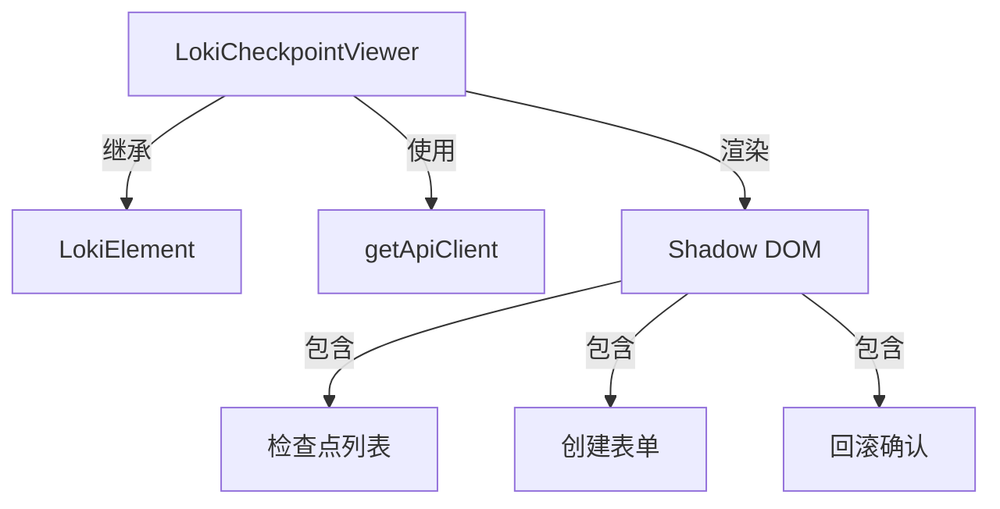
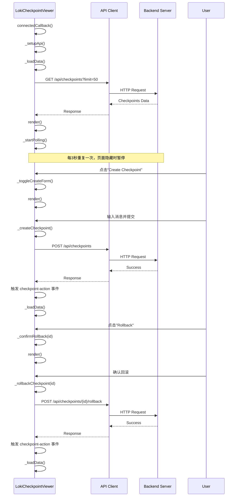

# LokiCheckpointViewer 模块文档

## 1. 模块概述

LokiCheckpointViewer 是一个用于管理和展示检查点历史记录的前端 UI 组件，属于 Dashboard UI Components 库的一部分。该组件提供了检查点创建、历史查看和状态回滚功能，支持自动数据刷新和可见性感知的轮询机制，帮助用户在开发或运维过程中管理应用状态的版本控制。

### 设计理念

该组件采用 Web Components 标准构建，具有良好的封装性和可移植性。其设计重点在于提供直观的用户界面、可靠的状态同步机制以及安全的回滚操作流程，同时保持与主题系统的无缝集成。

## 2. 核心组件详解

### LokiCheckpointViewer 类

`LokiCheckpointViewer` 是该模块的核心组件，继承自 `LokiElement` 基类，实现了检查点管理的完整功能。

#### 主要功能
- 检查点历史列表展示
- 新建检查点功能
- 检查点回滚操作（含确认流程）
- 自动数据刷新（3秒轮询）
- 页面可见性感知的轮询暂停/恢复
- 主题切换支持

#### 属性与配置

| 属性名 | 类型 | 默认值 | 说明 |
|--------|------|--------|------|
| api-url | string | window.location.origin | API 基础 URL |
| theme | string | 自动检测 | 主题设置，可选 'light' 或 'dark' |

#### 事件

| 事件名 | 触发时机 | 详情数据 |
|--------|----------|----------|
| checkpoint-action | 当执行检查点操作时 | `{ action: 'create'|'rollback', message?: string, checkpointId?: string }` |

#### 内部状态

```javascript
// 主要内部状态
this._loading = false;        // 加载状态
this._error = null;           // 错误信息
this._checkpoints = [];       // 检查点列表
this._pollInterval = null;    // 轮询定时器
this._showCreateForm = false; // 显示创建表单
this._creating = false;       // 创建中状态
this._rollingBack = false;    // 回滚中状态
this._rollbackTarget = null;  // 回滚目标ID
```

## 3. 架构与工作流程

### 组件架构



### 数据流程图



### 生命周期

1. **初始化阶段**：
   - 构造函数初始化内部状态
   - `connectedCallback` 被调用，设置 API 客户端
   - 加载初始数据
   - 启动轮询机制

2. **运行阶段**：
   - 每3秒自动刷新数据
   - 响应页面可见性变化，暂停/恢复轮询
   - 处理用户交互（创建、回滚）

3. **销毁阶段**：
   - `disconnectedCallback` 被调用
   - 清理轮询定时器
   - 移除事件监听器

## 4. 使用指南

### 基本用法

```html
<!-- 基本使用 -->
<loki-checkpoint-viewer></loki-checkpoint-viewer>

<!-- 自定义 API URL 和主题 -->
<loki-checkpoint-viewer 
  api-url="http://localhost:57374" 
  theme="dark">
</loki-checkpoint-viewer>
```

### JavaScript 集成

```javascript
// 获取组件引用
const viewer = document.querySelector('loki-checkpoint-viewer');

// 监听检查点操作事件
viewer.addEventListener('checkpoint-action', (event) => {
  const { action, message, checkpointId } = event.detail;
  if (action === 'create') {
    console.log(`Created checkpoint: ${message}`);
  } else if (action === 'rollback') {
    console.log(`Rolled back to checkpoint: ${checkpointId}`);
  }
});

// 动态修改属性
viewer.setAttribute('api-url', 'https://api.example.com');
viewer.setAttribute('theme', 'light');
```

### 样式定制

组件使用 CSS 变量进行样式控制，可通过覆盖这些变量实现主题定制：

```css
loki-checkpoint-viewer {
  --loki-text-primary: #333;
  --loki-text-muted: #666;
  --loki-bg-primary: #fff;
  --loki-bg-card: #f8f9fa;
  --loki-border: #e0e0e0;
  --loki-accent: #0070f3;
  --loki-accent-light: #3291ff;
  --loki-accent-muted: rgba(0, 112, 243, 0.1);
  --loki-red: #e00;
  --loki-red-muted: rgba(238, 0, 0, 0.1);
}
```

## 5. API 接口依赖

组件依赖以下后端 API 接口：

### 获取检查点列表

```
GET /api/checkpoints?limit=50
```

**响应示例**：
```json
[
  {
    "id": "checkpoint-123",
    "message": "Before refactoring auth module",
    "git_sha": "a1b2c3d4e5f6",
    "created_at": "2023-05-15T10:30:00Z",
    "files": ["file1.js", "file2.js"],
    "files_count": 2
  }
]
```

### 创建检查点

```
POST /api/checkpoints
Content-Type: application/json

{
  "message": "Checkpoint description"
}
```

### 回滚到检查点

```
POST /api/checkpoints/{checkpointId}/rollback
```

## 6. 注意事项与限制

### 边缘情况

1. **网络错误处理**：
   - 组件会捕获 API 调用错误并显示错误横幅
   - 轮询会继续尝试获取最新数据，即使之前的请求失败

2. **并发操作保护**：
   - 创建和回滚操作期间会禁用相应按钮，防止重复提交
   - 回滚操作有确认流程，防止误操作

3. **数据变化检测**：
   - 使用数据哈希比较避免不必要的重渲染
   - 仅在数据实际变化时更新 UI

### 性能考量

1. **轮询机制**：
   - 默认 3 秒轮询间隔，适合大多数场景
   - 页面不可见时自动暂停，减少资源消耗
   - 限制获取最新 50 个检查点，避免数据量过大

2. **渲染优化**：
   - 使用 Shadow DOM 封装样式，避免样式冲突
   - 数据哈希比较减少不必要的重渲染

### 已知限制

1. 组件假设 API 响应格式符合预期，没有进行严格的 Schema 验证
2. 错误恢复机制有限，连续失败时不会退避重试
3. 没有提供自定义轮询间隔的公开 API
4. 检查点消息长度限制为 200 字符

## 7. 与其他模块的关系

- **依赖**：
  - `LokiElement`：提供基础组件功能和主题支持
  - `getApiClient`：提供 API 客户端实例

- **相关模块**：
  - [LokiTheme](LokiTheme.md)：主题系统
  - [LokiTaskBoard](LokiTaskBoard.md)：任务板组件，可与检查点配合使用
  - [LokiSessionControl](LokiSessionControl.md)：会话控制组件

LokiCheckpointViewer 作为 Dashboard UI Components 库的一部分，与其他组件共享相同的设计语言和主题系统，可无缝集成到整体 dashboard 解决方案中。
