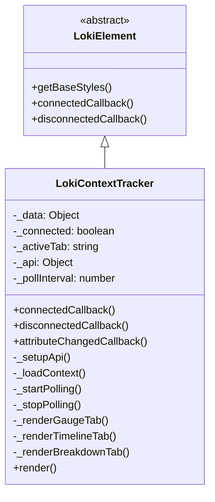

# LokiContextTracker 模块文档

## 概述

LokiContextTracker 是一个用于监控和可视化 AI 代理上下文窗口使用情况的仪表板 UI 组件。该组件提供了实时的上下文窗口利用率可视化、迭代时间线和令牌类型分解，帮助开发者理解和优化代理的上下文管理。

### 核心功能

- **上下文窗口利用率仪表板**：以圆形仪表形式展示当前上下文窗口使用百分比
- **每迭代时间线**：可视化每次迭代的令牌使用情况和成本
- **令牌类型分解**：详细展示输入、输出、缓存读取和缓存创建令牌的分布
- **实时轮询**：每 5 秒自动获取最新的上下文数据
- **成本估算**：显示每次迭代和总体的估算成本
- **压缩事件追踪**：记录和展示上下文压缩事件

## 组件架构

### 继承关系



### 核心组件设计

LokiContextTracker 继承自 `LokiElement`，这是仪表板 UI 组件库的基础元素类，提供了主题管理和基础样式功能。组件采用自定义元素（Custom Element）模式，可以像普通 HTML 元素一样使用。

## 安装与使用

### 基本使用

```html
<!-- 默认配置，使用当前页面的 origin 作为 API 地址 -->
<loki-context-tracker></loki-context-tracker>

<!-- 指定 API 地址和主题 -->
<loki-context-tracker 
  api-url="http://localhost:57374" 
  theme="dark">
</loki-context-tracker>
```

### 属性配置

| 属性名 | 类型 | 默认值 | 说明 |
|--------|------|--------|------|
| `api-url` | string | `window.location.origin` | API 基础 URL |
| `theme` | string | 自动检测 | 主题设置，可选值：`light`、`dark` |

## 数据结构

### API 响应格式

组件期望从 `/api/context` 端点获取以下格式的 JSON 数据：

```javascript
{
  current: {
    context_window_pct: 75.5,           // 上下文窗口使用百分比
    total_tokens: 120000,               // 总令牌数
    input_tokens: 90000,                // 输入令牌数
    output_tokens: 25000,               // 输出令牌数
    cache_read_tokens: 4000,            // 缓存读取令牌数
    cache_creation_tokens: 1000,        // 缓存创建令牌数
    estimated_cost_usd: 0.12            // 估算成本（美元）
  },
  totals: {
    compaction_count: 3,                 // 压缩事件总数
    iterations_tracked: 15               // 追踪的迭代总数
  },
  per_iteration: [                       // 每次迭代的详细数据
    {
      iteration: 1,
      input_tokens: 5000,
      output_tokens: 1000,
      cache_read_tokens: 0,
      cache_creation_tokens: 500,
      cost_usd: 0.006,
      compacted: false
    }
    // 更多迭代数据...
  ],
  compactions: [                         // 压缩事件列表
    {
      at_iteration: 5,                   // 发生压缩的迭代编号
      timestamp: "2024-01-01T12:00:00Z"
    }
  ]
}
```

## 核心功能详解

### 1. 仪表板视图（Gauge Tab）

仪表板视图是组件的默认视图，提供上下文使用情况的概览。

#### 圆形仪表

使用 SVG 绘制的圆形仪表直观地展示上下文窗口使用百分比：
- **绿色**（< 60%）：健康状态
- **黄色**（60-80%）：警告状态
- **红色**（> 80%）：危险状态

#### 摘要卡片

显示四个关键指标：
1. **总令牌数**：当前使用的总令牌数，包含输入/输出细分
2. **估算成本**：当前会话的估算成本
3. **压缩次数**：上下文压缩的总次数
4. **追踪迭代数**：已记录的迭代总数

#### 缓存信息

展示缓存读取和缓存创建的令牌数量，帮助评估缓存效率。

### 2. 时间线视图（Timeline Tab）

时间线视图展示每次迭代的令牌使用情况和成本，按时间顺序排列。

#### 特性

- 可视化每次迭代的总令牌使用量
- 显示每次迭代的成本
- 标记上下文压缩事件
- 突出显示被压缩的迭代
- 响应式的条形图，根据最大令牌数自动缩放

### 3. 分解视图（Breakdown Tab）

分解视图详细展示每次迭代中不同类型令牌的分布情况。

#### 令牌类型

- **输入令牌**（蓝色）：发送到模型的提示词
- **输出令牌**（绿色）：模型生成的响应
- **缓存读取**（蓝色）：从缓存中读取的令牌
- **缓存创建**（黄色）：创建新缓存条目的令牌

## 内部实现

### 生命周期管理

#### 连接回调（connectedCallback）

当组件被添加到 DOM 时触发：
1. 调用父类的 `connectedCallback`
2. 设置 API 客户端
3. 加载初始上下文数据
4. 启动轮询机制

#### 断开回调（disconnectedCallback）

当组件从 DOM 中移除时触发：
1. 调用父类的 `disconnectedCallback`
2. 停止轮询
3. 清理事件监听器

#### 属性变更回调（attributeChangedCallback）

监听属性变化：
- `api-url` 变化时更新 API 客户端并重新加载数据
- `theme` 变化时重新应用主题

### 轮询机制

组件使用智能轮询机制，每 5 秒获取一次数据：

```javascript
_startPolling() {
  this._pollInterval = setInterval(() => {
    this._loadContext();
  }, 5000);
  
  // 处理页面可见性变化
  this._visibilityHandler = () => {
    if (document.hidden) {
      // 页面隐藏时停止轮询以节省资源
      if (this._pollInterval) {
        clearInterval(this._pollInterval);
        this._pollInterval = null;
      }
    } else {
      // 页面可见时恢复轮询
      if (!this._pollInterval) {
        this._loadContext();
        this._pollInterval = setInterval(() => this._loadContext(), 5000);
      }
    }
  };
  document.addEventListener('visibilitychange', this._visibilityHandler);
}
```

### 渲染系统

组件使用 Shadow DOM 进行样式隔离，通过三个专用渲染方法生成不同视图：

- `_renderGaugeTab()`：渲染仪表板视图
- `_renderTimelineTab()`：渲染时间线视图
- `_renderBreakdownTab()`：渲染分解视图

主 `render()` 方法根据当前活动标签调用相应的渲染函数，并设置样式和事件监听器。

## 主题与样式

### CSS 变量

组件使用 CSS 自定义属性实现主题化：

```css
:host {
  --loki-bg-tertiary: /* 第三背景色 */;
  --loki-text-primary: /* 主要文本色 */;
  --loki-text-secondary: /* 次要文本色 */;
  --loki-text-muted: /* 弱化文本色 */;
  --loki-accent: /* 强调色 */;
  --loki-border: /* 边框色 */;
  --loki-border-light: /* 浅边框色 */;
  --loki-bg-card: /* 卡片背景色 */;
  --loki-bg-hover: /* 悬停背景色 */;
  --loki-red: /* 红色 */;
  --loki-yellow: /* 黄色 */;
  --loki-green: /* 绿色 */;
  --loki-blue: /* 蓝色 */;
  --loki-transition: /* 过渡动画 */;
}
```

这些变量应在父级主题系统中定义，详见 [LokiTheme](LokiTheme.md)。

## 扩展与定制

### 创建自定义渲染

虽然组件设计为开箱即用，但可以通过继承来扩展功能：

```javascript
class CustomContextTracker extends LokiContextTracker {
  _renderGaugeTab() {
    // 自定义仪表板渲染
    return `
      <div class="custom-gauge">
        <!-- 自定义内容 -->
      </div>
    `;
  }
}

// 注册自定义元素
customElements.define('custom-context-tracker', CustomContextTracker);
```

### 监听数据变化

组件目前没有暴露数据变化事件，但可以通过以下方式扩展：

```javascript
class EventedContextTracker extends LokiContextTracker {
  async _loadContext() {
    const oldData = this._data;
    await super._loadContext();
    
    if (oldData !== this._data) {
      this.dispatchEvent(new CustomEvent('contextchange', {
        detail: { data: this._data }
      }));
    }
  }
}
```

## 注意事项与限制

### 边缘情况

1. **API 不可用**：组件会优雅地处理 API 连接失败，显示 "Connecting to context API..." 消息
2. **空数据**：当没有迭代数据时，显示 "No iteration data yet" 空状态
3. **页面隐藏**：组件会在页面不可见时暂停轮询以节省资源
4. **超大数值**：组件会自动格式化大数值（如 1200000 → 1.20M）

### 性能考虑

- 轮询间隔固定为 5 秒，无法通过配置修改
- 当页面隐藏时会自动暂停轮询
- 使用 Shadow DOM 进行样式隔离，避免样式污染

### 错误处理

组件目前对错误处理较为简单，主要在 `_loadContext` 方法中：

```javascript
async _loadContext() {
  try {
    const apiUrl = this.getAttribute('api-url') || window.location.origin;
    const resp = await fetch(apiUrl + '/api/context');
    if (resp.ok) {
      this._data = await resp.json();
      this._connected = true;
    }
  } catch {
    this._connected = false;
  }
  this.render();
}
```

注意这里没有处理 HTTP 错误状态码（如 404、500 等），只是简单地检查 `resp.ok`。

## 相关模块

- [LokiElement](LokiTheme.md)：基础元素类和主题系统
- [LokiApiClient](LokiApiClient.md)：API 客户端工具
- [LokiOverview](LokiOverview.md)：系统概览组件
- [LokiLogStream](LokiLogStream.md)：日志流组件

## 总结

LokiContextTracker 是一个专业的上下文监控组件，为 AI 代理开发提供了实时的可视化监控能力。通过其直观的仪表板、详细的时间线和令牌分解视图，开发者可以有效地监控和优化上下文使用，避免不必要的成本，并确保代理始终在最佳状态下运行。

组件设计优雅，集成简单，同时提供了良好的错误处理和性能优化。作为 Loki 仪表板 UI 组件库的一部分，它与其他组件（如 [LokiOverview](LokiOverview.md)、[LokiLogStream](LokiLogStream.md)）协同工作，为 AI 代理开发提供完整的可观察性解决方案。
