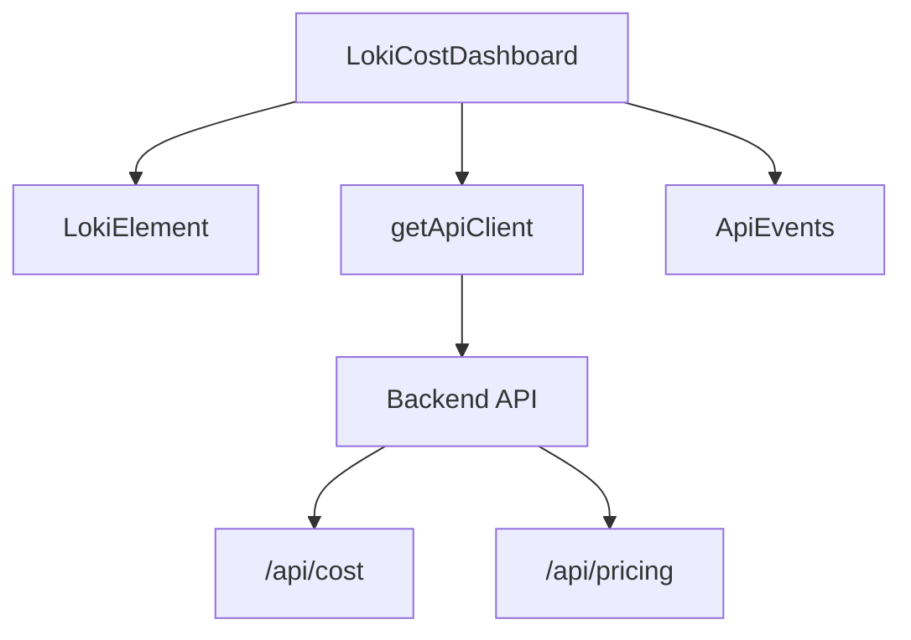
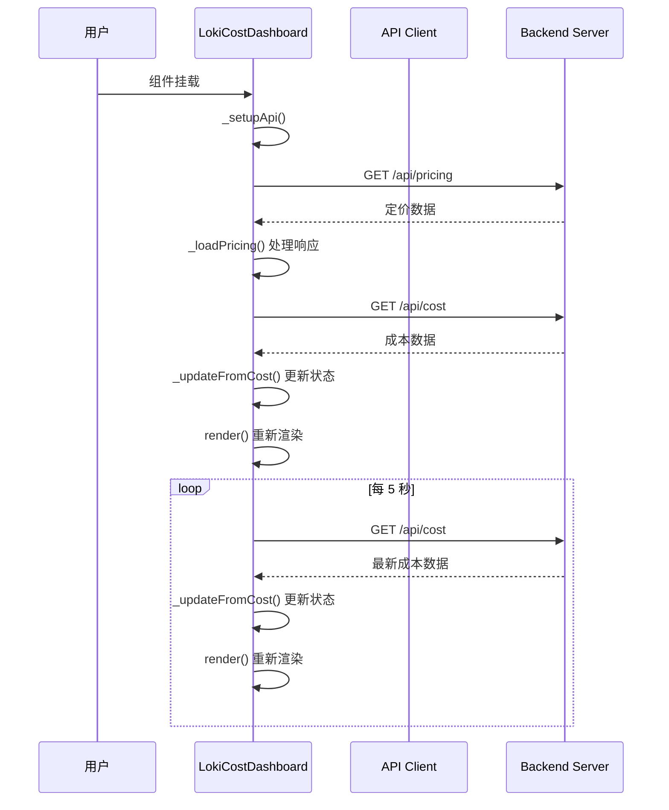

# LokiCostDashboard 模块文档

## 概述

LokiCostDashboard 是一个用于监控和可视化 LLM (大语言模型) API 调用成本的前端组件。它提供实时的代币使用统计、按模型和阶段划分的成本分析、预算跟踪功能以及 API 定价参考信息。该组件通过轮询 `/api/cost` 端点每 5 秒更新一次数据，并在组件挂载时从 `/api/pricing` 加载定价信息。

### 核心特性

- **实时成本监控**：显示总代币使用量、输入/输出代币数和估计美元成本
- **多维度分析**：按模型和阶段两个维度展示成本分布
- **预算管理**：可视化预算使用进度，支持阈值警告
- **定价参考**：提供 API 价格参考表，支持动态更新
- **主题支持**：自动适配亮色/暗色主题

## 架构与组件关系

LokiCostDashboard 是一个 Web Component，继承自 `LokiElement` 基类。它通过 API 客户端与后端服务通信，获取成本数据和定价信息。

### 组件依赖关系图



## 核心组件详解

### LokiCostDashboard 类

LokiCostDashboard 是一个自定义 Web Component，实现了成本监控仪表板的核心功能。

#### 类定义与属性

```javascript
export class LokiCostDashboard extends LokiElement {
  static get observedAttributes() {
    return ['api-url', 'theme'];
  }
  
  // 构造函数和方法实现...
}
```

**属性说明**：
- `api-url`：API 基础 URL（默认为 `window.location.origin`）
- `theme`：主题设置，可选值为 'light' 或 'dark'（默认自动检测）

#### 内部状态

组件维护以下内部状态：

```javascript
this._data = {
  total_input_tokens: 0,        // 总输入代币数
  total_output_tokens: 0,       // 总输出代币数
  estimated_cost_usd: 0,        // 估计总成本（美元）
  by_phase: {},                 // 按阶段划分的成本数据
  by_model: {},                 // 按模型划分的成本数据
  budget_limit: null,           // 预算限制
  budget_used: 0,               // 已使用预算
  budget_remaining: null,       // 剩余预算
  connected: false,             // API 连接状态
};
```

#### 主要方法

##### 生命周期方法

- **connectedCallback()**：组件挂载时调用，设置 API 客户端、加载定价和成本数据、启动轮询
- **disconnectedCallback()**：组件卸载时调用，停止轮询
- **attributeChangedCallback()**：监听属性变化，响应 api-url 和 theme 的变化

##### API 交互方法

- **_setupApi()**：初始化 API 客户端
- **_loadPricing()**：从 API 加载定价信息，覆盖默认定价
- **_loadCost()**：从 API 加载当前成本数据
- **_updateFromCost(cost)**：根据 API 返回的成本数据更新组件状态
- **_startPolling()**：启动成本数据轮询（每 5 秒）
- **_stopPolling()**：停止成本数据轮询

##### 渲染辅助方法

- **_formatTokens(count)**：格式化代币数量显示（K/M 单位）
- **_formatUSD(amount)**：格式化美元金额显示
- **_getBudgetPercent()**：计算预算使用百分比
- **_getBudgetStatusClass()**：根据预算使用情况返回状态类名
- **_renderPhaseRows()**：渲染按阶段划分的成本表格行
- **_renderModelRows()**：渲染按模型划分的成本表格行
- **_renderBudgetSection()**：渲染预算部分
- **_getPricingColorClass(key, model)**：获取模型对应的颜色类
- **_escapeHTML(str)**：转义 HTML 字符串防止 XSS 攻击

## 数据流与工作流程

### 数据获取与更新流程



### 页面可见性处理

组件会监听 `visibilitychange` 事件，在页面不可见时暂停轮询以节省资源，页面重新可见时恢复轮询：

```javascript
_visibilityHandler = () => {
  if (document.hidden) {
    // 页面不可见，停止轮询
    if (this._pollInterval) {
      clearInterval(this._pollInterval);
      this._pollInterval = null;
    }
  } else {
    // 页面可见，恢复轮询
    if (!this._pollInterval) {
      this._loadCost();
      this._pollInterval = setInterval(async () => {
        // 轮询逻辑
      }, 5000);
    }
  }
};
```

## 使用方法

### 基本用法

在 HTML 中直接使用自定义元素：

```html
<loki-cost-dashboard></loki-cost-dashboard>
```

### 自定义 API URL

```html
<loki-cost-dashboard api-url="http://localhost:8080"></loki-cost-dashboard>
```

### 指定主题

```html
<loki-cost-dashboard theme="dark"></loki-cost-dashboard>
<!-- 或 -->
<loki-cost-dashboard theme="light"></loki-cost-dashboard>
```

## 配置选项

### 默认定价配置

组件内置了默认定价配置，当 API 不可用时使用：

```javascript
const DEFAULT_PRICING = {
  // Claude (Anthropic)
  opus:   { input: 5.00,   output: 25.00,  label: 'Opus 4.6',       provider: 'claude' },
  sonnet: { input: 3.00,   output: 15.00,  label: 'Sonnet 4.5',     provider: 'claude' },
  haiku:  { input: 1.00,   output: 5.00,   label: 'Haiku 4.5',      provider: 'claude' },
  // OpenAI Codex
  'gpt-5.3-codex': { input: 1.50, output: 12.00, label: 'GPT-5.3 Codex', provider: 'codex' },
  // Google Gemini
  'gemini-3-pro':  { input: 1.25, output: 10.00, label: 'Gemini 3 Pro',   provider: 'gemini' },
  'gemini-3-flash': { input: 0.10, output: 0.40, label: 'Gemini 3 Flash', provider: 'gemini' },
};
```

### API 响应格式

#### /api/cost 响应格式

```json
{
  "total_input_tokens": 123456,
  "total_output_tokens": 78901,
  "estimated_cost_usd": 12.50,
  "by_phase": {
    "planning": {
      "input_tokens": 45000,
      "output_tokens": 15000,
      "cost_usd": 3.50
    },
    "coding": {
      "input_tokens": 78456,
      "output_tokens": 63901,
      "cost_usd": 9.00
    }
  },
  "by_model": {
    "sonnet": {
      "input_tokens": 80000,
      "output_tokens": 60000,
      "cost_usd": 7.20
    },
    "haiku": {
      "input_tokens": 43456,
      "output_tokens": 18901,
      "cost_usd": 5.30
    }
  },
  "budget_limit": 100.00,
  "budget_used": 12.50,
  "budget_remaining": 87.50
}
```

#### /api/pricing 响应格式

```json
{
  "models": {
    "model-key": {
      "input": 1.50,
      "output": 12.00,
      "label": "Model Display Name",
      "provider": "provider-name"
    }
  },
  "source": "api",
  "updated": "2026-02-07",
  "provider": "claude"
}
```

## 样式与主题

LokiCostDashboard 使用 CSS 自定义属性（CSS Variables）来支持主题功能。组件会继承 `LokiElement` 提供的基础样式。

### 主要 CSS 变量

- `--loki-bg-card`：卡片背景色
- `--loki-border`：边框颜色
- `--loki-border-light`：浅边框颜色
- `--loki-text-primary`：主要文本颜色
- `--loki-text-secondary`：次要文本颜色
- `--loki-text-muted`：-muted 文本颜色
- `--loki-accent`：强调色
- `--loki-bg-hover`：悬停背景色
- `--loki-bg-tertiary`：三级背景色
- `--loki-green`、`--loki-yellow`、`--loki-red`：状态颜色
- `--loki-opus`、`--loki-sonnet`、`--loki-haiku`：模型颜色
- `--loki-transition`：过渡动画时长

### 预算状态

组件根据预算使用百分比显示不同状态：
- **ok** (绿色)：预算使用 < 70%
- **warning** (黄色)：预算使用 70% - 89%
- **critical** (红色)：预算使用 ≥ 90%

## 注意事项与限制

### 性能考虑

1. **轮询频率**：组件默认每 5 秒轮询一次成本数据，在生产环境中可以根据实际需求调整此频率
2. **页面可见性**：组件已实现页面可见性监听，在页面不可见时会暂停轮询，但仍需注意不要在多个标签页同时打开以避免重复请求

### 错误处理

1. **API 连接失败**：当无法连接到 API 时，组件会显示 "Connecting to cost API..." 提示，并将 `connected` 状态设为 false
2. **定价加载失败**：如果 `/api/pricing` 请求失败，组件会回退到使用内置的 `DEFAULT_PRICING`

### 扩展建议

1. **自定义数据聚合**：如需按更多维度（如用户、项目等）统计成本，可以扩展 `_data` 对象并添加相应的渲染方法
2. **历史数据图表**：可以集成图表库（如 Chart.js、ECharts）来展示成本随时间变化的趋势
3. **告警功能**：可以添加在预算接近或超过阈值时发送通知的功能
4. **数据导出**：可以添加将成本数据导出为 CSV 或 PDF 的功能

## 相关模块

- [LokiElement](LokiTheme.md)：主题系统和基础组件类
- [loki-api-client](LokiApiClient.md)：API 客户端模块
- [LokiOverview](LokiOverview.md)：系统概览组件，可能包含成本概览

## 示例集成

### 在 React 应用中使用

```jsx
import React, { useEffect, useRef } from 'react';
import 'dashboard-ui/components/loki-cost-dashboard.js';

function CostDashboard() {
  const dashboardRef = useRef(null);
  
  useEffect(() => {
    if (dashboardRef.current) {
      dashboardRef.current.setAttribute('api-url', process.env.REACT_APP_API_URL);
    }
  }, []);
  
  return (
    <div className="cost-dashboard-container">
      <loki-cost-dashboard ref={dashboardRef}></loki-cost-dashboard>
    </div>
  );
}

export default CostDashboard;
```

### 在 Vue 应用中使用

```vue
<template>
  <div class="cost-dashboard-container">
    <loki-cost-dashboard :api-url="apiUrl"></loki-cost-dashboard>
  </div>
</template>

<script>
export default {
  name: 'CostDashboard',
  data() {
    return {
      apiUrl: process.env.VUE_APP_API_URL
    };
  },
  mounted() {
    import('dashboard-ui/components/loki-cost-dashboard.js');
  }
};
</script>
```
