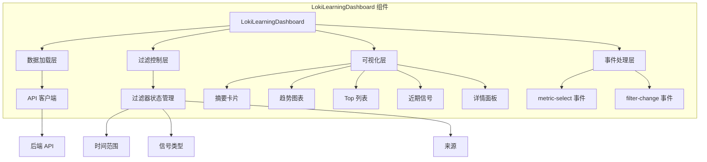
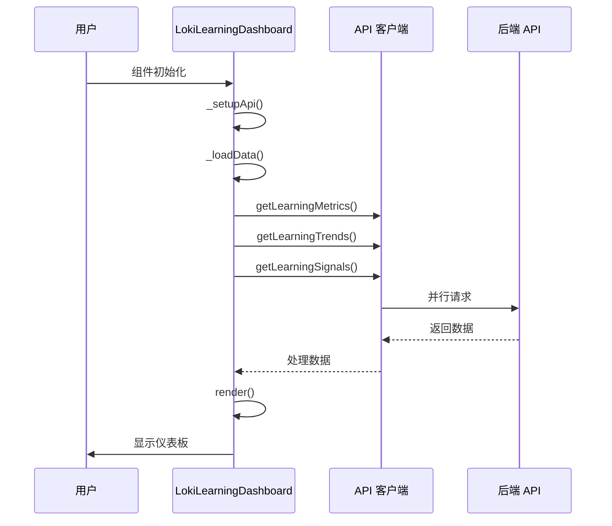
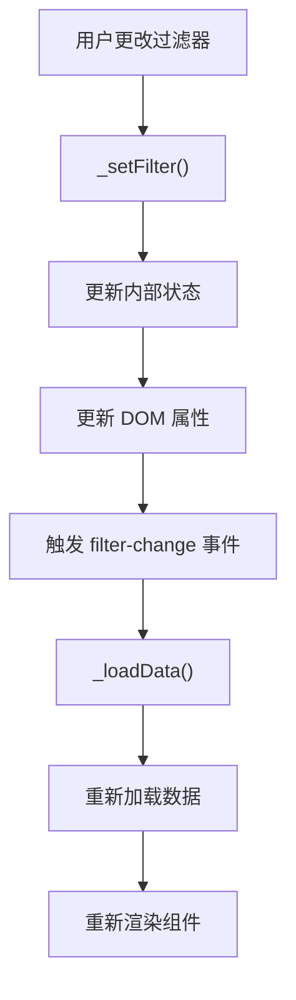

# LokiLearningDashboard 模块文档

## 概述

LokiLearningDashboard 是一个用于可视化跨工具学习系统中学习指标的 Web 组件。它提供了信号摘要、趋势图表、模式/偏好/工具效率列表以及近期信号活动的直观展示。组件支持按时间范围、信号类型和来源进行过滤，帮助用户理解和分析系统中的学习行为和模式。

## 核心功能

- **学习指标可视化**：展示总信号数、来源分布、发现的模式数量以及平均置信度
- **趋势分析**：通过图表展示信号量随时间的变化趋势
- **模式列表**：显示用户偏好、错误模式、成功模式和工具效率排名
- **信号活动**：展示最近的学习信号
- **灵活过滤**：支持按时间范围、信号类型和来源进行数据筛选

## 组件架构



## 核心组件详解

### LokiLearningDashboard 类

`LokiLearningDashboard` 是一个继承自 `LokiElement` 的自定义 Web 组件，负责整个学习仪表板的渲染和交互。

#### 属性配置

| 属性名 | 类型 | 默认值 | 说明 |
|--------|------|--------|------|
| `api-url` | string | `window.location.origin` | API 基础 URL |
| `theme` | string | 自动检测 | 主题，支持 'light' 或 'dark' |
| `time-range` | string | '7d' | 时间范围过滤器，可选值：'1h', '24h', '7d', '30d' |
| `signal-type` | string | 'all' | 信号类型过滤器 |
| `source` | string | 'all' | 信号来源过滤器 |

#### 事件

| 事件名 | 说明 | 事件详情 |
|--------|------|----------|
| `metric-select` | 当指标列表项被点击时触发 | `{ type, item }` |
| `filter-change` | 当任何过滤器下拉值改变时触发 | `{ timeRange, signalType, source }` |

#### 内部状态

```javascript
{
  _loading: boolean;           // 加载状态
  _error: string | null;       // 错误信息
  _api: ApiClient | null;    // API 客户端实例
  _timeRange: string;         // 时间范围
  _signalType: string;          // 信号类型
  _source: string;            // 信号来源
  _metrics: object | null;    // 指标数据
  _trends: object | null;      // 趋势数据
  _signals: Array;               // 信号数据
  _selectedMetric: object | null;   // 选中的指标
}
```

## 使用方法

### 基本用法

```html
<!-- 基本使用 -->
<loki-learning-dashboard></loki-learning-dashboard>

<!-- 带自定义配置 -->
<loki-learning-dashboard 
  api-url="http://localhost:57374" 
  theme="dark" 
  time-range="7d"
  signal-type="all"
  source="all">
</loki-learning-dashboard>
```

### JavaScript 集成

```javascript
// 创建组件实例
const dashboard = document.createElement('loki-learning-dashboard');
dashboard.setAttribute('api-url', 'http://localhost:57374');
dashboard.setAttribute('time-range', '24h');
document.body.appendChild(dashboard);

// 监听事件
dashboard.addEventListener('metric-select', (event) => {
  console.log('选中的指标:', event.detail);
});

dashboard.addEventListener('filter-change', (event) => {
  console.log('过滤器变化:', event.detail);
});
```

## 数据结构

### 指标数据结构

```javascript
{
  totalSignals: number;                    // 总信号数
  signalsByType: {                        // 按类型的信号分布
    [type: string]: number;
  };
  signalsBySource: {                  // 按来源的信号分布
    [source: string]: number;
  };
  avgConfidence: number;                  // 平均置信度
  aggregation: {
    preferences: Array<{
      preference_key: string;
      preferred_value: any;
      frequency: number;
      confidence: number;
      alternatives_rejected: Array<string>;
      sources: Array<string>;
      first_seen: string;
      last_seen: string;
    }>;
    error_patterns: Array<{
      error_type: string;
      resolution_rate: number;
      common_messages: Array<string>;
      resolutions: Array<string>;
      frequency: number;
      confidence: number;
      sources: Array<string>;
      first_seen: string;
      last_seen: string;
    }>;
    success_patterns: Array<{
      pattern_name: string;
      avg_duration_seconds: number;
      common_actions: Array<string>;
      frequency: number;
      confidence: number;
      sources: Array<string>;
      first_seen: string;
      last_seen: string;
    }>;
    tool_efficiencies: Array<{
      tool_name: string;
      efficiency_score: number;
      usage_count: number;
      success_rate: number;
      avg_execution_time_ms: number;
      total_tokens_used: number;
      alternative_tools: Array<string>;
      sources: Array<string>;
      first_seen: string;
      last_seen: string;
    }>;
  };
}
```

### 趋势数据结构

```javascript
{
  dataPoints: Array<{
    label: string;
    count: number;
  }>;
  maxValue: number;
  period: string;
}
```

### 信号数据结构

```javascript
{
  type: string;
  timestamp: string;
  data: {
    action: string;
    source: string;
    outcome: string;
  };
}
```

## 工作流程

### 数据加载流程



### 过滤器变化流程



## 样式和主题

### CSS 变量

组件使用以下 CSS 变量来支持主题切换：

- `--loki-bg-card` - 卡片背景色
- `--loki-bg-secondary` - 次要背景色
- `--loki-bg-tertiary` - 第三级背景色
- `--loki-bg-hover` - 悬停背景色
- `--loki-text-primary` - 主要文本颜色
- `--loki-text-secondary` - 次要文本颜色
- `--loki-text-muted` - 静音文本颜色
- `--loki-border` - 边框颜色
- `--loki-accent` - 强调色
- `--loki-accent-muted` - 柔和强调色
- `--loki-red` / `--loki-red-muted` - 红色系列
- `--loki-green` / `--loki-green-muted` - 绿色系列
- `--loki-blue` / `--loki-blue-muted` - 蓝色系列
- `--loki-purple` / `--loki-purple-muted` - 紫色系列
- `--loki-yellow` / `--loki-yellow-muted` - 黄色系列
- `--loki-transition` - 过渡动画
- `--loki-radius` - 圆角半径

## 扩展和自定义

### 自定义过滤器选项

可以通过修改组件代码中的常量来扩展过滤器选项：

```javascript
// 扩展时间范围选项
const TIME_RANGES = [
  { id: '1h', label: '1 Hour', hours: 1 },
  { id: '24h', label: '24 Hours', hours: 24 },
  { id: '7d', label: '7 Days', hours: 168 },
  { id: '30d', label: '30 Days', hours: 720 },
  { id: '90d', label: '90 Days', hours: 2160 }, // 新增
];

// 扩展信号类型选项
const SIGNAL_TYPES = [
  { id: 'all', label: 'All Signals' },
  { id: 'user_preference', label: 'User Preferences' },
  { id: 'error_pattern', label: 'Error Patterns' },
  { id: 'success_pattern', label: 'Success Patterns' },
  { id: 'tool_efficiency', label: 'Tool Efficiency' },
  { id: 'context_relevance', label: 'Context Relevance' },
  { id: 'custom_type', label: 'Custom Type' }, // 新增
];
```

### 自定义可视化

可以通过继承 `LokiLearningDashboard` 类来创建自定义版本：

```javascript
export class CustomLearningDashboard extends LokiLearningDashboard {
  _renderSummaryCards() {
    // 自定义摘要卡片渲染
    return `
      <div class="custom-summary">
        <!-- 自定义内容 -->
      </div>
    `;
  }
  
  _renderTrendChart() {
    // 自定义趋势图表渲染
    return `
      <div class="custom-chart">
        <!-- 自定义图表 -->
      </div>
    `;
  }
}

customElements.define('custom-learning-dashboard', CustomLearningDashboard);
```

## 注意事项和限制

### 错误处理

- 组件会捕获 API 请求失败，但会静默处理单个请求失败，继续渲染其他数据
- 当所有数据请求失败时，会显示错误状态
- API 响应数据结构需要符合预期格式，否则可能导致渲染异常

### 性能考虑

- 组件使用 Shadow DOM 进行样式隔离，确保样式不会影响其他元素
- 信号列表默认限制为 50 条，以保持良好的性能
- 图表数据点数量会影响渲染性能，建议限制在合理范围内

### 浏览器兼容性

- 组件使用自定义元素 API，需要现代浏览器支持
- 需要支持 ES6+ 语法和 Web Components
- 在不支持的浏览器中需要使用 polyfill

### 依赖项

- 依赖 `LokiElement` 基类，提供主题和基础样式功能
- 依赖 `getApiClient` 函数，用于创建 API 客户端
- 需要后端 API 提供学习数据接口

## 相关模块

- [LokiMemoryBrowser](LokiMemoryBrowser.md) - 内存浏览器组件
- [LokiOverview](LokiOverview.md) - 总览组件
- [LokiAnalytics](LokiAnalytics.md) - 分析组件
- [LokiPromptOptimizer](LokiPromptOptimizer.md) - 提示优化器组件

## 示例应用场景

### 场景 1：监控学习系统效果

通过学习仪表板可以帮助团队监控学习系统的效果，查看收集到的信号类型分布和趋势，了解用户偏好和成功模式，从而优化系统设计。

### 场景 2：分析工具使用效率

通过工具效率排名可以帮助识别最有效的工具，查看工具的成功率和执行时间，为工具选择和优化提供数据支持。

### 场景 3：追踪错误模式

错误模式列表可以帮助团队了解常见的错误类型和解决方法，提高系统的稳定性和用户体验。

### 场景 4：多维度数据过滤

通过组合使用时间范围、信号类型和来源过滤器，可以从不同角度分析学习数据，发现隐藏的模式和趋势。
