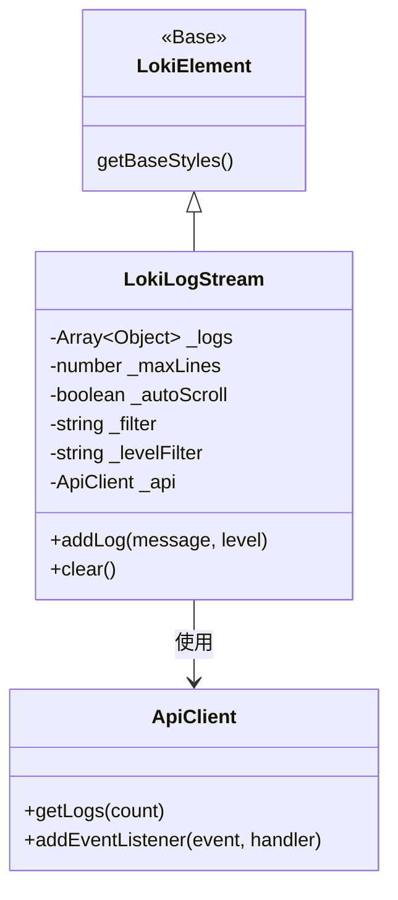
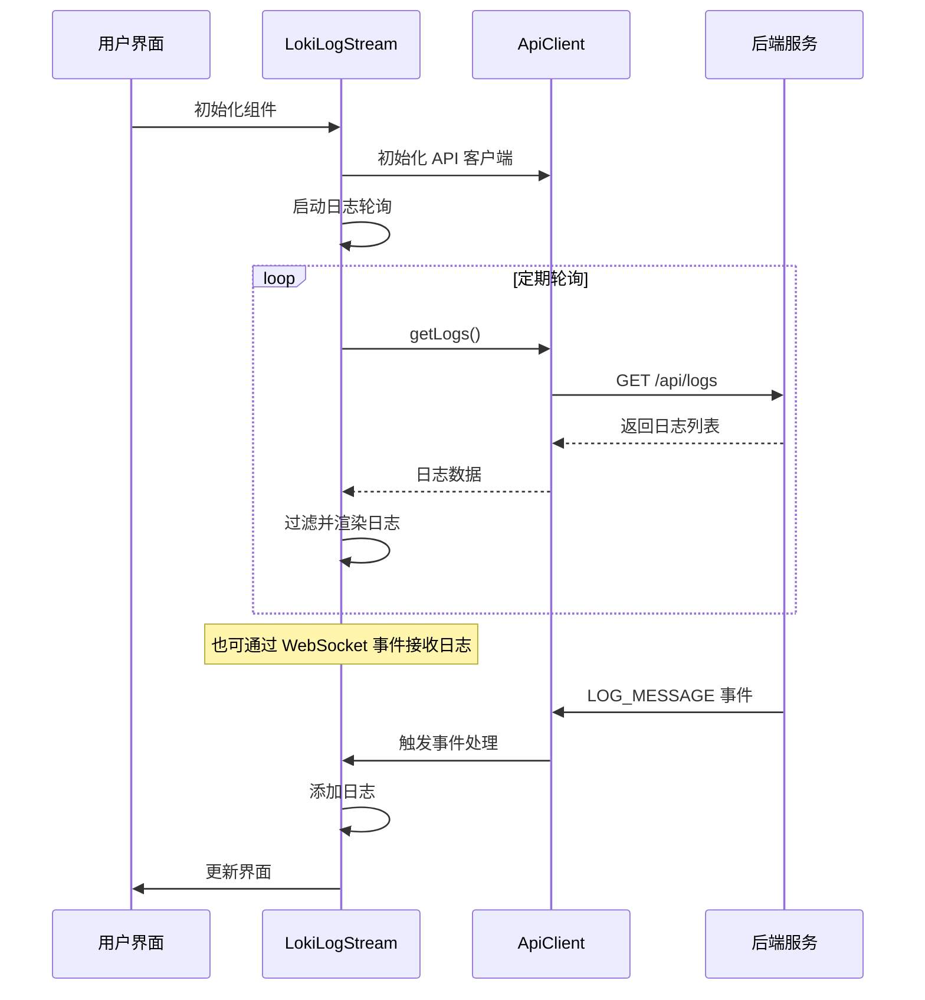

# LokiLogStream 模块文档

## 概述

LokiLogStream 是一个功能强大的实时日志查看器组件，设计为终端仿真器样式，提供多级别过滤、文本搜索、自动滚动和日志下载功能。该组件支持两种主要的日志源：API 轮询和文件轮询，同时也能通过 WebSocket 事件接收实时日志。作为 Dashboard UI Components 套件的一部分，LokiLogStream 为用户提供了直观的方式来监控和分析系统日志。

### 主要特性

- **实时日志监控**：支持 API 轮询、文件轮询和 WebSocket 事件接收
- **多级日志过滤**：支持 7 种日志级别的筛选显示
- **文本搜索功能**：可通过关键词快速定位相关日志
- **终端仿真器界面**：美观的深色主题和等宽字体
- **自动滚动**：新日志到达时自动滚动到底部
- **日志管理**：支持清空和下载功能

## 组件架构

### 核心依赖关系

LokiLogStream 组件继承自 LokiElement 基类，利用 LokiTheme 提供的主题系统，并通过 ApiClient 与后端服务进行通信。



### 数据流和事件处理

组件通过多种方式接收日志数据，并在内部维护一个日志缓冲区，同时通过自定义事件与外部环境交互。



## 核心组件详解

### LokiLogStream 类

LokiLogStream 是一个自定义 Web 组件，继承自 LokiElement，提供完整的日志查看功能。

#### 属性与配置

组件支持以下 HTML 属性，可通过属性变更动态调整：

| 属性名 | 类型 | 默认值 | 描述 |
|--------|------|--------|------|
| `api-url` | string | window.location.origin | API 基础 URL |
| `max-lines` | number | 500 | 保留的最大日志行数 |
| `auto-scroll` | boolean | false | 是否启用自动滚动 |
| `theme` | string | 自动检测 | 主题设置（light 或 dark） |
| `log-file` | string | null | 日志文件路径（用于文件轮询） |

#### 生命周期方法

```javascript
connectedCallback() {
  // 组件挂载时调用
  // 初始化配置、设置 API 连接、启动日志轮询
}

disconnectedCallback() {
  // 组件卸载时调用
  // 清理轮询定时器、移除事件监听器
}

attributeChangedCallback(name, oldValue, newValue) {
  // 监听属性变化并作出响应
  // 处理 api-url、max-lines、auto-scroll、theme 的变更
}
```

#### 公共 API 方法

##### `addLog(message, level = 'info')`

向日志流中添加一条新日志。

**参数：**
- `message` (string): 日志消息内容
- `level` (string): 日志级别，默认为 'info'

**使用示例：**
```javascript
const logStream = document.querySelector('loki-log-stream');
logStream.addLog('用户操作完成', 'success');
logStream.addLog('网络请求超时', 'warning');
```

##### `clear()`

清空所有日志。

**使用示例：**
```javascript
const logStream = document.querySelector('loki-log-stream');
logStream.clear();
```

### 日志源处理

组件支持三种获取日志的方式，按优先级处理：

1. **文件轮询**：当设置了 `log-file` 属性时，定期获取并解析日志文件
2. **API 轮询**：默认方式，定期调用 `/api/logs` 接口获取日志
3. **WebSocket 事件**：通过 ApiClient 监听 `LOG_MESSAGE` 事件接收实时日志

#### 文件解析

当从文件读取日志时，组件支持三种日志格式的自动识别和解析：

1. 标准格式：`[TIMESTAMP] [LEVEL] message`
2. 简单格式：`TIMESTAMP LEVEL message`
3. 纯文本：默认作为 info 级别处理

### 日志级别配置

组件预定义了 7 种日志级别，每种都有对应的颜色和标签：

```javascript
const LOG_LEVELS = {
  info: { color: 'var(--loki-blue)', label: 'INFO' },
  success: { color: 'var(--loki-green)', label: 'SUCCESS' },
  warning: { color: 'var(--loki-yellow)', label: 'WARN' },
  error: { color: 'var(--loki-red)', label: 'ERROR' },
  step: { color: 'var(--loki-purple)', label: 'STEP' },
  agent: { color: 'var(--loki-accent)', label: 'AGENT' },
  debug: { color: 'var(--loki-text-muted)', label: 'DEBUG' },
};
```

## 使用指南

### 基本使用

最简单的使用方式是直接在 HTML 中引入组件：

```html
<loki-log-stream></loki-log-stream>
```

### 配置 API 源

```html
<loki-log-stream 
  api-url="http://localhost:57374" 
  max-lines="1000" 
  auto-scroll>
</loki-log-stream>
```

### 配置文件源

```html
<loki-log-stream 
  log-file="/path/to/logs.txt" 
  max-lines="500">
</loki-log-stream>
```

### JavaScript 控制

```javascript
// 获取组件实例
const logStream = document.querySelector('loki-log-stream');

// 编程方式添加日志
logStream.addLog('系统初始化完成', 'success');
logStream.addLog('检测到异常活动', 'warning');

// 清空日志
logStream.clear();

// 监听事件
logStream.addEventListener('log-received', (e) => {
  console.log('新日志:', e.detail);
});

logStream.addEventListener('logs-cleared', () => {
  console.log('日志已清空');
});
```

## 主题与样式

LokiLogStream 使用 LokiTheme 系统提供的 CSS 变量，支持深色主题。主要样式元素包括：

- **终端容器**：带有圆角边框的深色容器
- **终端头部**：包含控制按钮和筛选器
- **日志输出区**：带有等宽字体的可滚动区域
- **状态栏**：显示日志计数信息

### 自定义样式

您可以通过 CSS 变量覆盖默认样式：

```css
loki-log-stream {
  --loki-blue: #4A90E2;
  --loki-green: #50E3C2;
  --loki-yellow: #F5A623;
  --loki-red: #D0021B;
  --loki-purple: #9013FE;
  --loki-accent: #FF6B9D;
  --loki-text-muted: #8B7FA8;
  --loki-border: #2A1F3E;
  --loki-bg-secondary: #140B24;
  --loki-transition: 0.2s ease;
}
```

## 事件系统

LokiLogStream 触发以下自定义事件：

### `log-received`

当接收到新日志时触发。

**事件详情：**
```javascript
{
  id: number,           // 日志唯一标识
  timestamp: string,    // 时间戳
  level: string,        // 日志级别
  message: string       // 日志消息
}
```

### `logs-cleared`

当日志被清空时触发，不包含任何数据。

## 注意事项与限制

### 性能考虑

- 当 `max-lines` 设置过大时，可能会影响渲染性能，建议保持在 1000 行以内
- 文本过滤是在客户端进行的，大量日志时可能会有轻微延迟
- API 轮询间隔为 2 秒，文件轮询间隔为 1 秒，这些值是硬编码的

### 错误处理

- API 请求失败时，组件会静默处理并继续下一次轮询
- 文件读取错误同样会被静默处理
- 无法识别的日志级别会默认作为 'info' 处理

### 安全考虑

- 所有日志消息在渲染前都会进行 HTML 转义，防止 XSS 攻击
- 组件不支持执行日志中的任何脚本内容

### 浏览器兼容性

- 需要支持 Web Components (Custom Elements 和 Shadow DOM)
- 推荐使用现代浏览器（Chrome、Firefox、Safari、Edge 最新版本）

## 与其他组件的集成

LokiLogStream 可以与 Dashboard UI Components 套件中的其他组件协同工作：

- **LokiAppStatus**：显示应用状态信息，可与日志流配合提供完整监控
- **LokiContextTracker**：提供上下文信息，帮助理解日志背景
- **LokiRunManager**：管理运行会话，可与日志流结合使用

更多关于这些组件的信息，请参考相应的模块文档。

## 总结

LokiLogStream 是一个功能丰富、易于集成的实时日志查看组件，为 Loki Mode 系统提供了直观的日志监控能力。其终端仿真器界面、多种日志源支持、灵活的过滤功能和良好的可扩展性，使其成为 Dashboard UI 中不可或缺的组件。

通过遵循本文档中的指导，开发者可以快速上手使用、配置和扩展 LokiLogStream，为其应用添加专业级的日志查看功能。
