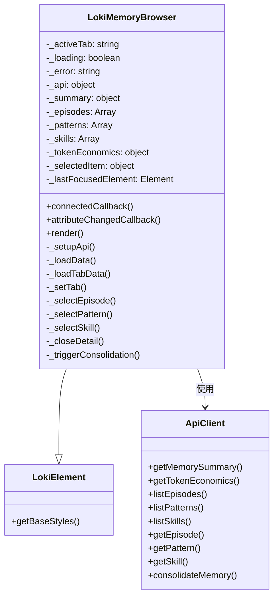
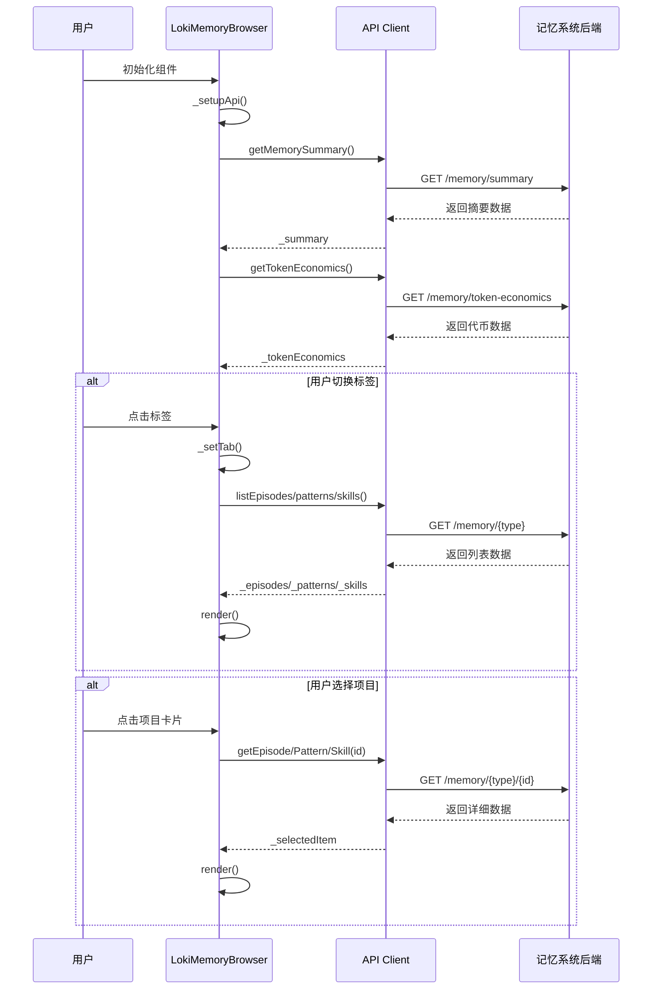

# LokiMemoryBrowser 模块文档

## 目录
1. [模块概述](#模块概述)
2. [架构与组件关系](#架构与组件关系)
3. [核心功能详解](#核心功能详解)
4. [API 参考](#api-参考)
5. [使用指南](#使用指南)
6. [主题与样式](#主题与样式)
7. [注意事项与边界情况](#注意事项与边界情况)

---

## 模块概述

### 功能定位

LokiMemoryBrowser 是一个专门为 Loki Mode 记忆系统设计的标签化浏览器组件。它提供了一个直观的用户界面，用于查看和管理三种类型的记忆层：**情景记忆（Episodic Memory）**、**语义记忆（Semantic Memory）** 和 **程序记忆（Procedural Memory）**。

该组件不仅是一个简单的数据展示工具，还包含了记忆摘要视图、详细信息面板、代币经济学分析以及记忆整合控制功能，为用户提供了全面的记忆系统管理能力。

### 设计理念

组件遵循以下设计原则：

1. **模块化架构**：通过标签页组织不同类型的记忆内容，使界面清晰且易于导航
2. **响应式设计**：适配不同屏幕尺寸，提供一致的用户体验
3. **无障碍优先**：完整支持键盘导航和屏幕阅读器
4. **主题一致性**：与 Loki UI 组件库的设计系统无缝集成
5. **性能优化**：采用渐进式数据加载，确保界面响应流畅

### 在系统中的位置

LokiMemoryBrowser 属于 Dashboard UI Components 模块下的 Memory and Learning Components 子模块，与 LokiLearningDashboard 和 LokiPromptOptimizer 共同构成了记忆系统的用户界面层。

```
Dashboard UI Components
└── Memory and Learning Components
    ├── LokiMemoryBrowser (当前模块)
    ├── LokiLearningDashboard
    └── LokiPromptOptimizer
```

---

## 架构与组件关系

### 组件架构图



### 数据流向



---

## 核心功能详解

### 1. 标签页系统

#### 功能描述

标签页系统是组件的核心导航机制，提供四个主要视图：

- **Summary（摘要）**：显示记忆系统的整体状态和关键指标
- **Episodes（情景）**：浏览具体的交互记录和任务执行历史
- **Patterns（模式）**：查看从经验中提取的通用模式和反模式
- **Skills（技能）**：管理学习到的技能和程序

#### 实现细节

标签页通过 `TABS` 常量定义，每个标签包含：
- `id`：唯一标识符
- `label`：显示文本
- `icon`：SVG 路径数据

```javascript
const TABS = [
  { id: 'summary', label: 'Summary', icon: 'M4 6h16M4 12h16M4 18h16' },
  { id: 'episodes', label: 'Episodes', icon: 'M12 8v4l3 3m6-3a9 9 0 11-18 0 9 9 0 0118 0z' },
  { id: 'patterns', label: 'Patterns', icon: 'M9 12h6m-6 4h6m2 5H7a2 2 0 01-2-2V5a2 2 0 012-2h5.586a1 1 0 01.707.293l5.414 5.414a1 1 0 01.293.707V19a2 2 0 01-2 2z' },
  { id: 'skills', label: 'Skills', icon: 'M13 10V3L4 14h7v7l9-11h-7z' },
];
```

#### 键盘导航

标签页支持完整的键盘导航：
- `←` / `→`：在标签间移动
- `Enter` / `Space`：激活选中的标签
- 自动焦点管理：标签切换时正确设置焦点顺序

### 2. 数据加载与状态管理

#### 功能描述

组件实现了完整的数据加载生命周期管理，包括：
- 初始化时的批量数据加载
- 标签页切换时的按需数据加载
- 加载状态和错误状态的用户反馈
- 数据刷新机制

#### 核心方法

**`_loadData()`** - 主数据加载方法
```javascript
async _loadData() {
  this._loading = true;
  this._error = null;
  this.render();

  try {
    // 先加载摘要数据
    this._summary = await this._api.getMemorySummary().catch(() => null);
    this._tokenEconomics = await this._api.getTokenEconomics().catch(() => null);

    // 加载标签页特定数据
    await this._loadTabData();
  } catch (error) {
    this._error = error.message || 'Failed to load memory data';
  }

  this._loading = false;
  this.render();
}
```

**`_loadTabData()`** - 标签页数据加载
```javascript
async _loadTabData() {
  switch (this._activeTab) {
    case 'episodes':
      this._episodes = await this._api.listEpisodes({ limit: 50 }).catch(() => []);
      break;
    case 'patterns':
      this._patterns = await this._api.listPatterns().catch(() => []);
      break;
    case 'skills':
      this._skills = await this._api.listSkills().catch(() => []);
      break;
  }
}
```

#### 错误处理

组件采用优雅降级的错误处理策略：
- 单个 API 调用失败不会阻止其他数据加载
- 使用 `.catch(() => [])` 为列表数据提供空数组回退
- 使用 `.catch(() => null)` 为对象数据提供 null 回退
- 在界面上显示友好的错误信息而不是技术堆栈跟踪

### 3. 详情面板系统

#### 功能描述

详情面板提供了对选中项目的深度查看功能，支持三种不同类型的项目：
- **Episode（情景）**：显示任务执行细节、操作日志、结果等
- **Pattern（模式）**：显示模式描述、条件、正确/错误做法等
- **Skill（技能）**：显示技能描述、前提条件、步骤、退出标准等

#### 焦点管理

详情面板实现了完整的焦点循环管理：
1. 打开详情时保存最后聚焦的元素
2. 详情面板打开后自动聚焦到关闭按钮
3. 关闭详情时将焦点返回到原来的元素

```javascript
_focusDetailPanel() {
  requestAnimationFrame(() => {
    const closeBtn = this.shadowRoot.getElementById('close-detail');
    if (closeBtn) {
      closeBtn.focus();
    }
  });
}

_closeDetail() {
  this._selectedItem = null;
  this.render();
  // 返回焦点到最后聚焦的元素
  if (this._lastFocusedElement) {
    requestAnimationFrame(() => {
      this._lastFocusedElement.focus();
      this._lastFocusedElement = null;
    });
  }
}
```

#### 智能渲染

详情面板通过检查对象的特定属性来判断项目类型：
- `actionLog` 存在 → Episode
- `conditions` 存在 → Pattern  
- `steps` 存在 → Skill

这种设计避免了需要额外类型字段的需求，使 API 更加简洁。

### 4. 记忆整合功能

#### 功能描述

记忆整合是一个高级功能，允许用户触发记忆系统的模式提取和优化过程。该功能会：
- 分析最近的情景记忆
- 提取新的模式
- 合并相似的模式
- 优化记忆存储

#### 实现细节

```javascript
async _triggerConsolidation() {
  try {
    const result = await this._api.consolidateMemory(24);
    alert(`Consolidation complete:\n- Patterns created: ${result.patternsCreated}\n- Patterns merged: ${result.patternsMerged}\n- Episodes processed: ${result.episodesProcessed}`);
    this._loadData();
  } catch (error) {
    alert('Consolidation failed: ' + error.message);
  }
}
```

#### 参数说明

- `hours`：指定要整合的小时数（当前固定为 24 小时）
- 返回结果包含：
  - `patternsCreated`：新创建的模式数量
  - `patternsMerged`：合并的模式数量
  - `episodesProcessed`：处理的情景数量

---

## API 参考

### 属性（Attributes）

| 属性名 | 类型 | 默认值 | 说明 |
|--------|------|--------|------|
| `api-url` | string | `window.location.origin` | API 基础 URL |
| `theme` | string | 自动检测 | 主题设置：'light' 或 'dark' |
| `tab` | string | 'summary' | 初始激活的标签页 |

### 观察属性（Observed Attributes）

组件会监视以下属性的变化并作出响应：

```javascript
static get observedAttributes() {
  return ['api-url', 'theme', 'tab'];
}
```

#### 属性变更处理

**`api-url` 变更**：
- 更新 API 客户端的基础 URL
- 重新加载所有数据

**`theme` 变更**：
- 调用 `_applyTheme()` 方法应用新主题

**`tab` 变更**：
- 调用 `_setTab()` 方法切换标签页

### 事件（Events）

| 事件名 | 触发时机 | detail 数据 |
|--------|----------|-------------|
| `episode-select` | 用户选择情景时 | 选中的情景对象 |
| `pattern-select` | 用户选择模式时 | 选中的模式对象 |
| `skill-select` | 用户选择技能时 | 选中的技能对象 |

### 公共方法

#### `render()`

强制重新渲染组件。通常在内部状态变化时自动调用，但也可以手动调用以强制更新。

### 生命周期方法

#### `connectedCallback()`

组件被添加到 DOM 时调用：
1. 调用父类的 `connectedCallback()`
2. 从属性初始化活动标签
3. 设置 API 客户端
4. 加载数据
5. 渲染组件

#### `attributeChangedCallback(name, oldValue, newValue)`

观察属性变化时调用：
- 跳过新旧值相同的情况
- 根据属性名分发到相应的处理逻辑

#### `disconnectedCallback()`

（继承自 LokiElement）组件从 DOM 移除时调用，用于清理资源。

---

## 使用指南

### 基本使用

最简单的使用方式是直接在 HTML 中使用自定义元素：

```html
<loki-memory-browser></loki-memory-browser>
```

### 完整配置示例

```html
<loki-memory-browser 
  api-url="http://localhost:57374"
  theme="dark"
  tab="episodes">
</loki-memory-browser>
```

### JavaScript 编程使用

#### 动态创建组件

```javascript
// 创建组件实例
const browser = document.createElement('loki-memory-browser');

// 设置属性
browser.setAttribute('api-url', 'http://localhost:57374');
browser.setAttribute('theme', 'dark');
browser.setAttribute('tab', 'patterns');

// 添加到文档
document.body.appendChild(browser);
```

#### 监听事件

```javascript
const browser = document.querySelector('loki-memory-browser');

// 监听情景选择事件
browser.addEventListener('episode-select', (event) => {
  console.log('Selected episode:', event.detail);
  // 可以在这里添加自定义处理逻辑
});

// 监听模式选择事件
browser.addEventListener('pattern-select', (event) => {
  console.log('Selected pattern:', event.detail);
});

// 监听技能选择事件
browser.addEventListener('skill-select', (event) => {
  console.log('Selected skill:', event.detail);
});
```

#### 程序化控制

```javascript
const browser = document.querySelector('loki-memory-browser');

// 切换标签页
browser.setAttribute('tab', 'skills');

// 更改 API URL
browser.setAttribute('api-url', 'https://api.example.com');

// 切换主题
browser.setAttribute('theme', 'light');

// 强制重新渲染
browser.render();
```

### 框架集成示例

#### React 集成

```jsx
import React, { useRef, useEffect } from 'react';

function MemoryBrowser() {
  const browserRef = useRef(null);

  useEffect(() => {
    if (browserRef.current) {
      // 添加事件监听器
      browserRef.current.addEventListener('episode-select', handleEpisodeSelect);
    }

    return () => {
      if (browserRef.current) {
        browserRef.current.removeEventListener('episode-select', handleEpisodeSelect);
      }
    };
  }, []);

  const handleEpisodeSelect = (event) => {
    console.log('Episode selected:', event.detail);
  };

  return (
    <loki-memory-browser
      ref={browserRef}
      api-url={process.env.REACT_APP_API_URL}
      theme="dark"
      tab="summary"
    />
  );
}
```

#### Vue 集成

```vue
<template>
  <loki-memory-browser
    ref="browser"
    :api-url="apiUrl"
    :theme="theme"
    :tab="activeTab"
    @episode-select="onEpisodeSelect"
    @pattern-select="onPatternSelect"
    @skill-select="onSkillSelect"
  />
</template>

<script>
export default {
  data() {
    return {
      apiUrl: 'http://localhost:57374',
      theme: 'dark',
      activeTab: 'summary'
    };
  },
  methods: {
    onEpisodeSelect(event) {
      console.log('Episode selected:', event.detail);
    },
    onPatternSelect(event) {
      console.log('Pattern selected:', event.detail);
    },
    onSkillSelect(event) {
      console.log('Skill selected:', event.detail);
    }
  }
};
</script>
```

---

## 主题与样式

### CSS 自定义属性（CSS Variables）

组件使用 Loki 设计系统的 CSS 自定义属性，确保与整个应用的视觉一致性：

| 变量名 | 用途 |
|--------|------|
| `--loki-bg-card` | 卡片背景色 |
| `--loki-bg-secondary` | 次要背景色 |
| `--loki-bg-tertiary` | 三级背景色 |
| `--loki-bg-hover` | 悬停背景色 |
| `--loki-border` | 边框颜色 |
| `--loki-border-light` | 浅边框颜色 |
| `--loki-text-primary` | 主要文本颜色 |
| `--loki-text-secondary` | 次要文本颜色 |
| `--loki-text-muted` | 静音文本颜色 |
| `--loki-accent` | 强调色 |
| `--loki-blue` | 蓝色（情景记忆） |
| `--loki-purple` | 紫色（语义记忆） |
| `--loki-green` | 绿色（程序记忆/成功） |
| `--loki-red` | 红色（错误/失败） |
| `--loki-yellow` | 黄色（警告/部分成功） |
| `--loki-green-muted` | 柔和绿色背景 |
| `--loki-red-muted` | 柔和红色背景 |
| `--loki-yellow-muted` | 柔和黄色背景 |
| `--loki-transition` | 过渡动画时间 |

### 颜色系统

组件使用颜色编码来区分不同类型的记忆：

- **蓝色**：情景记忆
- **紫色**：语义记忆（模式）
- **绿色**：程序记忆（技能）和成功状态
- **红色**：错误和失败状态
- **黄色**：警告和部分成功状态

### 布局结构

组件采用响应式布局设计：

```
┌─────────────────────────────────────────┐
│  Browser Header                          │
├─────────────────────────────────────────┤
│  Tabs                                   │
├─────────────────┬───────────────────────┤
│                 │                       │
│  Content Main   │  Detail Panel         │
│                 │                       │
│  (可滚动)       │  (可滚动)             │
│                 │                       │
└─────────────────┴───────────────────────┘
```

### 暗色主题支持

组件完整支持暗色主题，通过 `theme` 属性或自动检测系统偏好来切换。所有颜色都会根据主题自动调整。

---

## 注意事项与边界情况

### API 依赖

#### 必需的 API 端点

组件依赖以下 API 端点，必须在后端实现：

```
GET /memory/summary          # 获取记忆摘要
GET /memory/token-economics  # 获取代币经济学数据
GET /memory/episodes         # 列出情景（支持 limit 参数）
GET /memory/episodes/:id     # 获取单个情景详情
GET /memory/patterns         # 列出模式
GET /memory/patterns/:id     # 获取单个模式详情
GET /memory/skills           # 列出技能
GET /memory/skills/:id       # 获取单个技能详情
POST /memory/consolidate     # 触发记忆整合
```

#### API 客户端要求

组件通过 `getApiClient()` 函数获取 API 客户端，该客户端必须实现以下方法：

```javascript
{
  getMemorySummary: () => Promise<object>,
  getTokenEconomics: () => Promise<object>,
  listEpisodes: (params?: object) => Promise<Array>,
  listPatterns: () => Promise<Array>,
  listSkills: () => Promise<Array>,
  getEpisode: (id: string) => Promise<object>,
  getPattern: (id: string) => Promise<object>,
  getSkill: (id: string) => Promise<object>,
  consolidateMemory: (hours: number) => Promise<object>
}
```

### 性能考虑

1. **数据量限制**：
   - 情景列表默认限制为 50 条
   - 大量数据可能导致渲染性能下降
   - 建议实现虚拟滚动或分页加载

2. **渲染优化**：
   - 组件使用 Shadow DOM 进行样式隔离
   - 详情面板条件渲染，避免不必要的 DOM 操作
   - 使用 `requestAnimationFrame` 确保 DOM 操作的平滑性

3. **内存管理**：
   - 组件在 `disconnectedCallback` 中应该清理事件监听器
   - 大量数据加载后应注意内存占用
   - 建议在长时间运行的应用中实现数据缓存策略

### 无障碍访问（Accessibility）

#### ARIA 角色和属性

组件实现了完整的 ARIA 支持：

- `role="tablist"`：标签列表容器
- `role="tab"`：单个标签按钮
- `role="tabpanel"`：标签内容区域
- `aria-selected`：标识选中状态
- `aria-controls`：关联标签和内容区域
- `aria-labelledby`：标识内容区域的标签
- `aria-label`：为屏幕阅读器提供描述

#### 键盘操作

所有交互元素都支持键盘操作：

**标签导航**：
- `Tab`：进入标签列表
- `←` / `→`：在标签间移动
- `Enter` / `Space`：激活标签

**项目列表**：
- `Tab`：进入项目列表
- `↑` / `↓`：在项目间移动
- `Enter` / `Space`：选择项目

**详情面板**：
- `Tab`：在详情面板内导航
- `Escape`：（未实现，建议添加）关闭详情面板

### 错误处理和边界情况

#### 网络错误

- API 调用失败时显示友好的错误信息
- 单个端点失败不会影响其他功能
- 提供刷新按钮允许用户重试

#### 空数据状态

- 每个标签页都有空状态的 UI 设计
- 摘要视图在没有数据时显示 "No memory data available"
- 列表视图在没有数据时显示针对性的空状态信息

#### 数据验证

- 使用 `_escapeHtml()` 方法防止 XSS 攻击
- 所有用户生成的内容都经过 HTML 转义
- 可选字段有默认值处理

### 已知限制

1. **分页支持**：当前不支持分页，情景列表限制为 50 条
2. **搜索过滤**：没有内置的搜索和过滤功能
3. **导出功能**：不支持数据导出
4. **批量操作**：不支持批量选择和操作
5. **实时更新**：没有 WebSocket 支持，需要手动刷新
6. **移动端优化**：详情面板在小屏幕上的体验可能不佳

### 安全考虑

1. **XSS 防护**：所有动态内容都经过 HTML 转义
2. **CORS**：需要正确配置 CORS 策略
3. **认证**：API 客户端应该处理认证令牌
4. **数据验证**：不要假设 API 返回的数据结构总是正确的

### 浏览器兼容性

- 使用 Custom Elements API（需要 polyfill 支持旧浏览器）
- 使用 Shadow DOM（需要 polyfill 支持旧浏览器）
- 使用 CSS Custom Properties（IE11 及以下不支持）
- 使用 ES6+ 特性（需要转译支持旧浏览器）

建议的浏览器支持：
- Chrome 54+
- Firefox 63+
- Safari 10.1+
- Edge 79+

对于旧浏览器，需要使用相应的 polyfills。

---

## 相关模块

- [LokiLearningDashboard](LokiLearningDashboard.md) - 学习仪表板组件
- [LokiPromptOptimizer](LokiPromptOptimizer.md) - 提示优化器组件
- [Memory System](../MemorySystem.md) - 记忆系统核心模块
- [LokiTheme](LokiTheme.md) - 主题系统文档

---

## 更新日志

### v1.0.0
- 初始版本发布
- 支持四种记忆视图（摘要、情景、模式、技能）
- 实现详情面板功能
- 添加记忆整合控制
- 完整的键盘导航支持
- 暗色主题支持
