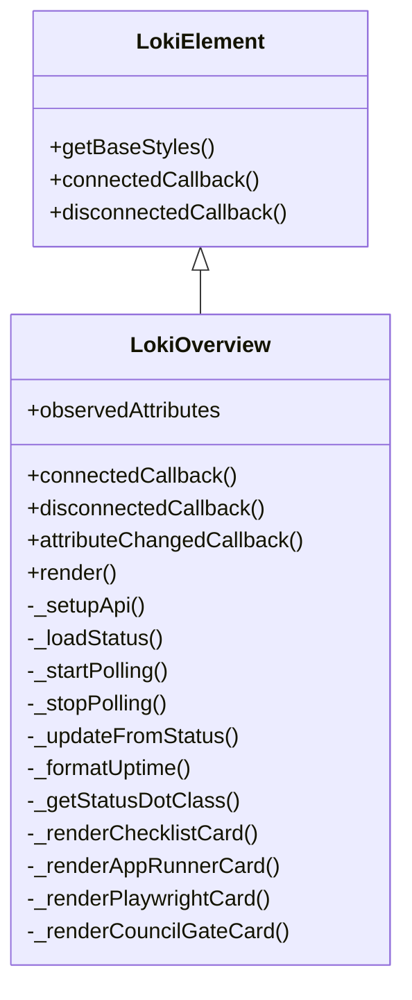
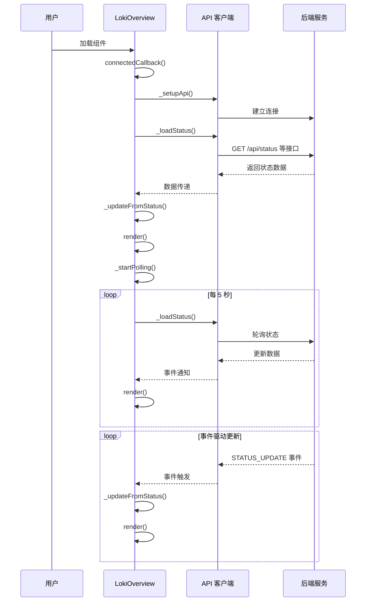

# LokiOverview 组件文档

## 概述

LokiOverview 是一个响应式的 Web Component，用于在仪表板中显示系统状态概览。该组件以卡片网格形式展示关键指标，包括会话状态、当前阶段、迭代次数、服务提供商、运行中代理、待处理任务、运行时间、复杂度、应用运行器状态、验证结果、PRD 进度和委员会门禁状态。

### 核心特性

- **实时状态监控**：通过定时轮询和事件监听机制保持数据最新
- **响应式布局**：自适应网格布局，可在各种屏幕尺寸上良好显示
- **主题支持**：内置浅色和深色主题，支持自动检测系统主题
- **多状态可视化**：通过颜色编码的状态指示器提供直观的状态反馈
- **实时更新**：结合定时轮询（每 5 秒）和事件驱动更新，确保信息及时性

## 组件架构

### 类继承关系



### 数据流程



## API 参考

### 属性

| 属性名 | 类型 | 默认值 | 描述 |
|--------|------|--------|------|
| `api-url` | string | `window.location.origin` | API 基础 URL |
| `theme` | string | 自动检测 | 主题设置，可选值：`light`、`dark` |

### 数据模型

组件内部维护以下状态数据：

```javascript
{
  status: 'offline',        // 会话状态: running, autonomous, paused, stopped, error, offline
  phase: null,              // 当前阶段
  iteration: null,          // 迭代次数
  provider: null,           // AI 服务提供商
  running_agents: 0,        // 运行中的代理数量
  pending_tasks: null,      // 待处理任务数量
  uptime_seconds: 0,        // 运行时间（秒）
  complexity: null,         // 复杂度级别
  connected: false          // API 连接状态
}
```

## 核心功能

### 1. 状态管理

组件通过两种方式获取最新状态：

- **定时轮询**：每 5 秒调用 `_loadStatus()` 方法获取最新状态
- **事件驱动**：监听 `ApiEvents.STATUS_UPDATE`、`ApiEvents.CONNECTED` 和 `ApiEvents.DISCONNECTED` 事件实现即时更新

### 2. API 集成

`_setupApi()` 方法初始化 API 客户端并设置事件监听器，支持动态更新 `api-url` 属性。

### 3. 卡片渲染

组件渲染多种类型的概览卡片：

#### 基础状态卡片
- 会话状态（带颜色指示器）
- 当前阶段
- 迭代次数
- 服务提供商
- 运行中代理数量
- 待处理任务数量
- 运行时间
- 复杂度级别

#### 专用卡片
- **PRD 进度**：显示需求文档验证进度，包含进度条和失败项提示
- **App Runner**：显示应用运行器状态，包括状态标签和端口信息
- **Verification**：显示 Playwright 验证结果，通过/失败状态和失败检查数量
- **Council Gate**：显示委员会门禁状态，通过/阻塞状态和严重故障数量

## 使用方法

### 基本用法

```html
<!-- 使用默认配置 -->
<loki-overview></loki-overview>

<!-- 自定义 API URL 和主题 -->
<loki-overview api-url="http://localhost:57374" theme="dark"></loki-overview>
```

### 程序化使用

```javascript
// 创建组件实例
const overview = document.createElement('loki-overview');

// 设置属性
overview.setAttribute('api-url', 'https://api.example.com');
overview.setAttribute('theme', 'light');

// 添加到 DOM
document.body.appendChild(overview);

// 动态修改属性
overview.setAttribute('api-url', 'https://new-api.example.com');
```

### 在 React 中使用

```jsx
import React, { useEffect, useRef } from 'react';

function LokiOverviewComponent({ apiUrl, theme }) {
  const elementRef = useRef(null);

  useEffect(() => {
    if (elementRef.current) {
      // 组件已挂载，可以访问 DOM 元素
      console.log('LokiOverview 已挂载');
    }
  }, []);

  return (
    <loki-overview
      ref={elementRef}
      api-url={apiUrl}
      theme={theme}
    />
  );
}
```

## 状态指示器

组件使用不同颜色的状态指示器来直观表示各种状态：

| 状态 | 颜色 | CSS 变量 | 动画 | 适用场景 |
|------|------|----------|------|----------|
| active | 绿色 | `--loki-green` | 脉冲动画 | 运行中、通过 |
| paused | 黄色 | `--loki-yellow` | 无 | 暂停 |
| stopped/error | 红色 | `--loki-red` | 无 | 停止、错误、阻塞、失败 |
| offline | 灰色 | `--loki-text-muted` | 无 | 离线、不可用 |

## 主题定制

组件使用 CSS 自定义属性（CSS Variables）实现主题化，可通过覆盖以下变量进行定制：

```css
loki-overview {
  --loki-bg-card: #ffffff;        /* 卡片背景 */
  --loki-bg-secondary: #f4f4f5;   /* 次要背景 */
  --loki-bg-hover: #e4e4e7;       /* 悬停背景 */
  --loki-border: #d4d4d8;         /* 边框颜色 */
  --loki-text-muted: #71717a;     /* 次要文本 */
  --loki-accent: #3b82f6;         /* 强调色 */
  --loki-green: #22c55e;          /* 成功色 */
  --loki-yellow: #f59e0b;         /* 警告色 */
  --loki-red: #ef4444;            /* 错误色 */
  --loki-transition: 0.2s ease;   /* 过渡动画 */
}
```

## 边缘情况和注意事项

### 错误处理

1. **API 连接失败**：当无法连接到 API 时，组件会显示"离线"状态，所有数值显示为 `--`
2. **数据不完整**：对于缺失或无效的数据，组件会显示默认值或 `--`
3. **异步加载**：使用 `Promise.allSettled()` 并行加载多个数据源，确保单个接口失败不影响其他数据展示

### 性能考虑

1. **定时轮询**：每 5 秒进行一次完整的状态更新，在生产环境中可考虑根据实际需求调整频率
2. **事件监听**：组件在断开连接时会正确清理所有事件监听器，避免内存泄漏
3. **渲染优化**：仅在数据实际变化时才更新 DOM，通过 Shadow DOM 实现样式隔离

### 限制条件

1. **浏览器兼容性**：需要支持 Custom Elements、Shadow DOM 和 ES6+ 特性的现代浏览器
2. **API 依赖**：组件依赖特定的 API 端点结构，包括 `/api/status`、`/api/checklist-summary`、`/api/app-runner-status`、`/api/playwright-results` 和 `/api/council-gate`
3. **数据格式**：期望的响应数据格式需要与组件内部处理逻辑匹配

## 相关组件

- [LokiTaskBoard](LokiTaskBoard.md) - 任务管理面板
- [LokiSessionControl](LokiSessionControl.md) - 会话控制面板
- [LokiLogStream](LokiLogStream.md) - 日志流组件
- [LokiAnalytics](LokiAnalytics.md) - 分析仪表板

## 示例集成

### 与其他 Loki UI 组件一起使用

```html
<div class="dashboard">
  <!-- 概览组件 -->
  <loki-overview api-url="http://localhost:57374" theme="dark"></loki-overview>
  
  <!-- 任务面板 -->
  <loki-task-board api-url="http://localhost:57374" theme="dark"></loki-task-board>
  
  <!-- 会话控制 -->
  <loki-session-control api-url="http://localhost:57374" theme="dark"></loki-session-control>
  
  <!-- 日志流 -->
  <loki-log-stream api-url="http://localhost:57374" theme="dark"></loki-log-stream>
</div>
```

## 维护与更新

### 扩展组件功能

要添加新的概览卡片，可按照以下步骤：

1. 在 `_loadStatus()` 方法中添加获取新数据的 API 调用
2. 创建新的渲染方法（如 `_renderNewCard()`）
3. 在 `render()` 方法的网格中添加新卡片的渲染调用

### 调试提示

1. 检查浏览器控制台是否有 API 相关错误
2. 验证 `api-url` 属性是否正确设置
3. 使用浏览器开发者工具检查 Shadow DOM 内部结构和样式
4. 监听组件的状态变化可以通过在 `render()` 方法中添加日志实现
