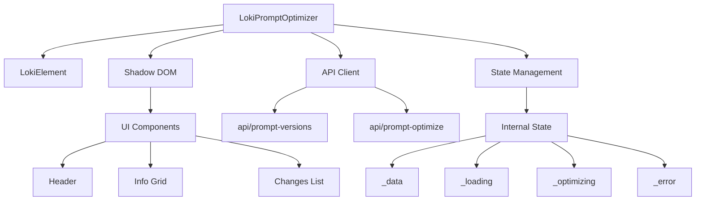
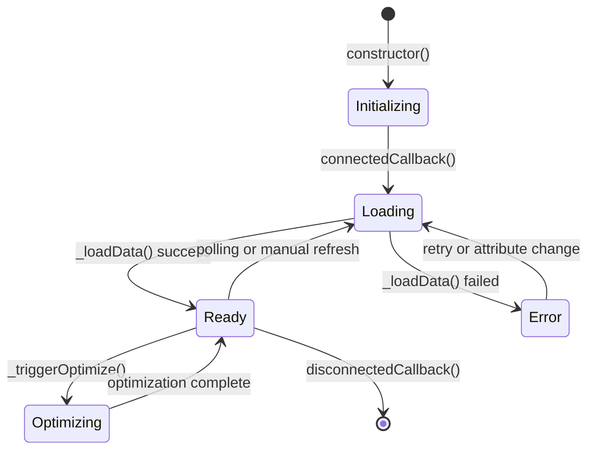
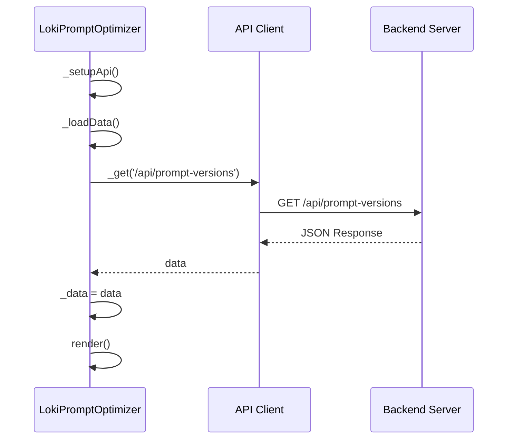
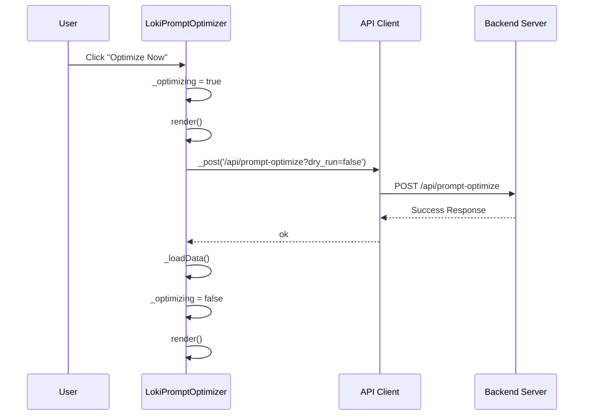
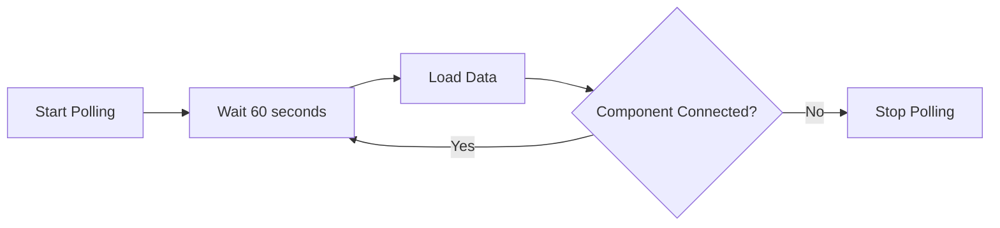

# LokiPromptOptimizer 模块文档

## 目录
1. [模块概述](#模块概述)
2. [核心组件](#核心组件)
3. [架构设计](#架构设计)
4. [使用指南](#使用指南)
5. [API参考](#api参考)
6. [状态管理](#状态管理)
7. [数据流](#数据流)
8. [注意事项与限制](#注意事项与限制)

---

## 模块概述

### 模块目的
LokiPromptOptimizer是Dashboard UI Components库中的一个专门用于提示词优化管理的前端组件。该组件为用户提供了一个直观的界面，用于监控提示词版本、查看优化历史、分析失败情况以及手动触发优化过程。

### 设计理念
该组件采用了以下设计原则：
- **实时监控**：通过定时轮询机制保持数据的实时性
- **用户友好**：提供清晰的视觉层次和交互反馈
- **状态驱动**：组件状态完全由数据驱动，确保UI一致性
- **可扩展性**：基于Web Components标准构建，便于集成和扩展

### 核心功能
- 显示当前提示词版本信息
- 展示最近优化时间
- 统计分析的失败次数
- 列出优化变更及其理由
- 支持手动触发优化操作
- 自动数据刷新（每60秒）

---

## 核心组件

### LokiPromptOptimizer类

**类定义**：
```javascript
export class LokiPromptOptimizer extends LokiElement
```

**继承关系**：
```
LokiElement (基类)
    ↑
LokiPromptOptimizer
```

#### 主要属性

| 属性名 | 类型 | 描述 | 默认值 |
|--------|------|------|--------|
| `api-url` | string | API基础URL | `window.location.origin` |
| `theme` | string | 主题名称 | - |
| `_data` | Object | 内部数据存储 | `null` |
| `_error` | string | 错误信息 | `null` |
| `_loading` | boolean | 加载状态 | `true` |
| `_optimizing` | boolean | 优化中状态 | `false` |
| `_api` | Object | API客户端实例 | `null` |
| `_pollInterval` | number | 轮询定时器ID | `null` |
| `_expandedChanges` | Set | 展开的变更索引集合 | `new Set()` |

#### 生命周期方法

##### `constructor()`
初始化组件实例，设置默认状态值。

**用途**：创建组件实例并初始化内部状态

**实现细节**：
```javascript
constructor() {
  super();
  this._data = null;
  this._error = null;
  this._loading = true;
  this._optimizing = false;
  this._api = null;
  this._pollInterval = null;
  this._expandedChanges = new Set();
}
```

##### `connectedCallback()`
组件挂载到DOM时调用，设置API连接并开始数据加载。

**用途**：初始化组件功能，建立API连接，开始数据轮询

**实现细节**：
```javascript
connectedCallback() {
  super.connectedCallback();
  this._setupApi();
  this._loadData();
  this._startPolling();
}
```

##### `disconnectedCallback()`
组件从DOM移除时调用，清理资源。

**用途**：停止轮询，释放资源，防止内存泄漏

**实现细节**：
```javascript
disconnectedCallback() {
  super.disconnectedCallback();
  this._stopPolling();
}
```

##### `attributeChangedCallback(name, oldValue, newValue)`
监听属性变化并作出相应处理。

**用途**：响应属性变化，更新组件状态

**参数**：
- `name`：变化的属性名
- `oldValue`：旧属性值
- `newValue`：新属性值

**实现细节**：
```javascript
attributeChangedCallback(name, oldValue, newValue) {
  if (oldValue === newValue) return;
  if (name === 'api-url' && this._api) {
    this._api.baseUrl = newValue;
    this._loadData();
  }
  if (name === 'theme') {
    this._applyTheme();
  }
}
```

#### 核心方法

##### `_setupApi()`
设置API客户端连接。

**用途**：初始化API客户端，配置基础URL

**实现细节**：
```javascript
_setupApi() {
  const apiUrl = this.getAttribute('api-url') || window.location.origin;
  this._api = getApiClient({ baseUrl: apiUrl });
}
```

##### `_loadData()`
异步加载提示词版本数据。

**用途**：从API获取最新的提示词优化数据

**返回值**：Promise<void>

**实现细节**：
```javascript
async _loadData() {
  try {
    this._data = await this._api._get('/api/prompt-versions');
    this._error = null;
  } catch (err) {
    this._error = err.message;
    this._data = null;
  }
  this._loading = false;
  this.render();
}
```

**错误处理**：
- 捕获API请求错误
- 设置错误信息
- 清除数据
- 触发重新渲染

##### `_triggerOptimize()`
触发提示词优化过程。

**用途**：手动启动提示词优化流程

**返回值**：Promise<void>

**实现细节**：
```javascript
async _triggerOptimize() {
  if (this._optimizing) return;
  this._optimizing = true;
  this.render();
  try {
    await this._api._post('/api/prompt-optimize?dry_run=false', {});
    await this._loadData();
  } catch (err) {
    this._error = err.message;
  }
  this._optimizing = false;
  this.render();
}
```

**状态管理**：
- 防止重复触发优化
- 优化过程中显示加载状态
- 优化完成后刷新数据
- 错误处理和状态重置

##### `_startPolling()`
启动数据轮询机制。

**用途**：定期自动刷新数据，保持信息实时性

**实现细节**：
```javascript
_startPolling() {
  this._pollInterval = setInterval(() => this._loadData(), 60000);
}
```

**轮询间隔**：60秒（60000毫秒）

##### `_stopPolling()`
停止数据轮询。

**用途**：清理轮询定时器，防止内存泄漏

**实现细节**：
```javascript
_stopPolling() {
  if (this._pollInterval) {
    clearInterval(this._pollInterval);
    this._pollInterval = null;
  }
}
```

##### `_toggleChange(index)`
切换变更项的展开/折叠状态。

**用途**：管理变更列表的显示状态

**参数**：
- `index`：变更项的索引

**实现细节**：
```javascript
_toggleChange(index) {
  if (this._expandedChanges.has(index)) {
    this._expandedChanges.delete(index);
  } else {
    this._expandedChanges.add(index);
  }
  this.render();
}
```

##### `render()`
渲染组件UI。

**用途**：根据当前状态生成组件的DOM结构

**实现细节**：
该方法是组件的核心渲染逻辑，根据不同的状态渲染不同的UI：
- 加载状态：显示加载动画和提示
- 错误状态：显示错误信息
- 正常状态：显示完整的优化器界面

**渲染内容包括**：
1. 样式定义
2. 优化器容器
3. 头部区域（标题和优化按钮）
4. 信息网格（版本、最后优化时间、失败分析数）
5. 变更列表（可展开/折叠）

---

## 架构设计

### 组件架构

LokiPromptOptimizer采用了标准的Web Components架构，基于Shadow DOM实现样式隔离，结合状态驱动的渲染模式。



### 状态流转



### 依赖关系

LokiPromptOptimizer依赖于以下核心模块：

1. **LokiElement**：提供基础组件功能和主题支持
2. **loki-api-client**：提供API通信功能
3. **CSS变量系统**：提供主题化支持

详细的依赖关系请参考：
- [LokiTheme](LokiTheme.md) - 主题系统
- [UnifiedThemeManager](UnifiedThemeManager.md) - 统一样式管理

---

## 使用指南

### 基本用法

#### HTML集成

```html
<!-- 基本使用 -->
<loki-prompt-optimizer></loki-prompt-optimizer>

<!-- 自定义API URL -->
<loki-prompt-optimizer api-url="https://api.example.com"></loki-prompt-optimizer>

<!-- 自定义主题 -->
<loki-prompt-optimizer theme="dark"></loki-prompt-optimizer>

<!-- 组合使用 -->
<loki-prompt-optimizer 
    api-url="https://api.example.com" 
    theme="dark">
</loki-prompt-optimizer>
```

#### JavaScript集成

```javascript
// 动态创建组件
const optimizer = document.createElement('loki-prompt-optimizer');
optimizer.setAttribute('api-url', 'https://api.example.com');
document.body.appendChild(optimizer);

// 或者使用import
import LokiPromptOptimizer from './dashboard-ui/components/loki-prompt-optimizer.js';

// 确保组件已注册
if (!customElements.get('loki-prompt-optimizer')) {
  customElements.define('loki-prompt-optimizer', LokiPromptOptimizer);
}
```

### 配置选项

#### 属性配置

| 属性 | 类型 | 必需 | 描述 |
|------|------|------|------|
| `api-url` | string | 否 | API服务器基础URL，默认为当前页面origin |
| `theme` | string | 否 | 主题名称，需与主题系统中定义的主题匹配 |

#### CSS变量

组件使用以下CSS变量进行样式定制：

```css
:host {
  --loki-bg-card: #ffffff;           /* 卡片背景色 */
  --loki-glass-border: #e5e7eb;      /* 边框色 */
  --loki-text-muted: #6b7280;        /* 次要文本色 */
  --loki-bg-secondary: #f9fafb;      /* 次要背景色 */
  --loki-border: #e5e7eb;            /* 边框色 */
  --loki-accent: #3b82f6;            /* 强调色 */
  --loki-accent-hover: #2563eb;      /* 强调色悬停状态 */
  --loki-text-secondary: #4b5563;    /* 次要文本色 */
  --loki-text-primary: #111827;      /* 主要文本色 */
  --loki-bg-hover: #f3f4f6;          /* 悬停背景色 */
  --loki-transition: 0.15s ease;     /* 过渡动画 */
}
```

### 事件处理

组件内部处理以下用户交互：

1. **优化按钮点击**：触发`_triggerOptimize()`方法
2. **变更项点击**：触发`_toggleChange()`方法

### 数据格式

#### API响应数据格式

**/api/prompt-versions 响应示例**：
```json
{
  "version": 5,
  "last_optimized": "2023-11-15T10:30:00Z",
  "failures_analyzed": 12,
  "changes": [
    {
      "description": "优化错误处理提示词",
      "rationale": "基于最近的失败分析，改进了错误处理的提示词，提高了成功率15%"
    },
    {
      "title": "添加上下文理解增强",
      "reasoning": "通过分析历史对话，增加了上下文理解的提示词"
    }
  ]
}
```

**数据字段说明**：
- `version`：当前提示词版本号
- `last_optimized`：最后优化时间（ISO格式）
- `failures_analyzed`：分析的失败次数
- `changes`：变更列表数组
  - `description`/`title`：变更描述
  - `rationale`/`reasoning`：变更理由

---

## API参考

### 公共API

#### 属性

##### `observedAttributes`
静态属性，定义需要监听的属性。

```javascript
static get observedAttributes() {
  return ['api-url', 'theme'];
}
```

### 内部API

#### 辅助方法

##### `_escapeHtml(str)`
转义HTML特殊字符，防止XSS攻击。

**参数**：
- `str`：需要转义的字符串

**返回值**：转义后的字符串

**实现**：
```javascript
_escapeHtml(str) {
  if (!str) return '';
  return String(str).replace(/&/g, '&amp;')
                     .replace(/</g, '&lt;')
                     .replace(/>/g, '&gt;')
                     .replace(/"/g, '&quot;');
}
```

##### `_formatTime(timestamp)`
格式化时间戳为相对时间显示。

**参数**：
- `timestamp`：时间戳或日期字符串

**返回值**：格式化的时间字符串

**支持的格式**：
- "Just now"：小于1分钟
- "Xm ago"：小于1小时
- "Xh ago"：小于24小时
- "Xd ago"：大于等于24小时

---

## 状态管理

### 内部状态

LokiPromptOptimizer维护以下内部状态：

```javascript
{
  _data: Object | null,           // API返回的数据
  _error: string | null,           // 错误信息
  _loading: boolean,               // 加载状态
  _optimizing: boolean,            // 优化中状态
  _api: Object | null,             // API客户端实例
  _pollInterval: number | null,    // 轮询定时器
  _expandedChanges: Set<number>    // 展开的变更索引
}
```

### 状态转换

#### 加载流程
```
_initializing → _loading=true → _loading=false, _data=response
                                    ↓
                              或 _loading=false, _error=message
```

#### 优化流程
```
_ready → _optimizing=true → _optimizing=false, _data=updated
                                  ↓
                            或 _optimizing=false, _error=message
```

---

## 数据流

### 数据获取流程



### 优化触发流程



### 轮询机制



---

## 注意事项与限制

### 边缘情况

1. **API不可用**
   - 组件会显示错误状态
   - 轮询会继续尝试恢复
   - 用户可以手动触发重试

2. **数据格式不匹配**
   - 组件会使用默认值处理缺失字段
   - 确保API返回符合预期格式的数据

3. **快速连续点击优化按钮**
   - 组件通过`_optimizing`状态防止重复触发
   - 第一次优化完成前的后续点击会被忽略

4. **组件频繁挂载/卸载**
   - 确保在`disconnectedCallback`中清理轮询
   - 避免内存泄漏

### 错误条件

| 错误情况 | 处理方式 | 用户体验 |
|----------|----------|----------|
| API请求失败 | 设置`_error`状态，显示错误信息 | 显示错误提示，可继续使用 |
| 网络超时 | 与API请求失败相同 | 显示错误提示 |
| 数据解析错误 | 捕获异常，设置错误状态 | 显示错误提示 |
| 优化请求失败 | 显示错误信息，保留旧数据 | 显示错误，数据不更新 |

### 性能考虑

1. **轮询频率**
   - 当前设置为60秒，可根据需求调整
   - 过于频繁的轮询可能影响性能
   - 考虑在组件不可见时暂停轮询

2. **渲染性能**
   - 每次状态变化都会触发完整重新渲染
   - 对于大量变更数据，考虑虚拟滚动

3. **内存管理**
   - 确保组件卸载时清理定时器
   - 避免循环引用

### 浏览器兼容性

- 支持所有现代浏览器（Chrome, Firefox, Safari, Edge）
- 需要支持Web Components API
- 需要支持Shadow DOM
- 需要支持ES6+语法

### 安全考虑

1. **XSS防护**
   - 所有用户生成的内容都经过`_escapeHtml()`处理
   - 使用Shadow DOM提供样式隔离

2. **API通信**
   - 建议使用HTTPS
   - 考虑添加认证机制

### 扩展建议

1. **自定义渲染**
   - 可以通过继承和重写`render()`方法自定义UI
   - 考虑提供插槽(slot)支持更灵活的内容定制

2. **事件通知**
   - 可以添加自定义事件，如`optimization-started`、`optimization-complete`
   - 允许父组件监听和响应这些事件

3. **配置增强**
   - 支持自定义轮询间隔
   - 支持配置API端点
   - 支持自定义日期格式化

4. **功能扩展**
   - 添加版本对比功能
   - 支持回滚到历史版本
   - 添加优化效果统计图表
   - 支持导出优化历史

---

## 相关模块

- [LokiTheme](LokiTheme.md) - 主题系统
- [UnifiedThemeManager](UnifiedThemeManager.md) - 统一样式管理
- [LokiLearningDashboard](LokiLearningDashboard.md) - 学习仪表盘
- [LokiMemoryBrowser](LokiMemoryBrowser.md) - 内存浏览器

---

## 更新日志

### v1.0.0
- 初始版本发布
- 支持基本的提示词优化监控
- 支持手动触发优化
- 60秒自动刷新
