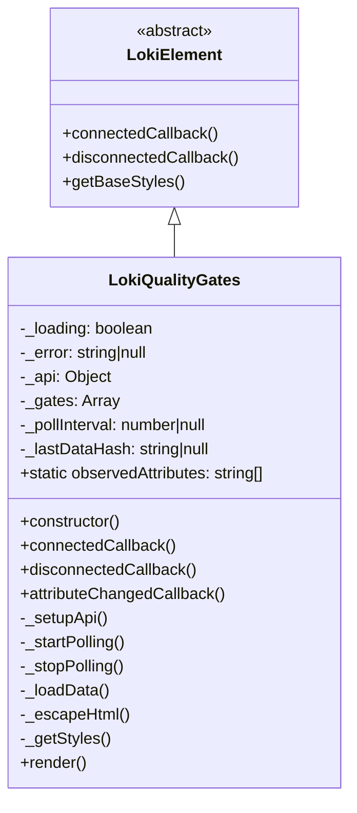
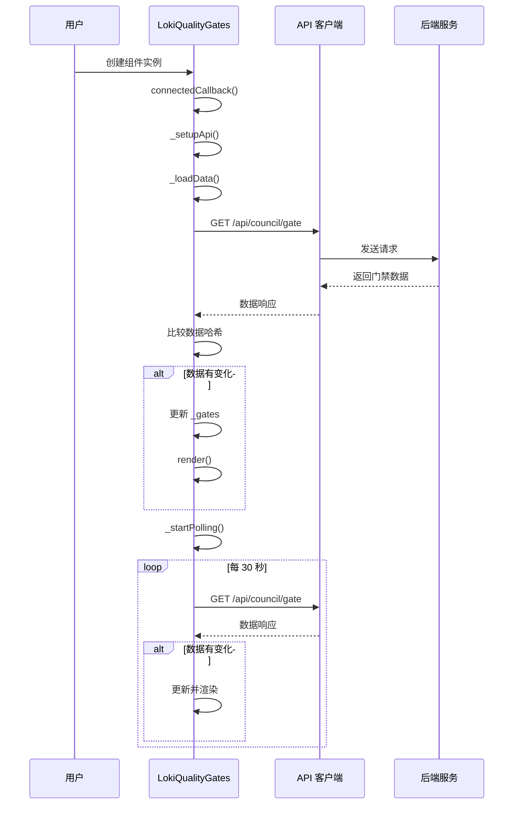

# LokiQualityGates 模块文档

## 概述

LokiQualityGates 是一个用于展示质量门禁状态的 Web 组件，它以颜色编码的卡片形式显示所有质量门禁的实时状态。该组件每 30 秒自动刷新数据，支持浅色和深色主题，并提供了视觉化的状态指示（绿色表示通过，红色表示失败，黄色表示待处理）。

作为 Dashboard UI Components 中成本和质量组件系列的一部分，LokiQualityGates 与 [LokiCostDashboard](LokiCostDashboard.md) 和 [LokiQualityScore](LokiQualityScore.md) 协同工作，为用户提供完整的质量监控解决方案。

## 核心功能

### 主要特性

- **实时状态监控**：自动每 30 秒刷新质量门禁数据
- **智能轮询**：根据页面可见性自动暂停和恢复轮询，优化资源使用
- **主题支持**：内置浅色和深色主题，自动适配系统设置
- **状态可视化**：通过颜色编码的卡片直观展示门禁状态
- **错误处理**：优雅处理 API 错误和加载状态
- **响应式布局**：自适应网格布局，支持各种屏幕尺寸

### 状态定义

| 状态 | 颜色 | 描述 |
|------|------|------|
| PASS | 绿色 | 质量门禁检查通过 |
| FAIL | 红色 | 质量门禁检查失败 |
| PENDING | 黄色 | 质量门禁检查待处理或未知状态 |

## 组件架构

### 类结构



### 数据流程



## API 参考

### 属性 (Attributes)

| 属性名 | 类型 | 默认值 | 描述 |
|--------|------|--------|------|
| `api-url` | string | `window.location.origin` | API 基础 URL |
| `theme` | string | 自动检测 | 主题设置，可选值：'light' 或 'dark' |

### 公共方法

#### `constructor()`
创建 LokiQualityGates 组件实例，初始化内部状态。

#### `connectedCallback()`
当组件被添加到 DOM 时调用，设置 API 客户端、加载初始数据并启动轮询。

#### `disconnectedCallback()`
当组件从 DOM 中移除时调用，清理轮询定时器和事件监听器。

#### `attributeChangedCallback(name, oldValue, newValue)`
当观察到的属性变化时调用，处理 `api-url` 和 `theme` 属性的更新。

#### `render()`
渲染组件的 UI，根据当前状态生成相应的 HTML 内容。

### 内部方法

#### `_setupApi()`
设置 API 客户端，使用 `api-url` 属性或默认值。

#### `_startPolling()`
启动数据轮询，每 30 秒刷新一次，并监听页面可见性变化以优化性能。

#### `_stopPolling()`
停止数据轮询，清理定时器和事件监听器。

#### `_loadData()`
从 API 加载质量门禁数据，比较数据哈希以避免不必要的重新渲染。

#### `_escapeHtml(str)`
转义 HTML 字符串以防止 XSS 攻击。

#### `_getStyles()`
返回组件的 CSS 样式定义。

### 辅助函数

#### `formatGateTime(timestamp)`
格式化时间戳为人类可读的字符串。

**参数：**
- `timestamp` (string|null): ISO 格式的时间戳

**返回值：**
- string: 格式化的时间字符串，如 "Jan 1, 14:30"

#### `summarizeGates(gates)`
统计质量门禁状态的数量。

**参数：**
- `gates` (Array): 包含 status 字段的门禁对象数组

**返回值：**
- Object: 包含 pass、fail、pending 和 total 数量的统计对象

## 使用方法

### 基本用法

```html
<!-- 使用默认配置 -->
<loki-quality-gates></loki-quality-gates>

<!-- 指定 API URL 和主题 -->
<loki-quality-gates 
  api-url="http://localhost:57374" 
  theme="dark">
</loki-quality-gates>
```

### JavaScript 集成

```javascript
// 动态创建组件
const qualityGates = document.createElement('loki-quality-gates');
qualityGates.setAttribute('api-url', 'https://api.example.com');
qualityGates.setAttribute('theme', 'light');
document.body.appendChild(qualityGates);

// 动态修改属性
qualityGates.setAttribute('api-url', 'https://new-api.example.com');
qualityGates.setAttribute('theme', 'dark');
```

### 样式自定义

组件使用 CSS 变量进行样式定义，可以通过覆盖这些变量来自定义外观：

```css
loki-quality-gates {
  --loki-green: #4ade80;
  --loki-red: #f87171;
  --loki-yellow: #facc15;
  --loki-font-family: 'Roboto', sans-serif;
  --loki-text-primary: #1f2937;
  --loki-bg-card: #f9fafb;
}
```

## 数据格式

### API 响应格式

组件期望从 `/api/council/gate` 端点接收以下格式的数据：

```json
{
  "gates": [
    {
      "name": "代码覆盖率",
      "status": "PASS",
      "description": "确保测试覆盖率至少达到 80%",
      "last_checked": "2024-01-15T14:30:00Z"
    },
    {
      "name": "安全扫描",
      "status": "FAIL",
      "description": "检查已知的安全漏洞",
      "last_checked": "2024-01-15T14:29:00Z"
    }
  ]
}
```

或者直接返回数组格式：

```json
[
  {
    "name": "门禁名称",
    "status": "PENDING",
    "description": "门禁描述",
    "lastChecked": "2024-01-15T14:30:00Z"
  }
]
```

### 门禁对象字段

| 字段名 | 类型 | 必填 | 描述 |
|--------|------|------|------|
| `name` | string | 是 | 质量门禁的名称 |
| `status` | string | 否 | 状态值：'PASS'、'FAIL' 或 'PENDING'（默认：'PENDING'） |
| `description` | string | 否 | 门禁的详细描述 |
| `last_checked` / `lastChecked` | string | 否 | 最后检查时间的 ISO 时间戳 |

## 高级配置

### 轮询间隔修改

虽然组件默认每 30 秒轮询一次，但可以通过修改源代码来调整间隔：

```javascript
// 在 _startPolling 方法中修改
this._pollInterval = setInterval(() => this._loadData(), 60000); // 改为 60 秒
```

### 自定义事件

组件可以扩展以支持自定义事件，例如当门禁状态变化时：

```javascript
// 在 _loadData 方法中添加
const oldSummary = summarizeGates(this._gates);
// ... 更新数据后 ...
const newSummary = summarizeGates(this._gates);
if (oldSummary.fail !== newSummary.fail) {
  this.dispatchEvent(new CustomEvent('gate-fail-count-changed', {
    detail: { oldCount: oldSummary.fail, newCount: newSummary.fail }
  }));
}
```

## 注意事项和限制

### 浏览器兼容性

- 组件使用 Web Components API，需要现代浏览器支持
- 支持的浏览器：Chrome 54+, Firefox 63+, Safari 10.1+, Edge 79+
- 不支持 Internet Explorer

### 性能考虑

- 组件实现了智能轮询，当页面不可见时会暂停轮询
- 使用数据哈希比较来避免不必要的重新渲染
- 在大量门禁（超过 50 个）的情况下，可能需要考虑分页或虚拟滚动

### 错误处理

- API 请求失败时会显示错误横幅，但不会中断轮询
- 只在首次错误时设置错误消息，避免重复显示相同错误
- 错误状态会在下次成功加载数据时自动清除

### 安全考虑

- 组件对所有用户输入的内容进行 HTML 转义，防止 XSS 攻击
- 建议在生产环境中使用 HTTPS 协议
- API 端点应该实施适当的认证和授权机制

## 与其他组件的集成

### LokiQualityScore

LokiQualityGates 通常与 [LokiQualityScore](LokiQualityScore.md) 一起使用，提供质量状态的概览和详细信息：

```html
<loki-quality-score api-url="http://localhost:57374"></loki-quality-score>
<loki-quality-gates api-url="http://localhost:57374"></loki-quality-gates>
```

### LokiCostDashboard

对于完整的 DevOps 监控解决方案，可以结合 [LokiCostDashboard](LokiCostDashboard.md) 使用：

```html
<div class="dashboard-grid">
  <loki-cost-dashboard></loki-cost-dashboard>
  <loki-quality-gates></loki-quality-gates>
</div>
```

## 调试技巧

### 启用调试日志

在浏览器控制台中执行以下代码可以查看组件内部状态：

```javascript
const component = document.querySelector('loki-quality-gates');
console.log('Gates:', component._gates);
console.log('Loading:', component._loading);
console.log('Error:', component._error);
```

### 手动触发数据刷新

```javascript
const component = document.querySelector('loki-quality-gates');
component._loadData(); // 手动加载数据
```

### 测试错误状态

可以通过临时修改 `api-url` 属性来测试错误处理：

```javascript
const component = document.querySelector('loki-quality-gates');
component.setAttribute('api-url', 'http://invalid-url');
```

## 总结

LokiQualityGates 是一个功能完整、设计精良的质量门禁监控组件，它提供了直观的用户界面和可靠的数据刷新机制。通过简单的配置即可集成到任何 Web 应用中，为团队提供实时的质量状态可视化。

该组件的模块化设计和清晰的 API 使其易于扩展和自定义，同时其性能优化措施确保了在生产环境中的高效运行。
