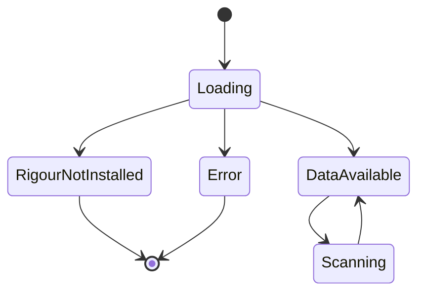
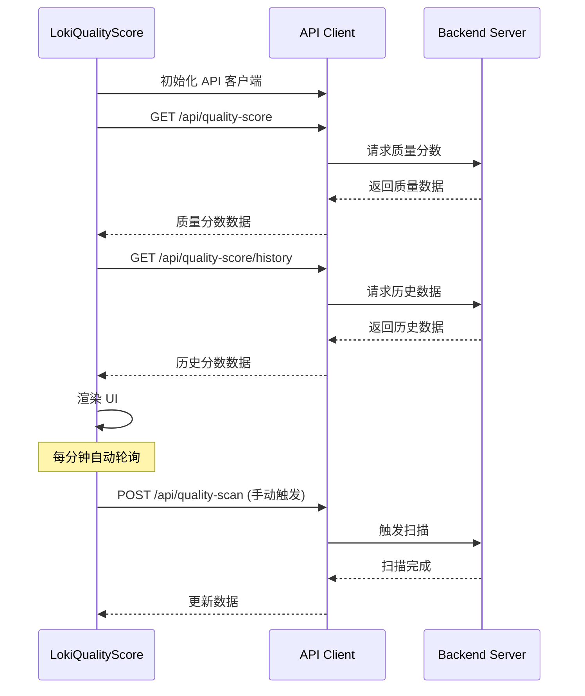
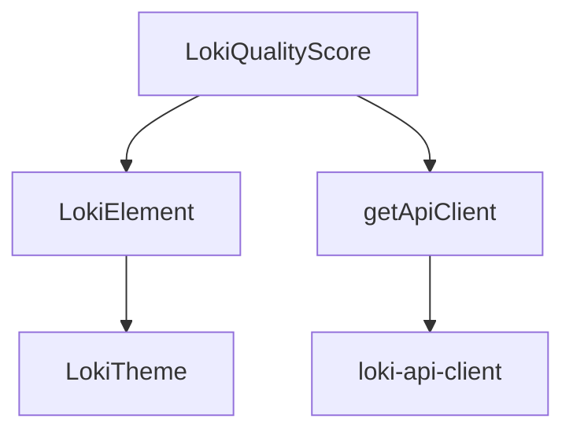

# LokiQualityScore 组件文档

## 概述

`LokiQualityScore` 是一个用于展示代码质量评分的 Web 组件，它提供了质量分数趋势显示、分类细项展示、严重程度发现和 sparkline 可视化功能。该组件通过轮询 API 来获取最新的质量数据，并支持手动触发质量扫描。

## 功能特性

- **质量分数总览：显示整体质量分数和对应的等级（A-F）
- **分类评分：展示 Security、Code Quality、Compliance 和 Best Practices 四个维度的评分
- **趋势可视化：通过 sparkline 图表显示最近的质量分数趋势
- **发现展示：按严重程度（Critical、Major、Minor、Info）展示质量问题
- **手动扫描：支持用户主动触发质量扫描
- **自动轮询：每分钟自动更新质量数据
- **主题支持：兼容 Loki 主题系统

## 安装与使用

### 基本使用

```html
<loki-quality-score api-url="http://localhost:57374"></loki-quality-score>
```

### 属性配置

| 属性 | 类型 | 默认值 | 描述 |
|------|------|-------|------|
| `api-url` | 字符串 | `window.location.origin` | API 基础 URL |
| `theme` | 字符串 | - | 主题名称 |

## 架构设计

### 组件状态

`LokiQualityScore` 组件维护以下内部状态：



### 数据流程



## API 接口

### 必需的后端 API

组件依赖以下后端 API 端点：

1. **GET /api/quality-score**
   - 功能：获取当前质量分数
   - 响应示例：
     ```json
     {
       "score": 85,
       "categories": {
         "security": 90,
         "code_quality": 80,
         "compliance": 85,
         "best_practices": 82
       },
       "findings": {
         "critical": 2,
         "major": 5,
         "minor": 10,
         "info": 3
       }
     }
     ```

2. **GET /api/quality-score/history**
   - 功能：获取质量分数历史
   - 响应示例：
     ```json
     [75, 78, 82, 80, 85]
     ```
     或
     ```json
     {
       "scores": [{"score": 75}, {"score": 78}, {"score": 82}]
     }
     ```

3. **POST /api/quality-scan**
   - 功能：触发质量扫描
   - 请求体：空对象 `{}`
   - 响应：无内容或确认消息

## 组件生命周期

### 生命周期钩子

- `connectedCallback()`：组件连接到 DOM 时调用，设置 API、加载数据和开始轮询
- `disconnectedCallback()`：组件从 DOM 断开时调用，停止轮询
- `attributeChangedCallback()`：属性变化时调用，处理 `api-url` 和 `theme` 属性变化

## 主题与样式

### 样式变量

组件使用以下 CSS 变量（来自 Loki 主题系统）：

- `--loki-bg-card`：卡片背景色
- `--loki-glass-border`：边框颜色
- `--loki-text-primary`：主要文本颜色
- `--loki-text-secondary`：次要文本颜色
- `--loki-text-muted`：辅助文本颜色
- `--loki-accent`：强调色
- `--loki-accent-hover`：强调色悬停状态
- `--loki-success`：成功状态色
- `--loki-warning`：警告状态色
- `--loki-error`：错误状态色
- `--loki-bg-secondary`：次要背景色
- `--loki-bg-tertiary`：第三背景色
- `--loki-border`：边框颜色
- `--loki-transition`：过渡时间

## 依赖关系



- 依赖 `LokiElement` 作为基类
- 使用 `getApiClient` 进行 API 通信
- 依赖 Loki 主题系统

## 注意事项与限制

1. **Rigour 依赖：组件需要 Rigour 分析引擎才能正常工作，未安装时会显示提示信息
2. **API 可用性：依赖后端 API 端点的可用性，404 错误会被视为 Rigour 未安装
3. **轮询间隔：默认轮询间隔为 60 秒，无法通过属性配置
4. **历史数据限制：只显示最近 10 个历史数据点
5. **浏览器支持：需要支持 Web Components 的浏览器环境
6. **主题依赖：依赖 Loki 主题系统的 CSS 变量

## 错误处理

- API 请求失败时显示错误状态
- 404 错误特殊处理为 Rigour 未安装
- 其他错误显示通用错误信息
- 错误状态下不会停止轮询

## 扩展与自定义

### 自定义评分等级

```javascript
// 可以通过重写 _getGrade 方法来自定义评分等级
// 当前实现：
_getGrade(score) {
  if (score >= 90) return { grade: 'A', color: 'var(--loki-success)' };
  if (score >= 80) return { grade: 'B', color: 'var(--loki-success)' };
  if (score >= 70) return { grade: 'C', color: 'var(--loki-warning)' };
  if (score >= 60) return { grade: 'D', color: 'var(--loki-warning)' };
  return { grade: 'F', color: 'var(--loki-error)' };
}
```

### 添加新的分类

可以通过修改 `categoryNames` 和 `categoryLabels` 数组来添加或修改分类：

```javascript
const categoryNames = ['security', 'code_quality', 'compliance', 'best_practices', 'performance'];
const categoryLabels = {
  security: 'Security',
  code_quality: 'Code Quality',
  compliance: 'Compliance',
  best_practices: 'Best Practices',
  performance: 'Performance'
};
```

## 相关组件

- [LokiQualityGates](LokiQualityGates.md) - 质量门控组件
- [LokiCostDashboard](LokiCostDashboard.md) - 成本仪表盘组件
- [LokiAnalytics](LokiAnalytics.md) - 分析组件
