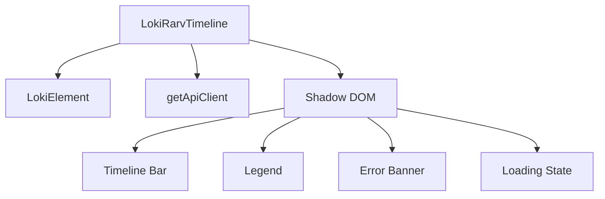
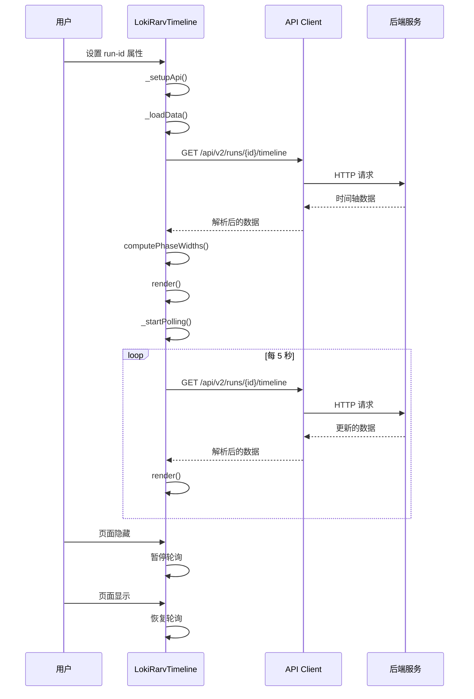

# LokiRarvTimeline 模块文档

## 1. 模块概述

### 1.1 模块简介

LokiRarvTimeline 是一个专门用于可视化展示 RARV（Reason、Act、Reflect、Verify）循环周期的 Web 组件。该组件为用户提供了直观的水平时间轴视图，用于展示特定运行任务的各阶段执行时间，并突出显示当前活跃运行的阶段，帮助用户了解任务执行进度和各阶段耗时分布。

### 1.2 设计理念

该模块的设计遵循以下核心理念：
- **直观可视化**：通过彩色分段时间轴清晰呈现各阶段的相对耗时
- **实时更新**：支持自动轮询机制，确保用户始终看到最新的执行状态
- **主题兼容**：支持明暗主题切换，并与系统整体设计语言保持一致
- **错误处理**：提供友好的加载状态和错误提示，确保良好的用户体验
- **可访问性**：使用语义化的 HTML 结构和合适的 ARIA 属性，确保组件可访问

### 1.3 在系统中的位置

LokiRarvTimeline 位于 Dashboard UI Components 模块下的 Monitoring and Observability Components 子模块中，与其他监控和可观察性组件（如 LokiAnalytics、LokiLogStream、LokiAppStatus 等）共同构成了系统的监控可视化层。它依赖于 Core Theme 和 Unified Styles 模块提供的基础样式系统，并通过 API 客户端与后端服务进行数据交互。

## 2. 核心组件详解

### 2.1 LokiRarvTimeline 类

`LokiRarvTimeline` 是该模块的核心组件，继承自 `LokiElement` 基类，实现了 Web Components 标准。

#### 主要属性

| 属性名 | 类型 | 默认值 | 描述 |
|--------|------|--------|------|
| `run-id` | string | null | 要获取时间轴的运行 ID |
| `api-url` | string | window.location.origin | API 基础 URL |
| `theme` | string | 自动检测 | 主题设置，可选值为 'light' 或 'dark' |

#### 关键生命周期方法

##### constructor()
初始化组件状态，设置内部变量的初始值：
- `_loading`: 控制加载状态
- `_error`: 存储错误信息
- `_api`: API 客户端实例
- `_timeline`: 时间轴数据
- `_pollInterval`: 轮询定时器

##### connectedCallback()
组件挂载到 DOM 时调用，执行以下操作：
1. 调用父类的 `connectedCallback`
2. 设置 API 客户端
3. 加载初始数据
4. 启动轮询机制

##### disconnectedCallback()
组件从 DOM 卸载时调用，负责清理工作：
1. 调用父类的 `disconnectedCallback`
2. 停止轮询，防止内存泄漏

##### attributeChangedCallback(name, oldValue, newValue)
监听属性变化，根据不同属性执行相应操作：
- `api-url`: 更新 API 客户端基础 URL 并重新加载数据
- `run-id`: 重新加载数据
- `theme`: 应用新主题

#### 核心功能方法

##### _setupApi()
配置 API 客户端，使用 `getApiClient` 函数创建实例，设置基础 URL。

##### _startPolling()
启动数据轮询机制：
1. 设置 5 秒间隔的定时器，定期调用 `_loadData`
2. 添加可见性变化监听器，在页面隐藏时暂停轮询，显示时恢复
3. 优化性能，避免后台不必要的 API 请求

##### _stopPolling()
停止轮询并清理事件监听器：
1. 清除轮询定时器
2. 移除可见性变化事件监听器

##### async _loadData()
异步加载时间轴数据：
1. 验证 `runId` 是否存在
2. 显示加载状态
3. 通过 API 客户端获取 `/api/v2/runs/${runId}/timeline` 数据
4. 处理成功响应，更新时间轴数据
5. 捕获并处理错误，设置错误信息
6. 无论成功或失败，最终都会调用 `render()` 方法更新视图

##### render()
渲染组件内容：
1. 获取 Shadow DOM 根节点
2. 根据当前状态（加载中、无运行 ID、无数据、有数据）生成不同内容
3. 计算各阶段宽度
4. 生成时间轴条和图例
5. 合并基础样式和组件特定样式
6. 更新 Shadow DOM 内容

### 2.2 辅助函数

#### formatDuration(ms)
将毫秒数格式化为人类可读的时间字符串：
- 小于 1000 毫秒：显示为 `Xms`
- 小于 60 秒：显示为 `Xs`
- 小于 60 分钟：显示为 `Xm Ys`
- 大于等于 60 分钟：显示为 `Xh Ym`
- 无效值（null 或负数）：显示为 `--`

#### computePhaseWidths(phases)
计算每个阶段在时间轴上的百分比宽度：
1. 计算所有阶段的总时长
2. 如总时长为 0，则平均分配宽度
3. 否则根据每个阶段的时长计算百分比
4. 返回包含阶段名称、百分比和时长的数组

### 2.3 配置常量

#### PHASE_CONFIG
定义了 RARV 各阶段的配置，包括颜色和标签：
- `reason`：蓝色，标签为 "Reason"
- `act`：绿色，标签为 "Act"
- `reflect`：紫色，标签为 "Reflect"
- `verify`：黄色，标签为 "Verify"

#### PHASE_ORDER
定义了 RARV 阶段的标准顺序：`['reason', 'act', 'reflect', 'verify']`

## 3. 架构与数据流

### 3.1 组件架构

LokiRarvTimeline 采用 Web Components 架构，使用 Shadow DOM 实现样式隔离，确保组件样式不会影响页面其他部分，同时也不受外部样式干扰。



组件内部采用状态驱动的渲染模式，所有 UI 变化都基于内部状态的更新，确保数据流的单向性和可预测性。

### 3.2 数据流程



数据流程说明：
1. 用户设置 `run-id` 属性触发组件初始化
2. 组件设置 API 客户端并加载初始数据
3. API 客户端向后端服务发送请求获取时间轴数据
4. 数据返回后，计算各阶段宽度并渲染视图
5. 启动轮询机制，定期更新数据
6. 监听页面可见性变化，优化资源使用

### 3.3 组件交互

LokiRarvTimeline 主要通过属性与外部环境交互：
- 通过 `run-id` 属性指定要显示的运行任务
- 通过 `api-url` 属性配置 API 端点
- 通过 `theme` 属性控制显示主题

组件内部通过状态管理实现 UI 更新，状态变化触发重新渲染，确保视图与数据保持一致。

## 4. 使用指南

### 4.1 基本使用

在 HTML 中直接使用自定义元素：

```html
<loki-rarv-timeline run-id="42"></loki-rarv-timeline>
```

### 4.2 完整配置示例

```html
<loki-rarv-timeline 
    run-id="42" 
    api-url="http://localhost:57374" 
    theme="dark">
</loki-rarv-timeline>
```

### 4.3 JavaScript 动态控制

```javascript
// 获取组件实例
const timeline = document.querySelector('loki-rarv-timeline');

// 动态设置运行 ID
timeline.runId = 123;

// 更改 API 地址
timeline.setAttribute('api-url', 'https://api.example.com');

// 切换主题
timeline.setAttribute('theme', 'light');
```

### 4.4 数据格式要求

组件期望从 API 接收以下格式的数据：

```json
{
  "phases": [
    {
      "phase": "reason",
      "duration_ms": 1500
    },
    {
      "phase": "act",
      "duration_ms": 3000
    },
    {
      "phase": "reflect",
      "duration_ms": 2000
    },
    {
      "phase": "verify",
      "duration_ms": 1000
    }
  ],
  "current_phase": "reflect"
}
```

## 5. 样式与主题

### 5.1 CSS 自定义属性

组件使用以下 CSS 自定义属性，可通过全局样式覆盖：

| 属性名 | 默认值 | 描述 |
|--------|--------|------|
| `--loki-blue` | #3b82f6 | Reason 阶段颜色 |
| `--loki-green` | #22c55e | Act 阶段颜色 |
| `--loki-purple` | #a78bfa | Reflect 阶段颜色 |
| `--loki-yellow` | #eab308 | Verify 阶段颜色 |
| `--loki-font-family` | 'Inter', -apple-system, sans-serif | 字体族 |
| `--loki-text-primary` | #201515 | 主要文本颜色 |
| `--loki-text-secondary` | #36342E | 次要文本颜色 |
| `--loki-text-muted` | #939084 |  muted 文本颜色 |
| `--loki-bg-tertiary` | #ECEAE3 | 三级背景色 |
| `--loki-accent` | #553DE9 | 强调色 |
| `--loki-accent-muted` | rgba(139, 92, 246, 0.15) | 弱化强调色 |
| `--loki-red` | #ef4444 | 错误颜色 |
| `--loki-red-muted` | rgba(239, 68, 68, 0.15) | 弱化错误颜色 |

### 5.2 主题定制

可以通过覆盖 CSS 自定义属性来创建自定义主题：

```css
/* 自定义暗色主题 */
loki-rarv-timeline {
  --loki-text-primary: #f0f0f0;
  --loki-text-secondary: #c0c0c0;
  --loki-text-muted: #888888;
  --loki-bg-tertiary: #333333;
}
```

## 6. 注意事项与限制

### 6.1 边缘情况处理

- **无 run-id**：组件会显示提示信息，告知用户需要设置 run-id 属性
- **空数据**：如果 API 返回空的阶段列表，会显示相应提示
- **无效时长**：`formatDuration` 函数对负数或 null 值返回 `--`
- **总时长为零**：各阶段平均分配时间轴宽度

### 6.2 错误处理

- 网络请求失败时，会显示错误横幅，包含错误信息
- 错误信息经过 HTML 转义，防止 XSS 攻击
- 组件不会因单个请求失败而停止工作，会继续尝试轮询

### 6.3 性能考虑

- 轮询间隔固定为 5 秒，无法通过配置修改
- 页面隐藏时自动暂停轮询，节省资源
- 组件卸载时清理定时器和事件监听器，防止内存泄漏
- 只在必要时重新渲染，避免不必要的 DOM 操作

### 6.4 已知限制

- 组件假设 API 返回的阶段顺序正确，不进行排序
- 不支持自定义阶段配置，硬编码为 RARV 四个阶段
- 轮询间隔不可配置
- 不支持历史数据回放，只显示当前状态
- 移动端响应式设计较为基础，在小屏幕上可能体验不佳

## 7. 扩展与集成

### 7.1 与其他组件的集成

LokiRarvTimeline 设计为可以与其他 Dashboard UI Components 无缝集成：

- 与 [LokiTaskBoard](LokiTaskBoard.md) 集成：在任务看板中选择任务时，自动更新时间轴显示
- 与 [LokiSessionControl](LokiSessionControl.md) 集成：在会话控制中查看当前会话的 RARV 周期
- 与 [LokiLogStream](LokiLogStream.md) 集成：点击时间轴阶段时，过滤显示对应阶段的日志

### 7.2 自定义扩展点

虽然当前版本的组件没有提供明确的扩展 API，但可以通过以下方式进行扩展：

1. **继承扩展**：创建继承自 `LokiRarvTimeline` 的子类，覆盖特定方法
2. **样式扩展**：通过 CSS 自定义属性和 ::part 伪元素（如实现）定制外观
3. **事件监听**：监听组件的属性变化和数据更新事件（如需添加）

## 8. 相关模块参考

- [LokiElement](LokiTheme.md)：组件基类，提供主题和基础样式系统
- [LokiApiClient](LokiTheme.md)：API 客户端，用于与后端服务通信
- [LokiTaskBoard](LokiTaskBoard.md)：任务看板组件，可与时间轴集成使用
- [LokiSessionControl](LokiSessionControl.md)：会话控制组件，提供会话管理功能

## 9. 总结

LokiRarvTimeline 是一个专注于 RARV 循环可视化的专业组件，通过直观的时间轴展示帮助用户理解任务执行过程。它具有良好的错误处理机制、实时更新能力和主题兼容性，是系统监控和可观察性工具链中的重要组成部分。

虽然组件当前存在一些限制，如硬编码的阶段配置和固定的轮询间隔，但其核心设计合理，代码结构清晰，为未来的扩展和改进奠定了良好基础。
